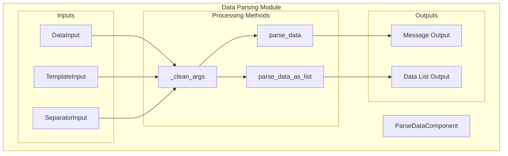
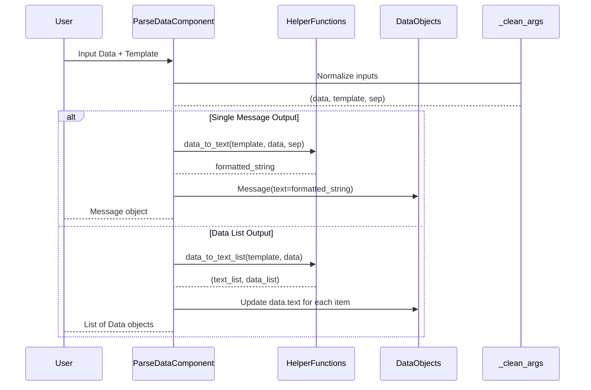

# Data Parsing Module

## Introduction

The data_parsing module provides essential functionality for converting Data objects into Messages within the Langflow system. This module serves as a bridge between raw data structures and formatted message content, enabling flexible data transformation and templating capabilities for downstream processing components.

## Overview

The data_parsing module is part of the broader data_processing ecosystem and specifically handles the conversion of Data objects into human-readable messages using customizable templates. It supports both single message generation and batch processing of data lists, making it a versatile component for data transformation workflows.

## Core Architecture

### Component Structure



### Component Inheritance


## Core Components

### ParseDataComponent

The `ParseDataComponent` is the primary component in the data_parsing module. It extends the `CustomComponent` base class and provides functionality for converting Data objects into formatted messages.

**Key Properties:**
- **Display Name**: "Data to Message"
- **Description**: "Convert Data objects into Messages using any {field_name} from input data."
- **Icon**: "message-square"
- **Legacy Name**: "Parse Data"
- **Status**: Legacy component (marked for backward compatibility)

**Component Configuration:**
```python
metadata = {
    "legacy_name": "Parse Data",
}
```

## Input Configuration

### DataInput
- **Name**: `data`
- **Display Name**: "Data"
- **Info**: "The data to convert to text."
- **Type**: List of Data objects
- **Required**: True
- **List Support**: Yes

### MultilineInput (Template)
- **Name**: `template`
- **Display Name**: "Template"
- **Info**: "The template to use for formatting the data. It can contain the keys {text}, {data} or any other key in the Data."
- **Default Value**: `"{text}"`
- **Required**: True

### StrInput (Separator)
- **Name**: `sep`
- **Display Name**: "Separator"
- **Advanced**: True
- **Default Value**: `"\n"`

## Output Configuration

### Message Output
- **Display Name**: "Message"
- **Name**: `text`
- **Info**: "Data as a single Message, with each input Data separated by Separator"
- **Method**: `parse_data()`

### Data List Output
- **Display Name**: "Data List"
- **Name**: `data_list`
- **Info**: "Data as a list of new Data, each having `text` formatted by Template"
- **Method**: `parse_data_as_list()`

## Processing Methods

### _clean_args()
Internal method that normalizes input parameters:
- Converts single Data objects to lists
- Extracts template and separator values
- Returns tuple: `(data_list, template, separator)`

### parse_data()
Converts Data objects into a single Message using the provided template:
1. Calls `_clean_args()` to normalize inputs
2. Uses `data_to_text()` helper function to format data
3. Sets component status to the result string
4. Returns a Message object with the formatted text

### parse_data_as_list()
Processes Data objects into a list of new Data objects:
1. Calls `_clean_args()` to normalize inputs
2. Uses `data_to_text_list()` helper function
3. Updates each Data object with formatted text
4. Sets component status to the data list
5. Returns the modified data list

## Data Flow Architecture



## Dependencies

### Internal Dependencies
- **Component System**: Inherits from `CustomComponent` ([component_system.md](component_system.md))
- **IO Framework**: Uses DataInput, MultilineInput, StrInput, and Output classes ([io_components.md](io_components.md))
- **Schema Types**: Integrates with Data and Message schemas ([schema_types.md](schema_types.md))

### Helper Functions
- **data_to_text**: Converts data objects to formatted text using templates
- **data_to_text_list**: Processes data lists with individual formatting

## Integration Points

### Graph System Integration
The ParseDataComponent integrates with the graph system through:
- Vertex-based execution model ([graph_system.md](graph_system.md))
- Input/output port connections
- Status reporting for visual feedback

### Template System Support
- Supports dynamic field substitution using `{field_name}` syntax
- Compatible with frontend template rendering ([template_system.md](template_system.md))
- Legacy template format support for backward compatibility

## Usage Patterns

### Basic Message Conversion
```python
# Input: Data object with fields
# Template: "{text}"
# Output: Message with concatenated text
```

### Custom Field Formatting
```python
# Input: Data objects with custom fields
# Template: "Name: {name}, Value: {value}"
# Output: Formatted messages with field substitution
```

### Batch Processing
```python
# Input: List of Data objects
# Template: "Item: {text}"
# Separator: "\n---\n"
# Output: Single message with separated items
```

## Error Handling

The component includes robust error handling for:
- Invalid data types
- Missing template fields
- Empty data lists
- Template parsing errors

## Performance Considerations

- **Memory Efficiency**: Processes data in streaming fashion for large datasets
- **Template Caching**: Reuses compiled templates for repeated operations
- **Status Tracking**: Provides real-time feedback during processing

## Legacy Support

As a legacy component, ParseDataComponent maintains:
- Backward compatibility with existing flows
- Legacy naming conventions
- Deprecated method signatures for smooth migration

## Related Modules

- **[data_creation](data_creation.md)**: Complementary module for creating Data objects
- **[data_filtering](data_filtering.md)**: Module for filtering Data objects
- **[data_merging](data_merging.md)**: Module for merging Data objects
- **[structured_output](structured_output.md)**: Module for structured data output

## Future Enhancements

Potential improvements for the data_parsing module:
- Enhanced template syntax support
- Performance optimizations for large datasets
- Additional output format options
- Integration with modern data processing frameworks