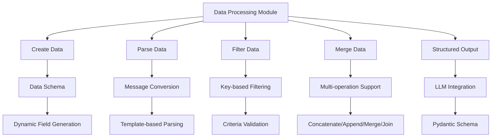
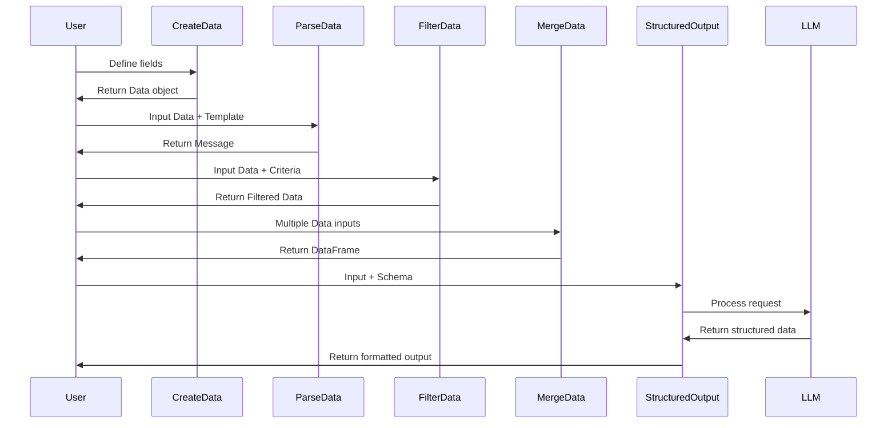

# Data Processing Module

## Overview

The data_processing module provides a comprehensive suite of components for manipulating, transforming, and structuring data within the Langflow ecosystem. This module serves as the backbone for data operations, enabling users to create, parse, filter, merge, and extract structured information from various data sources.

## Purpose

The data_processing module is designed to:
- **Create** dynamic data structures with customizable fields
- **Parse** and transform data between different formats
- **Filter** data based on specific criteria
- **Merge** and combine multiple data sources
- **Extract** structured outputs using LLM capabilities

## Architecture



## Core Components

### 1. CreateDataComponent
- **Purpose**: Dynamically creates Data objects with a specified number of fields
- **Key Features**:
  - Configurable field count (1-15 fields)
  - Real-time field generation
  - Text key validation
  - Dynamic input configuration
- **Use Case**: Building custom data structures on-the-fly
- **Detailed Documentation**: [Data Creation](data_creation.md)

### 2. ParseDataComponent
- **Purpose**: Converts Data objects into Messages using template-based formatting
- **Key Features**:
  - Template-based text generation
  - Support for multiple data inputs
  - Flexible field substitution
  - Batch processing capabilities
- **Use Case**: Transforming data for display or further processing
- **Detailed Documentation**: [Data Parsing](data_parsing.md)

### 3. FilterDataComponent
- **Purpose**: Filters Data objects based on specified key criteria
- **Key Features**:
  - Key-based filtering
  - Multiple filter criteria support
  - Preserves data structure
  - Beta feature status
- **Use Case**: Data subset extraction and cleanup
- **Detailed Documentation**: [Data Filtering](data_filtering.md)

### 4. MergeDataComponent
- **Purpose**: Combines multiple data sources using various operations
- **Key Features**:
  - Four operation types: Concatenate, Append, Merge, Join
  - DataFrame output format
  - Minimum 2 inputs required
  - Error handling and validation
- **Use Case**: Data aggregation and consolidation
- **Detailed Documentation**: [Data Merging](data_merging.md)

### 5. StructuredOutputComponent
- **Purpose**: Uses LLM to generate structured data from unstructured input
- **Key Features**:
  - Pydantic schema integration
  - Trustcall extractor backend
  - Customizable output schemas
  - Support for complex data types
- **Use Case**: Information extraction and data standardization
- **Detailed Documentation**: [Structured Output](structured_output.md)

## Data Flow



## Integration Points

### Dependencies
- **Component System**: All components inherit from base Component class
- **Schema Types**: Utilizes Data, Message, and DataFrame schemas
- **IO System**: Integrates with input/output handling framework
- **LLM Models**: StructuredOutputComponent interfaces with LanguageModel components

### Related Modules
- **[component_system](component_system.md)**: Base component infrastructure
- **[schema_types](schema_types.md)**: Data structure definitions
- **[llm_models](llm_models.md)**: Language model integration for structured output
- **[io_components](io_components.md)**: Input/output handling

## Usage Patterns

### Basic Data Creation
```python
# Create a data object with 3 fields
creator = CreateDataComponent()
creator.number_of_fields = 3
creator.field_1_key = {"name": "title", "value": "Example"}
creator.field_2_key = {"name": "content", "value": "Sample content"}
creator.field_3_key = {"name": "status", "value": "active"}
data = creator.build_data()
```

### Data Parsing and Transformation
```python
# Convert data to message using template
parser = ParseDataComponent()
parser.data = [data_object]
parser.template = "Title: {title}\nContent: {content}\nStatus: {status}"
message = parser.parse_data()
```

### Structured Data Extraction
```python
# Extract structured information using LLM
structured = StructuredOutputComponent()
structured.llm = language_model
structured.input_value = "Extract customer information from this text..."
structured.output_schema = [{"name": "customer_name", "type": "str"}]
result = structured.build_structured_output()
```

## Best Practices

1. **Field Validation**: Always validate text keys when using CreateDataComponent
2. **Template Design**: Use clear, descriptive templates for ParseDataComponent
3. **Filter Criteria**: Define explicit filter criteria to avoid unexpected results
4. **Merge Operations**: Choose the appropriate merge operation based on data structure
5. **Schema Definition**: Provide comprehensive schemas for StructuredOutputComponent

## Error Handling

The module implements comprehensive error handling:
- **Validation Errors**: Field validation in CreateDataComponent
- **Type Errors**: LLM compatibility checks in StructuredOutputComponent
- **Value Errors**: Input validation across all components
- **Processing Errors**: Operation-specific error handling in MergeDataComponent

## Performance Considerations

- **Field Limits**: CreateDataComponent enforces a maximum of 15 fields
- **Batch Processing**: ParseDataComponent supports efficient batch operations
- **Memory Management**: Components handle large datasets through streaming
- **Caching**: Integration with cache service for repeated operations

## Future Enhancements

- Enhanced filtering capabilities with conditional logic
- Support for more complex data transformations
- Integration with external data sources
- Advanced schema validation options
- Performance optimizations for large-scale data processing