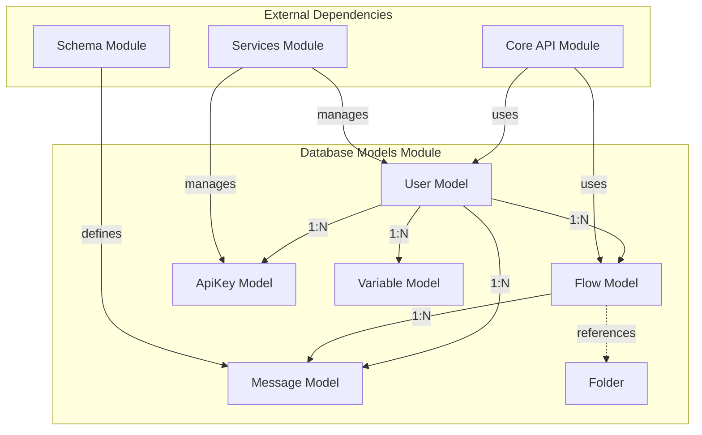
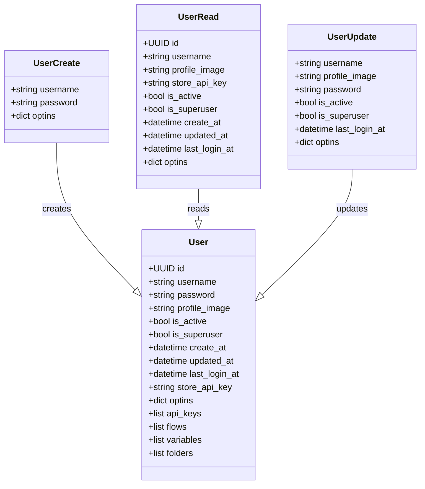
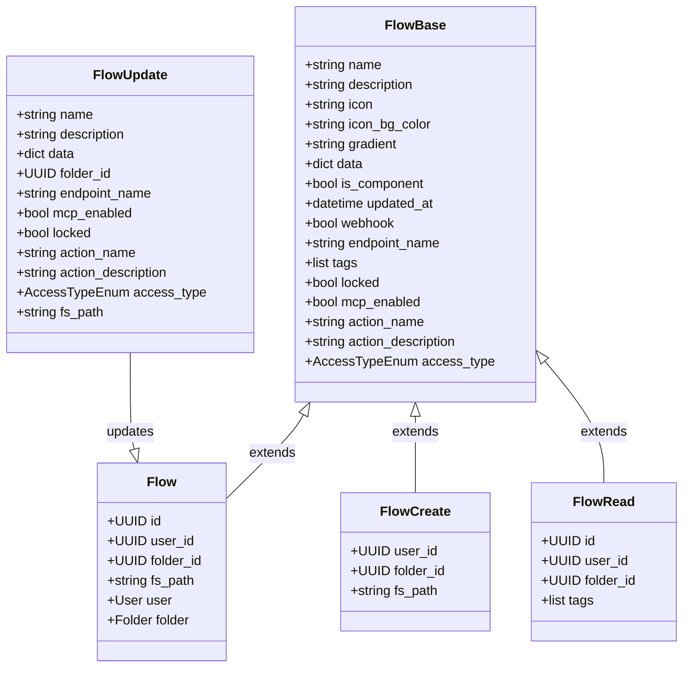
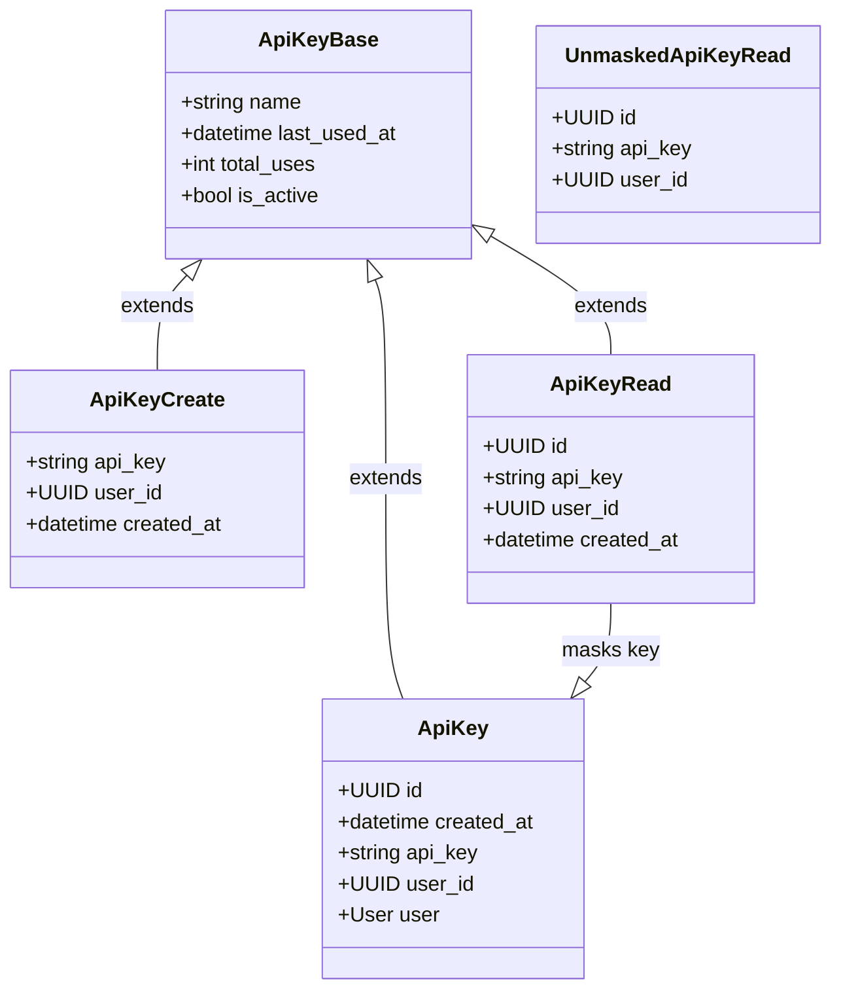
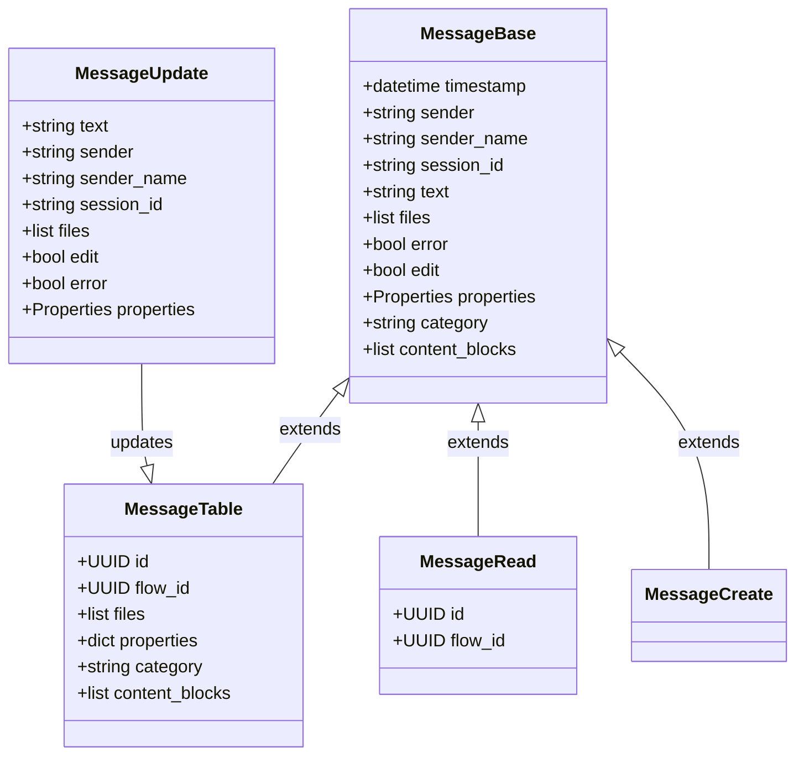
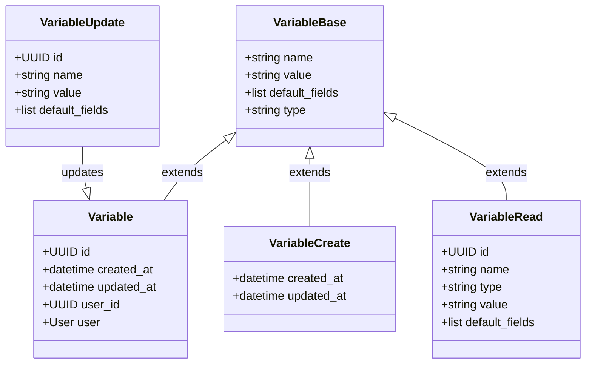
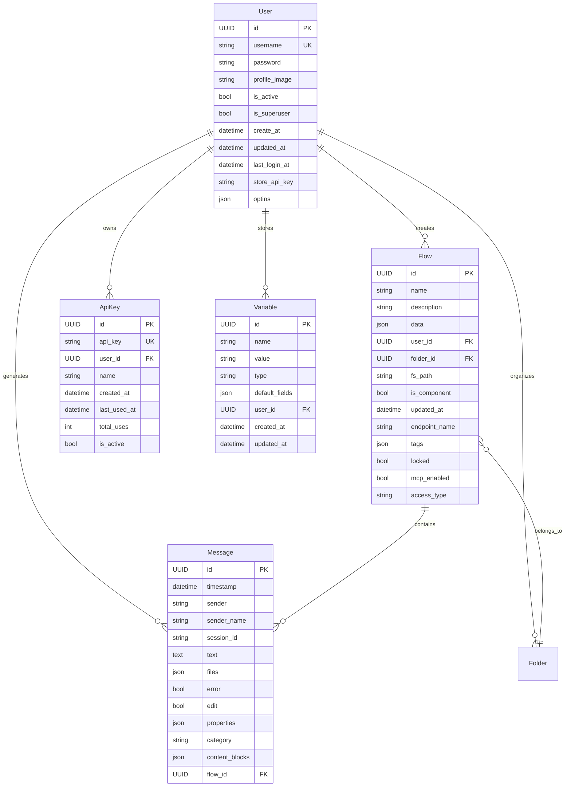
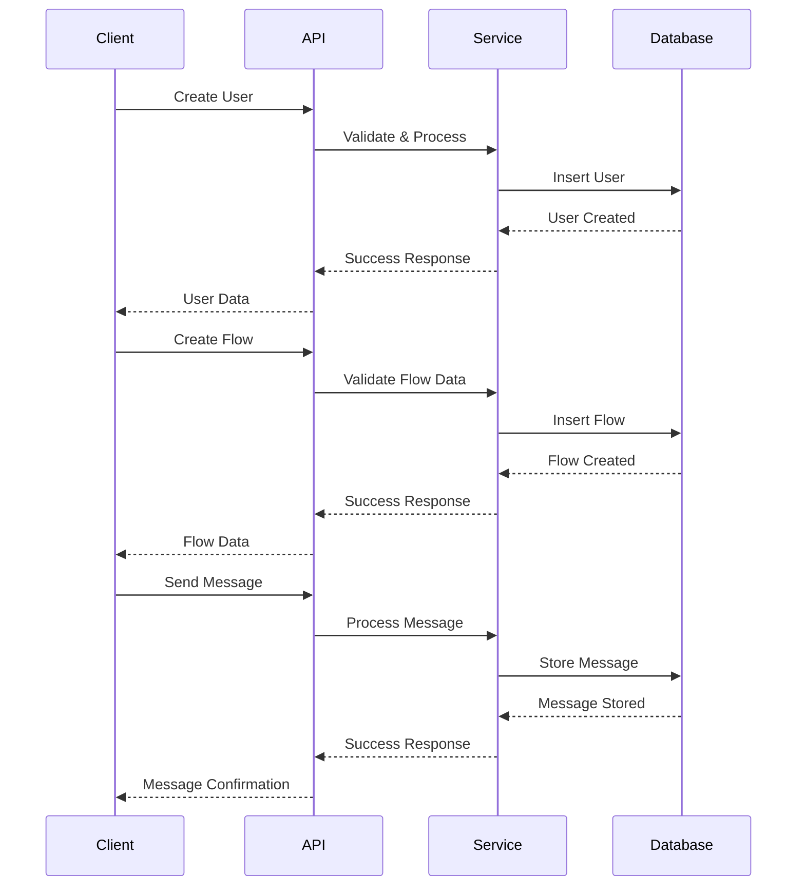
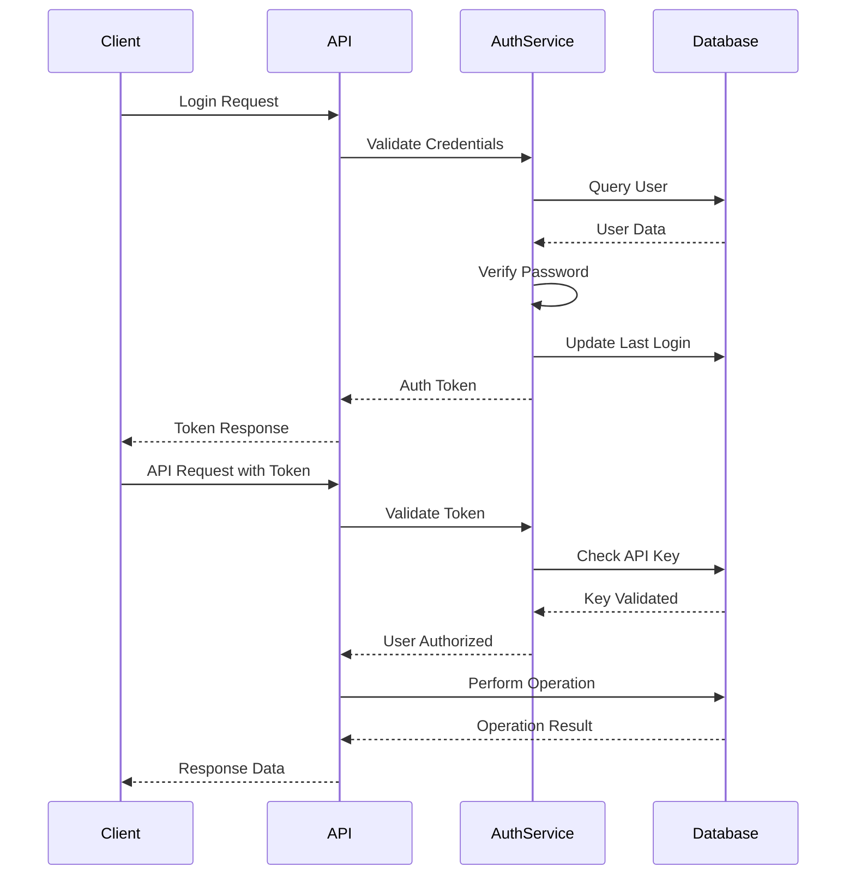

# Database Models Module Documentation

## Introduction

The database_models module serves as the foundational data layer for the Langflow application, providing SQLAlchemy/SQLModel-based ORM models that define the core entities and their relationships. This module implements the data persistence layer that supports user management, flow storage, API key authentication, message logging, and variable management within the Langflow ecosystem.

## Module Architecture

### Core Components Overview

The database_models module consists of five primary model categories:

1. **User Management Models** - Handle user authentication, profiles, and permissions
2. **Flow Models** - Manage workflow definitions, configurations, and metadata
3. **API Key Models** - Provide secure API authentication and usage tracking
4. **Message Models** - Store conversation history and message data
5. **Variable Models** - Handle encrypted variable storage for flows

### Architecture Diagram

## Component Details

### User Management System

The user management system provides comprehensive user authentication and profile management capabilities.

#### User Model Structure

#### User Opt-in System

The UserOptin model tracks user engagement and consent for various platform features:

- **github_starred**: Tracks if user has starred the repository
- **dialog_dismissed**: Records dismissed informational dialogs
- **discord_clicked**: Tracks Discord community engagement

### Flow Management System

The flow management system handles the storage and configuration of Langflow workflows.

#### Flow Model Architecture

#### Flow Validation System

The Flow model implements comprehensive validation for various fields:

- **Endpoint Name Validation**: Ensures endpoint names contain only alphanumeric characters, hyphens, and underscores
- **Icon Validation**: Supports both emoji (using emoji library) and Lucide icons with specific formatting rules
- **Color Validation**: Validates hex color codes with proper format (#RRGGBB)
- **Data Validation**: Ensures flow data contains required nodes and edges structure

#### Access Control

Flows support two access types through the AccessTypeEnum:
- **PRIVATE**: Flow is only accessible to the owner
- **PUBLIC**: Flow can be accessed by other users

### API Key Management

The API key system provides secure authentication for programmatic access.

#### API Key Model Structure

#### Security Features

- **Key Masking**: API keys are automatically masked in read operations (showing only first 8 characters)
- **Usage Tracking**: Monitors total uses and last usage timestamp
- **Active Status**: Supports enabling/disabling keys without deletion
- **Cascade Deletion**: API keys are automatically deleted when associated users are removed

### Message Management System

The message system stores conversation history and supports rich content blocks.

#### Message Model Architecture

#### Message Features

- **Content Blocks**: Supports rich content through ContentBlock schema
- **File Handling**: Manages file attachments with session-based path resolution
- **Properties**: Extensible properties system for metadata
- **Timestamp Serialization**: UTC timezone handling with custom serialization
- **Flow Association**: Links messages to specific flows for conversation tracking

### Variable Management System

The variable system provides encrypted storage for sensitive data and configuration.

#### Variable Model Structure

#### Security Features

- **Value Masking**: Automatically masks credential-type variables in read operations
- **User Isolation**: Variables are unique per user, ensuring data isolation
- **Encryption Support**: Values are stored encrypted (encryption handled at service layer)
- **Audit Trail**: Tracks creation and update timestamps

## Data Flow and Relationships

### Entity Relationship Diagram

### Database Constraints

The module implements several database-level constraints to ensure data integrity:

1. **Unique Flow Names**: `(user_id, name)` must be unique
2. **Unique Endpoint Names**: `(user_id, endpoint_name)` must be unique
3. **Unique Usernames**: Usernames must be unique across the system
4. **Unique API Keys**: API keys must be unique for security
5. **Foreign Key Constraints**: All relationships maintain referential integrity

## Integration with Other Modules

### Core API Integration

The database_models module serves as the data foundation for the [core_api](core_api.md) module:

- **User Authentication**: User model supports authentication endpoints
- **Flow Management**: Flow model enables CRUD operations for workflows
- **API Key Authentication**: ApiKey model provides secure API access
- **Message Storage**: Message model supports chat and conversation features

### Service Layer Integration

The [services](services.md) module depends on database_models for:

- **User Service**: Manages user lifecycle and authentication
- **Variable Service**: Handles encrypted variable storage and retrieval
- **Cache Service**: Works with flow data for performance optimization

### Schema Integration

The [schema_types](schema_types.md) module provides supporting types:

- **ContentBlock**: Used in Message model for rich content
- **Properties**: Extensible properties for messages and other entities

## Security Considerations

### Data Protection

1. **Password Storage**: User passwords are hashed before storage (hashing handled at service layer)
2. **API Key Security**: Keys are masked in responses and stored securely
3. **Variable Encryption**: Sensitive variables are encrypted before storage
4. **Access Control**: Flow-level access controls with PUBLIC/PRIVATE settings

### Privacy Features

1. **User Opt-in System**: Tracks user consent for various platform features
2. **Data Isolation**: User data is completely isolated through foreign key relationships
3. **Audit Trail**: Creation and update timestamps for all entities
4. **Soft Delete**: Supports logical deletion through status flags

## Performance Optimizations

### Database Indexing

The module implements strategic indexing for optimal query performance:

- **User.username**: Unique index for authentication queries
- **Flow.user_id**: Index for user-based flow queries
- **Flow.endpoint_name**: Index for endpoint-based lookups
- **ApiKey.api_key**: Unique index for API authentication
- **Message.session_id**: Index for conversation history queries

### Relationship Optimization

- **Eager Loading**: Configured for appropriate relationship loading strategies
- **Cascade Operations**: Efficient cascade delete for user-related data
- **JSON Storage**: Uses native JSON columns for flexible data structures

## Usage Patterns

### Typical Data Operations

### Authentication Flow

## Error Handling

### Validation Errors

The module implements comprehensive validation with specific error messages:

- **Flow Data Validation**: Ensures JSON structure with required nodes and edges
- **Icon Validation**: Validates emoji and Lucide icon formats
- **Color Validation**: Ensures proper hex color format
- **Endpoint Name Validation**: Enforces alphanumeric constraints

### Database Errors

- **Unique Constraint Violations**: Proper handling of duplicate entries
- **Foreign Key Violations**: Ensures referential integrity
- **Type Validation**: Validates data types before database operations

## Migration Support

The module is designed to support database migrations through:

- **SQLModel Compatibility**: Uses SQLModel for ORM and migration support
- **Explicit Table Names**: Clear table naming conventions
- **Constraint Definitions**: Proper constraint naming for migration tracking
- **Default Values**: Server-side default values for consistency

This comprehensive database_models module provides a robust, secure, and scalable foundation for the Langflow application's data persistence needs, with careful attention to performance, security, and maintainability.