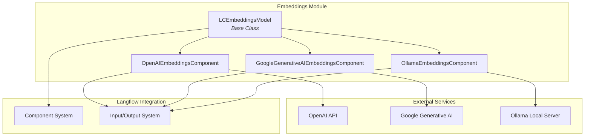
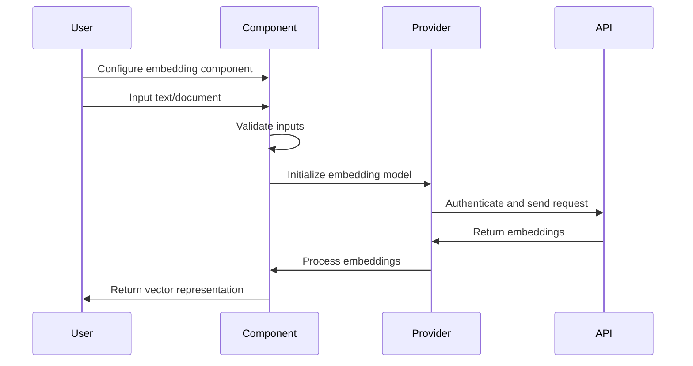

# Embeddings Module Documentation

## Overview

The embeddings module provides a comprehensive framework for generating text embeddings using various AI providers and models. It serves as a unified interface for integrating different embedding services, enabling developers to convert text into numerical vector representations that can be used for semantic search, similarity matching, and other natural language processing tasks.

## Purpose

The embeddings module is designed to:
- Provide a standardized interface for multiple embedding providers (OpenAI, Google, Ollama)
- Handle authentication and API key management for different services
- Support configurable embedding dimensions and model parameters
- Integrate seamlessly with the Langflow component system
- Enable batch processing of text documents for efficient embedding generation

## Architecture



## Core Components

### 1. Base Embeddings Model ([`LCEmbeddingsModel`](embeddings_base.md))
The foundational abstract class that defines the interface for all embedding components. It provides:
- Standardized output structure for embedding models
- Validation of required methods and outputs
- Integration with the Langflow component tracing system

For detailed information, see [embeddings_base.md](embeddings_base.md)

### 2. Provider-Specific Implementations

#### OpenAI Embeddings ([`OpenAIEmbeddingsComponent`](openai_embeddings.md))
- Integrates with OpenAI's embedding models
- Supports various OpenAI embedding models including text-embedding-ada-002
- Handles API authentication and rate limiting

For detailed information, see [openai_embeddings.md](openai_embeddings.md)

#### Google Generative AI Embeddings ([`GoogleGenerativeAIEmbeddingsComponent`](google_embeddings.md))
- Connects to Google's generative AI embedding service
- Supports configurable output dimensions (1-768)
- Implements batch processing with custom embedding logic
- Handles task types and title metadata for improved embeddings

For detailed information, see [google_embeddings.md](google_embeddings.md)

#### Ollama Embeddings ([`OllamaEmbeddingsComponent`](ollama_embeddings.md))
- Provides integration with locally hosted Ollama models
- Supports dynamic model discovery and validation
- Includes real-time URL validation and model refresh capabilities
- Filters embedding-specific models from available Ollama models

For detailed information, see [ollama_embeddings.md](ollama_embeddings.md)

## Data Flow



## Integration Points

### Component System Integration
The embeddings module integrates with the broader Langflow component system through:
- **Input/Output System**: Standardized input fields for API keys, model names, and text content
- **Component Base Class**: Inherits from the core Component class for consistent behavior
- **Field Typing**: Uses Langflow's type system for embedding objects

### Related Modules
- **[Vector Stores](../vector_stores.md)**: Embeddings are commonly used with vector stores for semantic search
- **[Component System](../component_system.md)**: Base component functionality and custom component development
- **[LLM Models](../llm_models.md)**: Complementary text generation capabilities

## Key Features

### Multi-Provider Support
- **OpenAI**: Industry-standard embedding models with proven performance
- **Google**: Advanced generative AI embeddings with customizable dimensions
- **Ollama**: Local deployment options for privacy and cost optimization

### Configuration Management
- API key handling with secure secret input fields
- Model selection with validation and discovery
- Configurable embedding dimensions and parameters
- Real-time model availability checking

### Error Handling
- Comprehensive validation of API keys and model parameters
- Graceful handling of network errors and API failures
- User-friendly error messages with troubleshooting guidance
- Automatic retry mechanisms for transient failures

## Usage Patterns

### Basic Text Embedding
```
1. Select embedding provider component
2. Configure API credentials
3. Choose appropriate model
4. Input text for embedding
5. Receive vector representation
```

### Batch Document Processing
```
1. Prepare list of documents
2. Configure batch size parameters
3. Process documents in batches
4. Receive embedding matrix
5. Use for similarity search or clustering
```

### Integration with Vector Stores
```
1. Generate embeddings for documents
2. Store in vector database
3. Query with embedded search terms
4. Retrieve similar documents
```

## Best Practices

### Model Selection
- Choose models based on your specific use case and performance requirements
- Consider dimensionality vs. accuracy trade-offs
- Evaluate cost implications of different providers

### API Management
- Store API keys securely using environment variables or secret management
- Monitor usage and implement rate limiting where appropriate
- Handle API errors gracefully with fallback options

### Performance Optimization
- Use batch processing for multiple documents
- Implement caching for frequently accessed embeddings
- Consider local deployment options for sensitive data

## Troubleshooting

### Common Issues
- **API Key Errors**: Verify credentials and permissions
- **Model Availability**: Check model support for your region
- **Network Connectivity**: Ensure proper firewall and proxy configuration
- **Rate Limiting**: Implement appropriate delays and retry logic

### Debug Information
- Enable detailed logging for embedding operations
- Monitor API response times and error rates
- Validate input text format and encoding
- Check embedding dimension compatibility with downstream systems