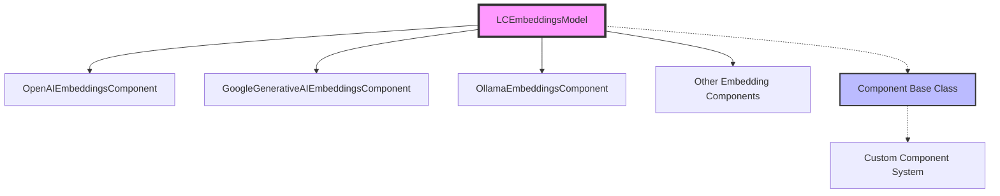
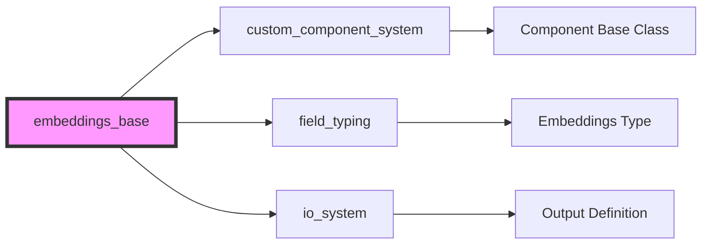
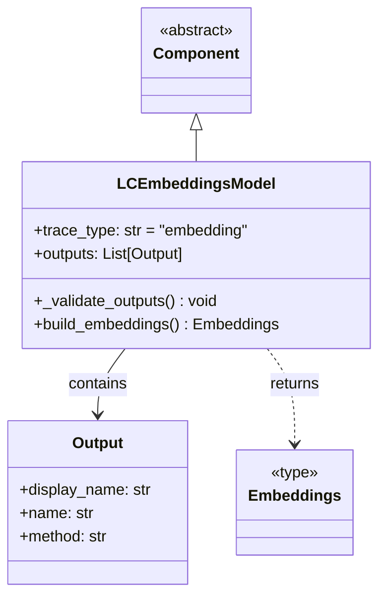
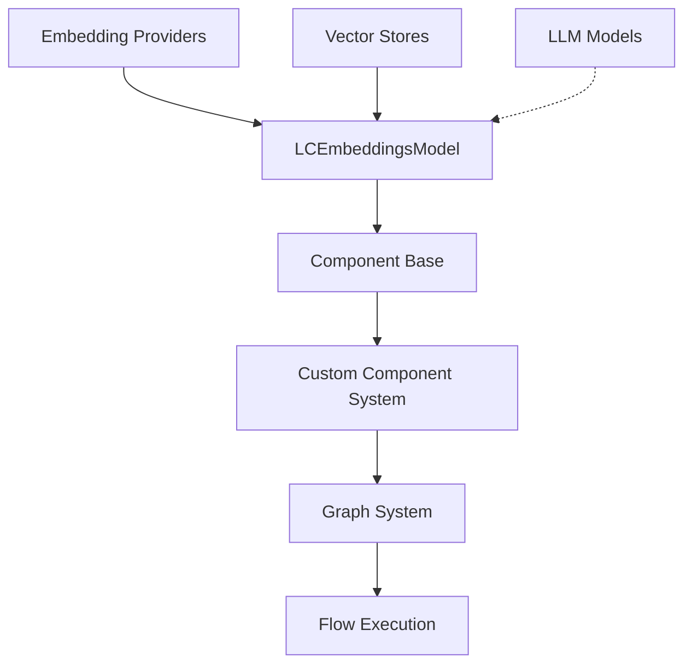
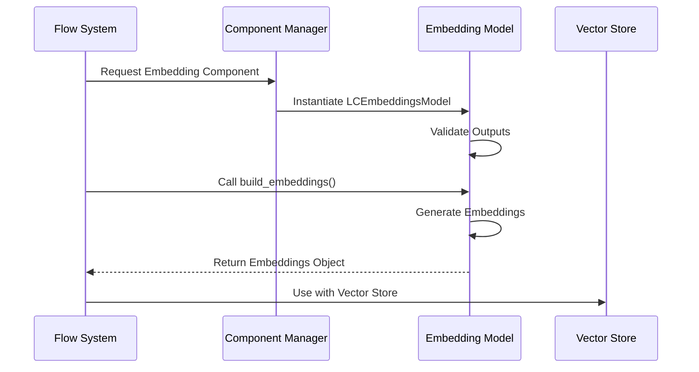

# Embeddings Base Module Documentation

## Introduction

The embeddings_base module provides the foundational framework for embedding model components within the Langflow system. It defines the abstract base class `LCEmbeddingsModel` that serves as the template for all embedding model implementations, ensuring consistent interface and behavior across different embedding providers.

## Core Architecture

### Component Hierarchy

The embeddings_base module sits at the foundation of the embeddings ecosystem, providing the base class that all specific embedding implementations inherit from:



### Module Dependencies



## Core Component: LCEmbeddingsModel

### Purpose and Responsibilities

The `LCEmbeddingsModel` class serves as the abstract base class for all embedding model components in the Langflow system. It provides:

1. **Standardized Interface**: Defines the contract that all embedding components must implement
2. **Validation Framework**: Ensures required outputs and methods are properly defined
3. **Trace Integration**: Sets up embedding-specific tracing for monitoring and debugging
4. **Output Specification**: Defines the standard output structure for embedding models

### Class Structure



### Key Features

#### 1. Trace Type Configuration
```python
trace_type = "embedding"
```
This enables embedding-specific tracing and monitoring throughout the system.

#### 2. Standardized Output Definition
```python
outputs = [
    Output(display_name="Embedding Model", name="embeddings", method="build_embeddings"),
]
```
All embedding components provide a consistent output interface with:
- **Display Name**: Human-readable identifier
- **Name**: System identifier for the output
- **Method**: The method that generates the embeddings

#### 3. Validation Framework
The `_validate_outputs()` method ensures that:
- Required output methods are defined in the outputs list
- Corresponding methods exist in the implementing class
- Proper error messages are provided for missing implementations

#### 4. Abstract Method Contract
The `build_embeddings()` method must be implemented by all subclasses:
```python
def build_embeddings(self) -> Embeddings:
    msg = "You must implement the build_embeddings method in your class."
    raise NotImplementedError(msg)
```

## Integration with Langflow System

### Component System Integration



### Data Flow Architecture



## Usage Patterns

### 1. Implementation Pattern
All embedding components follow this pattern:
```python
class MyEmbeddingsComponent(LCEmbeddingsModel):
    def build_embeddings(self) -> Embeddings:
        # Implementation specific to the embedding provider
        return embeddings_object
```

### 2. Validation Pattern
The base class automatically validates:
- Output definitions are complete
- Required methods are implemented
- Type consistency is maintained

### 3. Integration Pattern
Embedding components integrate with:
- Vector stores for similarity search
- Document processing pipelines
- RAG (Retrieval-Augmented Generation) systems

## Related Modules

### Parent Module
- [embeddings.md](embeddings.md) - Contains the complete embeddings ecosystem overview

### Dependent Modules
- [component_system.md](component_system.md) - Provides the base Component class
- [graph_system.md](graph_system.md) - Manages component execution within graphs
- [vector_stores.md](vector_stores.md) - Consumes embedding models for vector operations

### Type Dependencies
- [schema_types.md](schema_types.md) - Defines content types and schemas
- [field_typing.md](field_typing.md) - Provides Embeddings type definition

## Error Handling

The module implements comprehensive error handling:

1. **Missing Output Validation**: Raises `ValueError` if required outputs are not defined
2. **Missing Method Validation**: Raises `ValueError` if required methods are not implemented
3. **Implementation Enforcement**: Raises `NotImplementedError` for abstract methods

## Best Practices

### For Component Developers

1. **Always Implement build_embeddings**: This is the core method that must be implemented
2. **Follow Output Conventions**: Use the standard output name "embeddings" for consistency
3. **Handle Provider-Specific Logic**: Implement authentication, configuration, and error handling specific to your embedding provider
4. **Maintain Type Safety**: Ensure the return type matches the `Embeddings` type annotation

### For System Integrators

1. **Validate Components**: Use the built-in validation to ensure components are properly configured
2. **Handle Errors Gracefully**: Catch and handle validation errors appropriately
3. **Monitor Performance**: Use the trace_type for embedding-specific monitoring
4. **Maintain Consistency**: Follow the established patterns for output naming and structure

## Future Considerations

The embeddings_base module is designed to be extensible. Future enhancements may include:

1. **Batch Processing Support**: Methods for handling batch embedding operations
2. **Caching Integration**: Built-in support for embedding result caching
3. **Multi-modal Support**: Extension to support image, audio, and video embeddings
4. **Performance Metrics**: Built-in performance monitoring and optimization suggestions

## Conclusion

The embeddings_base module provides a robust foundation for the Langflow embedding ecosystem. By defining clear interfaces, validation mechanisms, and integration patterns, it ensures that all embedding components work consistently within the larger system while allowing for provider-specific implementations and optimizations.