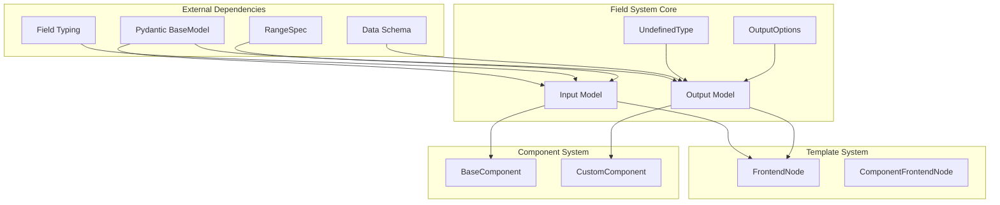
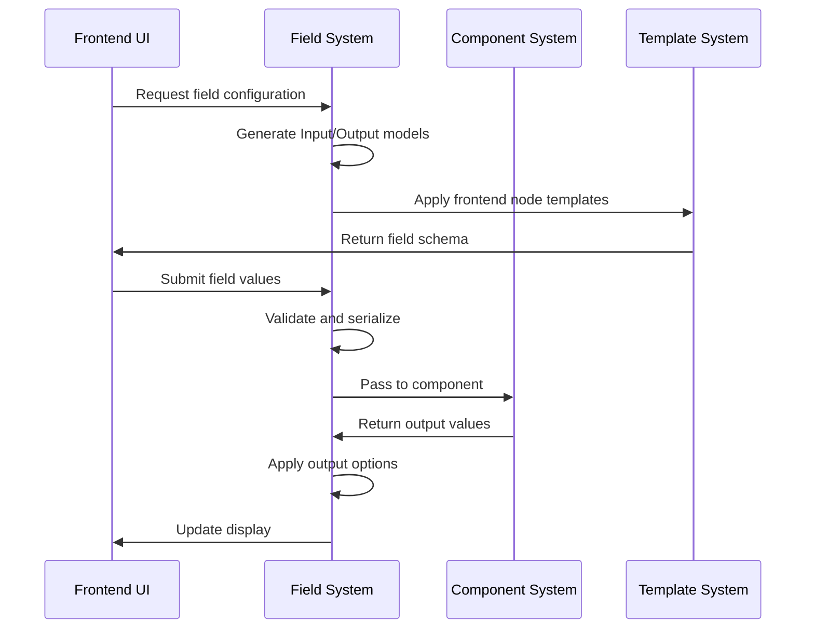

# Field System Module Documentation

## Introduction

The field_system module is a foundational component of the Langflow template system that defines the structure and behavior of input and output fields used throughout the application. It provides a comprehensive framework for handling field types, validation, serialization, and user interface configuration for component parameters and outputs.

This module serves as the bridge between the frontend interface and backend component logic, enabling dynamic form generation, type validation, and data flow management within the Langflow visual programming environment.

## Architecture Overview

The field_system module is built around three core abstractions that work together to provide a flexible and extensible field management system:

### Core Components

1. **UndefinedType**: An enumeration that provides a standardized way to represent undefined or uninitialized field values
2. **Input**: A comprehensive model for defining input fields with extensive configuration options
3. **Output**: A model for defining output fields with type management and result handling capabilities

### System Architecture



## Component Details

### UndefinedType Enumeration

The `UndefinedType` enumeration provides a standardized way to represent undefined field values, ensuring consistent handling of uninitialized states across the system.

```python
class UndefinedType(Enum):
    undefined = "__UNDEFINED__"
```

**Key Features:**
- Provides a single, consistent undefined value
- Used as the default value for output fields
- Enables clear distinction between null/empty values and truly undefined states

### Input Model

The `Input` model is a comprehensive Pydantic model that defines the structure and behavior of input fields. It supports extensive customization options for different field types and use cases.

#### Key Properties:

| Property | Type | Default | Description |
|----------|------|---------|-------------|
| `field_type` | str \| type \| None | str | The data type of the field |
| `required` | bool | False | Whether the field is required |
| `placeholder` | str | "" | Placeholder text for the field |
| `is_list` | bool | False | Whether the field accepts multiple values |
| `show` | bool | True | Whether to display the field in the UI |
| `multiline` | bool | False | Whether to enable text editor mode |
| `value` | Any | None | The current value of the field |
| `file_types` | list[str] | [] | Allowed file types for file inputs |
| `password` | bool \| None | None | Whether the field is a password input |
| `options` | list[str] \| Callable \| None | None | Available options for select fields |
| `name` | str \| None | None | Internal field name |
| `display_name` | str \| None | None | User-friendly display name |
| `advanced` | bool | False | Whether the field is advanced (hidden by default) |
| `input_types` | list[str] \| None | None | Supported input types for multi-type fields |
| `dynamic` | bool | False | Whether the field is dynamically updated |
| `info` | str \| None | "" | Tooltip information |
| `real_time_refresh` | bool \| None | None | Enable real-time refresh |
| `refresh_button` | bool \| None | None | Show refresh button |
| `refresh_button_text` | str \| None | None | Custom refresh button text |
| `range_spec` | RangeSpec \| None | None | Numeric range specifications |
| `load_from_db` | bool | False | Load value from database |
| `title_case` | bool | False | Display name in title case |

#### Advanced Features:

**Type Validation and Serialization:**
- Automatic type conversion and validation
- Support for generic types and custom components
- Field-specific serialization logic

**Dynamic Field Behavior:**
- Conditional display based on other fields
- Real-time validation and updates
- Database integration for persistent values

**UI Configuration:**
- Rich text editor support for multiline fields
- File upload with type filtering
- Password field masking
- Advanced field grouping and hiding

### Output Model

The `Output` model defines the structure for component outputs, including type management, result handling, and display configuration.

#### Key Properties:

| Property | Type | Default | Description |
|----------|------|---------|-------------|
| `types` | list[str] | [] | Available output types |
| `selected` | str \| None | None | Currently selected output type |
| `name` | str | required | Output field name |
| `hidden` | bool \| None | None | Whether the output is hidden |
| `display_name` | str \| None | None | User-friendly display name |
| `method` | str \| None | None | Method to generate output |
| `value` | Any \| None | UNDEFINED | Current output value |
| `cache` | bool | True | Whether to cache the output |
| `required_inputs` | list[str] \| None | None | Required input fields |
| `allows_loop` | bool | False | Whether output supports looping |
| `group_outputs` | bool | False | Group all outputs without dropdown |
| `options` | OutputOptions \| None | None | Output-specific options |
| `tool_mode` | bool | True | Whether output can be used as tool |

#### OutputOptions Sub-model:

The `OutputOptions` model provides additional configuration for output behavior:

- `filter`: String filter to apply to output data
- Integration with [Data Schema](schema_types.md) for structured output processing

## Data Flow and Integration

### Field System Integration Flow



### Component Integration

The field_system integrates closely with the [Component System](component_system.md) to provide:

1. **Dynamic Form Generation**: Input models automatically generate appropriate UI forms
2. **Type Safety**: Runtime type validation ensures data integrity
3. **Value Binding**: Seamless two-way data binding between UI and component logic
4. **Output Processing**: Structured output handling with filtering and transformation

### Template System Integration

Integration with the [Template System](template_system.md) enables:

1. **Frontend Node Generation**: Automatic creation of UI nodes based on field definitions
2. **Custom Component Support**: Specialized field handling for custom components
3. **Dynamic UI Updates**: Real-time UI updates based on field state changes

## Usage Patterns

### Basic Input Field Definition

```python
# Simple text input
name_field = Input(
    name="component_name",
    display_name="Component Name",
    field_type="str",
    required=True,
    placeholder="Enter component name"
)

# Numeric input with range
age_field = Input(
    name="age",
    field_type="int",
    range_spec=RangeSpec(min=0, max=150, step=1),
    required=True
)

# File input
file_field = Input(
    name="upload_file",
    field_type="file",
    file_types=[".txt", ".csv", ".json"],
    required=True
)
```

### Advanced Field Configuration

```python
# Dynamic select field
category_field = Input(
    name="category",
    field_type="str",
    options=["Option 1", "Option 2", "Option 3"],
    dynamic=True,
    real_time_refresh=True
)

# Multi-type input
input_field = Input(
    name="data_input",
    input_types=["Text", "Data", "Table"],
    field_type="Text",
    info="Accepts text, data objects, or table data"
)
```

### Output Field Definition

```python
# Basic output
result_output = Output(
    name="result",
    types=["Text", "JSON", "Data"],
    selected="Text",
    display_name="Processing Result"
)

# Filtered output
filtered_output = Output(
    name="filtered_data",
    types=["Data"],
    options=OutputOptions(filter="key == 'active'"),
    display_name="Filtered Results"
)
```

## Validation and Error Handling

### Input Validation

The field_system implements comprehensive validation at multiple levels:

1. **Type Validation**: Ensures field values match specified types
2. **Range Validation**: Numeric fields validate against RangeSpec constraints
3. **File Validation**: File type and path validation for file inputs
4. **Required Field Validation**: Ensures required fields have values
5. **Custom Validation**: Support for component-specific validation logic

### Serialization and Deserialization

The system provides robust serialization capabilities:

- **Alias Support**: Field names can be aliased for frontend/backend compatibility
- **Type Conversion**: Automatic conversion between Python types and JSON-serializable formats
- **Custom Serializers**: Field-specific serialization logic for complex types
- **None Exclusion**: Optional exclusion of None values from serialized output

## Performance Considerations

### Caching Strategy

The field_system implements intelligent caching:

- **Output Caching**: Output values are cached by default to avoid recomputation
- **Field State Caching**: Dynamic field states can be cached for performance
- **Validation Caching**: Validation results can be cached for expensive operations

### Memory Management

- **Lazy Evaluation**: Field values are computed only when needed
- **Reference Management**: Proper cleanup of circular references
- **Large Data Handling**: Special handling for large file and data inputs

## Security Features

### Input Sanitization

- **Type Constraints**: Strict type validation prevents injection attacks
- **File Path Validation**: Prevents directory traversal attacks
- **Password Field Handling**: Secure handling of sensitive data

### Access Control

- **Advanced Field Hiding**: Sensitive fields can be hidden from unauthorized users
- **Database Integration**: Secure loading of sensitive configuration from databases
- **Dynamic Field Control**: Runtime control over field visibility and editability

## Extension Points

### Custom Field Types

The system supports custom field types through:

- **Type Registration**: Custom types can be registered with the validation system
- **Custom Serializers**: Field-specific serialization logic
- **Validation Extensions**: Custom validation functions

### Plugin Integration

- **Dynamic Options**: Options can be provided by callable functions for dynamic content
- **External Data Sources**: Integration with external APIs for field options
- **Custom UI Components**: Support for custom frontend field renderers

## Related Documentation

- [Component System Documentation](component_system.md) - Integration with component framework
- [Template System Documentation](template_system.md) - Frontend node generation
- [Schema Types Documentation](schema_types.md) - Data structure definitions
- [Graph System Documentation](graph_system.md) - Field usage in graph vertices

## API Reference

### Input Model Methods

- `to_dict()`: Serialize input configuration to dictionary
- `validate_model()`: Validate input configuration
- `serialize_model()`: Custom serialization logic

### Output Model Methods

- `to_dict()`: Serialize output configuration
- `add_types(types)`: Add supported output types
- `apply_options(result)`: Apply output options to result
- `serialize_model()`: Custom serialization with undefined handling

### Utility Functions

- `validate_type()`: Type validation and conversion
- `validate_file_types()`: File type validation and normalization
- `serialize_field_type()`: Field type serialization with range spec handling