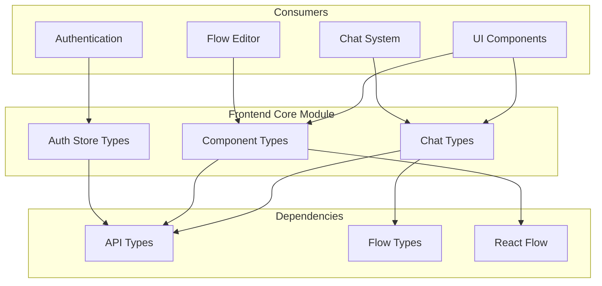
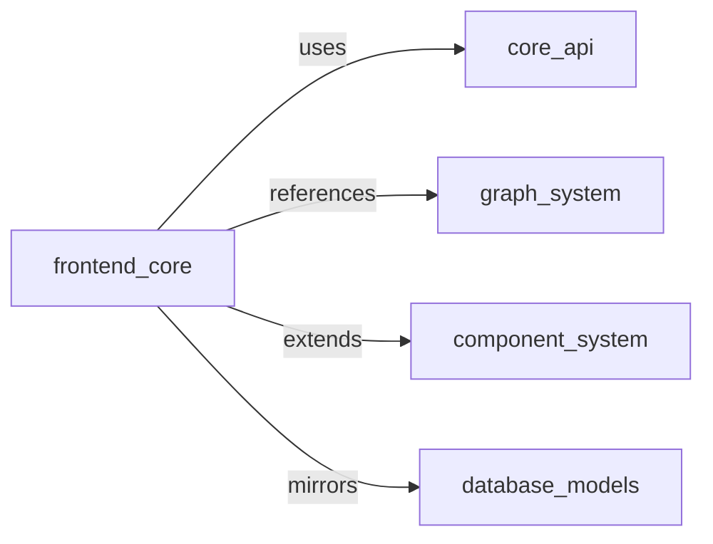

# Frontend Core Module Documentation

## Overview

The frontend_core module serves as the foundational layer for the Langflow frontend application, providing essential type definitions, interfaces, and data structures that support the entire frontend ecosystem. This module establishes the contract between different frontend components and ensures type safety across the application.

## Architecture



## Core Functionality

### 1. Chat System Types (`chat/index.ts`)

The chat system provides comprehensive type definitions for handling conversational interfaces within the Langflow application:

- **Message Types**: Defines structures for chat messages, including text, media, and structured content
- **Content Blocks**: Supports rich content with markdown, media, and code blocks
- **Playground Events**: Handles real-time event streaming and token updates
- **File Handling**: Manages file attachments and previews in chat contexts

Key interfaces include:
- `ChatMessageType`: Core message structure with metadata
- `ContentBlock`: Rich content container with multiple content types
- `PlaygroundEvent`: Real-time event handling for streaming responses

### 2. Component System Types (`components/index.ts`)

Provides extensive type definitions for React components and UI elements:

- **Input Components**: Type-safe input fields with validation
- **Node Components**: Flow-based node representations
- **Modal Types**: Various modal dialog configurations
- **Form Types**: Comprehensive form handling types
- **UI State**: Component state management types

This file contains over 50 type definitions supporting the entire component ecosystem.

### 3. Authentication Store (`zustand/auth/index.ts`)

Defines the authentication state management interface using Zustand:

- **User State**: User data and authentication status
- **Token Management**: Access token and API key handling
- **Error Handling**: Authentication error tracking
- **Session Management**: Login/logout functionality

## Module Relationships



The frontend_core module serves as the type foundation that other modules depend on:

- **core_api**: Frontend types mirror backend API schemas for consistency
- **graph_system**: Component types support graph-based UI representations
- **component_system**: Extends base component interfaces
- **database_models**: Frontend types reflect backend data models

## Key Features

### Type Safety
- Comprehensive TypeScript interfaces ensure compile-time type checking
- Extensive use of union types for flexible content handling
- Generic types for reusable component patterns

### Content Flexibility
- Multi-format content support (text, JSON, media, code)
- Dynamic content block system for rich UI experiences
- Extensible type system for future content types

### State Management
- Centralized authentication state interface
- Component state type definitions
- Form and input state management

## Usage Patterns

### Chat Integration
```typescript
// Message handling with content blocks
const message: ChatMessageType = {
  message: "User input",
  isSend: true,
  content_blocks: [{
    title: "Response",
    contents: [{ type: "text", text: "AI response" }],
    allow_markdown: true,
    component: "ChatComponent"
  }]
};
```

### Component Props
```typescript
// Type-safe component props
const inputProps: InputComponentType = {
  value: "input value",
  onChange: (value) => updateValue(value),
  password: false,
  required: true
};
```

### Authentication State
```typescript
// Zustand store usage
const authStore: AuthStoreType = {
  isAuthenticated: true,
  accessToken: "token",
  userData: userObject,
  logout: async () => { /* logout logic */ }
};
```

## Related Documentation

- [Chat System Documentation](chat_types.md) - Detailed documentation of chat message types, content blocks, and playground events
- [Component Types Documentation](component_types.md) - Comprehensive guide to component prop types and UI element interfaces
- [Authentication Store Documentation](auth_store.md) - Complete reference for authentication state management and user session handling
- [Core API Documentation](core_api.md) - Backend API integration and data transfer object definitions
- [Graph System Documentation](graph_system.md) - Node-based flow editor system and graph visualization types

## Development Guidelines

1. **Type Extensions**: When adding new types, maintain consistency with existing patterns
2. **Backward Compatibility**: Ensure type changes are backward compatible or provide migration paths
3. **Documentation**: Update type documentation when modifying interfaces
4. **Testing**: Type definitions should be thoroughly tested with TypeScript compilation

## Future Considerations

- **Performance**: Consider type-only imports for better tree-shaking
- **Modularity**: Potential splitting into smaller, more focused type modules
- **Validation**: Integration with runtime validation libraries
- **Documentation**: Auto-generated type documentation from TypeScript definitions