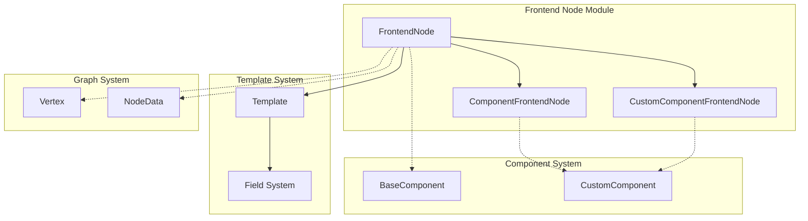
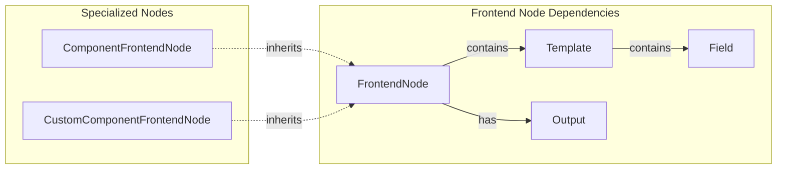
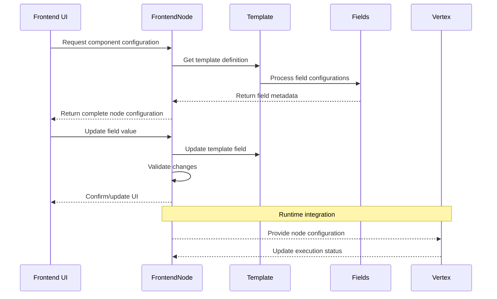
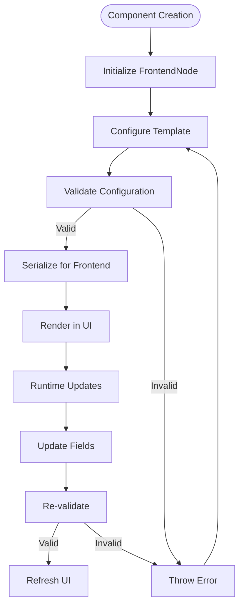

# Frontend Node Module Documentation

## Introduction

The frontend_node module is a core component of the Langflow template system that defines how components are represented and configured in the frontend interface. It provides the bridge between backend component definitions and their visual representation in the user interface, handling metadata, field configuration, and component validation.

## Module Overview

The frontend_node module serves as the foundation for creating, configuring, and managing component nodes in the Langflow visual interface. It defines the structure and behavior of components as they appear to users, including their visual properties, input/output configurations, and validation rules.

## Core Components

### FrontendNode

The `FrontendNode` class is the base class for all frontend component representations. It encapsulates all the metadata and configuration needed to render a component in the visual interface.

**Key Responsibilities:**
- Component metadata management (name, description, icon, documentation)
- Input/output field configuration and validation
- Template management for component configuration
- Base class and type system management
- Component state tracking (beta, legacy, frozen, pinned)

**Key Properties:**
- `template`: The component's field template defining inputs and configuration
- `base_classes`: List of base classes the component inherits from
- `outputs`: List of output fields and their types
- `display_name`: User-friendly name shown in the interface
- `documentation`: Help text and usage instructions

### ComponentFrontendNode

A specialized frontend node for standard components with code-based configuration. It provides a default template with a code editor field for component implementation.

### CustomComponentFrontendNode

A specialized frontend node for custom user-defined components. Similar to ComponentFrontendNode but specifically designed for user-created components with custom logic.

## Architecture



## Component Relationships



## Data Flow



## Key Features

### 1. Template Management

Frontend nodes manage component templates that define the structure and configuration of component fields:

```python
# Template integration
self.template: Template  # Contains field definitions
self.field_order: list[str]  # Controls field display order
```

### 2. Validation System

Comprehensive validation ensures component integrity:

- **Name Overlap Validation**: Prevents conflicts between input and output field names
- **Reserved Attribute Validation**: Protects system attributes from user-defined fields
- **Type System Validation**: Ensures consistency between base classes and output types

### 3. Serialization and Deserialization

Frontend nodes support flexible serialization for API communication:

```python
# Model serialization with custom handling
@model_serializer(mode="wrap")
def serialize_model(self, handler):
    # Custom serialization logic
    # Handles template conversion and output mapping
```

### 4. Dynamic Field Management

Runtime field updates and configuration:

```python
def set_field_value_in_template(self, field_name, value) -> None:
    # Update field values dynamically
    
def set_field_load_from_db_in_template(self, field_name, value) -> None:
    # Control database loading behavior
```

## Integration Points

### Graph System Integration

Frontend nodes integrate with the [graph_system](graph_system.md) to provide visual representation of vertices:

- Node data mapping to vertex configuration
- Input/output port definitions for edge connections
- Execution state visualization

### Component System Integration

Connection to the [component_system](component_system.md) for component behavior:

- Base class inheritance mapping
- Custom component code integration
- Component validation and lifecycle

### Template System Integration

Part of the broader [template_system](template_system.md):

- Field template management
- Type system coordination
- Frontend-backend synchronization

## Process Flow



## Usage Patterns

### 1. Component Definition

Frontend nodes are typically created during component registration:

```python
# Standard component
node = FrontendNode(
    name="MyComponent",
    display_name="My Component",
    template=template_instance,
    base_classes=["BaseClass"],
    outputs=[output_definitions]
)
```

### 2. Custom Component Creation

For user-defined components:

```python
# Custom component with code editor
custom_node = CustomComponentFrontendNode()
custom_node.template.fields[0].value = user_code
```

### 3. Runtime Configuration

Dynamic updates during execution:

```python
# Update field values
node.set_field_value_in_template("param", new_value)

# Modify base classes
node.add_base_class("NewBaseClass")

# Add output types
node.add_output_type("OutputType")
```

## Error Handling

The module implements comprehensive error handling:

- **Validation Errors**: Clear messages for configuration issues
- **Name Conflicts**: Detailed information about overlapping names
- **Type Mismatches**: Guidance for base class and output type issues

## Best Practices

1. **Field Naming**: Use descriptive, unique names that don't conflict with system attributes
2. **Documentation**: Provide comprehensive documentation for user understanding
3. **Validation**: Always validate component configuration before deployment
4. **Base Classes**: Maintain accurate base class lists for proper type inference
5. **Output Types**: Define clear output types for proper graph connectivity

## Related Modules

- [template_system](template_system.md): Parent module containing field and template definitions
- [graph_system](graph_system.md): Vertex and edge management system
- [component_system](component_system.md): Backend component implementations
- [core_api](core_api.md): API schemas and request/response handling

## Summary

The frontend_node module is essential for creating a seamless bridge between backend component logic and frontend user experience. It provides the metadata, configuration, and validation necessary to render components effectively in the visual interface while maintaining consistency with the underlying graph and component systems. Through its comprehensive template management and validation capabilities, it ensures that components are both user-friendly and technically sound.