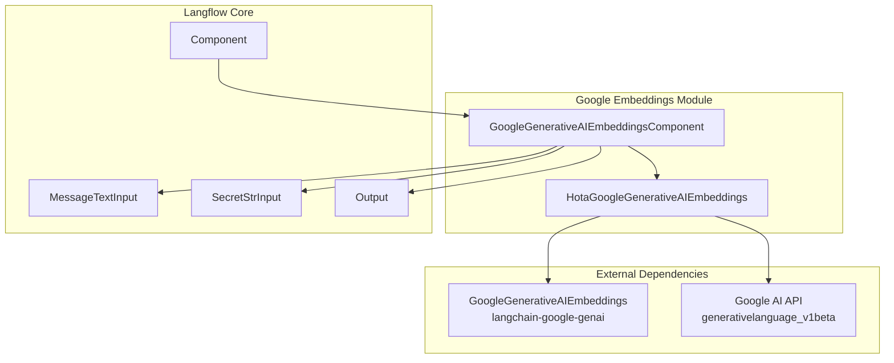
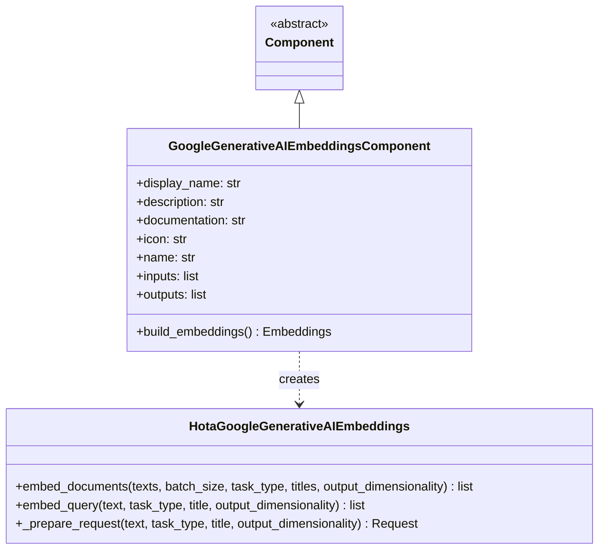
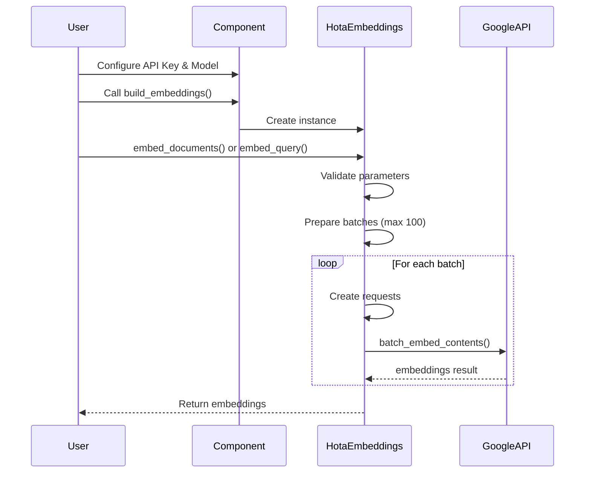
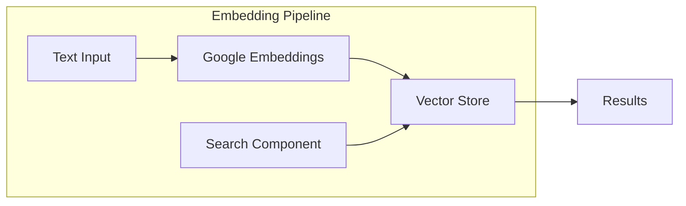

# Google Embeddings Module Documentation

## Introduction

The Google Embeddings module provides a specialized component for generating text embeddings using Google's Generative AI embedding models. This module integrates with Google's state-of-the-art embedding services to convert text into high-dimensional vector representations, enabling semantic search, similarity matching, and other natural language processing tasks within the Langflow ecosystem.

## Core Component

### GoogleGenerativeAIEmbeddingsComponent

The `GoogleGenerativeAIEmbeddingsComponent` is the primary component that interfaces with Google's Generative AI embedding service. It extends the base `Component` class and provides a user-friendly interface for generating embeddings using Google's models.

**Key Features:**
- Support for Google's text-embedding models (default: `models/text-embedding-004`)
- Configurable output dimensionality (1-768 dimensions)
- Batch processing capabilities with automatic batch size management
- Support for different task types (RETRIEVAL_QUERY, RETRIEVAL_DOCUMENT, etc.)
- Optional title support for document embeddings
- Built-in error handling and validation

## Architecture

## Component Structure

## Data Flow

## Configuration

### Input Parameters

| Parameter | Type | Required | Default | Description |
|-----------|------|----------|---------|-------------|
| `api_key` | SecretStr | Yes | - | Google AI API key for authentication |
| `model_name` | str | No | `models/text-embedding-004` | Google embedding model to use |

### Output

| Output | Type | Description |
|--------|------|-------------|
| `embeddings` | Embeddings | LangChain embeddings instance for generating text embeddings |

## Advanced Features

### Batch Processing
The component automatically handles batching for document embeddings, with a maximum batch size of 100 strings as required by Google's API. This ensures optimal performance when processing large numbers of documents.

### Dimensionality Control
Users can control the output dimensionality of embeddings, with support for dimensions ranging from 1 to 768. This allows for trade-offs between embedding quality and storage/computation requirements.

### Task Type Support
The component supports different task types as defined by Google's API:
- `RETRIEVAL_QUERY`: For query embeddings in retrieval scenarios
- `RETRIEVAL_DOCUMENT`: For document embeddings in retrieval scenarios
- Other task types as supported by the API

### Title Support
When using `RETRIEVAL_DOCUMENT` task type, optional titles can be provided for documents to enhance embedding quality.

## Error Handling

The component includes comprehensive error handling for:
- **API Key validation**: Ensures API key is provided before making requests
- **Dimension validation**: Validates output dimensionality is within allowed range (1-768)
- **API error handling**: Catches and wraps Google API errors with descriptive messages
- **Batch processing errors**: Handles errors during batch embedding operations

## Integration with Langflow

The Google Embeddings component integrates seamlessly with other Langflow components:

### Common Use Cases
1. **Semantic Search**: Convert documents and queries to embeddings for similarity search
2. **Document Clustering**: Generate embeddings for document grouping and categorization
3. **Recommendation Systems**: Use embeddings for content-based recommendations
4. **RAG Applications**: Power retrieval-augmented generation systems

## Dependencies

This module depends on several key components:

- **[Component System](component_system.md)**: Inherits from the base Component class
- **[Embeddings Base](embeddings_base.md)**: Integrates with LangChain embeddings framework
- **[Google Integration](google_integration.md)**: Part of the broader Google AI integration ecosystem

## Performance Considerations

- **Batch Size**: Automatic batching with 100-item limit for optimal API usage
- **Rate Limiting**: Respects Google's API rate limits and quotas
- **Caching**: Can be combined with caching components for improved performance
- **Dimensionality**: Lower dimensions reduce storage and computation costs

## Security

- API keys are handled as secure strings and not exposed in logs or outputs
- All API communications use secure HTTPS connections
- Authentication credentials are validated before API calls

## Troubleshooting

Common issues and solutions:

1. **Invalid API Key**: Ensure the Google AI API key is valid and has necessary permissions
2. **Dimension Errors**: Verify output dimensionality is between 1 and 768
3. **Batch Size Errors**: The component automatically handles batching, manual intervention rarely needed
4. **Model Availability**: Check that the specified model is available in your Google AI project

## Future Enhancements

Potential improvements for the module:
- Support for additional Google embedding models as they become available
- Integration with Google's multimodal embedding capabilities
- Enhanced caching mechanisms for improved performance
- Support for custom embedding fine-tuning

---

*This documentation is part of the [Langflow](index.md) system documentation. For related modules, see [Embeddings](embeddings.md), [Google Integration](google_integration.md), and [Component System](component_system.md).*