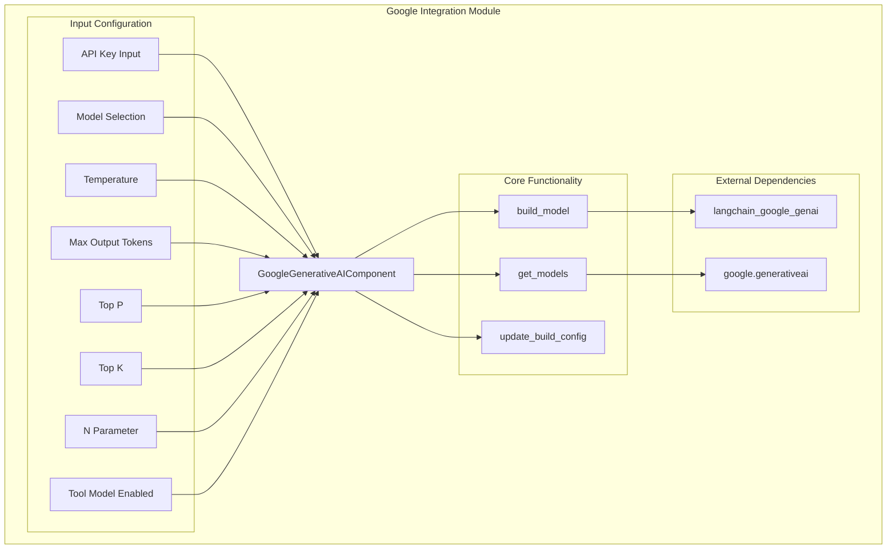
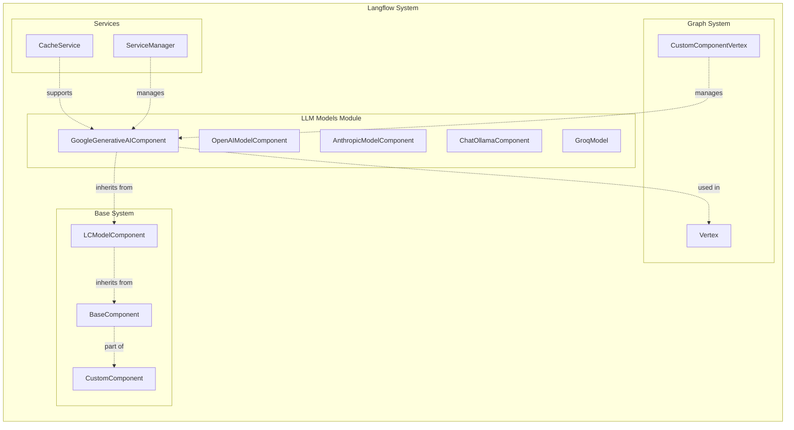
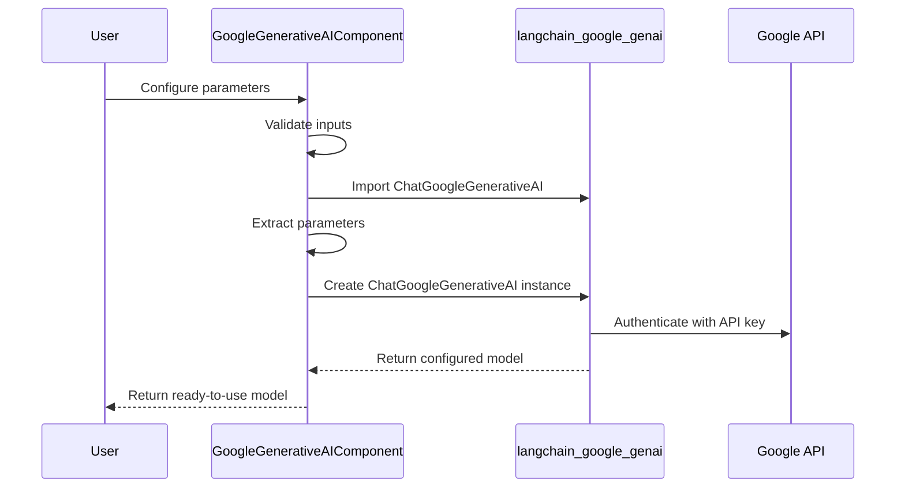
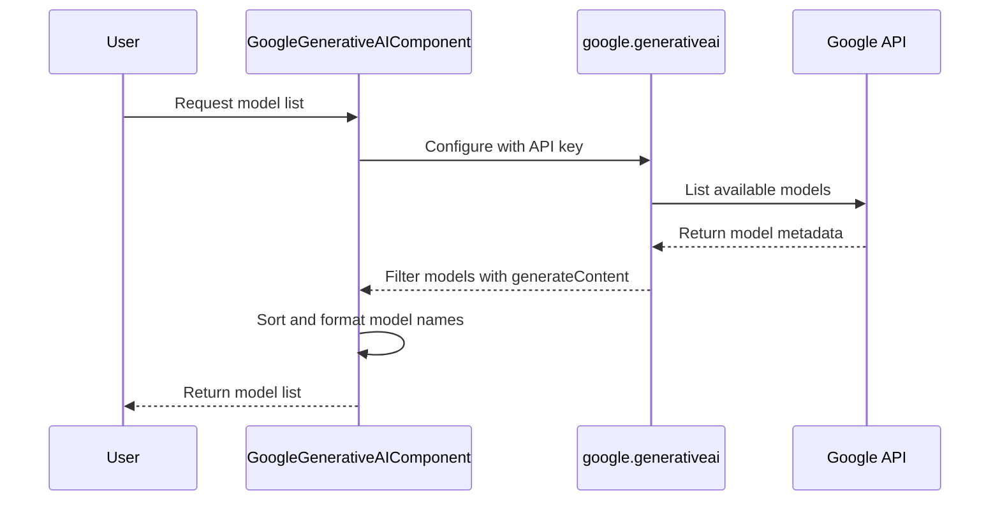
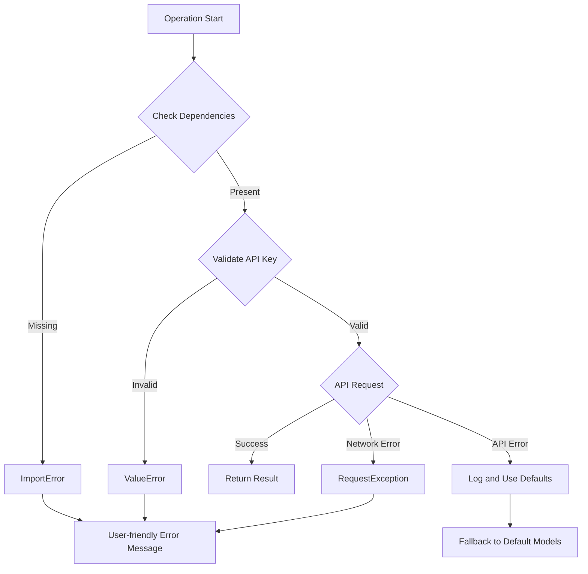
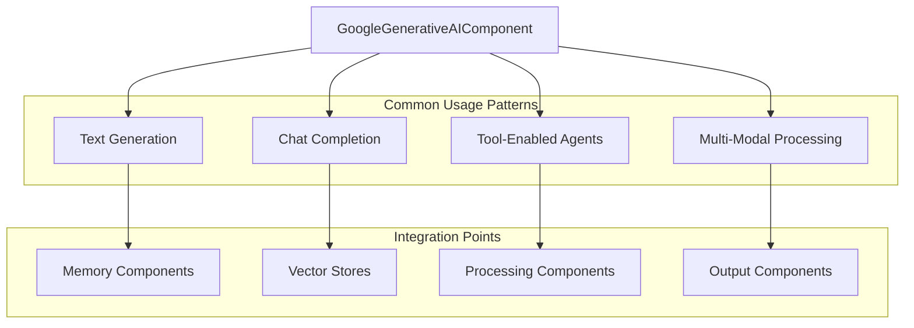

# Google Integration Module Documentation

## Introduction

The Google Integration module provides seamless integration with Google's Generative AI models, enabling Langflow users to leverage Google's state-of-the-art language models within their workflows. This module serves as a bridge between Langflow's component system and Google's Gemini family of models, offering a standardized interface for text generation, chat completions, and tool-enabled interactions.

## Core Purpose

The module's primary purpose is to:
- Provide a unified interface for accessing Google Generative AI models
- Handle authentication and API key management for Google services
- Support advanced model configuration including temperature, top-p, top-k sampling
- Enable tool calling capabilities for enhanced AI interactions
- Integrate with Langflow's broader LLM ecosystem

## Architecture Overview

### Component Structure



### System Integration



## Core Components

### GoogleGenerativeAIComponent

The `GoogleGenerativeAIComponent` is the primary component that encapsulates all Google Generative AI functionality. It extends `LCModelComponent` to provide a standardized interface within Langflow's LLM ecosystem.

#### Key Features:

1. **Model Selection**: Dynamic model discovery and selection from Google's available models
2. **Authentication**: Secure API key management with real-time validation
3. **Parameter Control**: Fine-grained control over generation parameters
4. **Tool Support**: Optional tool calling capabilities for enhanced interactions
5. **Error Handling**: Comprehensive error handling for API failures and missing dependencies

#### Configuration Options:

| Parameter | Type | Description | Default |
|-----------|------|-------------|---------|
| `api_key` | SecretStr | Google API Key for authentication | Required |
| `model_name` | str | Model to use (e.g., gemini-1.5-pro) | gemini-1.5-pro |
| `temperature` | float | Controls randomness (0-1) | 0.1 |
| `max_output_tokens` | int | Maximum tokens to generate | None |
| `top_p` | float | Cumulative probability threshold | None |
| `top_k` | int | Top-k sampling parameter | None |
| `n` | int | Number of completions | 1 |
| `tool_model_enabled` | bool | Enable tool calling | False |

## Data Flow

### Model Building Process



### Model Discovery Process



## Dependencies

### Internal Dependencies

The Google Integration module relies on several core Langflow systems:

1. **[LCModelComponent](llm_models.md)**: Base class providing common LLM functionality
2. **[BaseComponent](component_system.md)**: Foundation for all Langflow components
3. **[Vertex System](graph_system.md)**: Integration with the graph execution system
4. **[CacheService](services.md)**: Caching support for model configurations

### External Dependencies

The module requires external packages for Google AI integration:

```python
# Required packages
langchain_google_genai  # LangChain integration for Google models
google-generativeai     # Google's official Generative AI SDK
```

### Error Handling

The module implements comprehensive error handling:



## Integration with Langflow Ecosystem

### Component Registration

The GoogleGenerativeAIComponent integrates with Langflow's component system through:

1. **Template System**: Automatic registration in the component library
2. **Frontend Integration**: UI components for parameter configuration
3. **Graph Execution**: Seamless execution within workflow graphs
4. **Service Management**: Integration with Langflow's service architecture

### Usage Patterns



## Configuration Management

### Dynamic Configuration Updates

The module supports real-time configuration updates through the `update_build_config` method:

1. **API Key Changes**: Triggers model list refresh
2. **Model Selection**: Updates available options based on API access
3. **Tool Mode Toggle**: Filters models based on tool support
4. **Error Recovery**: Falls back to default models on API failures

### Security Considerations

- API keys are handled as `SecretStr` objects for secure storage
- Real-time validation prevents invalid configurations
- No API keys are logged or exposed in error messages
- Secure transmission through HTTPS protocols

## Performance Optimization

### Caching Strategy

The module leverages Langflow's caching system to:
- Cache model configurations
- Store validated API connections
- Reduce redundant API calls for model discovery

### Model Selection Optimization

- Models are sorted by capability and recency
- Tool-enabled filtering for agent workflows
- Fallback to known good models on discovery failures

## Error Recovery and Resilience

### Graceful Degradation

When the Google API is unavailable:
1. Falls back to predefined model list (`GOOGLE_GENERATIVE_AI_MODELS`)
2. Maintains basic functionality with cached configurations
3. Provides clear error messages to users
4. Logs detailed error information for debugging

### Network Resilience

- Handles network timeouts and connection failures
- Implements retry logic for transient failures
- Provides fallback options for critical operations

## Future Enhancements

### Planned Features

1. **Multi-Modal Support**: Enhanced image and video processing capabilities
2. **Batch Processing**: Support for bulk text generation
3. **Streaming Responses**: Real-time response streaming
4. **Advanced Tooling**: Expanded tool calling and function integration
5. **Model Versioning**: Better handling of model version updates

### Integration Roadmap

- Enhanced integration with [memory components](memory.md)
- Improved support for [agent workflows](agents.md)
- Better coordination with [vector stores](vector_stores.md)
- Enhanced [data processing](data_processing.md) capabilities

## Related Documentation

- [LLM Models Module](llm_models.md) - Overview of all LLM integrations
- [Component System](component_system.md) - Base component architecture
- [Graph System](graph_system.md) - Workflow execution system
- [Services Module](services.md) - Service management and caching
- [Base Models](base_models.md) - Foundation model components

## API Reference

For detailed API documentation, see the [Google Generative AI Component API Reference](#api-reference) section.

---

*This documentation is automatically generated and maintained by the Langflow documentation system. For updates or corrections, please refer to the source code and submit changes through the appropriate channels.*