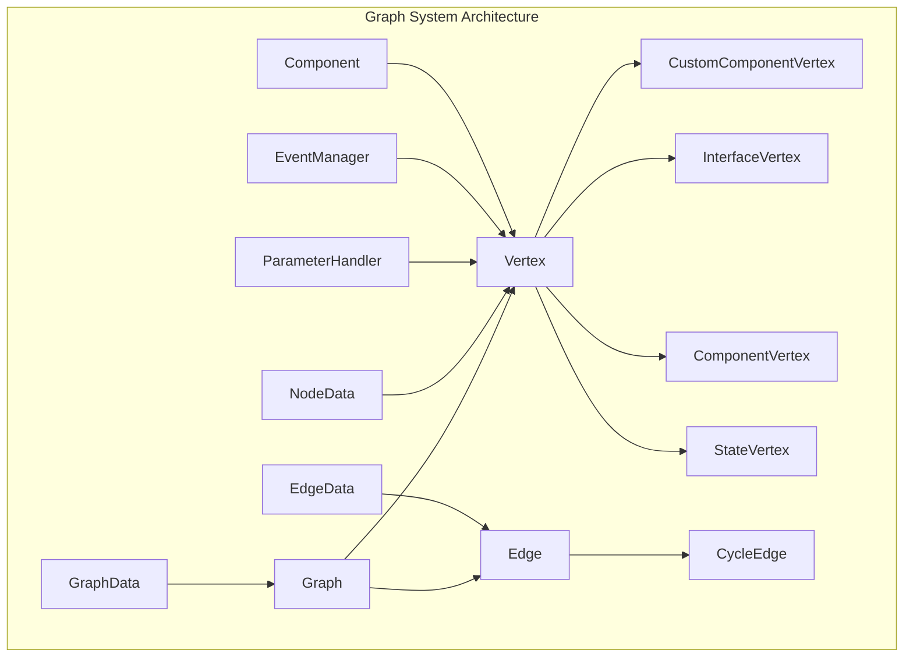
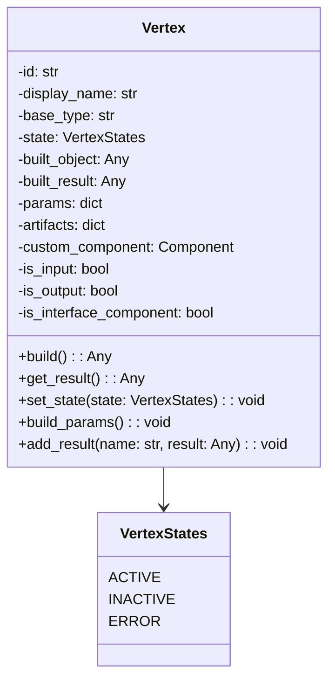
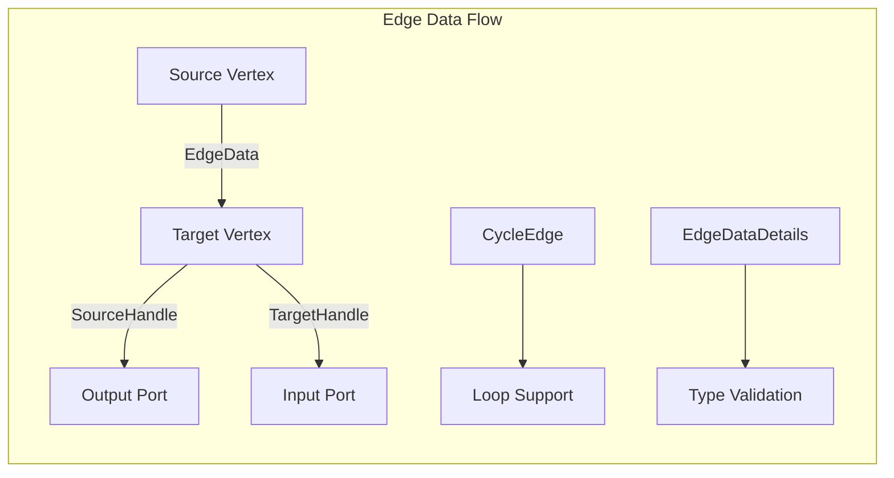
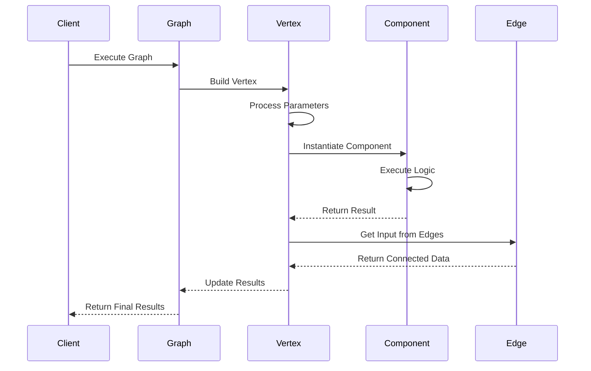
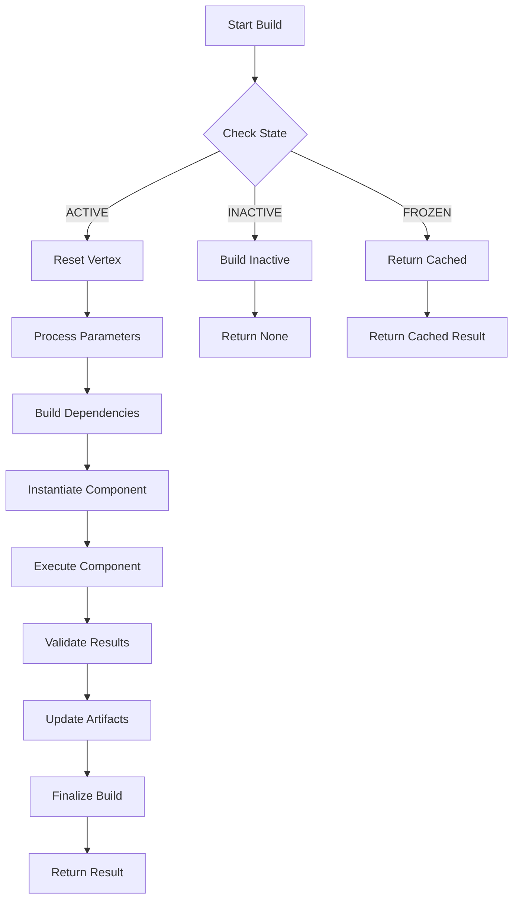
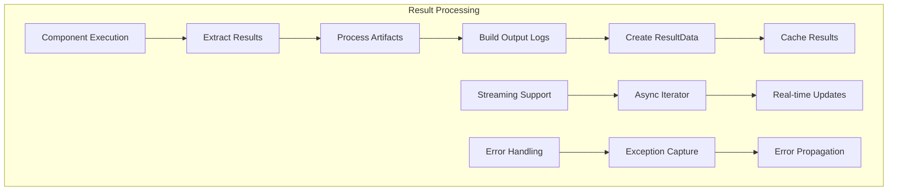
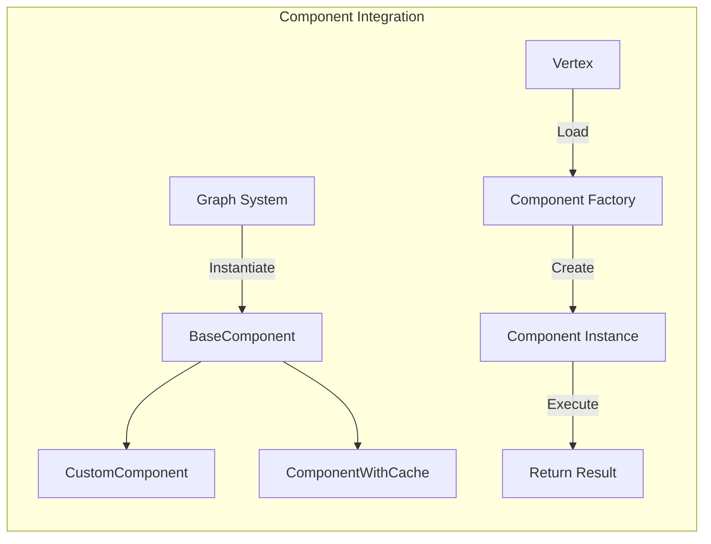
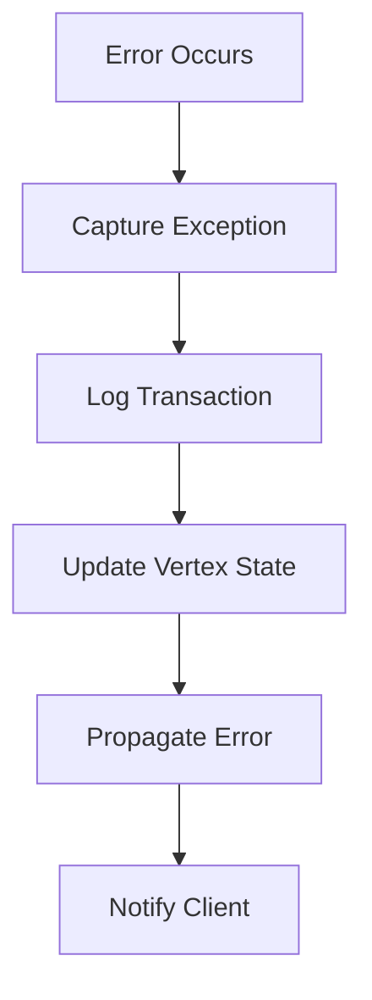

# Graph System Module Documentation

## Introduction

The graph_system module is the core execution engine of the Langflow platform, responsible for managing the flow of data through interconnected components. It provides a robust vertex-edge graph architecture that enables complex data processing pipelines, AI workflows, and component interactions. The module handles the complete lifecycle of graph execution, from parameter processing to result delivery, with support for streaming, caching, and error handling.

## Architecture Overview

The graph_system implements a directed graph architecture where vertices represent computational components and edges define data flow relationships. The system supports both synchronous and asynchronous execution models, with built-in support for streaming data, error propagation, and state management.

### Core Architecture Components



## Core Components

### Vertex Base Class

The `Vertex` class is the fundamental building block of the graph system, representing a computational node that can process data and produce results.



**Key Features:**
- **State Management**: Tracks vertex state (ACTIVE, INACTIVE, ERROR) for proper execution flow
- **Parameter Processing**: Handles both edge-based and field-based parameter injection
- **Result Caching**: Maintains built objects and results for efficient reuse
- **Artifact Management**: Stores execution artifacts and metadata
- **Async Support**: Full async/await support for non-blocking execution
- **Error Handling**: Comprehensive error propagation and logging

### Specialized Vertex Types

#### CustomComponentVertex
Handles user-defined custom components with flexible parameter schemas and execution logic.

#### InterfaceVertex  
Manages interface components like chat inputs/outputs with streaming support and message processing.

#### ComponentVertex
Standard component vertices with input/output validation and result mapping.

#### StateVertex
Specialized vertices for maintaining state across graph executions.

### Edge System

The edge system manages data flow between vertices with support for complex routing and type validation.



**Edge Features:**
- **Type Safety**: Validates data types between connected vertices
- **Handle Management**: Source and target handles for precise port mapping
- **Cycle Support**: Handles cyclic dependencies and loop edges
- **Parameter Mapping**: Maps edge connections to vertex parameters

### Graph Data Structures

#### NodeData Schema
Defines the structure of vertices including position, type, and configuration data.

#### EdgeData Schema  
Specifies edge connections with source/target handles and metadata.

#### GraphData Schema
Container for the complete graph structure with nodes and edges.

## Data Flow Architecture



## Execution Flow

### Vertex Build Process



### Parameter Processing

The system uses a sophisticated parameter handling mechanism:

1. **Edge Parameters**: Values from connected vertices via edges
2. **Field Parameters**: Static values from vertex configuration
3. **Dynamic Updates**: Runtime parameter updates with validation
4. **Type Conversion**: Automatic type conversion and validation

### Result Management



## Integration with Other Modules

### Component System Integration

The graph_system works closely with the [component_system](component_system.md) to instantiate and execute components:



### Database Models Integration

Graph execution results are stored using [database_models](database_models.md):

- **FlowRead**: Stores graph configuration and metadata
- **MessageRead**: Persists chat messages and interactions
- **Variable**: Manages runtime variables and state

### Schema Types Integration

The system uses [schema_types](schema_types.md) for data validation and serialization:

- **ContentBlock**: Structured content representation
- **TableSchema**: Tabular data handling
- **LogFunctionType**: Execution logging

## Advanced Features

### Streaming Support

Interface vertices support real-time streaming for chat and data components:

```python
# Async iterator support for streaming
async def stream():
    async for chunk in vertex.stream():
        yield chunk
```

### Error Handling

Comprehensive error handling with detailed logging and transaction tracking:



### Caching and Performance

- **Result Caching**: Built results are cached for reuse
- **Lazy Loading**: Components loaded on-demand
- **Build Time Tracking**: Performance monitoring per vertex
- **Memory Management**: Efficient artifact cleanup

### State Management

Vertices can maintain state across executions:

- **Vertex States**: ACTIVE, INACTIVE, ERROR
- **State Persistence**: State vertices for long-running workflows
- **Session Management**: Session ID tracking for multi-user scenarios

## Usage Examples

### Basic Graph Execution

```python
# Create and execute a simple graph
graph = Graph(graph_data)
result = await graph.build()
```

### Vertex-Level Execution

```python
# Build individual vertex
vertex = Vertex(node_data, graph)
result = await vertex.build(user_id=user_id)
```

### Streaming Interface

```python
# Stream chat responses
if vertex.is_interface_component:
    async for message in vertex.stream():
        yield message
```

## Configuration and Customization

### Vertex Configuration

Vertices support extensive configuration through NodeData:

- **Position**: Visual layout coordinates
- **Type**: Component type classification
- **Template**: Parameter schema definition
- **Parent Relationships**: Hierarchical organization

### Edge Configuration

Edges provide flexible connection options:

- **Handle Mapping**: Precise port-to-port connections
- **Type Validation**: Runtime type checking
- **Loop Support**: Cyclic graph structures
- **Conditional Flow**: Dynamic edge activation

## Monitoring and Debugging

### Build Metrics

- **Build Times**: Performance tracking per vertex
- **Success Rates**: Execution success/failure statistics
- **Resource Usage**: Memory and CPU monitoring
- **Transaction Logs**: Detailed execution history

### Debugging Features

- **Artifact Inspection**: Detailed execution artifacts
- **Log Analysis**: Comprehensive logging system
- **State Inspection**: Runtime state examination
- **Error Traces**: Full exception stack traces

## Security Considerations

### Input Validation

- **Type Checking**: Runtime type validation
- **Parameter Sanitization**: Input cleaning and validation
- **Access Control**: User permission checking
- **Resource Limits**: Execution time and memory limits

### Data Protection

- **Artifact Encryption**: Sensitive data protection
- **Session Isolation**: Multi-tenant data separation
- **Audit Logging**: Security event tracking
- **Error Sanitization**: Safe error message exposure

## Performance Optimization

### Execution Optimization

- **Parallel Execution**: Concurrent vertex building
- **Lazy Evaluation**: On-demand computation
- **Result Caching**: Avoid redundant calculations
- **Memory Pooling**: Efficient memory management

### Scalability Features

- **Async Architecture**: Non-blocking execution
- **Load Balancing**: Distributed execution support
- **Resource Management**: Dynamic resource allocation
- **Connection Pooling**: Efficient database connections

## API Reference

### Vertex Class

#### Methods

- `build(user_id, inputs, files, **kwargs)`: Execute vertex logic
- `get_result(requester, target_handle_name)`: Retrieve execution results
- `set_state(state)`: Update vertex state
- `update_raw_params(new_params, overwrite)`: Update vertex parameters

#### Properties

- `id`: Unique vertex identifier
- `display_name`: Human-readable name
- `base_type`: Component type classification
- `state`: Current execution state
- `built`: Build completion status
- `artifacts`: Execution artifacts

### Edge Classes

#### EdgeData
Structured data for edge connections with source/target handles.

#### CycleEdge
Extended edge with loop support and cycle detection.

### Graph Integration

#### Graph Class
Manages vertex collections and execution orchestration.

#### ParameterHandler
Processes vertex parameters from multiple sources.

## Best Practices

### Graph Design

1. **Minimize Cycles**: Reduce complexity with acyclic graphs where possible
2. **Optimize Dependencies**: Order vertices for efficient parallel execution
3. **Use Caching**: Leverage frozen vertices for expensive computations
4. **Handle Errors**: Implement proper error handling and recovery

### Performance

1. **Lazy Loading**: Enable lazy component loading for large graphs
2. **Result Caching**: Cache frequently accessed results
3. **Async Execution**: Use async patterns for I/O operations
4. **Resource Management**: Monitor and limit resource usage

### Security

1. **Input Validation**: Validate all user inputs
2. **Access Control**: Implement proper permission checks
3. **Error Handling**: Sanitize error messages for production
4. **Audit Logging**: Log security-relevant events

## Troubleshooting

### Common Issues

1. **Build Failures**: Check component instantiation and parameter validation
2. **Circular Dependencies**: Review edge connections for cycles
3. **Memory Issues**: Monitor artifact size and cleanup
4. **Performance Problems**: Analyze build times and optimize vertex ordering

### Debug Tools

1. **Transaction Logs**: Detailed execution history
2. **Artifact Inspection**: Examine execution artifacts
3. **State Monitoring**: Track vertex states during execution
4. **Performance Metrics**: Build time and resource usage analysis

This documentation provides a comprehensive guide to understanding and working with the graph_system module. For additional information on related modules, see the [component_system](component_system.md), [database_models](database_models.md), and [schema_types](schema_types.md) documentation.