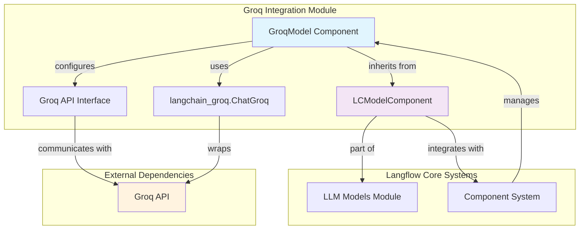
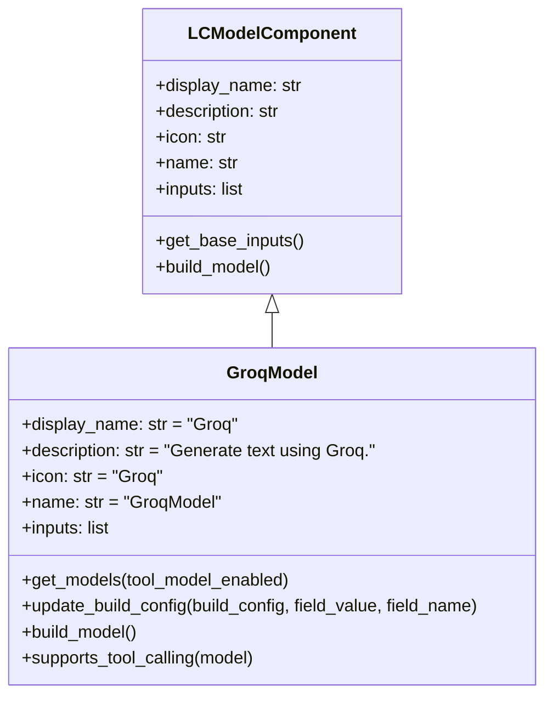
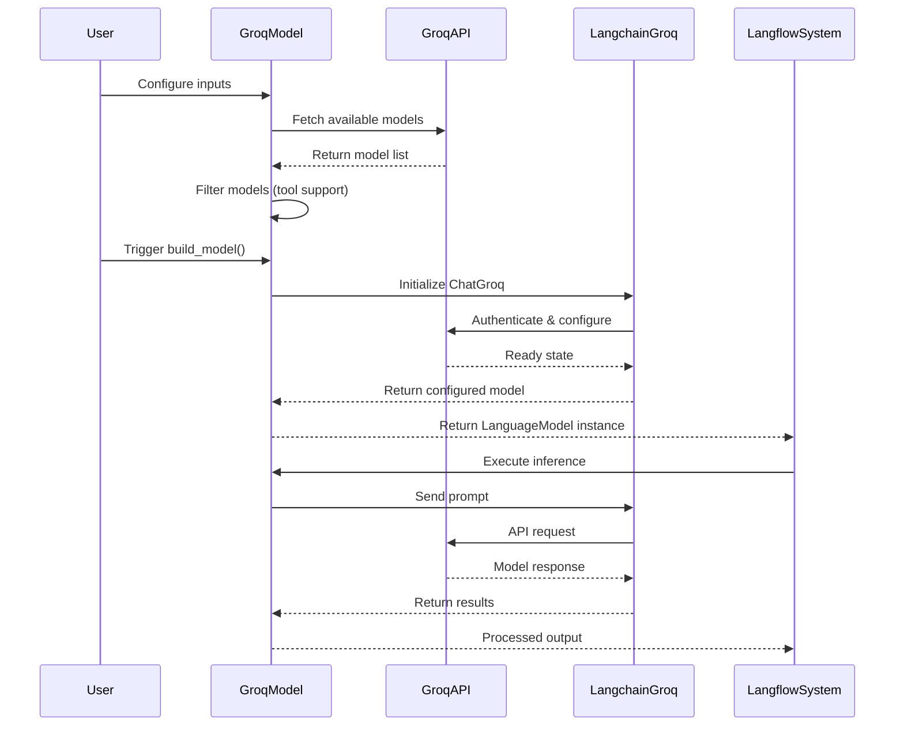
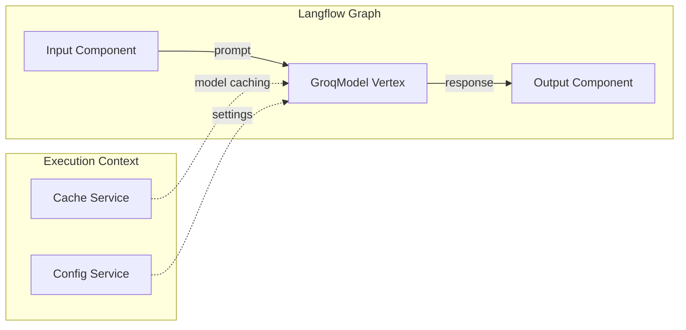

# Groq Integration Module Documentation

## Introduction

The Groq Integration module provides Langflow with seamless access to Groq's high-performance language models through a unified interface. This module enables users to leverage Groq's optimized inference infrastructure for fast and efficient text generation tasks within the Langflow ecosystem.

Groq models are known for their exceptional speed and performance, making them ideal for applications requiring rapid response times and high-throughput text generation. The integration supports both standard text generation and tool-calling capabilities, allowing for complex AI workflows and agent-based applications.

## Architecture Overview

The Groq Integration module is built on top of Langflow's extensible component architecture, inheriting from the base `LCModelComponent` class. This design ensures consistency with other LLM integrations while providing Groq-specific optimizations and features.



## Component Structure

### Core Component: GroqModel

The `GroqModel` class is the primary interface for interacting with Groq's language models. It extends the `LCModelComponent` base class and provides Groq-specific functionality while maintaining compatibility with Langflow's component ecosystem.



## Input Configuration

The GroqModel component provides a comprehensive set of input parameters for fine-tuning model behavior:

### Authentication & Connection
- **api_key**: Secret API key for Groq API authentication
- **base_url**: Custom API endpoint (defaults to https://api.groq.com)

### Model Configuration
- **model_name**: Dropdown selection of available Groq models
- **tool_model_enabled**: Boolean flag to filter models supporting tool calling
- **max_tokens**: Maximum output tokens limit
- **temperature**: Sampling temperature (0.0-1.0 range)
- **n**: Number of completions to generate

### Advanced Features
- **stream**: Enable streaming responses (inherited from base class)
- **real_time_refresh**: Dynamic model list updates based on API availability

## Data Flow Architecture



## Integration with Langflow Ecosystem

### Component System Integration
The GroqModel integrates seamlessly with Langflow's component system through inheritance from `LCModelComponent`. This ensures:

- **Standardized Interface**: Consistent API across all LLM providers
- **Component Discovery**: Automatic registration in component catalogs
- **Field Validation**: Type-safe input handling and validation
- **Caching Support**: Integration with Langflow's caching mechanisms

### Graph System Compatibility
As a vertex in Langflow's graph system, the GroqModel:

- **Node Integration**: Functions as a processable vertex in execution graphs
- **Edge Connectivity**: Accepts inputs from and sends outputs to connected components
- **Data Flow**: Participates in the directed acyclic graph execution model



## Model Management

### Dynamic Model Discovery
The module implements intelligent model discovery that:

1. **API-based Discovery**: Fetches current model list from Groq API
2. **Fallback Mechanism**: Uses predefined constants if API unavailable
3. **Tool Support Filtering**: Dynamically filters models based on tool-calling capabilities
4. **Real-time Updates**: Refreshes model list when configuration changes

### Supported Models
The integration supports all Groq models while providing intelligent filtering for:

- **Standard Models**: All general-purpose language models
- **Tool-Enabled Models**: Models supporting function calling and tool use
- **Unsupported Models**: Automatically excludes deprecated or incompatible models

## Error Handling and Resilience

### Exception Management
The module implements comprehensive error handling:

- **Import Errors**: Graceful handling of missing `langchain_groq` dependency
- **API Errors**: Network timeout and HTTP error management
- **Authentication Errors**: Clear error messages for invalid API keys
- **Model Errors**: Validation of model availability and compatibility

### Logging Integration
Integrated with Langflow's logging system for:

- **Debug Information**: Model configuration and API interactions
- **Error Tracking**: Exception capture and reporting
- **Performance Monitoring**: Request/response timing and metrics

## Security Considerations

### API Key Management
- **Secret Storage**: API keys handled as `SecretStr` objects
- **Secure Transmission**: HTTPS-only communication with Groq API
- **Key Validation**: Real-time validation of API key authenticity

### Data Privacy
- **Local Processing**: Model configuration handled locally
- **Minimal Data Exposure**: Only necessary data sent to Groq API
- **No Persistent Storage**: API keys not stored in component state

## Performance Optimizations

### Caching Strategy
- **Model Instance Caching**: Reuse of configured model instances
- **Model List Caching**: Cached model discovery results
- **Configuration Caching**: Efficient build configuration updates

### Network Optimization
- **Timeout Configuration**: Configurable request timeouts
- **Connection Pooling**: Efficient HTTP connection management
- **Error Recovery**: Automatic retry mechanisms for transient failures

## Dependencies and Requirements

### External Dependencies
- **langchain-groq**: Required for Groq API integration
- **requests**: HTTP client for API communication
- **pydantic**: Data validation and serialization

### Langflow Dependencies
- **LCModelComponent**: Base class for model components
- **Field Types**: Input field definitions and validation
- **Logger**: Centralized logging infrastructure

## Usage Patterns

### Basic Text Generation
```
GroqModel → Configure API Key → Select Model → Set Parameters → Execute
```

### Tool-Enabled Workflows
```
GroqModel → Enable Tool Models → Select Compatible Model → Connect Tools → Execute
```

### Streaming Applications
```
GroqModel → Enable Streaming → Connect to Chat Interface → Real-time Response
```

## Integration with Other Modules

### LLM Models Module
The Groq Integration is part of the broader [LLM Models Module](llm_models.md), which provides a unified interface for multiple language model providers including OpenAI, Anthropic, Google, and Ollama.

### Component System
Integrates with the [Component System](component_system.md) for standardized component behavior, lifecycle management, and inter-component communication.

### Graph System
Participates in the [Graph System](graph_system.md) as a vertex type, enabling complex workflow orchestration and data flow management.

## Future Enhancements

### Planned Features
- **Batch Processing**: Support for bulk text generation
- **Model Fine-tuning**: Integration with Groq's fine-tuning capabilities
- **Advanced Tooling**: Enhanced tool calling and function execution
- **Performance Metrics**: Built-in performance monitoring and analytics

### Scalability Considerations
- **Load Balancing**: Support for multiple Groq API endpoints
- **Rate Limiting**: Intelligent request throttling and queue management
- **Resource Management**: Efficient memory and connection pooling

## Conclusion

The Groq Integration module provides a robust, scalable, and user-friendly interface for incorporating Groq's high-performance language models into Langflow workflows. Through its comprehensive feature set, intelligent model management, and seamless integration with the Langflow ecosystem, it enables developers to build sophisticated AI applications with exceptional speed and reliability.

The module's architecture ensures maintainability and extensibility, positioning it as a key component in Langflow's multi-provider LLM strategy while delivering the performance benefits that make Groq models attractive for production applications.