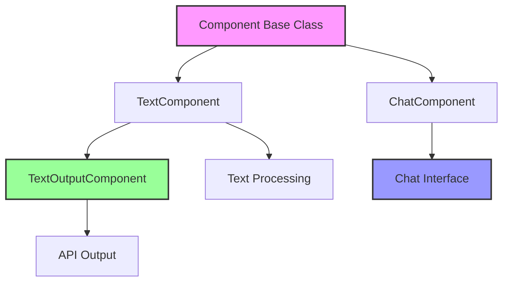
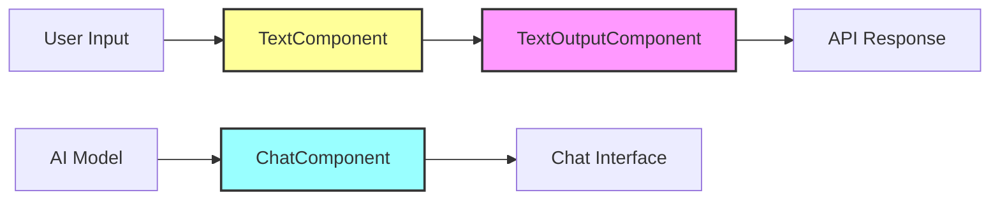
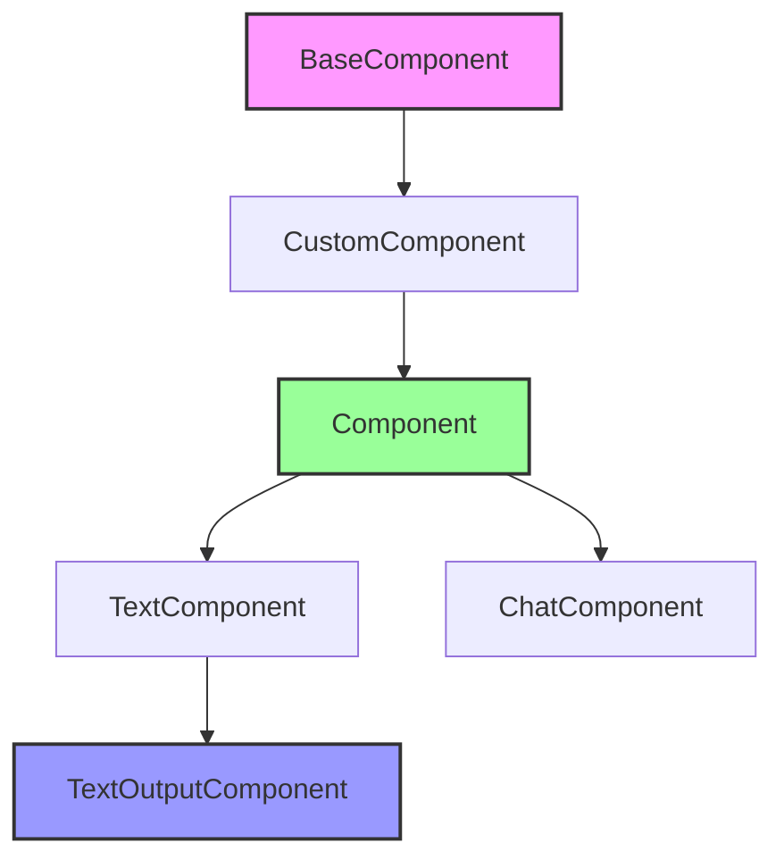
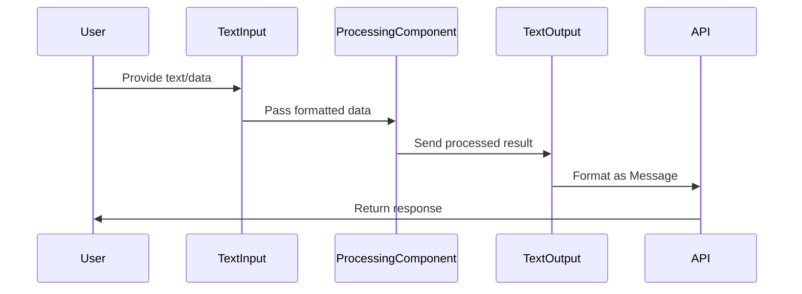

# IO Components Module Documentation

## Overview

The IO Components module provides the foundation for input/output operations in the Langflow system. It defines base classes and concrete implementations for handling text and chat interactions, serving as the primary interface between users and the system's processing components.

## Purpose

This module enables:
- **Text-based interactions**: Processing and passing text data between components
- **Chat functionality**: Managing conversational interfaces and chat-based workflows
- **Output generation**: Formatting and delivering results to users via API endpoints
- **Data flow management**: Ensuring smooth data transfer between different system components

## Architecture



## Core Components

### 1. ChatComponent (`src.lfx.src.lfx.base.io.chat.ChatComponent`)

The ChatComponent serves as the base class for all chat-related components in the system. It provides essential functionality for extracting properties from source components in the processing graph.

**Key Features:**
- **Property Extraction**: Automatically retrieves model information from connected components
- **Graph Navigation**: Traverses the component graph to identify source components
- **Model Detection**: Identifies model attributes (model_name, model_id, model) from connected AI components
- **Icon and Source Tracking**: Maintains visual and source component references

**Usage Pattern:**
```
ChatComponent → Connected AI Model → Property Extraction → Chat Interface
```

**Inheritance Chain:**
```
BaseComponent → CustomComponent → Component → ChatComponent
```

The ChatComponent inherits from the Component class, which extends CustomComponent and BaseComponent, providing access to:
- Graph traversal capabilities
- Vertex and edge management
- Component configuration and templating
- User context and flow information

### 2. TextComponent (`src.lfx.src.lfx.base.io.text.TextComponent`)

The TextComponent provides the foundation for text-based data processing and transfer between components. It handles the conversion of various data types to text format.

**Key Features:**
- **Data Type Flexibility**: Accepts both Message and Data input types
- **Template System**: Supports customizable data-to-text conversion templates
- **Dynamic Configuration**: Automatically configures based on input data structure
- **Text Pass-through**: Enables seamless text data flow between components

**Configuration Options:**
- `input_value`: Primary text or data input
- `data_template`: Custom template for data-to-text conversion

**Inheritance Chain:**
```
BaseComponent → CustomComponent → Component → TextComponent
```

**Build Configuration:**
The component dynamically generates its configuration through the `build_config()` method, which defines:
- Input field specifications with display names and data types
- Advanced options for data template customization
- Multi-line support for complex text processing

### 3. TextOutputComponent (`src.lfx.src.lfx.components.input_output.text_output.TextOutputComponent`)

A concrete implementation that extends TextComponent to provide API-based text output functionality. This component serves as the final output stage in processing workflows.

**Key Features:**
- **API Integration**: Sends text output through the system's API endpoints
- **Message Formatting**: Converts input to standardized Message format
- **Status Tracking**: Updates component status with output value
- **Documentation Integration**: Links to official documentation for user guidance

**Component Specification:**
- **Display Name**: "Text Output"
- **Icon**: "type" emoji
- **Documentation**: https://docs.langflow.org/components-io#text-output

**Input/Output Configuration:**
- **Inputs**: Single multiline input field for text content
- **Outputs**: Single text output that returns a Message object
- **Method**: `text_response()` - converts input to Message format

**Output Flow:**
```
Input Text → TextOutputComponent → Message Object → API Response
```

**Message Creation:**
The component creates Message objects with the input text, enabling standardized communication across the system and proper formatting for API responses.

## Component Relationships



## Inheritance Hierarchy



**Inheritance Benefits:**
- **BaseComponent**: Provides core functionality like code management, template configuration, and function validation
- **CustomComponent**: Adds component-specific features like field configuration, graph integration, and user context
- **Component**: Offers the main component interface with build configuration and execution capabilities
- **IO Components**: Implement specific input/output behaviors while inheriting all base functionality

## Integration with Other Modules

### Core API Integration
The IO Components module integrates with the [core_api](core_api.md) module through:
- **API Response Formatting**: TextOutputComponent generates responses compatible with API schemas like `RunResponse`, `InitResponse`, and `BuiltResponse`
- **Request Handling**: Processes incoming data requests through schemas like `FlowDataRequest` and `ValidatePromptRequest`
- **Status Management**: Updates component status for API monitoring via `TaskResponse` and `CacheResponse`

**API Schema Integration:**
```
TextOutputComponent → Message Object → RunResponse → API Endpoint
ChatComponent → Model Info → ComponentListRead → Frontend Display
```

### Graph System Integration
IO Components work within the [graph_system](graph_system.md) by:
- **Vertex Integration**: Components operate as vertices (`Vertex`) in the processing graph
- **Edge Navigation**: ChatComponent traverses graph edges (`EdgeData`) to find source components
- **Data Flow**: TextComponents pass data along graph connections defined in `GraphData`
- **Custom Component Support**: Integrates with `CustomComponentVertex` and `InterfaceVertex` for specialized behaviors

**Graph Navigation Pattern:**
```
ChatComponent._vertex.incoming_edges → EdgeData → Source Vertex → CustomComponentVertex
```

### Component System Integration
The module extends the [component_system](component_system.md) through:
- **Base Component Inheritance**: All IO components inherit from `BaseComponent` → `CustomComponent` → `Component`
- **Custom Component Support**: Enables creation of custom IO components using `ComponentWithCache`
- **Configuration Management**: Leverages component field configuration and template systems
- **Build System Integration**: Utilizes the build configuration and execution framework

**Component Lifecycle:**
```
BaseComponent.__init__() → CustomComponent.setup() → Component.build_config() → IO Component Implementation
```

### Schema Types Integration
IO Components integrate with [schema_types](schema_types.md) for content management:
- **Content Block Support**: Uses `ContentBlock` and `TextContent` for structured output
- **Message Formatting**: Leverages schema types for consistent message structure
- **Data Serialization**: Utilizes schema validation and serialization capabilities

### Services Integration
The module connects with [services](services.md) for system functionality:
- **Cache Service**: Utilizes `CacheService` for performance optimization
- **Service Management**: Integrates with `ServiceManager` and `ServiceFactory`
- **User Context**: Accesses user services for authentication and authorization

## Error Handling and Validation

### Input Validation
IO Components implement robust input validation through the component system:
- **Type Checking**: Validates input types (Message, Data, Text) before processing
- **Template Validation**: Ensures data templates are properly formatted
- **Graph Validation**: Verifies component connections and edge integrity

### Error Recovery
The components provide multiple error recovery mechanisms:
- **Graceful Degradation**: Continues operation with default values when inputs are missing
- **Status Reporting**: Updates component status to reflect errors or warnings
- **User Feedback**: Provides clear error messages through the API layer

### Exception Handling
- **Graph Navigation Errors**: Handles cases where source components are not found
- **Model Property Extraction**: Gracefully handles missing model attributes
- **Message Creation**: Validates Message object creation before API transmission

## Performance Considerations

### Caching Strategy
- **Component Cache**: Utilizes TTLCache for component configuration and template data
- **Graph Traversal**: Caches vertex and edge information to avoid repeated lookups
- **Template Compilation**: Caches compiled templates for repeated use

### Optimization Techniques
- **Lazy Loading**: Defers expensive operations until actually needed
- **Batch Processing**: Groups multiple text operations for efficiency
- **Memory Management**: Properly cleans up resources after component execution

## Security Features

### Input Sanitization
- **Text Validation**: Sanitizes user input to prevent injection attacks
- **Template Security**: Validates data templates for safe execution
- **API Output**: Ensures safe text transmission through API endpoints

### Access Control
- **User Context**: Leverages user authentication from the component system
- **Flow Permissions**: Respects flow-level access controls
- **Component Authorization**: Enforces component-specific permissions



## Usage Patterns

### Basic Text Processing
```
Text Input → TextComponent → Processing → TextOutputComponent → API Response
```

### Chat-Based Workflow
```
User Input → ChatComponent → AI Model → ChatComponent → Response
```

### Data Transformation
```
Data Input → TextComponent (with template) → Text Output → API
```

## Key Benefits

1. **Modular Design**: Each component has a specific, well-defined purpose
2. **Flexibility**: Supports various input types and output formats
3. **Extensibility**: Easy to create custom IO components
4. **Integration**: Seamless integration with the broader Langflow ecosystem
5. **User-Friendly**: Provides clear interfaces for both developers and end-users

## Best Practices

- Use TextComponent for simple text processing and data conversion
- Extend ChatComponent for conversational interfaces
- Implement TextOutputComponent for final output stages
- Leverage the template system for consistent data formatting
- Maintain component documentation links for user guidance

## Development Guidelines

### Creating Custom IO Components

To create a custom IO component, follow this pattern:

```python
from lfx.base.io.text import TextComponent

class MyCustomIOComponent(TextComponent):
    display_name = "My Custom IO"
    description = "Custom IO component for specific use case"
    icon = "custom_icon"
    
    def build_config(self):
        config = super().build_config()
        # Add custom configuration
        config["custom_field"] = {
            "display_name": "Custom Field",
            "input_types": ["Text"],
            "info": "Custom field description"
        }
        return config
    
    def build(self) -> Message:
        # Custom implementation
        return Message(text=self.input_value)
```

### Best Practices for IO Components

1. **Inheritance**: Always extend the appropriate base class (TextComponent or ChatComponent)
2. **Configuration**: Implement `build_config()` for dynamic field configuration
3. **Documentation**: Include proper display_name, description, and documentation links
4. **Error Handling**: Implement proper error handling and status updates
5. **Type Safety**: Use appropriate return types and input validation
6. **Performance**: Consider caching for expensive operations
7. **Security**: Sanitize inputs and validate templates

### Testing IO Components

```python
def test_text_component():
    component = TextComponent()
    component.input_value = "Test input"
    result = component.build()
    assert isinstance(result, Message)
    assert result.text == "Test input"

def test_chat_component_graph_navigation():
    component = ChatComponent()
    # Mock graph and vertex setup
    model_name, icon, source, component_id = component.get_properties_from_source_component()
    assert model_name is not None
```

## Advanced Usage Patterns

### Complex Workflow Example
```
User Input → ChatComponent → LLM Model → TextComponent → TextOutputComponent → API
     ↓              ↓           ↓           ↓              ↓
Model Info ← Graph Navigation ← Processing ← Formatting ← Message Creation
```

### Multi-Component Pipeline
```
Input → TextComponent → Processing → ChatComponent → AI Model → TextOutputComponent → API
   ↓         ↓             ↓            ↓           ↓            ↓
Validation Template → Data Conversion → Model Info → Generation → Formatting → Response
```

### Conditional Flow Control
```
ChatComponent → Condition Check → TextComponent (if text) → TextOutputComponent
     ↓                ↓
   Model Info    Alternative Path → Other Component Types
```

## Related Documentation

- [Core API Module](core_api.md) - API integration and request handling
- [Graph System](graph_system.md) - Component graph navigation and data flow
- [Component System](component_system.md) - Base component architecture and configuration
- [Schema Types](schema_types.md) - Content formatting and message structures
- [Services](services.md) - System services and caching mechanisms