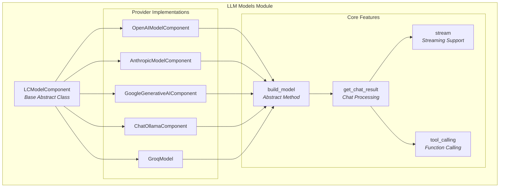
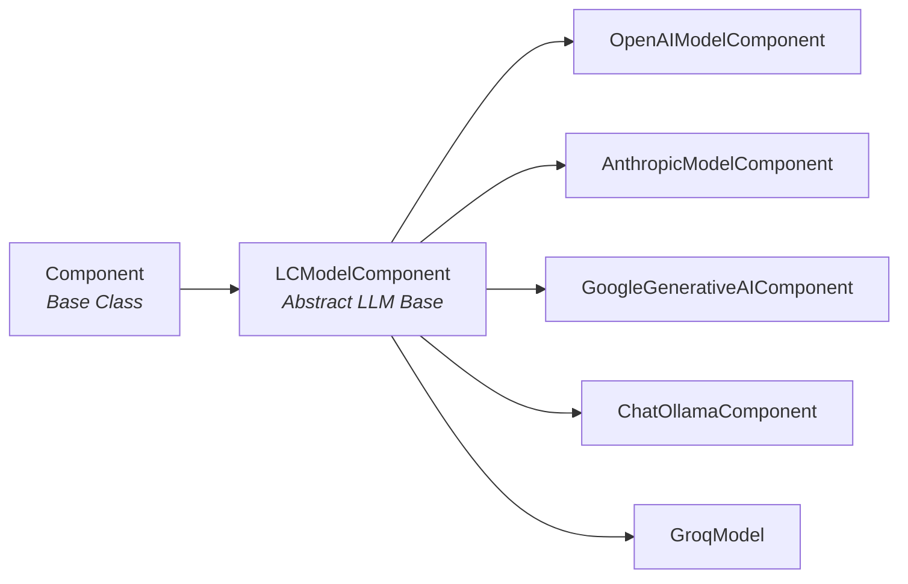
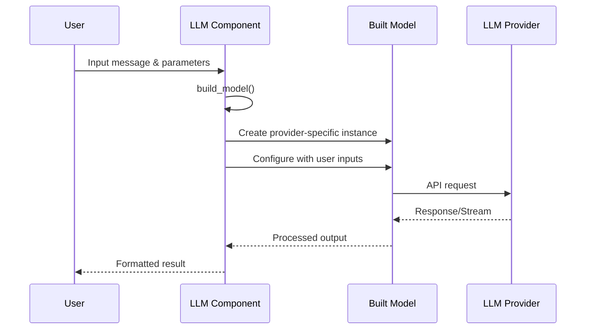

# LLM Models Module Documentation

## Overview

The `llm_models` module is a comprehensive language model integration system that provides unified access to various Large Language Model (LLM) providers. It serves as the core component for text generation, chat interactions, and AI-powered functionality within the Langflow ecosystem.

## Purpose

This module abstracts the complexity of different LLM providers by offering:
- **Unified Interface**: Consistent API across multiple LLM providers (OpenAI, Anthropic, Google, Ollama, Groq)
- **Provider-Specific Features**: Access to unique capabilities of each LLM provider
- **Tool Integration**: Support for function calling and tool usage where available
- **Streaming Support**: Real-time response streaming for interactive applications
- **Configuration Management**: Dynamic model selection and parameter configuration

## Architecture



## Component Hierarchy



## Core Components

### 1. LCModelComponent (Base Class)
The abstract base class that defines the standard interface for all LLM implementations.

**Key Responsibilities:**
- Define common inputs (system_message, stream, input_value)
- Handle chat result processing and streaming
- Implement tool calling validation
- Build status messages from model responses
- Manage output parsing and configuration

**Core Methods:**
- `build_model()`: Abstract method for creating provider-specific model instances
- `get_chat_result()`: Process chat interactions with streaming support
- `supports_tool_calling()`: Validate tool calling capabilities
- `text_response()`: Generate text responses from model inputs

### 2. Provider-Specific Implementations

#### OpenAI Integration
- **Component**: `OpenAIModelComponent`
- **Features**: GPT models, function calling, streaming, token usage tracking
- **Configuration**: Model selection, temperature, max tokens, API key management
- **Documentation**: [OpenAI Integration Details](openai_integration.md)

#### Anthropic Integration
- **Component**: `AnthropicModelComponent`
- **Features**: Claude models, Messages API, tool calling support
- **Configuration**: Model filtering, API URL customization, token limits
- **Documentation**: [Anthropic Integration Details](anthropic_integration.md)

#### Google Generative AI
- **Component**: `GoogleGenerativeAIComponent`
- **Features**: Gemini models, multimodal capabilities, Google AI integration
- **Configuration**: Top-k, top-p sampling, output token limits
- **Documentation**: [Google Integration Details](google_integration.md)

#### Ollama Integration
- **Component**: `ChatOllamaComponent`
- **Features**: Local LLM deployment, extensive parameter control
- **Configuration**: Mirostat sampling, GPU/CPU settings, context window
- **Documentation**: [Ollama Integration Details](ollama_integration.md)

#### Groq Integration
- **Component**: `GroqModel`
- **Features**: High-speed inference, OpenAI-compatible API
- **Configuration**: Model filtering, tool calling support
- **Documentation**: [Groq Integration Details](groq_integration.md)

## Data Flow



## Key Features

### 1. Unified Input Interface
All LLM components share common input fields:
- `input_value`: The main input text or message
- `system_message`: System-level instructions
- `stream`: Enable/disable response streaming
- Provider-specific parameters (temperature, max_tokens, etc.)

### 2. Dynamic Model Selection
- Runtime model discovery and filtering
- Tool calling capability detection
- Provider-specific model lists
- Real-time configuration updates

### 3. Streaming Support
- Real-time response streaming
- Chat integration with partial messages
- Status tracking and progress updates

### 4. Tool Integration
- Function calling support where available
- Automatic capability detection
- Tool model filtering

## Integration Points

### Dependencies
- **[component_system](component_system.md)**: Inherits from Component base class
- **[schema_types](schema_types.md)**: Uses Message and content types
- **[services](services.md)**: Integrates with service management

### Related Modules
- **[embeddings](embeddings.md)**: Complementary embedding models
- **[agents](agents.md)**: Uses LLM models for agent reasoning
- **[memory](memory.md)**: Integrates with chat memory systems

## Configuration Management

Each provider component supports dynamic configuration updates through:
- `update_build_config()`: Modify available options based on current settings
- `get_models()`: Fetch available models from provider APIs
- Real-time field validation and dependency management

## Error Handling

The module implements comprehensive error handling:
- Provider-specific exception messages
- API connection validation
- Model capability validation
- Graceful fallbacks for unsupported features

## Usage Patterns

### Basic Text Generation
```python
# Configure component with model parameters
component.set(
    model_name="gpt-4",
    temperature=0.7,
    max_tokens=1000
)

# Build and use model
model = component.build_model()
response = model.invoke("Hello, world!")
```

### Streaming Chat
```python
# Enable streaming
component.set(stream=True)

# Process chat with streaming
async for chunk in component.text_response():
    print(chunk, end="")
```

### Tool-Enabled Models
```python
# Filter for tool-capable models
component.set(tool_model_enabled=True)
available_models = component.get_models(tool_model_enabled=True)
```

## Extensibility

The modular architecture supports easy addition of new LLM providers:
1. Create new component inheriting from `LCModelComponent`
2. Implement `build_model()` method
3. Define provider-specific inputs and configuration
4. Add model discovery and validation logic

This design ensures consistent behavior across all LLM integrations while allowing provider-specific optimizations and features.