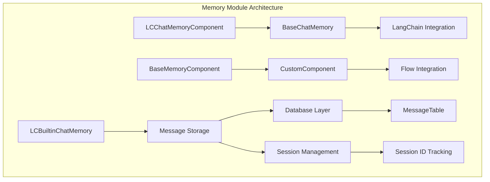
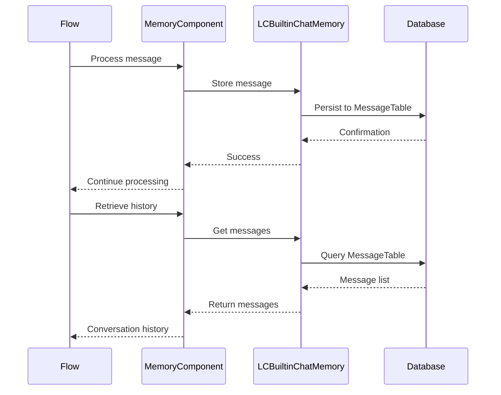

# Memory Module Documentation

## Overview

The memory module in Langflow provides comprehensive chat memory management capabilities, enabling persistent storage and retrieval of conversation history across sessions. This module serves as a bridge between LangChain's memory abstractions and Langflow's data persistence layer, offering both synchronous and asynchronous operations for message handling.

## Purpose

The memory module is designed to:
- Store and retrieve chat messages with session-based organization
- Provide integration with LangChain's memory interfaces
- Support multiple memory backends and configurations
- Enable conversation context preservation across flow executions
- Offer flexible querying and filtering of historical messages

## Architecture



## Core Components

### 1. LCBuiltinChatMemory
- **Location**: `src.backend.base.langflow.memory.LCBuiltinChatMemory`
- **Purpose**: LangChain-compatible chat memory implementation
- **Key Features**:
  - Implements `BaseChatMessageHistory` interface
  - Provides synchronous and asynchronous message operations
  - Supports session-based message organization
  - Integrates with Langflow's message storage system
- **Detailed Documentation**: [Memory Implementation](memory_implementation.md)

### 2. LCChatMemoryComponent
- **Location**: `src.lfx.src.lfx.base.memory.model.LCChatMemoryComponent`
- **Purpose**: Base class for LangChain memory components
- **Key Features**:
  - Abstract base for chat memory implementations
  - Defines standard interface for memory components
  - Integrates with Langflow's component system
- **Detailed Documentation**: [Memory Base Components](memory_base_components.md)

### 3. BaseMemoryComponent
- **Location**: `src.lfx.src.lfx.base.memory.memory.BaseMemoryComponent`
- **Purpose**: Foundation for custom memory components
- **Key Features**:
  - Extends `CustomComponent` for flow integration
  - Provides configuration interface for memory settings
  - Supports message retrieval and storage operations
- **Detailed Documentation**: [Memory Base Components](memory_base_components.md)

## Data Flow



## Key Functions

### Message Operations
- `aget_messages()`: Asynchronously retrieve filtered messages
- `aadd_messages()`: Asynchronously store new messages
- `aupdate_messages()`: Update existing messages
- `adelete_messages()`: Delete messages by session ID

### Memory Management
- `astore_message()`: Store individual messages with validation
- `LCBuiltinChatMemory`: Complete chat memory implementation
- Session-based organization and retrieval

## Integration Points

### Database Integration
The memory module integrates with Langflow's database layer through:
- `MessageTable`: Primary storage for chat messages
- `session_scope()`: Database session management
- Async operations for non-blocking database access

### LangChain Integration
- Implements `BaseChatMessageHistory` interface
- Compatible with LangChain's memory system
- Supports conversation buffer memory patterns

### Flow Integration
- Custom components can access memory through `self.graph.flow_id`
- Session ID tracking for conversation continuity
- Message validation and error handling

## Configuration

### Memory Settings
- Sender type filtering (AI, User, or both)
- Message count limits for retrieval
- Ordering options (ascending/descending)
- Session ID-based organization
- Data template customization

### Database Configuration
- Async session management
- Error handling and rollback support
- Message property serialization
- Content block handling

## Dependencies

This module depends on:
- [Database Models](database_models.md) - For message persistence
- [Schema Types](schema_types.md) - For message structure
- [Component System](component_system.md) - For integration with flows
- [Services](services.md) - For session management

## Usage Examples

### Basic Message Storage
```python
# Store a message
message = Message(
    session_id="session_123",
    sender="User",
    sender_name="John",
    text="Hello, how are you?"
)
await astore_message(message, flow_id="flow_456")
```

### Retrieving Conversation History
```python
# Get recent messages
messages = await aget_messages(
    session_id="session_123",
    limit=10,
    order="DESC"
)
```

### Using LCBuiltinChatMemory
```python
# Create memory instance
memory = LCBuiltinChatMemory(
    flow_id="flow_456",
    session_id="session_123"
)

# Add messages
await memory.aadd_messages([lc_message])

# Retrieve messages
history = await memory.aget_messages()
```

## Best Practices

1. **Session Management**: Always use consistent session IDs for conversation continuity
2. **Error Handling**: Implement proper error handling for database operations
3. **Performance**: Use async operations for better performance in concurrent environments
4. **Validation**: Validate message content before storage
5. **Cleanup**: Implement proper cleanup of old messages based on retention policies

## Migration Notes

Several functions in this module are marked as deprecated:
- `get_messages()` → Use `aget_messages()`
- `add_messages()` → Use `aadd_messages()`
- `delete_messages()` → Use `adelete_messages()`
- `store_message()` → Use `astore_message()`

These deprecated functions are maintained for backward compatibility but should be avoided in new code.