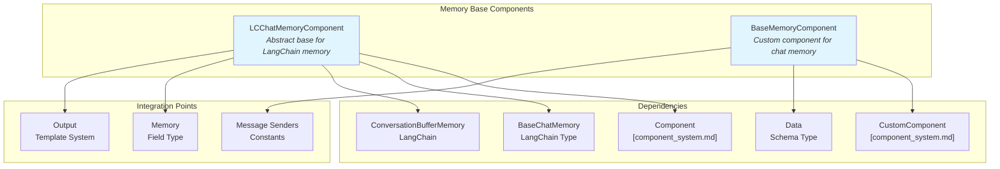
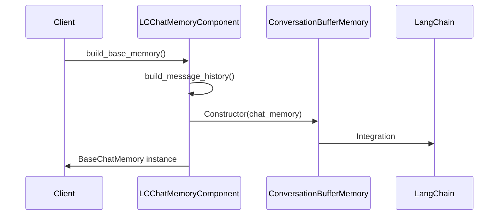
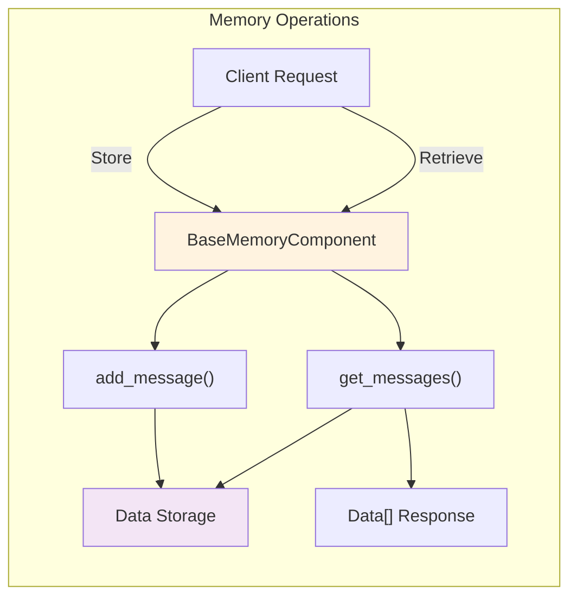
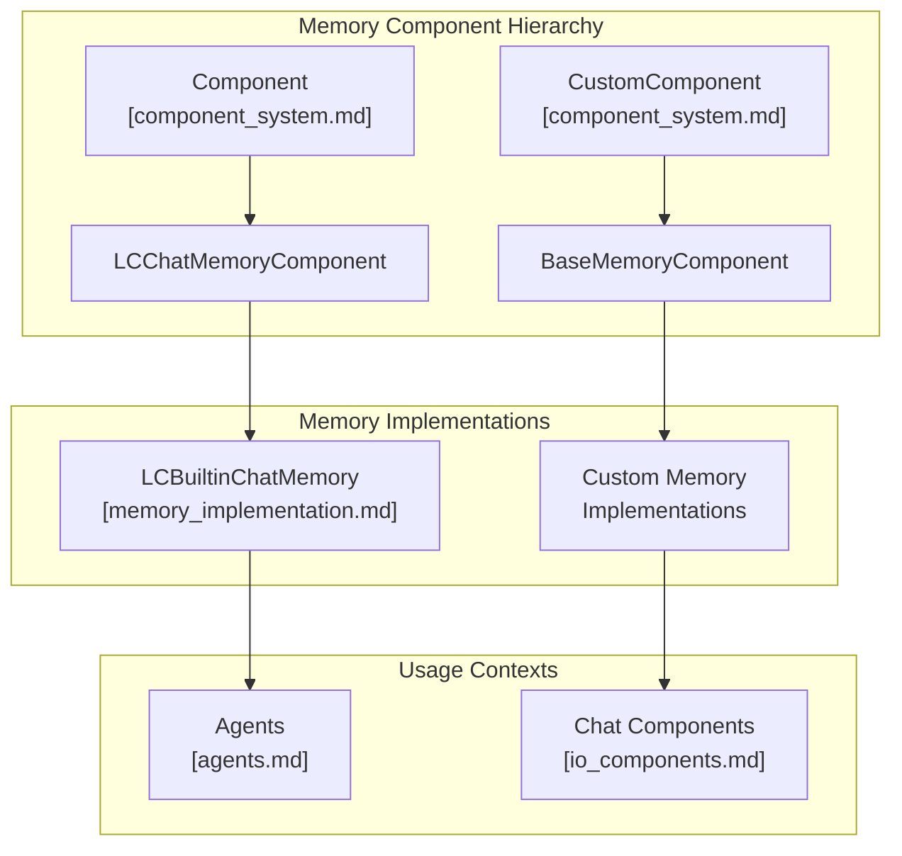

# Memory Base Components Module Documentation

## Introduction

The memory_base_components module provides the foundational abstractions and interfaces for implementing chat memory functionality in the Langflow system. This module defines the core contracts and base classes that enable different memory implementations to store, retrieve, and manage conversational history across various storage backends and memory types.

The module serves as the bridge between the Langchain ecosystem and Langflow's component architecture, providing standardized interfaces for chat memory operations while maintaining flexibility for custom implementations.

## Architecture Overview



## Core Components

### LCChatMemoryComponent

**Purpose**: Abstract base class for LangChain-compatible chat memory components that provides a standardized interface for building conversational memory systems.

**Key Features**:
- Defines the contract for LangChain memory integration
- Enforces implementation of required output methods
- Provides base memory construction with ConversationBufferMemory
- Handles traceability through "chat_memory" trace type

**Component Specification**:
```python
trace_type = "chat_memory"
outputs = [
    Output(
        display_name="Memory",
        name="memory",
        method="build_message_history",
    )
]
```

**Abstract Methods**:
- `build_message_history() -> Memory`: Builds the chat message history memory implementation

**Concrete Methods**:
- `build_base_memory() -> BaseChatMemory`: Constructs a ConversationBufferMemory instance
- `_validate_outputs()`: Validates that required output methods are defined

**Integration Flow**:


### BaseMemoryComponent

**Purpose**: Custom component base class for implementing chat memory retrieval and management functionality with configurable parameters.

**Key Features**:
- Provides standardized configuration for memory operations
- Defines interface for message retrieval and storage
- Supports filtering by sender, session, and message count
- Includes data templating capabilities
- Marked as beta component with history icon

**Configuration Schema**:
```python
{
    "sender": {
        "options": ["Machine", "User", "Machine and User"],
        "display_name": "Sender Type"
    },
    "sender_name": {"display_name": "Sender Name", "advanced": True},
    "n_messages": {
        "display_name": "Number of Messages",
        "info": "Number of messages to retrieve."
    },
    "session_id": {
        "display_name": "Session ID",
        "info": "Session ID of the chat history.",
        "input_types": ["Message"]
    },
    "order": {
        "options": ["Ascending", "Descending"],
        "display_name": "Order",
        "info": "Order of the messages.",
        "advanced": True
    },
    "data_template": {
        "display_name": "Data Template",
        "multiline": True,
        "info": "Template to convert Data to Text."
    }
}
```

**Abstract Methods**:
- `get_messages(**kwargs) -> list[Data]`: Retrieves stored messages based on criteria
- `add_message(sender, sender_name, text, session_id, metadata, **kwargs) -> None`: Stores a new message

**Data Flow**:


## Component Relationships



## Integration Patterns

### LangChain Memory Integration
The LCChatMemoryComponent provides seamless integration with LangChain's memory system:

1. **Memory Construction**: Components implement `build_message_history()` to return LangChain-compatible memory objects
2. **Buffer Management**: Uses ConversationBufferMemory as the standard wrapper
3. **Trace Integration**: Automatically tracks memory operations through the "chat_memory" trace type

### Custom Memory Implementation
The BaseMemoryComponent enables flexible memory implementations:

1. **Storage Backend Agnostic**: Abstract methods allow any storage implementation
2. **Message Filtering**: Built-in support for sender, session, and temporal filtering
3. **Data Transformation**: Configurable templates for converting stored data to text
4. **Session Management**: Standardized session ID handling for conversation isolation

## Usage Examples

### Implementing a Custom LangChain Memory
```python
class MyChatMemory(LCChatMemoryComponent):
    def build_message_history(self) -> Memory:
        # Implement custom memory logic
        return MyCustomMemoryImplementation()
```

### Creating a Storage-Specific Memory Component
```python
class DatabaseMemory(BaseMemoryComponent):
    def get_messages(self, **kwargs) -> list[Data]:
        # Query database for messages
        return retrieved_messages
    
    def add_message(self, sender, sender_name, text, session_id, metadata=None, **kwargs) -> None:
        # Store message in database
        pass
```

## Dependencies and References

### Direct Dependencies
- [component_system.md](component_system.md) - Base component classes and custom component framework
- LangChain Memory Types - External dependency for memory abstractions

### Related Modules
- [memory.md](memory.md) - Parent memory module containing implementation components
- [memory_implementation.md](memory_implementation.md) - Concrete memory implementations
- [agents.md](agents.md) - Memory usage in agent contexts
- [io_components.md](io_components.md) - Chat components that utilize memory

### Schema References
- `Data` - Standard data container for message content
- `BaseChatMemory` - LangChain memory interface
- `Memory` - Field type for memory objects
- `Output` - Template system for component outputs

## Best Practices

1. **Memory Validation**: Always implement `_validate_outputs()` when extending LCChatMemoryComponent
2. **Session Isolation**: Use session IDs to maintain conversation separation
3. **Error Handling**: Implement proper error handling in abstract methods
4. **Performance**: Consider indexing strategies for message retrieval operations
5. **Data Format**: Maintain consistent data formats across storage and retrieval operations

## Extension Points

The module provides two primary extension paths:

1. **LangChain Integration**: Extend LCChatMemoryComponent for LangChain-compatible memory
2. **Custom Storage**: Extend BaseMemoryComponent for specialized storage backends

Both approaches maintain compatibility with the broader Langflow ecosystem while allowing for custom memory behavior and storage strategies.