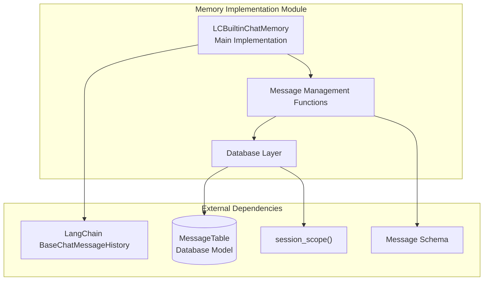
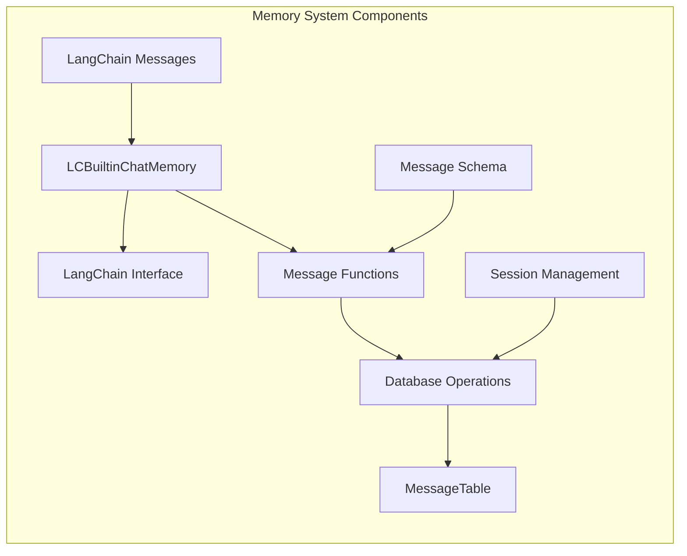
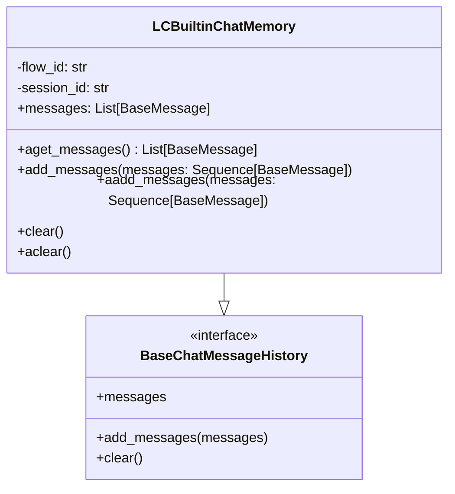
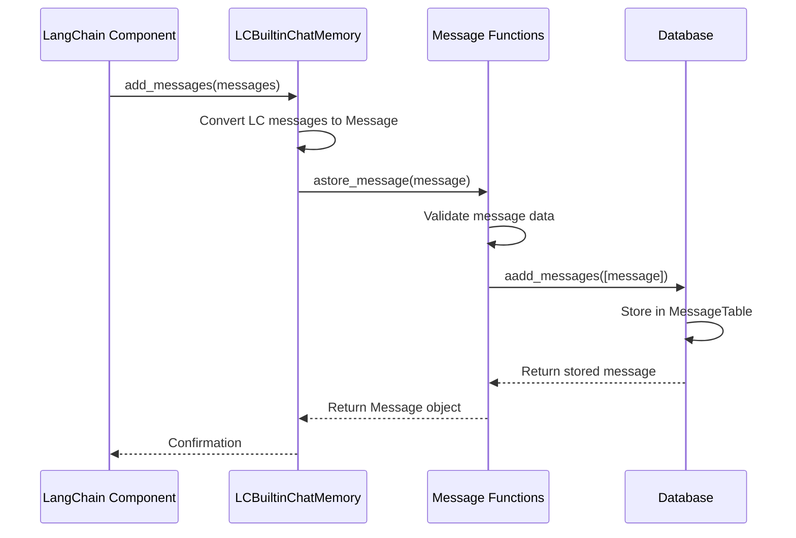
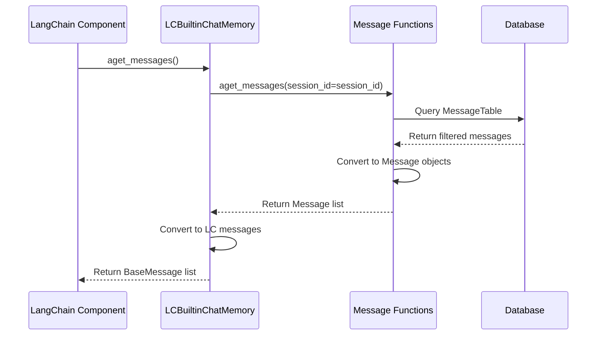
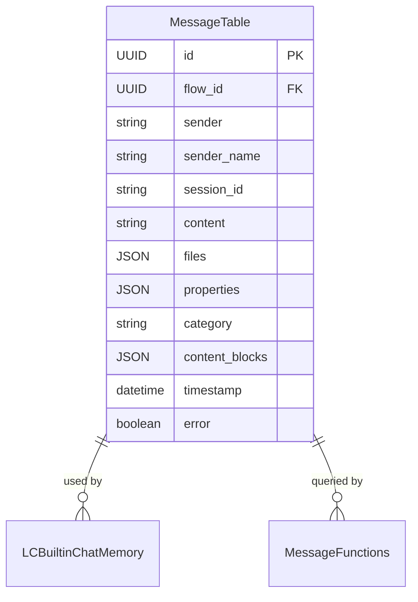

# Memory Implementation Module

## Introduction

The memory_implementation module provides the core functionality for managing conversational memory in Langflow. It implements a persistent chat memory system that stores, retrieves, and manages messages across chat sessions, enabling Langflow applications to maintain conversation context and history.

## Module Purpose

This module serves as the bridge between Langflow's message storage system and LangChain's chat memory interface. It provides:

- **Message Persistence**: Store and retrieve chat messages with full metadata
- **Session Management**: Organize messages by session ID and flow ID
- **LangChain Integration**: Implement LangChain's BaseChatMessageHistory interface
- **Async Operations**: Full async/await support for non-blocking database operations
- **Message Filtering**: Advanced querying capabilities for message retrieval

## Architecture

### Core Components



### Component Relationships



## Core Implementation

### LCBuiltinChatMemory Class

The `LCBuiltinChatMemory` class is the main implementation that bridges Langflow's message storage with LangChain's chat memory interface:



### Message Management Functions

The module provides comprehensive message management through these key functions:

#### Message Retrieval
- `aget_messages()`: Async retrieval with filtering capabilities
- `get_messages()`: Sync wrapper for backward compatibility
- `_get_variable_query()`: Internal query builder with advanced filtering

#### Message Storage
- `aadd_messages()`: Async message storage with validation
- `add_messages()`: Sync wrapper for backward compatibility
- `astore_message()`: High-level message storage with validation
- `store_message()`: Sync wrapper for backward compatibility

#### Message Updates
- `aupdate_messages()`: Async message updates
- `aadd_messagetables()`: Low-level database operations

#### Message Deletion
- `adelete_messages()`: Delete by session ID
- `delete_messages()`: Sync wrapper
- `delete_message()`: Delete by message ID

## Data Flow

### Message Storage Flow



### Message Retrieval Flow



## Database Schema Integration

The memory implementation integrates with the database through the `MessageTable` model:



## Key Features

### 1. Async-First Design
All core operations are implemented asynchronously with sync wrappers for backward compatibility:
- `aget_messages()` / `get_messages()`
- `aadd_messages()` / `add_messages()`
- `astore_message()` / `store_message()`
- `adelete_messages()` / `delete_messages()`

### 2. Advanced Message Filtering
The query builder supports multiple filter criteria:
- Sender and sender name filtering
- Session ID-based retrieval
- Flow ID association
- Timestamp-based ordering
- Result limiting

### 3. Message Validation
Comprehensive validation ensures data integrity:
- Message type validation
- Required field checking (session_id, sender, sender_name)
- UUID format validation for flow_id
- Error handling with proper logging

### 4. LangChain Integration
Seamless integration with LangChain's memory system:
- Implements `BaseChatMessageHistory` interface
- Converts between LangChain messages and Langflow Message objects
- Supports both sync and async LangChain operations

## Dependencies

The memory implementation module depends on several key components:

### Internal Dependencies
- **[database_models](database_models.md)**: Uses `MessageTable` for persistent storage
- **[schema_types](schema_types.md)**: Integrates with `Message` schema for data validation
- **[services](services.md)**: Utilizes `session_scope()` for database session management

### External Dependencies
- **LangChain Core**: Implements `BaseChatMessageHistory` interface
- **SQLAlchemy/SQLModel**: Database operations and ORM
- **AsyncIO**: Asynchronous operation support

## Usage Patterns

### Basic Usage
```python
# Initialize memory for a specific flow and session
memory = LCBuiltinChatMemory(flow_id="flow-123", session_id="session-456")

# Add messages
memory.add_messages([HumanMessage(content="Hello"), AIMessage(content="Hi there!")])

# Retrieve messages
messages = memory.messages
```

### Advanced Filtering
```python
# Retrieve messages with specific criteria
messages = await aget_messages(
    session_id="session-456",
    sender="User",
    order_by="timestamp",
    order="DESC",
    limit=10
)
```

### Direct Message Storage
```python
# Store a message directly
message = Message(
    session_id="session-456",
    sender="User",
    sender_name="John",
    content="Hello world"
)
await astore_message(message, flow_id="flow-123")
```

## Error Handling

The module implements comprehensive error handling:

- **Validation Errors**: Invalid message types or missing required fields
- **Database Errors**: Connection issues, constraint violations
- **Async Errors**: CancelledError handling for robust async operations
- **Logging**: Detailed logging for debugging and monitoring

## Performance Considerations

- **Async Operations**: Non-blocking database operations for better scalability
- **Query Optimization**: Efficient SQL queries with proper indexing
- **Memory Management**: Proper cleanup of database sessions
- **Error Recovery**: Automatic retry mechanisms for transient failures

## Integration with Langflow System

The memory implementation is designed to integrate seamlessly with the broader Langflow ecosystem:

- **Flow Execution**: Messages are associated with specific flow executions
- **Session Management**: Supports multi-user, multi-session scenarios
- **Component Integration**: Can be used by any Langflow component requiring memory
- **API Integration**: Supports REST API operations for message management

This module provides the foundation for building conversational AI applications that can maintain context and learn from interactions within the Langflow platform.