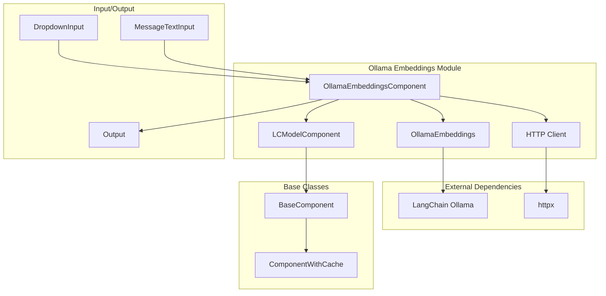
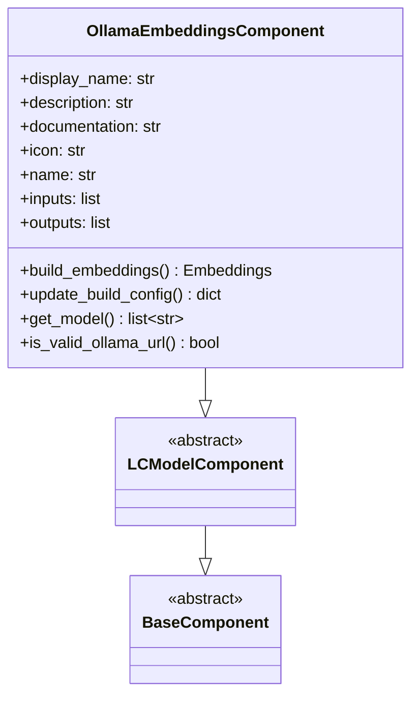
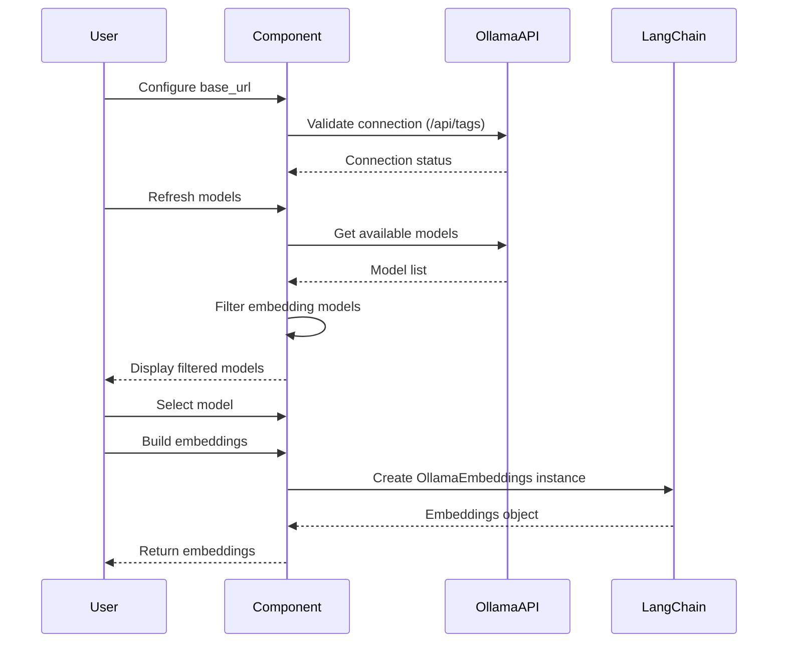
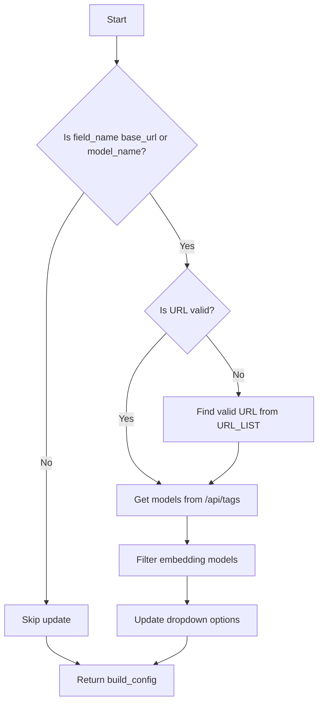

# Ollama Embeddings Module Documentation

## Introduction

The Ollama Embeddings module provides a Langflow component for generating text embeddings using Ollama's local embedding models. This module enables users to create vector representations of text data using Ollama's lightweight, locally-hosted embedding models, making it ideal for privacy-sensitive applications and scenarios where local processing is preferred over cloud-based solutions.

## Architecture Overview

## Component Structure

### Core Component: OllamaEmbeddingsComponent

The `OllamaEmbeddingsComponent` is the main class that implements the Ollama embeddings functionality. It inherits from `LCModelComponent` and provides a user-friendly interface for working with Ollama's embedding models.

## Key Features

### 1. Model Selection and Validation
- **Dynamic Model Discovery**: Automatically fetches available embedding models from the Ollama API
- **Model Filtering**: Filters models to show only embedding-capable models based on predefined constants
- **URL Validation**: Validates Ollama server connectivity before operations

### 2. User Interface Components
- **Dropdown Input**: Provides a searchable dropdown for model selection with real-time refresh
- **Text Input**: Allows configuration of the Ollama base URL
- **Refresh Button**: Enables manual refresh of available models

### 3. Error Handling
- **Connection Validation**: Checks Ollama server availability before attempting operations
- **Graceful Degradation**: Provides fallback URLs if the primary URL is invalid
- **Clear Error Messages**: Offers actionable error messages for common issues

## Data Flow

## Configuration and Usage

### Input Parameters

| Parameter | Type | Required | Description |
|-----------|------|----------|-------------|
| `model_name` | string | Yes | The name of the Ollama embedding model |
| `base_url` | string | Yes | The base URL of the Ollama server |

### Output

| Output | Type | Description |
|--------|------|-------------|
| `embeddings` | Embeddings | A LangChain Embeddings instance configured with the selected Ollama model |

### Model Discovery Process

## Integration with Langflow Ecosystem

### Dependencies
- **[embeddings_base](embeddings_base.md)**: Inherits from `LCEmbeddingsModel` base class
- **[component_system](component_system.md)**: Uses the component framework for UI and configuration
- **[llm_models](llm_models.md)**: Part of the broader LLM integration ecosystem

### Related Components
- **[openai_embeddings](openai_embeddings.md)**: Alternative cloud-based embedding solution
- **[google_embeddings](google_embeddings.md)**: Google AI embedding models
- **[vector_stores](vector_stores.md)**: Components that can utilize these embeddings

## Error Handling and Troubleshooting

### Common Issues

1. **Connection Errors**
   - Ensure Ollama server is running
   - Verify the base URL is correct
   - Check network connectivity

2. **Model Not Found**
   - Pull the required embedding model using `ollama pull <model_name>`
   - Verify the model name is correct

3. **Invalid Model Selection**
   - Only models starting with names in `OLLAMA_EMBEDDING_MODELS` are shown
   - Ensure you're using an embedding-capable model

### Error Messages

The component provides clear error messages:
- Connection issues: "Unable to connect to the Ollama API. Please verify the base URL, ensure the relevant Ollama model is pulled, and try again."
- Model fetching issues: "Could not get model names from Ollama."

## Best Practices

1. **Local Development**: Use `http://localhost:11434` as the base URL for local Ollama instances
2. **Model Selection**: Choose models based on your specific use case and performance requirements
3. **Error Handling**: Always implement proper error handling when using the embeddings in your flows
4. **Resource Management**: Consider the computational requirements of embedding models for large datasets

## API Reference

### Methods

#### `build_embeddings()`
Creates and returns a LangChain `OllamaEmbeddings` instance configured with the selected model and base URL.

**Returns**: `Embeddings` - A configured Ollama embeddings instance

**Raises**: `ValueError` - If unable to connect to Ollama API

#### `update_build_config(build_config, field_value, field_name)`
Updates the component configuration based on field changes, particularly for dynamic model discovery.

**Parameters**:
- `build_config` (dict): The current build configuration
- `field_value` (Any): The new field value
- `field_name` (str | None): The name of the field being updated

**Returns**: `dict` - Updated build configuration

#### `get_model(base_url_value)`
Fetches available models from the Ollama API and filters for embedding models.

**Parameters**:
- `base_url_value` (str): The base URL of the Ollama server

**Returns**: `list[str]` - List of available embedding model names

**Raises**: `ValueError` - If unable to fetch models

#### `is_valid_ollama_url(url)`
Validates if the provided URL points to a valid Ollama server.

**Parameters**:
- `url` (str): The URL to validate

**Returns**: `bool` - True if valid, False otherwise

## Configuration Constants

The module uses several constants for configuration:
- `OLLAMA_EMBEDDING_MODELS`: List of valid embedding model prefixes
- `URL_LIST`: List of default URLs to try for connection
- `HTTP_STATUS_OK`: HTTP status code for successful requests (200)