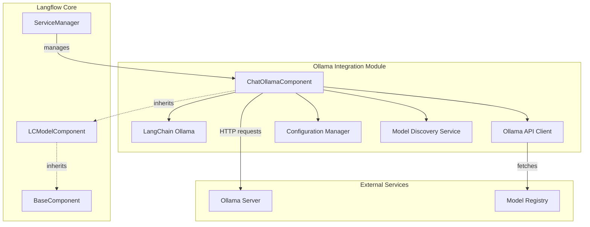
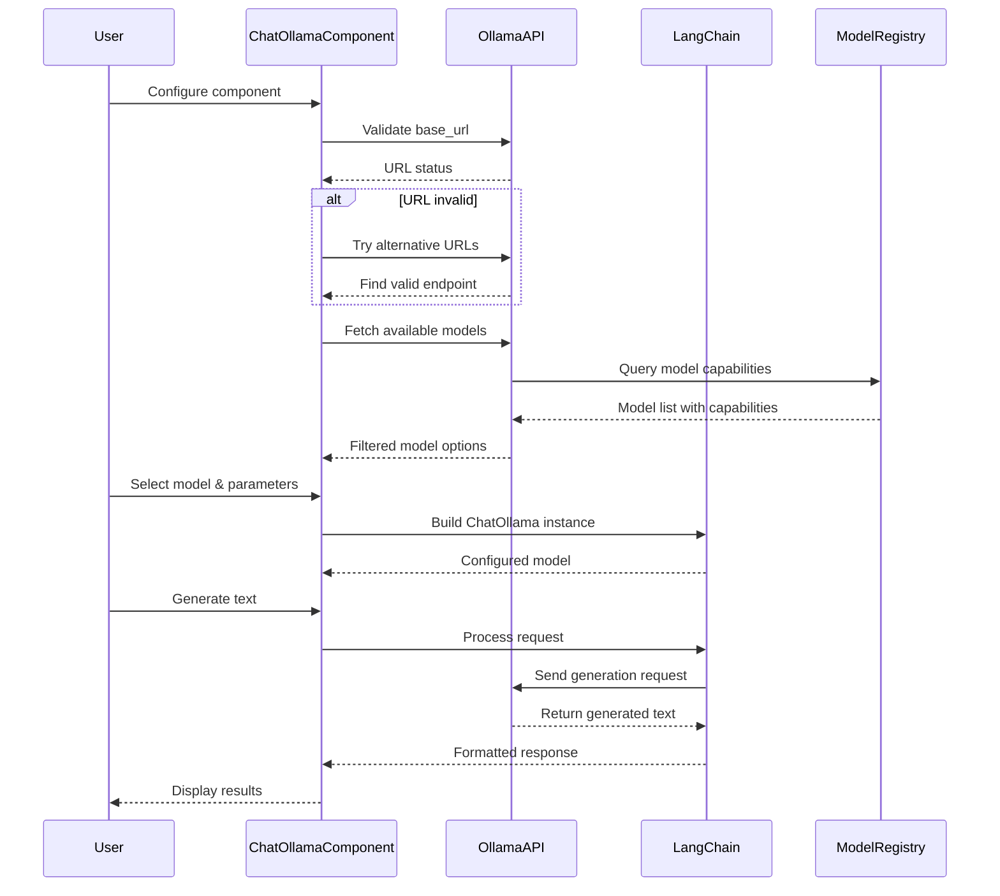
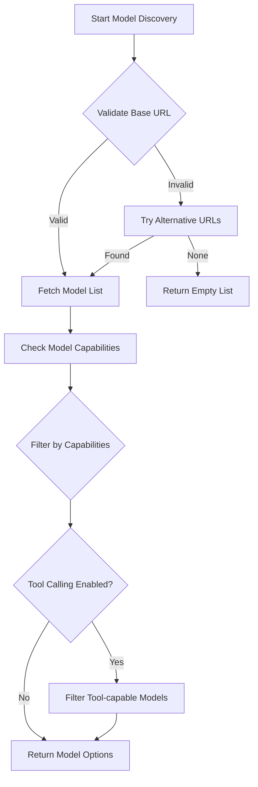
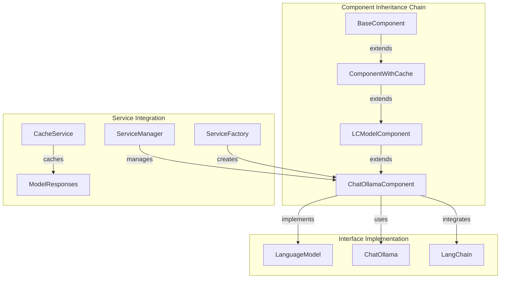

# Ollama Integration Module

## Introduction

The Ollama Integration module provides seamless integration with Ollama's local Large Language Model (LLM) services within the Langflow ecosystem. This module enables users to leverage locally hosted AI models through the ChatOllamaComponent, offering a comprehensive interface for text generation, tool calling, and advanced model configuration options.

## Architecture Overview

The Ollama Integration module is built on top of the LangChain Ollama integration and follows the Langflow component architecture pattern. It provides a unified interface for interacting with Ollama's local LLM services while maintaining compatibility with the broader Langflow ecosystem.



## Core Components

### ChatOllamaComponent

The `ChatOllamaComponent` is the primary interface for integrating Ollama's local LLM services into Langflow workflows. It extends the `LCModelComponent` base class and provides comprehensive model configuration options, real-time model discovery, and advanced sampling parameters.

**Key Features:**
- **Model Discovery**: Automatically discovers available models from Ollama API
- **Advanced Configuration**: Supports comprehensive model parameters including temperature, context window, GPU settings, and sampling strategies
- **Tool Calling**: Enables function calling capabilities for models that support it
- **Real-time Updates**: Dynamically updates model options and configuration based on user input
- **Error Handling**: Provides robust error handling for connection issues and API failures

**Component Specification:**
```python
class ChatOllamaComponent(LCModelComponent):
    display_name = "Ollama"
    description = "Generate text using Ollama Local LLMs."
    icon = "Ollama"
    name = "OllamaModel"
```

## Data Flow Architecture



## Component Configuration

### Input Parameters

The ChatOllamaComponent provides extensive configuration options organized into basic and advanced categories:

**Basic Configuration:**
- `base_url`: Ollama API endpoint (default: auto-discovery)
- `model_name`: Selected model from available options
- `temperature`: Sampling temperature (0-1, default: 0.1)

**Advanced Configuration:**
- **Context & Performance**: `num_ctx`, `num_gpu`, `num_thread`, `timeout`
- **Sampling Strategies**: `mirostat`, `mirostat_eta`, `mirostat_tau`, `top_k`, `top_p`, `tfs_z`
- **Repetition Control**: `repeat_last_n`, `repeat_penalty`
- **Output Formatting**: `format`, `template`, `system`, `stop_tokens`
- **Metadata**: `metadata`, `tags`, `verbose`
- **Tool Integration**: `tool_model_enabled`

### Model Discovery Process



## Integration with Langflow Ecosystem

### Component Hierarchy



### Dependencies

The Ollama Integration module relies on several key dependencies:

**Core Dependencies:**
- [LCModelComponent](llm_models.md): Base class for language model components
- [BaseComponent](component_system.md): Foundation component class
- [ServiceManager](services.md): Service lifecycle management
- [LangChain Ollama](https://python.langchain.com/docs/integrations/chat/ollama): External LLM integration

**Supporting Dependencies:**
- `httpx`: Async HTTP client for API communication
- `asyncio`: Asynchronous programming support
- `urllib.parse`: URL manipulation and validation

## Error Handling and Validation

### URL Validation
The component implements robust URL validation with automatic fallback to common Ollama endpoints:

```python
async def is_valid_ollama_url(self, url: str) -> bool:
    try:
        async with httpx.AsyncClient() as client:
            return (await client.get(urljoin(url, "api/tags"))).status_code == HTTP_STATUS_OK
    except httpx.RequestError:
        return False
```

### Model Capability Filtering
Models are filtered based on their capabilities to ensure compatibility:
- **Completion Models**: Filters for models with "completion" capability
- **Tool Support**: Optionally filters for models with "tools" capability
- **Embedding Exclusion**: Excludes models with "embedding" capability

### Error Recovery
The component implements multiple error recovery strategies:
- **URL Fallback**: Automatically tries alternative Ollama URLs
- **Graceful Degradation**: Returns empty model lists instead of crashing
- **User Feedback**: Provides clear error messages for configuration issues

## Configuration Management

### Dynamic Configuration Updates
The component supports real-time configuration updates based on user input:

```python
async def update_build_config(self, build_config: dict, field_value: Any, field_name: str | None = None):
    # Handle mirostat settings
    if field_name == "mirostat":
        # Update dependent field visibility and values
    
    # Handle URL and model updates
    if field_name in {"base_url", "model_name"}:
        # Validate URL and refresh model options
```

### Parameter Mapping
The component maps user-friendly parameters to LangChain Ollama format:

| User Parameter | LangChain Parameter | Description |
|----------------|-------------------|-------------|
| `mirostat` | `mirostat` | Sampling control (0=Disabled, 1=Mirostat, 2=Mirostat 2.0) |
| `temperature` | `temperature` | Randomness in generation (0-1) |
| `num_ctx` | `num_ctx` | Context window size |
| `tool_model_enabled` | N/A | Filters models by tool calling capability |

## Usage Patterns

### Basic Text Generation
```python
# Configure component with basic settings
component = ChatOllamaComponent()
component.base_url = "http://localhost:11434"
component.model_name = "llama2"
component.temperature = 0.7

# Build and use model
model = component.build_model()
response = model.invoke("Hello, how are you?")
```

### Advanced Configuration
```python
# Configure advanced parameters
component.mirostat = "Mirostat 2.0"
component.mirostat_eta = 0.2
component.mirostat_tau = 10
component.num_ctx = 4096
component.num_gpu = 2
component.tool_model_enabled = True
```

### Tool Calling Setup
```python
# Enable tool calling for compatible models
component.tool_model_enabled = True
# Component will filter models to only show tool-capable ones
# Use with LangChain tool binding for function calling
```

## Performance Considerations

### Model Loading
- **Keep-alive**: Configure model persistence to avoid repeated loading
- **GPU Utilization**: Optimize `num_gpu` setting based on available hardware
- **Thread Management**: Adjust `num_thread` for optimal CPU usage

### Network Optimization
- **Connection Pooling**: Uses httpx async client for efficient connections
- **Timeout Configuration**: Configurable timeout for long-running requests
- **URL Caching**: Validates and caches working endpoints

### Memory Management
- **Context Window**: Configure `num_ctx` based on available memory
- **Batch Processing**: Supports batch processing for multiple requests
- **Cache Integration**: Works with Langflow's caching system for response caching

## Security Considerations

### Local Deployment
- **Network Isolation**: Designed for local network deployment
- **No External Dependencies**: All processing happens locally or on configured Ollama instance
- **API Validation**: Validates API endpoints before connection

### Data Privacy
- **Local Processing**: Supports fully local AI processing
- **No Data Leakage**: Ensures data stays within configured Ollama instance
- **Secure Connections**: Supports HTTPS for remote Ollama instances

## Troubleshooting

### Common Issues

**Connection Failures:**
- Verify Ollama service is running
- Check base_url configuration
- Try alternative URLs from URL_LIST

**Model Not Found:**
- Ensure model is pulled in Ollama
- Check model capabilities match requirements
- Verify tool_model_enabled setting

**Performance Issues:**
- Adjust num_gpu and num_thread settings
- Optimize context window size
- Configure appropriate sampling parameters

### Debug Information
Enable verbose mode for detailed logging:
```python
component.verbose = True
```

Check component logs for:
- API request/response details
- Model discovery process
- Configuration validation results

## Related Documentation

- [LLM Models Module](llm_models.md) - Overview of language model integrations
- [Component System](component_system.md) - Base component architecture
- [Services Module](services.md) - Service management and lifecycle
- [Graph System](graph_system.md) - Workflow and vertex management
- [OpenAI Integration](openai_integration.md) - Alternative LLM provider
- [Anthropic Integration](anthropic_integration.md) - Claude model integration

## API Reference

### ChatOllamaComponent Methods

#### `build_model() -> LanguageModel`
Builds and returns a configured LangChain ChatOllama instance.

**Returns:** Configured LanguageModel ready for text generation

**Raises:** ValueError if unable to connect to Ollama API

#### `async update_build_config(build_config: dict, field_value: Any, field_name: str | None = None) -> dict`
Dynamically updates component configuration based on field changes.

**Parameters:**
- `build_config`: Current build configuration
- `field_value`: New value for the field
- `field_name`: Name of the field being updated

**Returns:** Updated build configuration

#### `async get_models(base_url_value: str, tool_model_enabled: bool | None = None) -> list[str]`
Fetches available models from Ollama API with capability filtering.

**Parameters:**
- `base_url_value`: Ollama API base URL
- `tool_model_enabled`: Whether to filter for tool-capable models

**Returns:** List of model names matching criteria

**Raises:** ValueError if unable to fetch model list

#### `async is_valid_ollama_url(url: str) -> bool`
Validates if a URL points to a working Ollama API endpoint.

**Parameters:**
- `url`: URL to validate

**Returns:** True if URL is valid, False otherwise