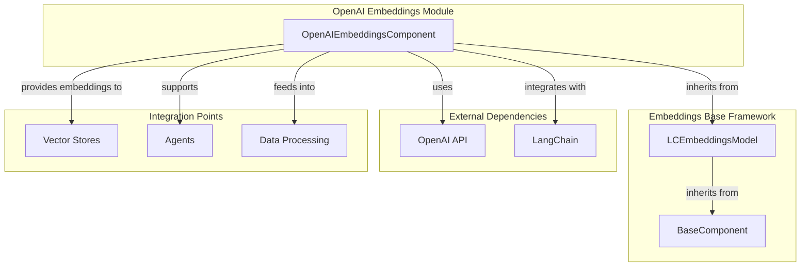
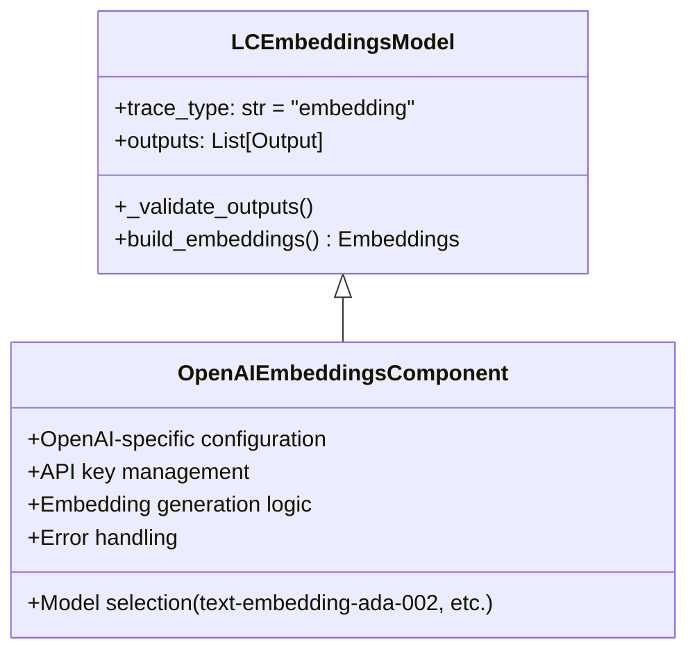
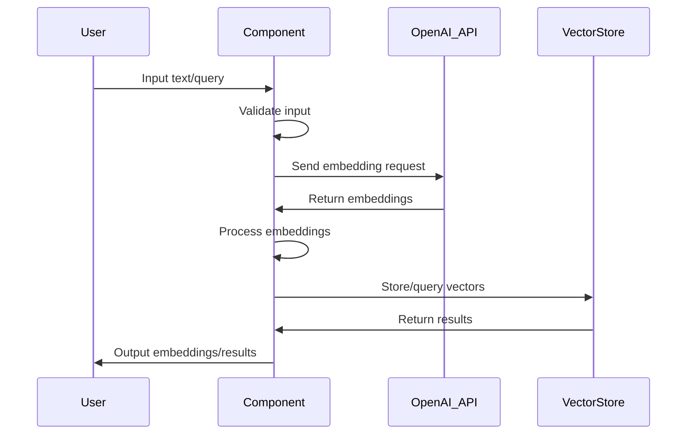

# OpenAI Embeddings Module Documentation

## Introduction

The OpenAI Embeddings module provides a specialized component for generating text embeddings using OpenAI's embedding models. This module integrates seamlessly with the Langflow ecosystem, offering a standardized interface for converting text into high-dimensional vector representations that can be used for various downstream tasks such as semantic search, clustering, and similarity matching.

## Architecture Overview

The OpenAI Embeddings module is built on top of a robust embeddings framework that provides common functionality across different embedding providers. The module follows a component-based architecture that ensures consistency and reusability across the Langflow platform.



## Component Structure

### Core Component: OpenAIEmbeddingsComponent

The `OpenAIEmbeddingsComponent` is the primary implementation that provides OpenAI-specific embedding functionality. It extends the base `LCEmbeddingsModel` class, which defines the standard interface for all embedding components in the system.



## Key Features

### 1. Model Support
The module supports various OpenAI embedding models, including:
- `text-embedding-ada-002` (recommended)
- `text-embedding-3-small`
- `text-embedding-3-large`

### 2. Configuration Management
- API key handling through secure configuration
- Model parameter customization
- Batch processing capabilities
- Rate limiting and retry logic

### 3. Integration Capabilities
- Seamless integration with vector stores for semantic search
- Support for agent-based applications
- Compatibility with data processing pipelines
- Frontend node integration for visual workflow building

## Data Flow



## Dependencies and Integration

### Internal Dependencies
- **[embeddings_base](embeddings_base.md)**: Provides the foundational `LCEmbeddingsModel` class that defines the standard interface for embedding components
- **[component_system](component_system.md)**: Supplies base component functionality and caching capabilities through `BaseComponent` and `ComponentWithCache`
- **[graph_system](graph_system.md)**: Enables integration into the graph-based workflow system through vertex and node abstractions

### External Dependencies
- **OpenAI API**: Core service for generating embeddings
- **LangChain**: Provides the underlying `Embeddings` interface and utilities

### Related Modules
- **[vector_stores](vector_stores.md)**: Consumes embeddings for storage and similarity search operations
- **[agents](agents.md)**: Utilizes embeddings for context understanding and decision making
- **[data_processing](data_processing.md)**: Processes and transforms embedding outputs for various use cases

## Usage Patterns

### 1. Standalone Embedding Generation
```python
# Direct embedding generation for text
embeddings = openai_embeddings_component.build_embeddings()
vectors = embeddings.embed_documents(["text1", "text2"])
```

### 2. Vector Store Integration
```python
# Embeddings fed into vector stores for semantic search
vector_store.add_embeddings(
    texts=["document1", "document2"],
    embeddings=embeddings
)
```

### 3. Agent Context Enhancement
```python
# Embeddings used to enhance agent understanding
agent_context.add_embeddings(embeddings)
```

## Configuration Options

### Required Parameters
- **OpenAI API Key**: Authentication credential for OpenAI services
- **Model Name**: Specific embedding model to use

### Optional Parameters
- **Chunk Size**: Batch size for processing multiple texts
- **Max Retries**: Number of retry attempts for failed requests
- **Timeout**: Request timeout duration
- **Base URL**: Custom API endpoint (for proxy scenarios)

## Error Handling

The module implements comprehensive error handling for:
- API authentication failures
- Rate limiting and quota exceeded errors
- Network connectivity issues
- Invalid input validation
- Model availability checks

## Performance Considerations

### Optimization Strategies
1. **Batch Processing**: Group multiple texts into single API calls
2. **Caching**: Leverage component-level caching for repeated requests
3. **Async Operations**: Support for asynchronous embedding generation
4. **Connection Pooling**: Efficient HTTP connection management

### Scalability Features
- Horizontal scaling through distributed processing
- Load balancing across multiple API keys
- Queue-based processing for high-volume operations

## Security and Compliance

### Data Protection
- API key encryption at rest
- Secure transmission using HTTPS
- Input sanitization and validation
- Audit logging for compliance requirements

### Privacy Considerations
- No persistent storage of input texts
- Configurable data retention policies
- GDPR compliance through data anonymization options

## Monitoring and Observability

### Metrics Collection
- API request/response times
- Error rates and types
- Token usage and costs
- Embedding generation throughput

### Logging
- Structured logging for debugging
- Performance metrics tracking
- Error context preservation
- Integration with monitoring systems

## Future Enhancements

### Planned Features
1. **Multi-modal Embeddings**: Support for image and text combined embeddings
2. **Custom Model Fine-tuning**: Integration with OpenAI's fine-tuning API
3. **Dimensionality Reduction**: Built-in support for embedding compression
4. **Real-time Streaming**: Support for streaming embedding generation

### Extensibility Points
- Plugin architecture for custom embedding providers
- Configurable preprocessing pipelines
- Custom similarity metrics
- Integration with additional vector databases

## Best Practices

### 1. Model Selection
- Use `text-embedding-ada-002` for general-purpose applications
- Consider `text-embedding-3-large` for high-accuracy requirements
- Evaluate cost-performance trade-offs for your use case

### 2. Input Optimization
- Preprocess text to remove unnecessary content
- Consider text length limits and chunking strategies
- Implement proper error handling for edge cases

### 3. Performance Tuning
- Batch multiple texts when possible
- Implement caching for frequently accessed embeddings
- Monitor API usage to optimize costs

### 4. Integration Guidelines
- Follow the standard component interface for consistency
- Implement proper validation and error handling
- Document configuration requirements clearly

## Troubleshooting

### Common Issues
1. **API Key Errors**: Verify key validity and permissions
2. **Rate Limiting**: Implement exponential backoff strategies
3. **Model Availability**: Check model support in your region
4. **Network Issues**: Configure appropriate timeouts and retries

### Debug Information
- Enable verbose logging for detailed request/response information
- Use the trace functionality to track embedding generation flow
- Monitor API response headers for rate limit information

This documentation provides a comprehensive overview of the OpenAI Embeddings module, its architecture, integration points, and best practices for effective utilization within the Langflow ecosystem.