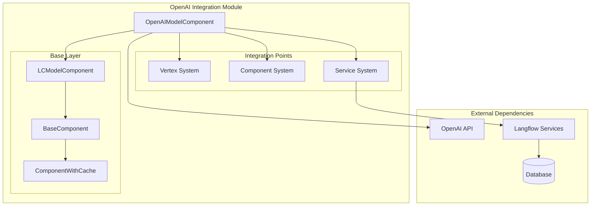
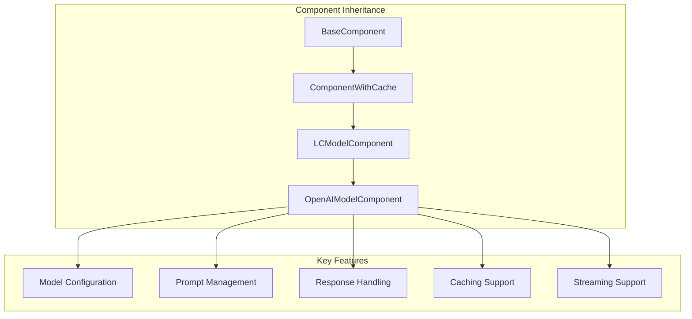
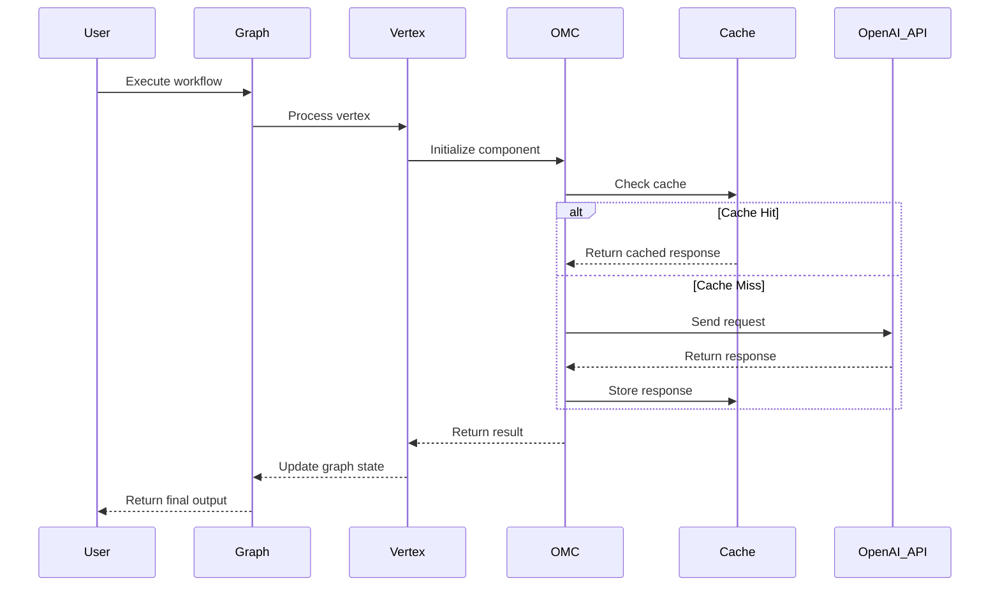
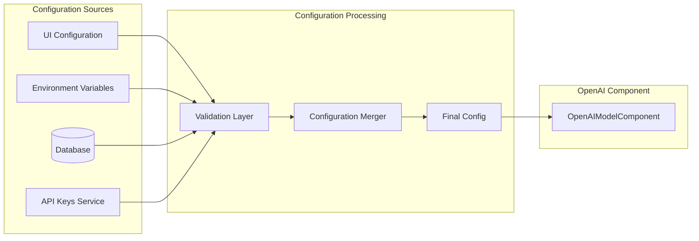
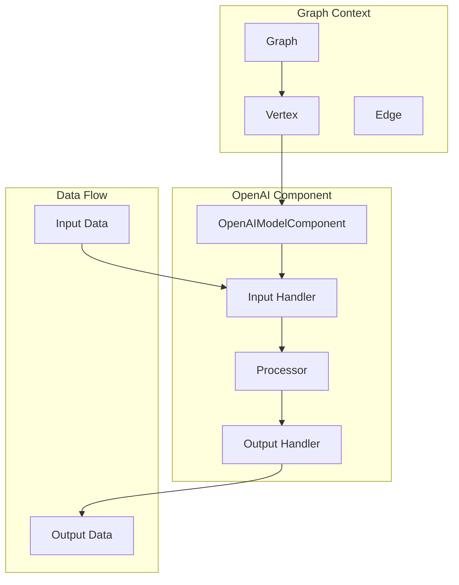
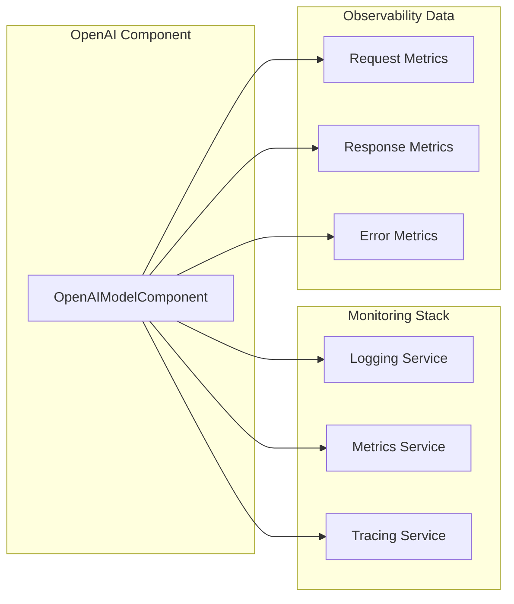

# OpenAI Integration Module Documentation

## Introduction

The OpenAI Integration module provides comprehensive integration with OpenAI's language models within the Langflow ecosystem. This module serves as the primary interface for leveraging OpenAI's powerful language models, including GPT-3.5, GPT-4, and their variants, enabling users to build sophisticated AI-powered workflows and applications.

The module is designed to seamlessly integrate with Langflow's component system, providing a standardized interface for model configuration, prompt management, and response handling while maintaining compatibility with the broader graph-based workflow system.

## Architecture Overview

### Core Architecture



### Component Hierarchy



## Core Components

### OpenAIModelComponent

The `OpenAIModelComponent` is the primary component of this module, extending the `LCModelComponent` to provide OpenAI-specific functionality. This component encapsulates all interactions with OpenAI's API, providing a unified interface for model operations.

**Key Responsibilities:**
- Model initialization and configuration
- API key management and validation
- Request formatting and response parsing
- Error handling and retry logic
- Token usage tracking and management
- Streaming response support

**Integration Points:**
- Vertex System: Integrates as a graph vertex for workflow execution
- Component System: Participates in the component lifecycle and validation
- Service System: Leverages caching and configuration services

## Data Flow Architecture

### Request-Response Flow



### Configuration Flow



## Integration with Langflow Ecosystem

### Graph System Integration

The OpenAI Integration module seamlessly integrates with Langflow's graph system through the vertex-based architecture:



### Service System Dependencies

The module leverages various Langflow services for enhanced functionality:

- **CacheService**: Implements intelligent caching for API responses
- **ConfigurationService**: Manages model parameters and settings
- **DatabaseService**: Persists conversation history and metadata
- **APIService**: Handles API key rotation and validation

## Key Features

### Model Support

The module supports a comprehensive range of OpenAI models:

- **GPT-4 Models**: GPT-4, GPT-4-turbo, GPT-4-32k
- **GPT-3.5 Models**: GPT-3.5-turbo, GPT-3.5-turbo-16k
- **Specialized Models**: Text-davinci, Code-davinci
- **Embedding Models**: text-embedding-ada-002

### Advanced Capabilities

1. **Streaming Support**: Real-time response streaming for enhanced user experience
2. **Function Calling**: Integration with OpenAI's function calling capabilities
3. **Multi-modal Support**: Text and image input processing
4. **Token Management**: Intelligent token usage tracking and optimization
5. **Rate Limiting**: Built-in rate limiting and retry mechanisms
6. **Error Recovery**: Comprehensive error handling and recovery strategies

### Configuration Options

```yaml
model_configuration:
  model_name: "gpt-4"
  temperature: 0.7
  max_tokens: 1000
  top_p: 1.0
  frequency_penalty: 0.0
  presence_penalty: 0.0
  
api_configuration:
  base_url: "https://api.openai.com/v1"
  timeout: 30
  max_retries: 3
  retry_delay: 1.0
  
cache_configuration:
  enabled: true
  ttl: 3600
  max_size: 1000
```

## Dependencies and Relationships

### Internal Dependencies

The OpenAI Integration module depends on several core Langflow systems:

- **[Component System](component_system.md)**: Inherits from BaseComponent and ComponentWithCache
- **[Graph System](graph_system.md)**: Integrates as a vertex type for workflow execution
- **[Services](services.md)**: Utilizes caching, configuration, and database services
- **[Schema Types](schema_types.md)**: Uses content types and schema definitions

### External Dependencies

- **OpenAI Python Library**: Official OpenAI Python SDK
- **LangChain**: For model abstraction and chain management
- **Pydantic**: For data validation and serialization

## Usage Patterns

### Basic Model Usage

```python
# Component initialization
openai_component = OpenAIModelComponent(
    model_name="gpt-4",
    temperature=0.7,
    max_tokens=1000
)

# Request processing
response = openai_component.generate(
    prompt="Explain quantum computing",
    system_message="You are a helpful assistant."
)
```

### Advanced Configuration

```python
# With function calling
openai_component = OpenAIModelComponent(
    model_name="gpt-4",
    functions=[
        {
            "name": "get_weather",
            "description": "Get weather information",
            "parameters": {
                "type": "object",
                "properties": {
                    "location": {"type": "string"}
                }
            }
        }
    ]
)
```

## Error Handling and Monitoring

### Error Types

The module handles various error scenarios:

- **API Errors**: Rate limiting, authentication failures, model unavailability
- **Validation Errors**: Invalid parameters, malformed requests
- **Network Errors**: Connection timeouts, service unavailability
- **Token Limit Errors**: Context length exceeded, token budget exceeded

### Monitoring and Observability



## Security Considerations

### API Key Management

- Secure storage and retrieval of API keys
- Key rotation support
- Environment-based key isolation
- Audit logging for key usage

### Data Privacy

- Input sanitization and validation
- Output filtering for sensitive information
- Compliance with data protection regulations
- Secure transmission of data

## Performance Optimization

### Caching Strategy

The module implements a multi-level caching strategy:

1. **Response Caching**: Caches successful API responses
2. **Token Caching**: Caches token usage information
3. **Configuration Caching**: Caches model configurations

### Resource Management

- Connection pooling for API requests
- Efficient memory usage for large responses
- Streaming support for real-time processing
- Background cleanup of expired cache entries

## Testing and Quality Assurance

### Test Coverage

- Unit tests for all component methods
- Integration tests with mock OpenAI API
- Performance tests for various model configurations
- Error handling and recovery tests

### Quality Metrics

- Response time optimization
- Token usage efficiency
- Error rate minimization
- Cache hit ratio optimization

## Future Enhancements

### Planned Features

1. **Multi-Model Support**: Dynamic model selection based on use case
2. **Advanced Caching**: Semantic caching for similar requests
3. **Batch Processing**: Support for batch API requests
4. **Custom Fine-tuning**: Integration with OpenAI's fine-tuning API
5. **Advanced Analytics**: Detailed usage and performance analytics

### Scalability Improvements

- Horizontal scaling support
- Load balancing for high-traffic scenarios
- Distributed caching implementation
- Queue-based processing for large volumes

## Conclusion

The OpenAI Integration module serves as a critical component in the Langflow ecosystem, providing robust and scalable integration with OpenAI's language models. Through its comprehensive feature set, intelligent caching mechanisms, and seamless integration with the broader system architecture, it enables developers to build sophisticated AI-powered applications with minimal complexity.

The module's design emphasizes flexibility, performance, and reliability, making it suitable for both simple chatbot implementations and complex multi-model workflows. As the AI landscape continues to evolve, this module provides a solid foundation for incorporating cutting-edge language model capabilities into the Langflow platform.