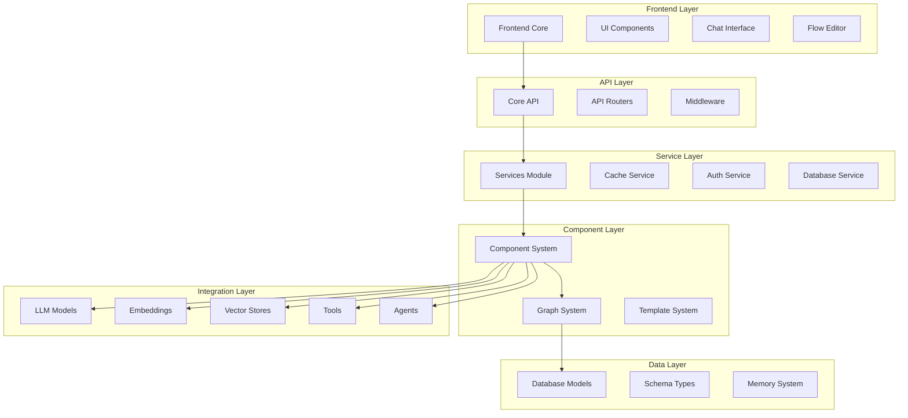

# Langflow-AI--Langflow Repository Overview

## Purpose

The `langflow-ai--langflow` repository is the core implementation of Langflow, an open-source visual framework for building AI applications and workflows. It provides a comprehensive platform for creating, managing, and executing AI-powered workflows through a visual interface, supporting multiple LLM providers, custom components, and complex data processing pipelines.

## Architecture

## Core Modules

### 1. Core API (`core_api`)
The central API layer providing standardized request/response schemas, authentication, flow management, and real-time communication support. It serves as the contract layer between frontend clients and backend services.

### 2. Graph System (`graph_system`)
The execution engine that manages data flow through interconnected components using a vertex-edge architecture. Handles component instantiation, parameter processing, result caching, and error propagation.

### 3. Component System (`component_system`)
The extensible framework for creating and managing custom components. Provides code validation, template configuration, variable management, and integration with the broader Langflow ecosystem.

### 4. LLM Models (`llm_models`)
Unified interface for multiple Large Language Model providers including OpenAI, Anthropic, Google, Ollama, and Groq. Supports streaming, tool calling, and provider-specific features.

### 5. Services (`services`)
Service-oriented architecture foundation providing dependency injection, lifecycle management, caching, and cross-cutting concerns. Manages authentication, database operations, and system services.

### 6. Database Models (`database_models`)
SQLAlchemy-based ORM models for user management, flow storage, API key authentication, message logging, and variable management. Ensures data persistence and integrity.

### 7. Schema Types (`schema_types`)
Standardized data structures for content representation, table schemas, and logging protocols. Provides type-safe communication throughout the system.

### 8. Frontend Core (`frontend_core`)
TypeScript type definitions and interfaces for the frontend application, ensuring type safety across UI components, chat systems, and authentication.

### 9. Template System (`template_system`)
Manages frontend representation and configuration of components, bridging backend logic with frontend visualization through template definitions and field configurations.

### 10. Server Main (`server_main`)
FastAPI application setup, middleware configuration, and lifecycle management. Handles request processing, error handling, and production deployment.

## Key Features

- **Visual Workflow Builder**: Drag-and-drop interface for creating AI workflows
- **Multi-Provider LLM Support**: Integration with major LLM providers
- **Custom Component Development**: Framework for building reusable components
- **Real-time Collaboration**: Chat interfaces and streaming support
- **Data Processing Pipeline**: Comprehensive data transformation and processing
- **Vector Store Integration**: Support for multiple vector databases
- **Agent Framework**: Intelligent agent capabilities with tool integration
- **Extensible Architecture**: Plugin system for custom integrations
- **Production Ready**: Comprehensive error handling, caching, and deployment support

## Integration Points

The repository integrates with external services and libraries:
- **LLM Providers**: OpenAI, Anthropic, Google AI, Ollama, Groq
- **Vector Databases**: Chroma, Pinecone, AstraDB, Qdrant
- **Frontend Framework**: React with TypeScript
- **Database**: SQLAlchemy with multiple backend support
- **API Framework**: FastAPI with automatic documentation
- **Authentication**: Multiple authentication methods including API keys and OAuth

## Development and Deployment

The system supports both development and production environments:
- **Development**: Hot reload, comprehensive logging, debug tools
- **Production**: Gunicorn integration, Prometheus metrics, Sentry error tracking
- **Scalability**: Async architecture, caching layers, connection pooling
- **Security**: Input validation, API key management, encrypted variable storage

This repository represents a complete, production-ready platform for building and deploying AI applications with a focus on usability, extensibility, and performance.