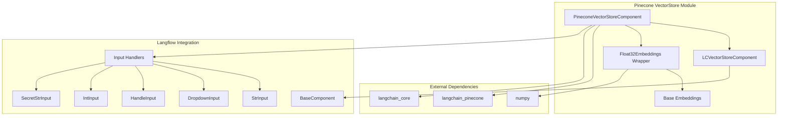
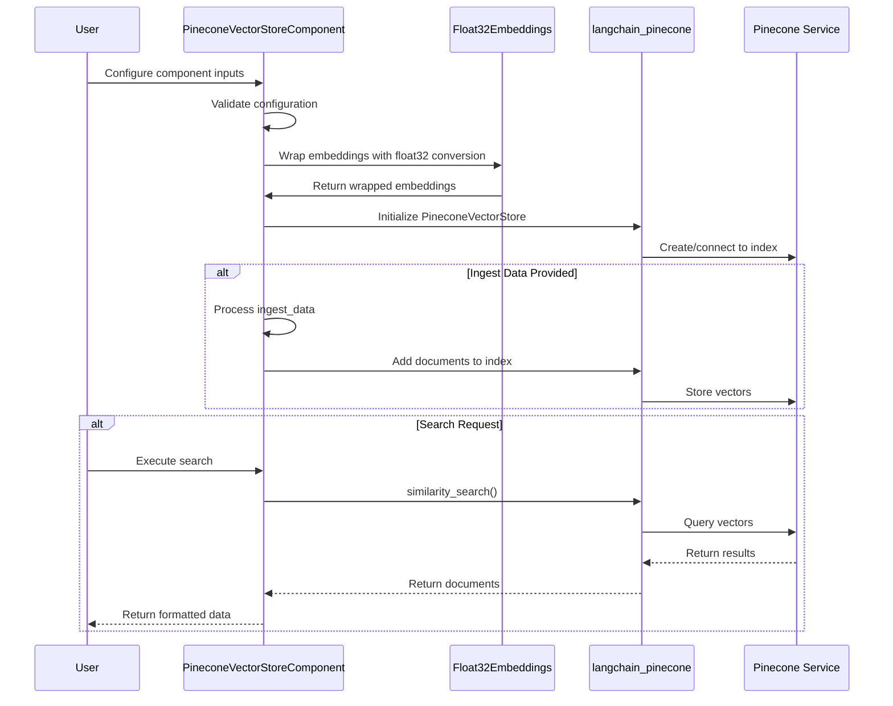
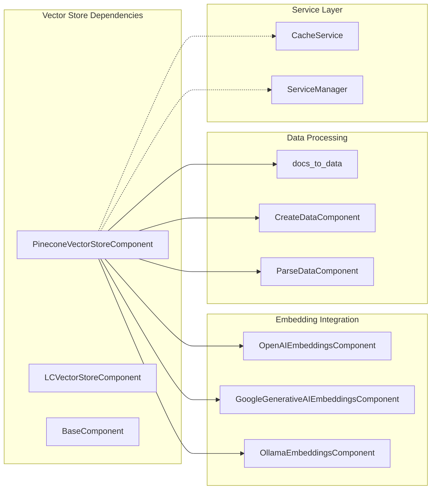
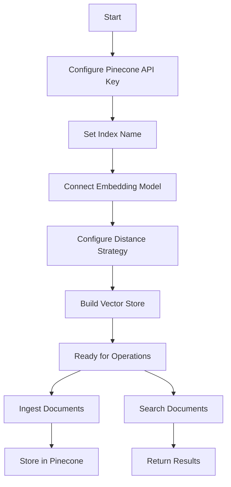
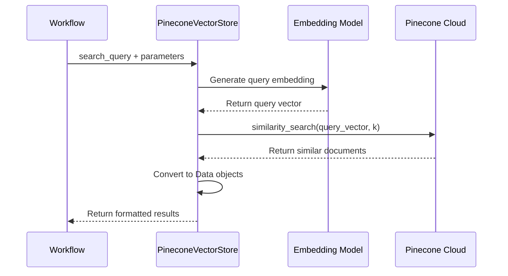

# Pinecone VectorStore Module Documentation

## Introduction

The Pinecone VectorStore module provides a specialized integration with Pinecone, a managed vector database service designed for high-performance similarity search at scale. This module enables Langflow users to leverage Pinecone's cloud-native vector storage and retrieval capabilities within their AI workflows, supporting efficient semantic search, recommendation systems, and retrieval-augmented generation (RAG) applications.

## Module Overview

The Pinecone VectorStore module implements a comprehensive vector storage solution that seamlessly integrates with Langflow's component ecosystem. It provides a user-friendly interface for configuring Pinecone indices, managing embeddings, and performing similarity searches while handling the complexities of data type conversions and API interactions.

## Core Architecture

### Component Structure

### Data Flow Architecture

## Component Details

### PineconeVectorStoreComponent

The main component that provides Pinecone integration capabilities:

**Purpose**: Creates and manages Pinecone vector store instances for semantic search operations

**Key Features**:
- Configurable distance strategies (Cosine, Euclidean, Dot Product)
- Namespace support for multi-tenant scenarios
- Automatic data type conversion to float32 for compatibility
- Integration with Langflow's data processing pipeline
- Support for both document ingestion and search operations

**Configuration Options**:
- `index_name`: The Pinecone index name (required)
- `namespace`: Namespace for logical separation within an index
- `distance_strategy`: Similarity calculation method
- `pinecone_api_key`: Authentication credential (required)
- `text_key`: Field name containing text content in records
- `embedding`: Embedding model connection
- `number_of_results`: Number of search results to return

### Float32Embeddings Wrapper

A utility class that ensures embedding vectors are properly formatted:

**Purpose**: Converts embedding vectors to float32 format for Pinecone compatibility

**Functionality**:
- Wraps base embedding models
- Forces float32 conversion on all vector elements
- Maintains compatibility with numpy arrays and Python lists
- Preserves the original embedding model's interface

## Integration Points

### Dependencies

### Related Modules

- [base_vectorstore.md](base_vectorstore.md) - Base vector store functionality
- [openai_embeddings.md](openai_embeddings.md) - OpenAI embedding integration
- [google_embeddings.md](google_embeddings.md) - Google AI embedding integration
- [ollama_embeddings.md](ollama_embeddings.md) - Ollama embedding integration
- [component_system.md](component_system.md) - Component framework

## Usage Patterns

### Basic Vector Store Setup

### Search Workflow

## Error Handling

The module implements comprehensive error handling:

- **Import Errors**: Graceful handling of missing `langchain-pinecone` dependency
- **Configuration Errors**: Validation of required parameters (API key, index name)
- **Connection Errors**: Proper error propagation for Pinecone service issues
- **Data Processing Errors**: Safe handling of document conversion and ingestion

## Performance Considerations

### Optimization Features
- **Float32 Conversion**: Automatic data type optimization for storage efficiency
- **Caching Support**: Integration with Langflow's caching system via `@check_cached_vector_store`
- **Batch Processing**: Efficient document ingestion through batch operations
- **Distance Strategy Selection**: Configurable similarity metrics for optimal performance

### Scalability
- **Namespace Support**: Logical partitioning for multi-tenant applications
- **Cloud-Native**: Leverages Pinecone's managed infrastructure for automatic scaling
- **Async Compatibility**: Supports asynchronous operations through Langchain integration

## Security Features

- **API Key Protection**: Secure handling of Pinecone credentials using `SecretStrInput`
- **Data Isolation**: Namespace support for data separation
- **Access Control**: Integration with Langflow's authentication system

## Configuration Examples

### Minimal Configuration
- Index name
- Pinecone API key
- Connected embedding model

### Advanced Configuration
- Custom namespace
- Specific distance strategy
- Text key customization
- Result count optimization

## Troubleshooting

### Common Issues
1. **Import Error**: Ensure `langchain-pinecone` is installed
2. **Authentication Error**: Verify API key validity
3. **Index Not Found**: Check index name and region configuration
4. **Embedding Compatibility**: Ensure embedding dimensions match index configuration

### Debug Information
- Component status tracking
- Error message propagation
- Integration with Langflow's logging system

## Future Enhancements

Potential improvements and extensions:
- Support for Pinecone's metadata filtering
- Integration with Pinecone's hybrid search capabilities
- Support for Pinecone collections
- Enhanced batch processing options
- Performance monitoring and metrics integration