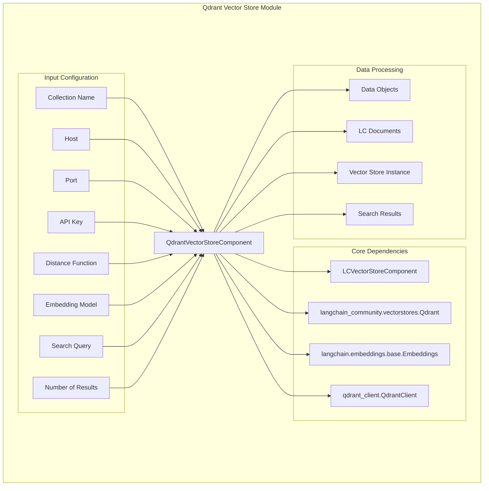
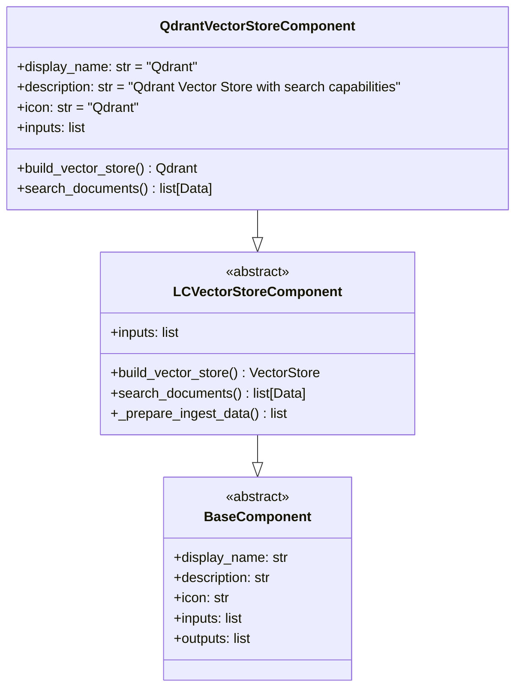
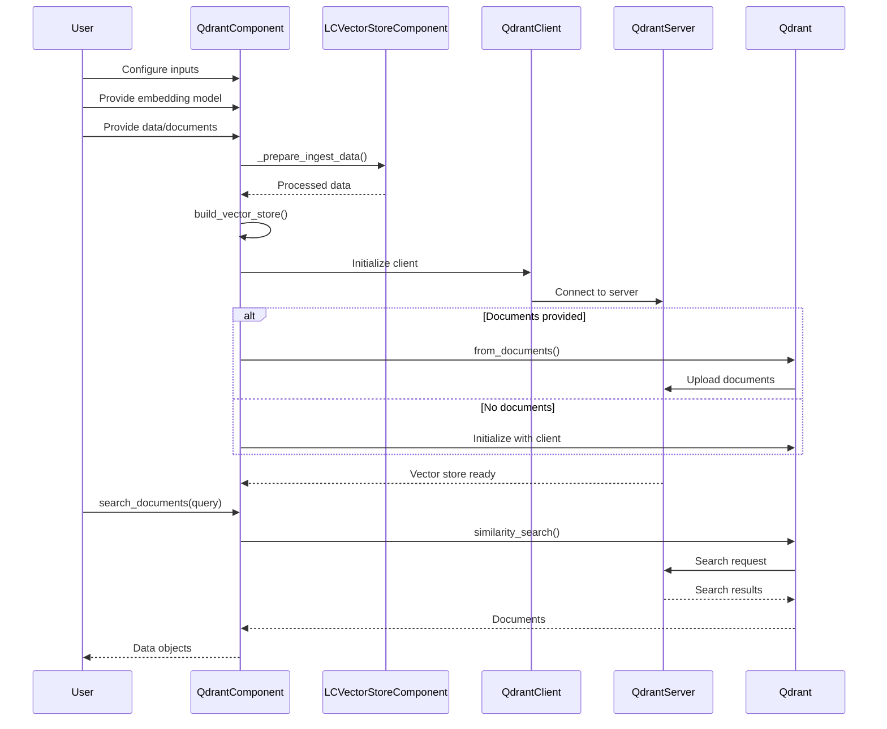
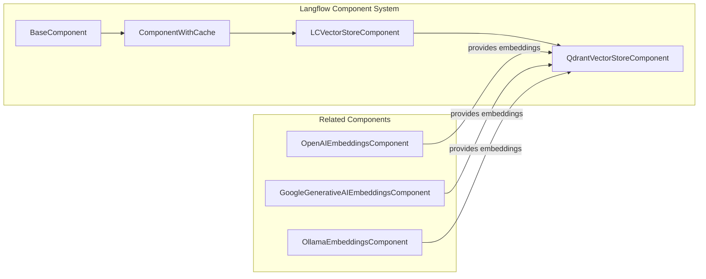

# Qdrant Vector Store Module

## Introduction

The Qdrant Vector Store module provides a powerful integration with Qdrant, a high-performance vector similarity search engine. This module enables Langflow users to store, index, and perform similarity searches on vector embeddings within their AI workflows. Qdrant offers both local and cloud deployment options, making it suitable for various use cases from development to production environments.

## Architecture Overview

## Component Structure

### QdrantVectorStoreComponent

The `QdrantVectorStoreComponent` is the main component that extends `LCVectorStoreComponent` to provide Qdrant-specific functionality. It handles both the creation of vector stores and the execution of similarity searches.

## Configuration Options

### Connection Settings

| Parameter | Type | Default | Description | Advanced |
|-----------|------|---------|-------------|----------|
| `collection_name` | StrInput | Required | Name of the Qdrant collection | No |
| `host` | StrInput | "localhost" | Qdrant server host | Yes |
| `port` | IntInput | 6333 | HTTP port for Qdrant server | Yes |
| `grpc_port` | IntInput | 6334 | gRPC port for Qdrant server | Yes |
| `api_key` | SecretStrInput | None | API key for authentication | Yes |
| `url` | StrInput | None | Full URL to Qdrant instance | Yes |
| `path` | StrInput | None | Local path for persistent storage | Yes |
| `prefix` | StrInput | None | URL prefix for the API | Yes |
| `timeout` | IntInput | None | Request timeout in seconds | Yes |

### Search Configuration

| Parameter | Type | Default | Description | Advanced |
|-----------|------|---------|-------------|----------|
| `distance_func` | DropdownInput | "Cosine" | Distance function for similarity | Yes |
| `content_payload_key` | StrInput | "page_content" | Key for content in payload | Yes |
| `metadata_payload_key` | StrInput | "metadata" | Key for metadata in payload | Yes |
| `number_of_results` | IntInput | 4 | Number of search results to return | Yes |

### Data Flow

## Integration with Langflow System

### Component Hierarchy

The Qdrant vector store integrates seamlessly with Langflow's component system:

### Dependencies

- **Base Classes**: [base_vectorstore.md](base_vectorstore.md) - Provides the foundational vector store functionality
- **Embeddings**: [embeddings_base.md](embeddings_base.md) - Required for vector generation
- **Data Processing**: Uses Langflow's data conversion utilities for document handling

## Usage Patterns

### Basic Setup

1. **Local Development**: Use default localhost configuration
2. **Cloud Deployment**: Configure with proper host, port, and API key
3. **Persistent Storage**: Use path parameter for local file-based storage

### Advanced Configuration

- **Distance Functions**: Choose between Cosine, Euclidean, or Dot Product based on use case
- **gRPC vs HTTP**: Use gRPC port for better performance in production
- **Authentication**: Secure your Qdrant instance with API keys

## Error Handling

The component includes several validation checks:

- **Embedding Validation**: Ensures the embedding object is valid before use
- **Data Conversion**: Handles conversion between Data objects and LangChain documents
- **Connection Validation**: Validates server connection parameters

## Performance Considerations

- **Batch Processing**: Processes documents in batches for efficiency
- **Caching**: Utilizes Langflow's caching mechanism via `@check_cached_vector_store`
- **Connection Pooling**: Qdrant client manages connection pooling automatically

## Security Features

- **API Key Protection**: Uses SecretStrInput for sensitive authentication data
- **Connection Security**: Supports HTTPS connections via URL configuration
- **Input Validation**: Validates all input parameters before processing

## Related Documentation

- [Base Vector Store Components](base_vectorstore.md) - Understanding the base vector store architecture
- [Embeddings Integration](embeddings_base.md) - Working with embedding models
- [Component System](component_system.md) - General component architecture
- [Data Processing](data_processing.md) - Data transformation utilities

## API Reference

### QdrantVectorStoreComponent

**build_vector_store()** → `Qdrant`
- Creates and returns a Qdrant vector store instance
- Handles document ingestion if data is provided
- Configures connection parameters based on inputs

**search_documents()** → `list[Data]`
- Performs similarity search on the vector store
- Returns results as Langflow Data objects
- Uses configured number_of_results parameter

### Configuration Parameters

See the configuration tables above for detailed parameter descriptions and usage patterns.