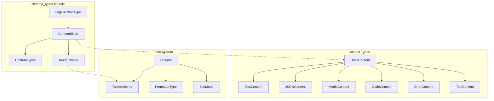
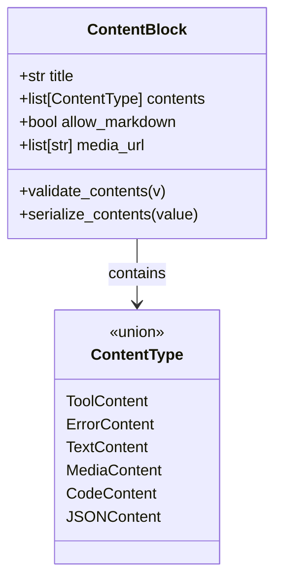
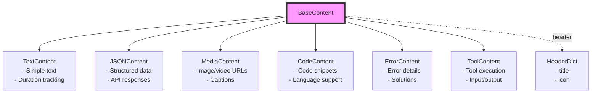
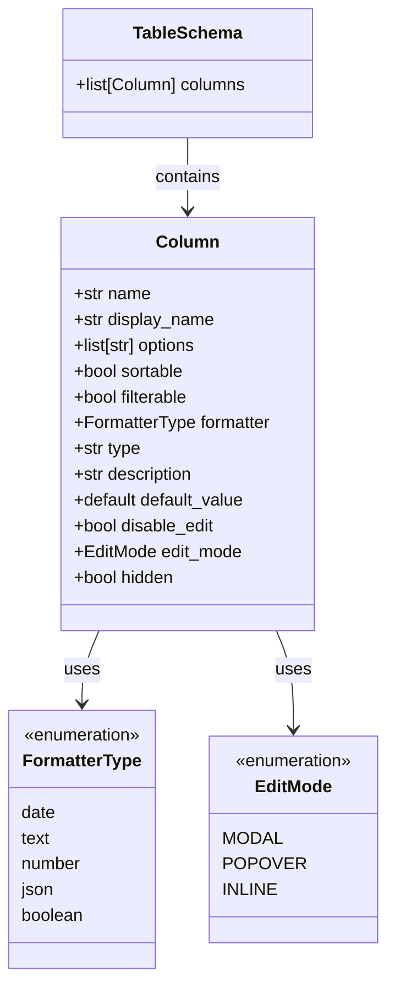
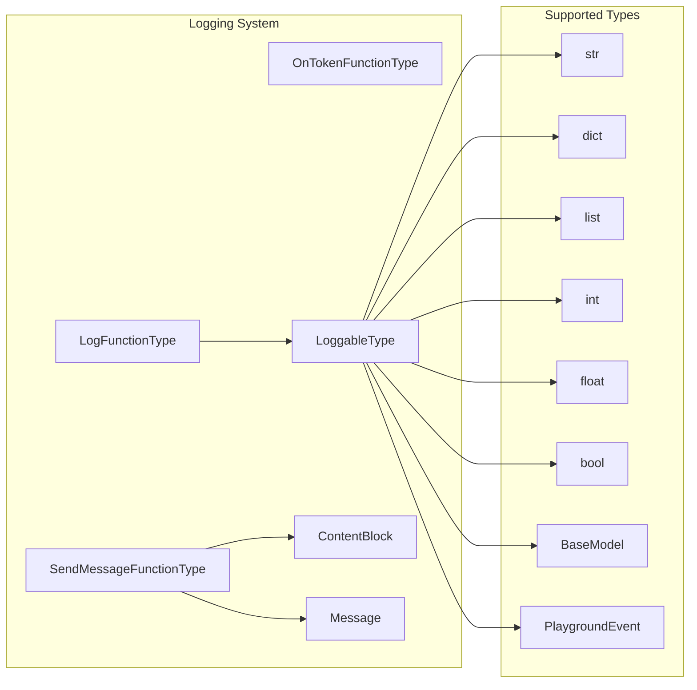
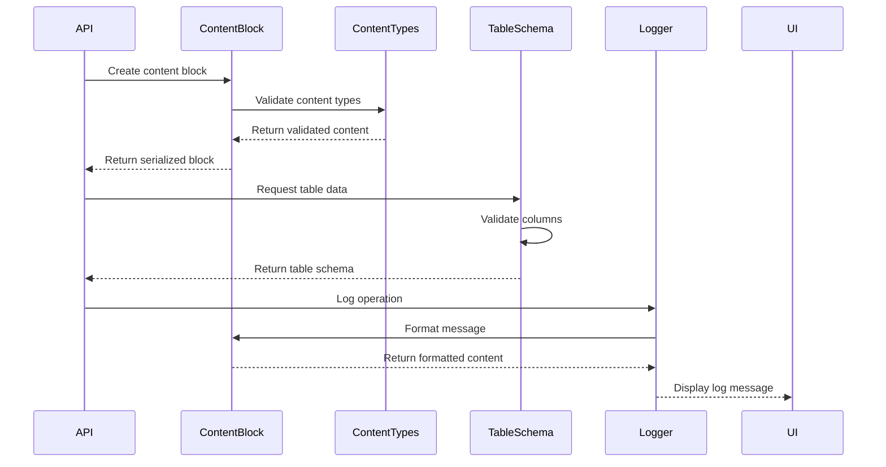

# Schema Types Module Documentation

## Introduction

The `schema_types` module serves as the foundational data structure layer for the Langflow system, providing standardized content representation, table schemas, and logging protocols. This module defines the core data types that enable consistent content handling across the entire platform, from API responses to UI components and logging systems.

The module is designed around three primary concerns:
- **Content Management**: Flexible content blocks that can represent various data types (text, JSON, media, code, tools)
- **Data Structure**: Table schemas for structured data representation and validation
- **System Integration**: Logging and messaging protocols for system-wide communication

## Architecture Overview



## Core Components

### ContentBlock

The `ContentBlock` is the central content container that provides a unified interface for handling diverse content types within the Langflow system.



**Key Features:**
- **Type Safety**: Uses Pydantic's discriminated unions to ensure type-safe content handling
- **Flexible Content**: Supports multiple content types within a single block
- **Serialization**: Custom serialization for consistent data transfer
- **Markdown Support**: Optional markdown rendering for text content

### Content Types

The content types system provides a hierarchical structure for different kinds of data that can flow through the Langflow system.



**BaseContent Properties:**
- `type`: Content type discriminator
- `duration`: Optional execution time tracking
- `header`: Optional title and icon for UI display

### TableSchema

The `TableSchema` provides a comprehensive data structure for tabular data representation with built-in validation and formatting capabilities.



**Column Features:**
- **Type Validation**: Automatic formatter assignment based on data type
- **Edit Control**: Configurable editing modes and permissions
- **UI Behavior**: Sorting, filtering, and visibility controls
- **Default Values**: Automatic type conversion for default values

### LogFunctionType

The logging protocol defines the interface for system-wide logging and messaging functionality.



## Data Flow Architecture



## Integration Points

### API Integration
The schema types module integrates with the [core_api](core_api.md) module to provide standardized request/response formats:

- **ContentBlock**: Used in API responses for structured content delivery
- **JSONContent**: Handles API response data serialization
- **ErrorContent**: Standardizes error reporting across endpoints

### Graph System Integration
Content blocks flow through the [graph_system](graph_system.md) to represent:

- **Node Data**: Component execution results as content blocks
- **Edge Data**: Data transformation between nodes
- **Tool Results**: Tool execution outputs in structured format

### Component System Integration
The [component_system](component_system.md) uses schema types for:

- **Input/Output**: Standardized component interfaces
- **Error Handling**: Consistent error reporting
- **Data Validation**: Type-safe data processing

### Frontend Integration
Schema types provide the data foundation for [frontend_core](frontend_core.md):

- **Content Rendering**: TextContent and JSONContent for UI display
- **Table Display**: TableSchema for data grid components
- **Error Display**: ErrorContent for user-friendly error messages

## Usage Patterns

### Content Block Creation
```python
# Creating a content block with mixed content types
content_block = ContentBlock(
    title="Analysis Results",
    contents=[
        TextContent(text="Processing completed successfully"),
        JSONContent(data={"results": [1, 2, 3]}),
        MediaContent(urls=["chart.png"], caption="Results visualization")
    ]
)
```

### Table Schema Definition
```python
# Defining a table schema for user data
table_schema = TableSchema(
    columns=[
        Column(
            name="username",
            display_name="User Name",
            type="string",
            sortable=True,
            filterable=True
        ),
        Column(
            name="created_at",
            display_name="Created Date",
            type="date",
            formatter=FormatterType.date
        )
    ]
)
```

### Logging Integration
```python
# Using the logging protocol
def log_operation(logger: LogFunctionType, message: str):
    logger(message, name="operation")
    
# The logger can handle various data types
logger("Simple message")
logger({"status": "success", "count": 42})
logger(content_block)  # ContentBlock instance
```

## Validation and Error Handling

The schema types module implements comprehensive validation:

- **Type Validation**: Pydantic models ensure data integrity
- **Content Validation**: Custom validators for content-specific rules
- **Format Validation**: Automatic type conversion and formatting
- **Error Propagation**: Structured error information through ErrorContent

## Extension Points

The modular design allows for easy extension:

- **New Content Types**: Extend BaseContent for specialized content
- **Custom Formatters**: Add new FormatterType values
- **Validation Rules**: Extend field validation for specific requirements
- **Serialization**: Custom serializers for special data types

## Performance Considerations

- **Lazy Validation**: Pydantic's validation occurs on model creation
- **Efficient Serialization**: Custom serializers optimize data transfer
- **Type Discrimination**: Fast type resolution using discriminators
- **Memory Efficiency**: Optional fields reduce memory footprint

## Security Features

- **Input Validation**: All input data is validated before processing
- **Type Safety**: Strong typing prevents injection attacks
- **Content Sanitization**: Markdown content can be controlled
- **Error Information**: Sensitive data excluded from error messages

This schema types module provides the essential data infrastructure that enables consistent, type-safe communication throughout the Langflow ecosystem, from backend processing to frontend display and user interaction.