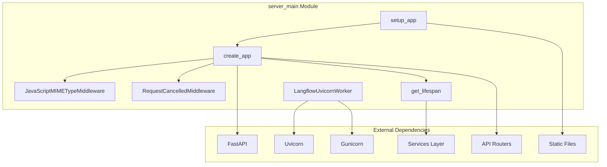
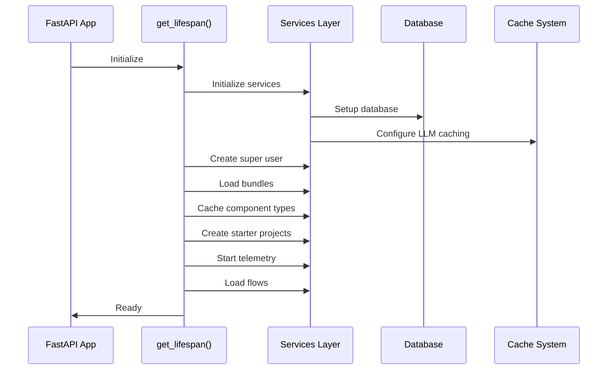

# Server Main Module Documentation

## Overview

The `server_main` module serves as the primary entry point and orchestration layer for the Langflow application. It provides the core FastAPI application setup, middleware configuration, lifecycle management, and server deployment functionality. This module is responsible for initializing the entire application stack, managing service dependencies, and ensuring proper startup/shutdown procedures.

## Architecture



## Core Components

### 1. JavaScriptMIMETypeMiddleware

**Purpose**: Ensures proper MIME type headers for JavaScript files served by the application.

**Key Responsibilities**:
- Intercepts HTTP responses for JavaScript files
- Sets correct `Content-Type: text/javascript` header
- Handles Pydantic serialization errors with user-friendly messages
- Filters requests to avoid processing static file routes incorrectly

**Error Handling**:
- Catches `PydanticSerializationError` and converts to HTTP 500 with detailed error messages
- Provides guidance to users for reporting serialization issues

### 2. RequestCancelledMiddleware

**Purpose**: Handles client request cancellations gracefully to prevent server resource waste.

**Key Features**:
- Monitors request connection status during processing
- Cancels ongoing request processing when client disconnects
- Returns HTTP 499 status code for cancelled requests
- Prevents unnecessary computation on abandoned requests

**Implementation**:
- Uses asyncio task coordination to monitor both request processing and cancellation
- Implements sentinel pattern for clean task cancellation
- Provides 0.1-second polling interval for connection status checks

### 3. LangflowUvicornWorker

**Purpose**: Custom Uvicorn worker implementation for production deployment with Gunicorn.

**Key Enhancements**:
- Custom signal handling for graceful shutdown
- Prevents duplicate exit signals
- Integrates with Langflow's logging system via InterceptHandler
- Configures asyncio event loop settings

**Production Features**:
- SIGINT/SIGTERM signal management
- Prevents "Worker was sent SIGINT" log spam
- Ensures clean worker lifecycle management

## Application Lifecycle Management

### Startup Sequence



### Shutdown Sequence

The shutdown process follows a structured 5-step approach:

1. **Stopping Server**: Graceful server shutdown initiation
2. **Cancelling Background Tasks**: Clean cancellation of async tasks
3. **Cleaning Up Services**: Service teardown with 10-second timeout
4. **Clearing Temporary Files**: Cleanup of temporary directories
5. **Finalizing Shutdown**: Completion logging and summary

## Service Integration

### Dependency Management

The module integrates with multiple service layers:

- **Settings Service**: Configuration management
- **Telemetry Service**: Error tracking and analytics
- **Queue Service**: Background task processing
- **Cache Service**: LLM caching optimization

### Error Handling

Comprehensive error handling includes:
- Telemetry integration for exception tracking
- Database connection error handling during teardown
- Async task cancellation management
- Timeout protection for service operations

## Configuration and Deployment

### Static File Serving

- Configurable static files directory
- SPA (Single Page Application) support with fallback to index.html
- MIME type correction for JavaScript files
- Boundary validation for multipart uploads

### Production Deployment

- Gunicorn integration with custom worker class
- Prometheus metrics support
- Sentry error tracking integration
- CORS middleware configuration
- Content size limiting

### Environment Configuration

Key environment variables:
- `LANGFLOW_PROMETHEUS_PORT`: Prometheus metrics port
- `LANGFLOW_LOG_LEVEL`: Logging verbosity
- `LANGFLOW_SENTRY_DSN`: Error tracking configuration

## API Integration

The module integrates with multiple API routers:

- **Main API Router**: Core application endpoints
- **Health Check Router**: Service health monitoring
- **Log Router**: Logging and debugging endpoints
- **MCP Router**: Model Context Protocol support (when enabled)

## Development Features

### Hot Reload Support

- Uvicorn development server with reload capability
- Asyncio loop configuration
- Error logging integration

### Request Processing

- Query string flattening for list parameters
- Multipart form data validation
- Boundary format validation
- Content type enforcement

## Related Documentation

For detailed information about dependent modules, refer to:

- [core_api.md](core_api.md) - API schemas and request/response models
- [services.md](services.md) - Service layer architecture
- [database_models.md](database_models.md) - Database model definitions
- [graph_system.md](graph_system.md) - Graph processing components
- [component_system.md](component_system.md) - Component framework

## Usage Examples

### Development Server

```python
from langflow.main import create_app
import uvicorn

app = create_app()
uvicorn.run(app, host="localhost", port=7860, reload=True)
```

### Production Deployment

```python
from langflow.main import setup_app
from langflow.server import LangflowApplication

app = setup_app()
options = {
    "bind": "0.0.0.0:7860",
    "workers": 4,
    "worker_class": "langflow.server.LangflowUvicornWorker"
}
LangflowApplication(app, options).run()
```

This module serves as the foundation for the entire Langflow application, providing robust error handling, comprehensive middleware support, and flexible deployment options for both development and production environments.