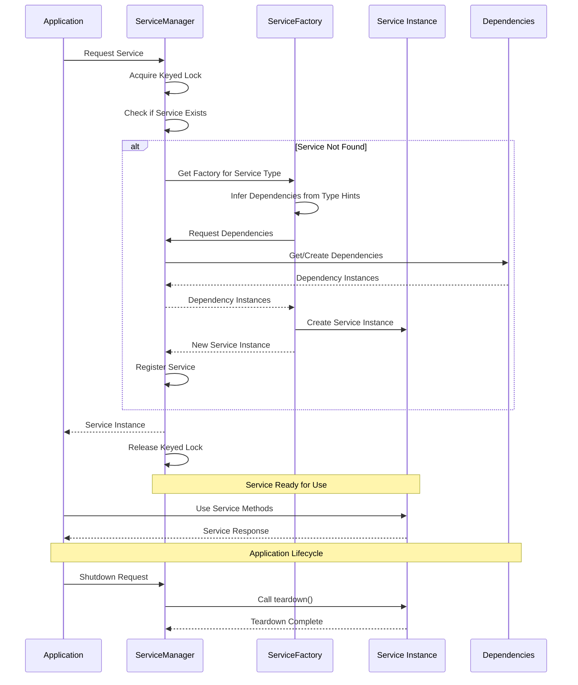
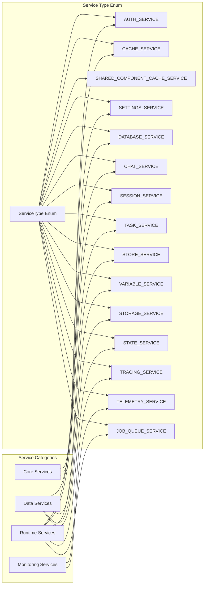
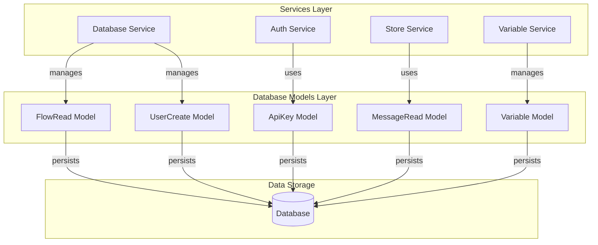
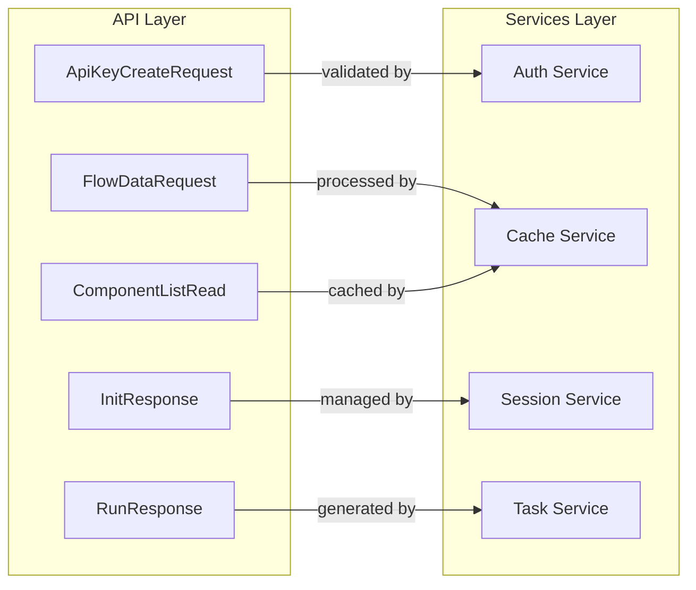
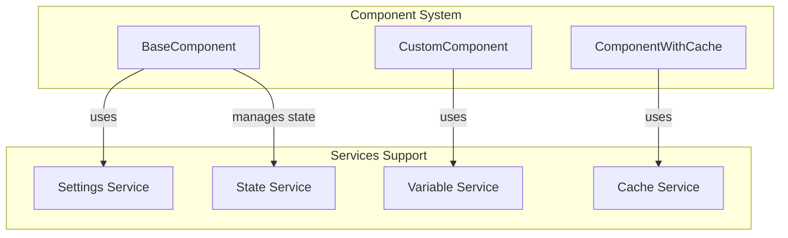
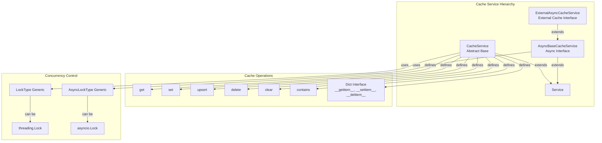
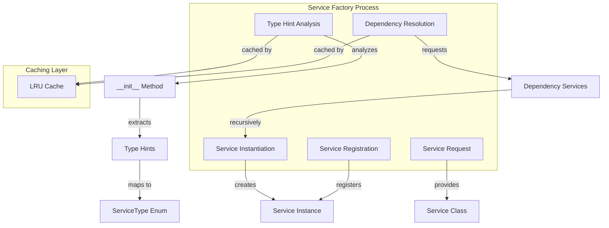

# Services Module Documentation

## Overview

The Services module is the backbone of Langflow's service-oriented architecture, providing a robust foundation for dependency injection, service lifecycle management, and cross-cutting concerns like caching. This module implements a sophisticated service management system that enables loose coupling between components while ensuring reliable service discovery, instantiation, and dependency resolution.

## Architecture

### Core Components

The Services module consists of four fundamental components that work together to provide a comprehensive service management solution:

#### 1. Service Base Class (`Service`)
The abstract base class that defines the contract for all services in the system. It provides:
- Service identification through the `name` attribute
- Lifecycle management with `ready` status tracking
- Schema introspection capabilities for API documentation
- Teardown and readiness management methods

#### 2. Cache Service (`CacheService`)
A specialized service that provides caching capabilities with both synchronous and asynchronous interfaces. It supports:
- Generic lock-based concurrency control
- Standard cache operations (get, set, upsert, delete, clear)
- Python dictionary-like interface (`__getitem__`, `__setitem__`, `__delitem__`)
- Connection status monitoring for external cache implementations

#### 3. Service Factory (`ServiceFactory`)
Implements the factory pattern for service instantiation with intelligent dependency injection. Features include:
- Automatic service type inference from constructor signatures
- Dependency resolution based on type hints
- LRU-cached factory operations for performance
- Dynamic service class loading and registration

#### 4. Enhanced Service Manager (`ServiceManager`)
An enhanced version of the base service manager that extends LFX's service management with Langflow-specific features:
- Automatic factory discovery and registration
- Keyed locking for thread-safe service access
- Dependency injection with automatic service resolution
- Integration with the broader Langflow ecosystem

### Service Architecture Diagram

```mermaid
graph TB
    subgraph "Services Module Architecture"
        Service[Service<br/>Abstract Base Class]
        CacheService[CacheService<br/>Generic Cache Interface]
        ServiceFactory[ServiceFactory<br/>Dependency Injection Factory]
        ServiceManager[ServiceManager<br/>Lifecycle & Discovery]
        
        Service -->|extends| ABC[ABC Abstract Base]
        CacheService -->|extends| Service
        CacheService -->|implements| Generic[Generic Types]
        
        ServiceFactory -->|creates| Service
        ServiceFactory -->|uses| LRU[LRU Cache]
        ServiceFactory -->|infers| Dependencies[Service Dependencies]
        
        ServiceManager -->|extends| BaseManager[LFX ServiceManager]
        ServiceManager -->|manages| ServiceFactory
        ServiceManager -->|provides| KeyedLock[Keyed Locking]
    end
    
    subgraph "Service Types"
        AuthService[Auth Service]
        CacheServiceImpl[Cache Service Impl]
        DatabaseService[Database Service]
        SettingsService[Settings Service]
        ChatService[Chat Service]
        SessionService[Session Service]
        TaskService[Task Service]
        StoreService[Store Service]
        VariableService[Variable Service]
        StorageService[Storage Service]
        StateService[State Service]
        TracingService[Tracing Service]
        TelemetryService[Telemetry Service]
        JobQueueService[Job Queue Service]
    end
    
    ServiceManager -->|registers| AuthService
    ServiceManager -->|registers| CacheServiceImpl
    ServiceManager -->|registers| DatabaseService
    ServiceManager -->|registers| SettingsService
    ServiceManager -->|registers| ChatService
    ServiceManager -->|registers| SessionService
    ServiceManager -->|registers| TaskService
    ServiceManager -->|registers| StoreService
    ServiceManager -->|registers| VariableService
    ServiceManager -->|registers| StorageService
    ServiceManager -->|registers| StateService
    ServiceManager -->|registers| TracingService
    ServiceManager -->|registers| TelemetryService
    ServiceManager -->|registers| JobQueueService
```



## Service Lifecycle and Dependency Flow



## Service Type System

The services module implements a comprehensive type system that defines all available services in the Langflow ecosystem:



### Service Type Definition

The `ServiceType` enum is defined as a string-based enumeration that provides type-safe service identification:

```python
class ServiceType(str, Enum):
    """Enum for the different types of services that can be registered with the service manager."""

    AUTH_SERVICE = "auth_service"
    CACHE_SERVICE = "cache_service"
    SHARED_COMPONENT_CACHE_SERVICE = "shared_component_cache_service"
    SETTINGS_SERVICE = "settings_service"
    DATABASE_SERVICE = "database_service"
    CHAT_SERVICE = "chat_service"
    SESSION_SERVICE = "session_service"
    TASK_SERVICE = "task_service"
    STORE_SERVICE = "store_service"
    VARIABLE_SERVICE = "variable_service"
    STORAGE_SERVICE = "storage_service"
    STATE_SERVICE = "state_service"
    TRACING_SERVICE = "tracing_service"
    TELEMETRY_SERVICE = "telemetry_service"
    JOB_QUEUE_SERVICE = "job_queue_service"
```

This enum serves as the central registry for all service types, ensuring consistent naming and type safety throughout the application.

## Integration with Other Modules

### Database Models Integration
The services module provides the service layer that manages database operations through the [database_models](database_models.md) module:



### API Integration
The services module powers the [core_api](core_api.md) endpoints by providing the business logic layer:



### Component System Integration
Services provide the runtime environment for the [component_system](component_system.md):



## Cache Service Architecture

The cache service provides a sophisticated caching layer with multiple implementations:



## Service Factory and Dependency Injection

The service factory implements intelligent dependency injection based on type hints:



## Key Features and Benefits

### 1. **Loose Coupling**
Services are decoupled from their consumers through abstract interfaces and dependency injection, making the system more maintainable and testable.

### 2. **Lifecycle Management**
Comprehensive service lifecycle management with initialization, readiness tracking, and teardown capabilities ensures proper resource management.

### 3. **Thread Safety**
Keyed locking mechanisms provide thread-safe access to services, preventing race conditions in concurrent environments.

### 4. **Automatic Discovery**
The service manager automatically discovers and registers service factories, reducing configuration overhead.

### 5. **Type Safety**
Strong typing throughout the service system with compile-time dependency validation and runtime type checking.

### 6. **Performance Optimization**
LRU caching of factory operations and dependency resolution ensures optimal performance even with complex service graphs.

### 7. **Extensibility**
The modular design allows for easy addition of new services without modifying existing code, following the open/closed principle.

## Usage Patterns

### Basic Service Registration
```python
# Services are automatically discovered and registered
service_manager = ServiceManager()
# Services are now available through the manager
```

### Service Access
```python
# Get a service by type
auth_service = service_manager.get(ServiceType.AUTH_SERVICE)
cache_service = service_manager.get(ServiceType.CACHE_SERVICE)
```

### Custom Service Implementation
```python
class MyCustomService(Service):
    name = "my_custom_service"
    
    def __init__(self, dependency_service: AnotherService):
        self.dependency = dependency_service
        self.ready = True
    
    async def teardown(self):
        # Cleanup resources
        pass
```

## Error Handling and Resilience

The services module implements comprehensive error handling:

- **Service Discovery Errors**: Graceful handling of missing service factories
- **Dependency Resolution Errors**: Clear error messages for circular dependencies or missing services
- **Runtime Errors**: Proper exception propagation with context information
- **Teardown Errors**: Ensuring cleanup even when errors occur

## Monitoring and Observability

Services provide built-in monitoring capabilities:

- **Service Health**: Ready status tracking for health checks
- **Schema Introspection**: Runtime service capability discovery
- **Performance Metrics**: Caching and factory operation metrics
- **Dependency Graph**: Service relationship visualization

This comprehensive service architecture forms the foundation of Langflow's modular, scalable, and maintainable system design, enabling complex workflows while maintaining simplicity and reliability.