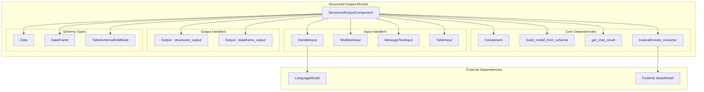
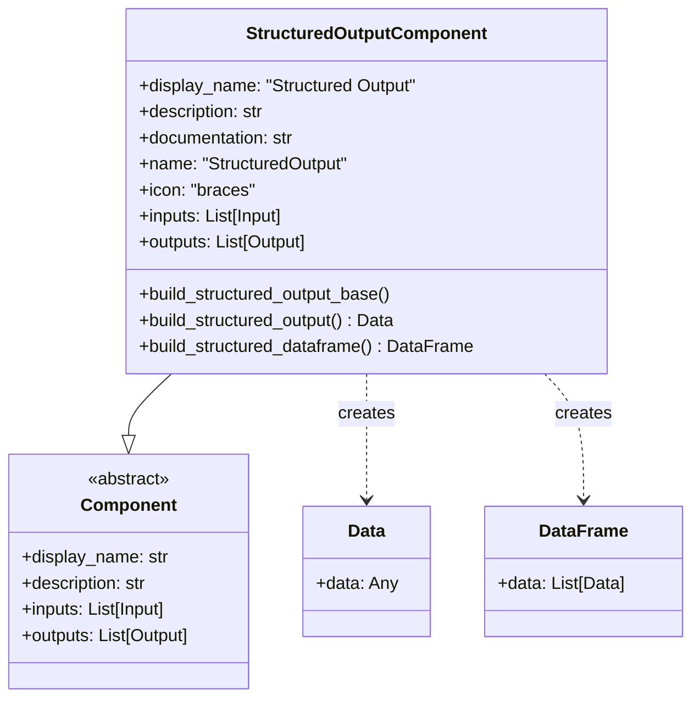
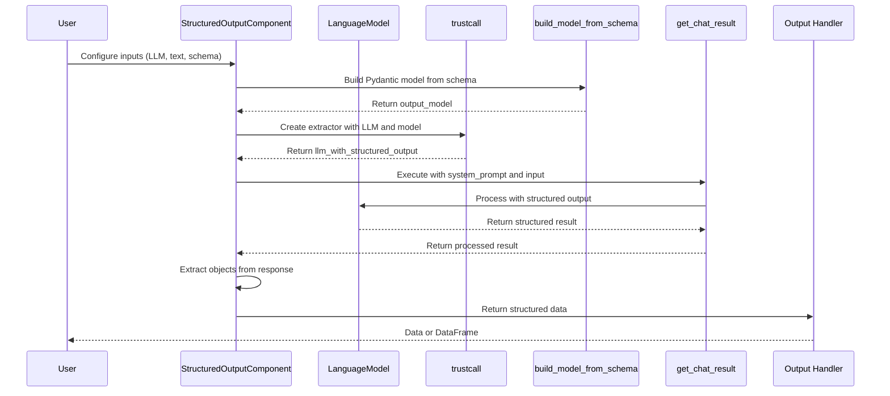
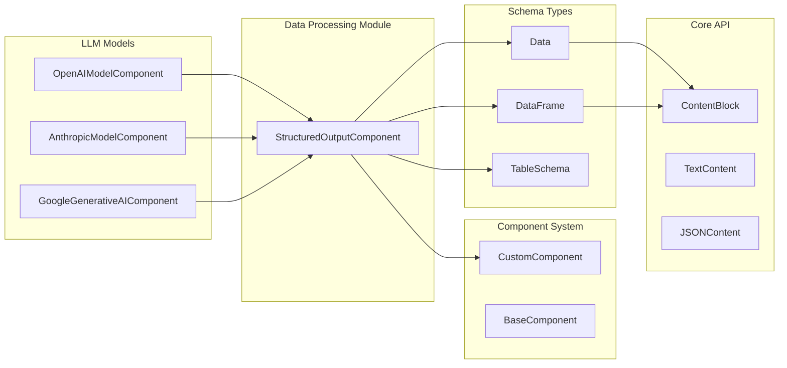

# Structured Output Module

## Introduction

The Structured Output module provides a powerful component for extracting structured data from unstructured text using Language Models (LLMs). This module is essential for applications that need to convert free-form text into well-defined, typed data structures, making it a cornerstone of data processing workflows in Langflow.

## Architecture Overview

The Structured Output module is built around the `StructuredOutputComponent`, which leverages LLMs with structured output capabilities to extract and format data according to user-defined schemas. The module integrates with the broader Langflow ecosystem through its dependencies on custom components, schema definitions, and LLM integrations.



## Component Structure

### StructuredOutputComponent

The `StructuredOutputComponent` is the main component that orchestrates the structured output generation process. It provides a user-friendly interface for defining schemas and extracting structured data from text inputs.



## Data Flow

The structured output generation follows a well-defined flow from input processing to structured data extraction:



## Input Configuration

The component provides several input types for flexible configuration:

### Required Inputs

1. **Language Model** (`llm`): The LLM component that supports structured output
2. **Input Message** (`input_value`): The unstructured text to process
3. **Output Schema** (`output_schema`): Table-based schema definition

### Optional Inputs

1. **Format Instructions** (`system_prompt`): Custom instructions for the LLM
2. **Schema Name** (`schema_name`): Name for the output data schema

### Schema Definition

The output schema is defined using a table structure with the following fields:

| Field | Type | Description | Options |
|-------|------|-------------|---------|
| name | str | Field name | - |
| description | str | Field description | - |
| type | str | Data type | str, int, float, bool, dict |
| multiple | boolean | Whether field should be a list | True/False |

## Output Types

The component provides two output methods:

### 1. Structured Output (`build_structured_output`)
- Returns a `Data` object containing the structured data
- Single result: Wrapped in `Data(data=result)`
- Multiple results: Wrapped in `Data(data={"results": output})`

### 2. DataFrame Output (`build_structured_dataframe`)
- Returns a `DataFrame` object for tabular data processing
- Converts structured output to a list of `Data` objects
- Suitable for downstream data processing components

## Integration with Langflow Ecosystem

The Structured Output module integrates with several other Langflow modules:



## Error Handling

The component implements comprehensive error handling for various scenarios:

1. **LLM Compatibility**: Checks if the provided LLM supports structured output
2. **Schema Validation**: Ensures output schema is not empty
3. **Response Processing**: Handles unexpected response formats gracefully
4. **Empty Results**: Validates that structured output contains data

## Usage Patterns

### Basic Extraction
```python
# Configure LLM and input text
structured_output.configure(llm=gpt4, input_value="Extract names and ages from: John is 25, Jane is 30")

# Define schema
schema = [
    {"name": "name", "type": "str", "description": "Person's name"},
    {"name": "age", "type": "int", "description": "Person's age"}
]

# Execute extraction
result = structured_output.build_structured_output()
```

### Advanced Configuration
```python
# Custom system prompt for specialized extraction
structured_output.system_prompt = "Extract product information including price and availability"

# Multiple output handling
result = structured_output.build_structured_dataframe()
```

## Dependencies

The Structured Output module depends on several key components:

- **[Component System](component_system.md)**: Base component infrastructure
- **[Schema Types](schema_types.md)**: Data and DataFrame schema definitions
- **[LLM Models](llm_models.md)**: Language model integrations
- **[Data Processing](data_processing.md)**: Related processing components

## Performance Considerations

1. **Model Selection**: Use LLMs optimized for structured output
2. **Schema Complexity**: Simpler schemas yield better performance
3. **Batch Processing**: Consider DataFrame output for multiple results
4. **Caching**: Leverage component caching for repeated extractions

## Best Practices

1. **Schema Design**: Define clear, specific field descriptions
2. **Input Preparation**: Pre-process text for better extraction accuracy
3. **Error Handling**: Implement fallback strategies for extraction failures
4. **Validation**: Validate extracted data against expected formats
5. **Documentation**: Document schema purposes and expected outputs

## Future Enhancements

Potential improvements for the Structured Output module:

1. **Multi-format Support**: Support for XML, YAML output formats
2. **Validation Rules**: Built-in data validation and transformation
3. **Template Library**: Pre-defined schemas for common use cases
4. **Performance Metrics**: Extraction accuracy and performance monitoring
5. **Advanced Filtering**: Conditional extraction based on content analysis