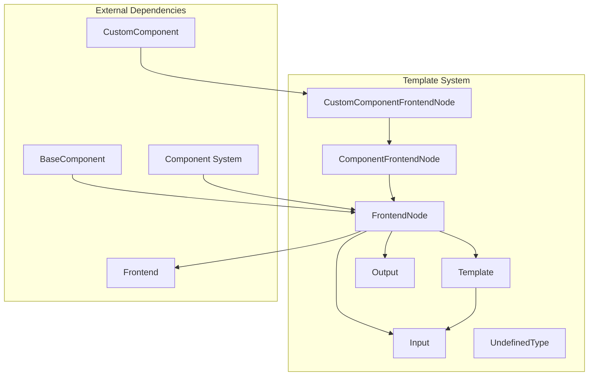
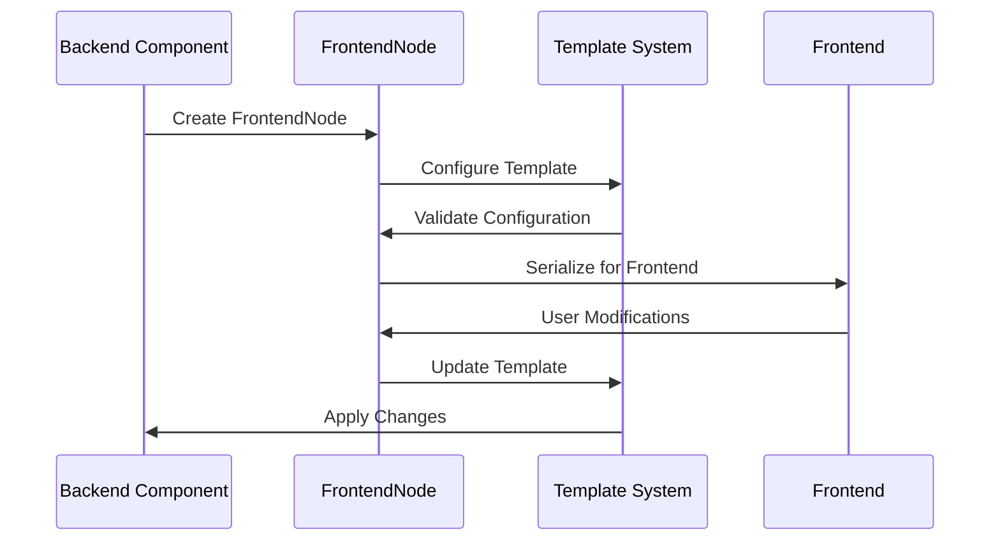

# Template System Module Documentation

## Overview

The template_system module is a core component of the Langflow platform that manages the frontend representation and configuration of components. It provides the bridge between backend component logic and frontend visualization, handling template definitions, field configurations, and component metadata.

## Purpose

The template system serves as the central hub for:
- **Component Template Management**: Defining how components appear and behave in the frontend
- **Field Configuration**: Managing input/output field definitions, types, and validation
- **Frontend Node Representation**: Creating structured representations of components for the UI
- **Custom Component Support**: Enabling dynamic creation and configuration of custom components

## Architecture



## Core Components

### 1. FrontendNode System
The frontend node system provides the foundation for component representation:
- **FrontendNode**: Base class for all frontend component representations ([details](frontend_node.md))
- **ComponentFrontendNode**: Specialized for standard components
- **CustomComponentFrontendNode**: Dedicated for custom components

See [Frontend Node Documentation](frontend_node.md) for detailed information about component representation, validation, and serialization.

### 2. Field System
The field system manages input/output definitions and configurations ([details](field_system.md)):
- **Input**: Comprehensive field definition with validation and UI configuration
- **Output**: Output specification with type information
- **UndefinedType**: Special handling for undefined values

See [Field System Documentation](field_system.md) for detailed field configuration options and validation rules.

## Key Features

### Template Management
- Dynamic template creation and modification
- Field ordering and organization
- Conditional field display
- Real-time template validation

### Component Validation
- Name overlap detection between inputs and outputs
- Reserved attribute protection
- Type validation and conversion
- Custom validation rules

### Frontend Integration
- Structured serialization for frontend consumption
- Icon and display name management
- Documentation integration
- Metadata preservation

## Data Flow



## Integration with Other Modules

### Component System Integration
The template system works closely with the [component_system](component_system.md) to:
- Provide frontend representation for backend components
- Handle custom component creation and configuration
- Manage component lifecycle and validation

### Graph System Integration
Integrates with the [graph_system](graph_system.md) to:
- Define node properties and behavior
- Handle input/output connections
- Manage node metadata and configuration

### Schema Types Integration
Uses [schema_types](schema_types.md) for:
- Content type definitions
- Data structure validation
- Log and output formatting

## Usage Patterns

### Basic Component Template
```python
frontend_node = FrontendNode(
    template=Template(fields=[...]),
    name="MyComponent",
    display_name="My Component",
    description="A custom component",
    icon="custom-icon"
)
```

### Custom Component Creation
```python
custom_node = CustomComponentFrontendNode(
    template=Template(fields=[
        Input(field_type="code", name="implementation", required=True)
    ])
)
```

## Configuration Options

### FrontendNode Properties
- **template**: Core template configuration
- **base_classes**: Component inheritance hierarchy
- **output_types**: Supported output types
- **field_order**: UI field ordering
- **metadata**: Additional component metadata

### Input Field Configuration
- **field_type**: Data type and UI representation
- **required**: Field requirement status
- **options**: Dropdown or selection options
- **advanced**: Advanced field visibility
- **dynamic**: Dynamic field behavior

### Output Configuration
- **types**: Supported output types
- **selected**: Default selected type
- **hidden**: Output visibility
- **allows_loop**: Loop capability
- **tool_mode**: Tool integration

## Error Handling

The template system implements comprehensive validation:
- Input/output name conflicts
- Reserved attribute usage
- Type validation and conversion
- Template structure validation
- Custom component code validation

## Performance Considerations

- **Caching**: Template configurations are cached for performance
- **Lazy Loading**: Field validation occurs on-demand
- **Serialization**: Optimized serialization for frontend transfer
- **Memory Management**: Efficient handling of large component libraries

## Future Enhancements

- Enhanced field type system
- Improved custom component IDE integration
- Advanced validation rules
- Template versioning and migration
- Performance optimization for large graphs