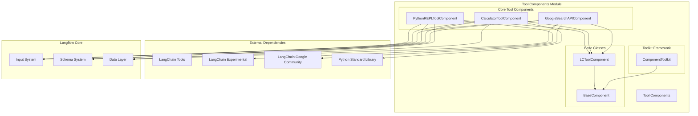
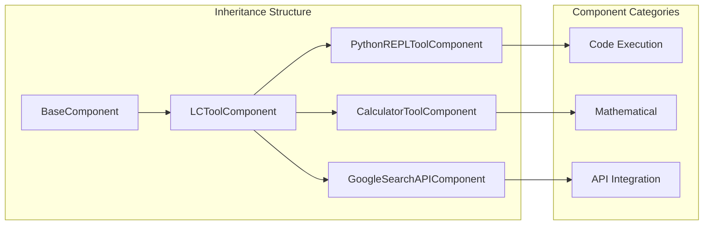
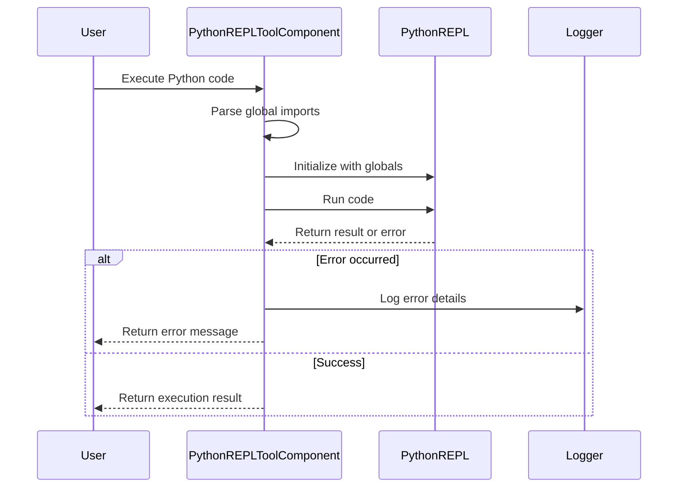
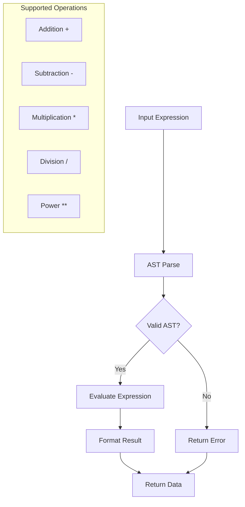
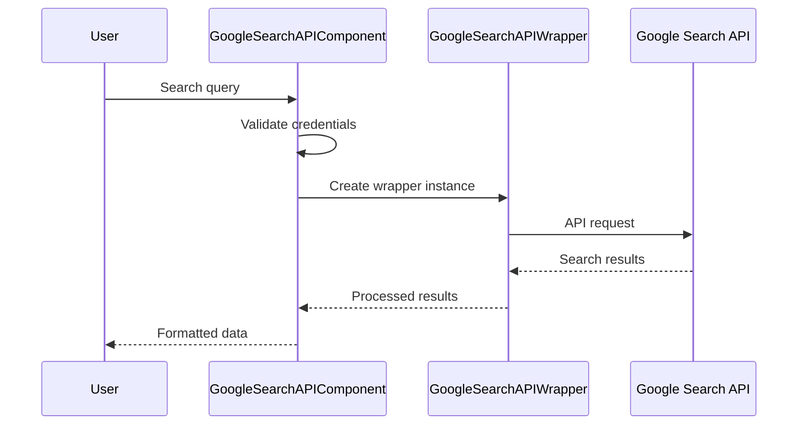
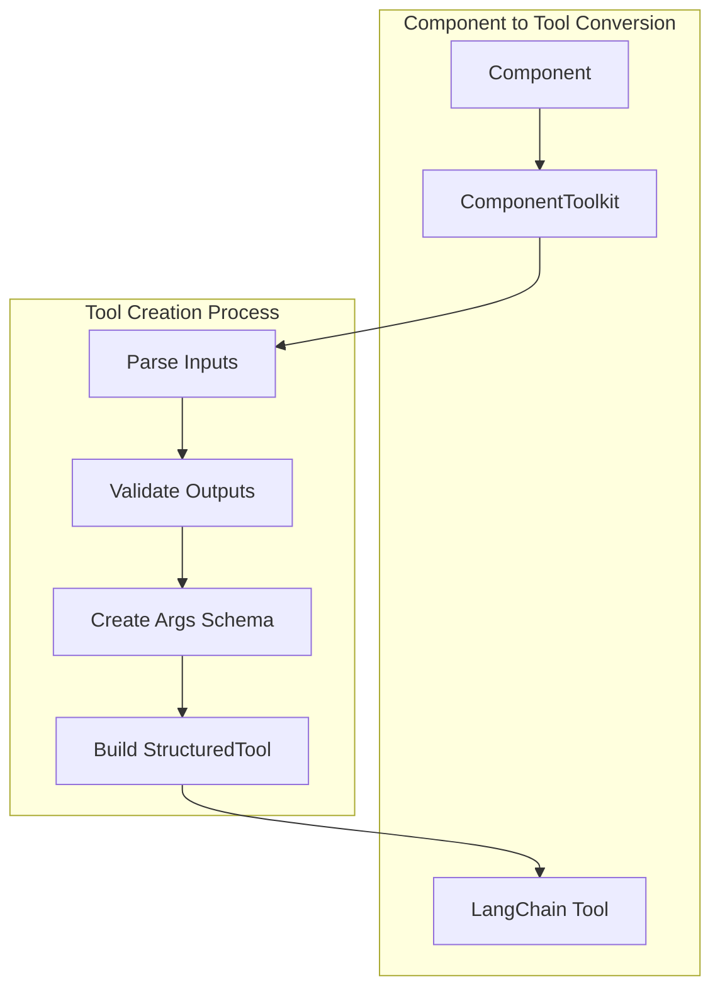
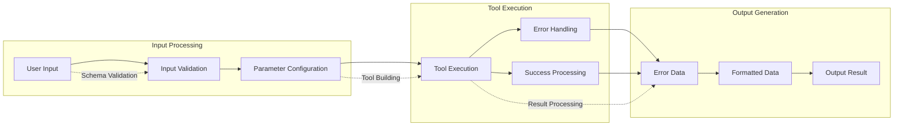
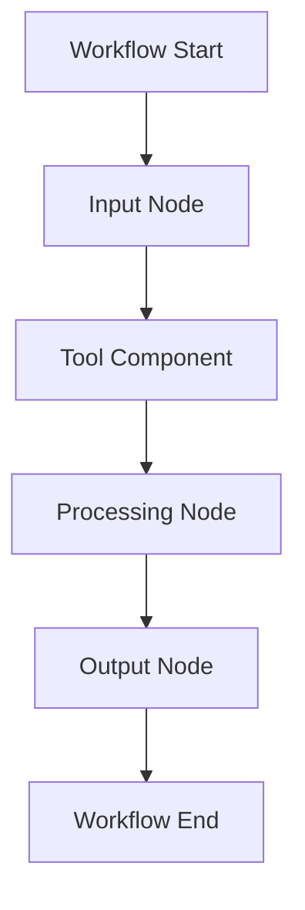
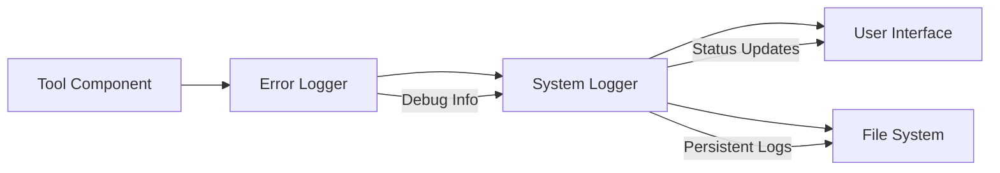

# Tool Components Module Documentation

## Introduction

The tool_components module provides a comprehensive suite of tool components that enable Langflow to integrate with external services and perform specialized operations. These components serve as the bridge between Langflow's workflow system and various external APIs, utilities, and computational services. The module includes deprecated but functional tools for Python code execution, mathematical calculations, and Google Search API integration.

## Module Architecture



## Component Hierarchy and Relationships



## Core Components

### PythonREPLToolComponent

**Purpose**: Provides a Python code execution environment within Langflow workflows.

**Key Features**:
- Safe Python code execution in a sandboxed REPL environment
- Global imports management for commonly used modules
- Error handling and logging integration
- Tool schema validation

**Architecture**:


**Configuration Options**:
- Tool name and description customization
- Global imports specification (e.g., "math,numpy,pandas")
- Code input with validation

**Security Considerations**:
- Uses LangChain's PythonREPL utility for sandboxed execution
- Limited to basic Python operations
- No file system access or network operations

### CalculatorToolComponent

**Purpose**: Provides mathematical expression evaluation capabilities.

**Key Features**:
- Arithmetic expression parsing and evaluation
- Support for basic operations: +, -, *, /, **
- AST-based expression parsing for security
- Error handling for invalid expressions and division by zero

**Expression Processing Flow**:


**Limitations**:
- No function calls (sqrt, sin, cos, etc.)
- Basic arithmetic operations only
- String-based expression input

### GoogleSearchAPIComponent

**Purpose**: Integrates Google Search API for web search functionality.

**Key Features**:
- Google Custom Search API integration
- Configurable number of results
- API key and CSE ID management
- Result processing and formatting

**API Integration Flow**:


**Configuration Requirements**:
- Google API Key (required)
- Google CSE ID (required)
- Number of results (default: 4)

## Toolkit Framework Integration

The ComponentToolkit provides the framework for converting components into LangChain tools:



**Key Features**:
- Automatic tool generation from component outputs
- Input schema creation based on tool_mode inputs
- Async and sync tool support
- Metadata management for tool customization

## Data Flow Architecture



## Integration with Langflow Ecosystem

### Component System Integration
The tool components integrate with Langflow's component system through inheritance from [BaseComponent](component_system.md) and [LCToolComponent](llm_models.md).

### Graph System Integration
Tools can be used as vertices in the [graph system](graph_system.md), allowing them to be connected in complex workflows.

### Service Layer Integration
Tool components can leverage [services](services.md) for caching, configuration, and other system-level functionality.

## Usage Patterns

### 1. Direct Tool Usage
Components can be used directly as tools within Langflow workflows:

```python
# Example: Using CalculatorToolComponent
calculator = CalculatorToolComponent()
calculator.expression = "4 * 4 * (33 / 22) + 12 - 20"
result = calculator.run_model()
```

### 2. Tool Building for Agents
Components can be converted to LangChain tools for use with AI agents:

```python
# Example: Building a tool from component
tool = component.build_tool()
# Use tool with LangChain agent
```

### 3. Workflow Integration
Tools can be integrated into larger workflows through the graph system:



## Error Handling and Logging

### Error Categories
1. **Input Validation Errors**: Invalid parameters, missing required fields
2. **Execution Errors**: Runtime exceptions during tool execution
3. **API Errors**: External service failures (e.g., Google Search API)
4. **Security Errors**: Unauthorized operations or invalid expressions

### Logging Integration
All tool components integrate with Langflow's logging system for debugging and monitoring:



## Security Considerations

### Code Execution Safety
- PythonREPLToolComponent uses sandboxed execution environment
- Limited import capabilities
- No file system or network access

### API Security
- Secure credential handling for external APIs
- Input validation and sanitization
- Rate limiting considerations

### Expression Security
- CalculatorToolComponent uses AST parsing to prevent code injection
- Limited to arithmetic operations only
- No function call support

## Migration and Deprecation

**Note**: All tool components in this module are marked as deprecated (`legacy = True`). Users should consider migrating to newer alternatives or custom implementations.

### Migration Recommendations
1. **PythonREPLToolComponent**: Consider using custom Python execution components with enhanced security
2. **CalculatorToolComponent**: Implement mathematical operations using expression evaluation libraries
3. **GoogleSearchAPIComponent**: Use updated Google Search integrations with current API versions

## Dependencies

### External Dependencies
- **langchain**: Core tool framework
- **langchain-experimental**: Python REPL utilities
- **langchain-google-community**: Google Search API wrapper
- **pydantic**: Schema validation

### Internal Dependencies
- [BaseComponent](component_system.md): Core component functionality
- [LCToolComponent](llm_models.md): LangChain tool integration
- [Input System](core_api.md): User input handling
- [Schema System](schema_types.md): Data validation and formatting

## Testing and Quality Assurance

### Test Coverage
- Unit tests for individual tool components
- Integration tests with external services
- Error handling validation
- Security testing for code execution

### Performance Considerations
- Tool execution timeout handling
- Resource usage monitoring
- API rate limiting compliance
- Memory management for large operations

## Future Enhancements

### Planned Improvements
1. **Security Enhancements**: Improved sandboxing for code execution
2. **Performance Optimization**: Caching mechanisms for frequently used tools
3. **Extended API Support**: Integration with additional external services
4. **Custom Tool Builder**: Framework for user-defined tool components

### API Evolution
- Migration to non-deprecated implementations
- Enhanced error reporting and debugging
- Improved configuration management
- Better integration with modern LangChain features