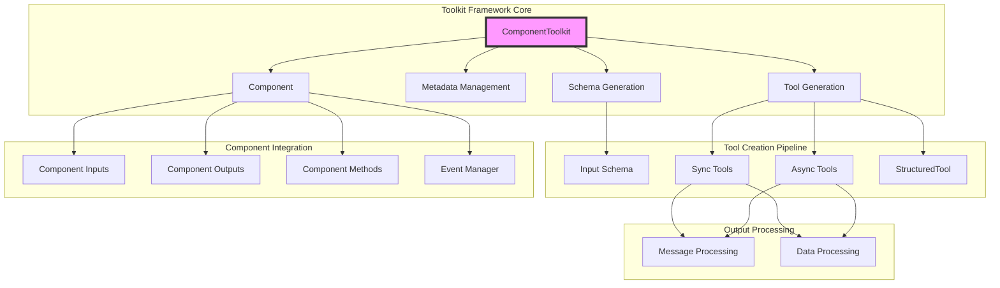
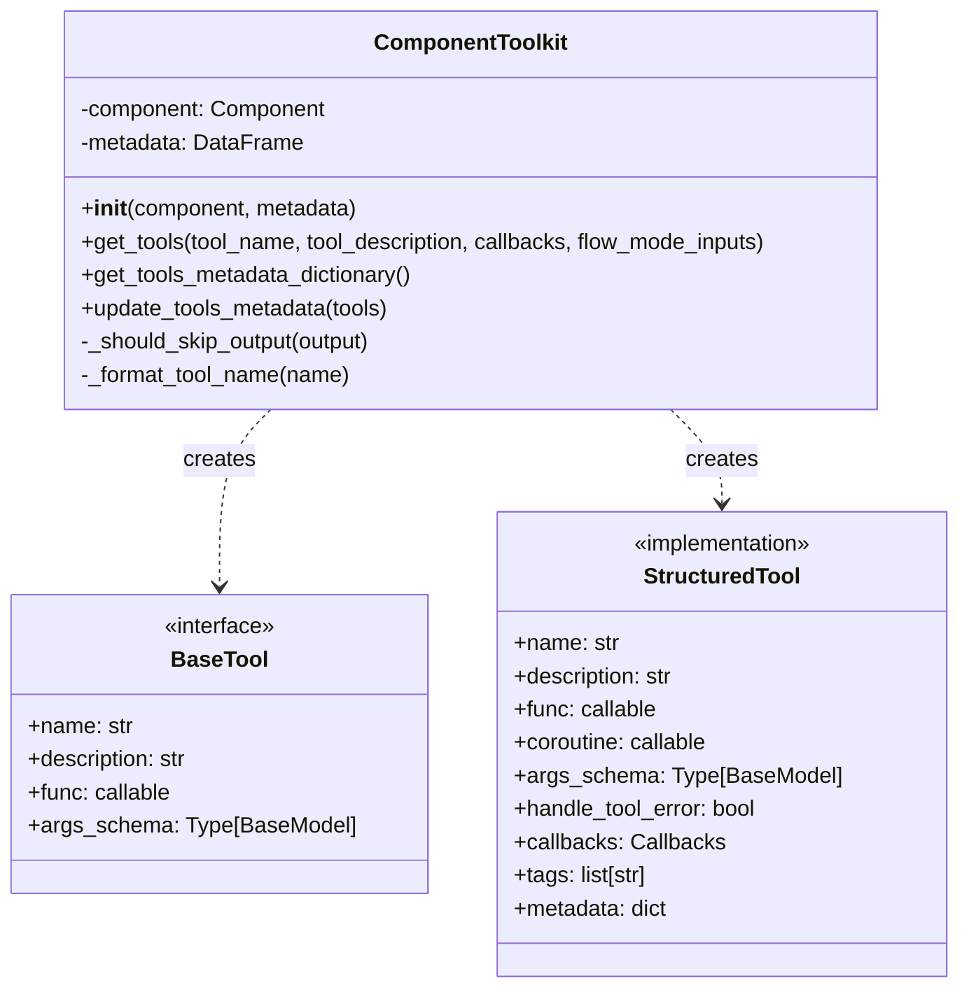
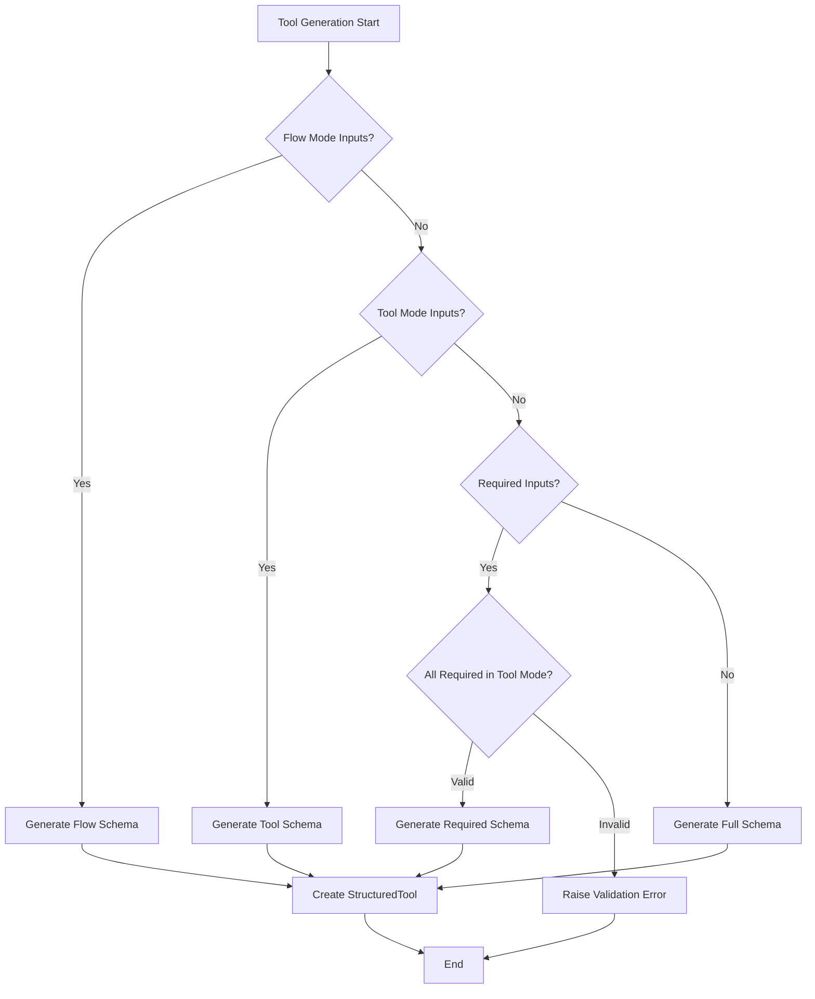
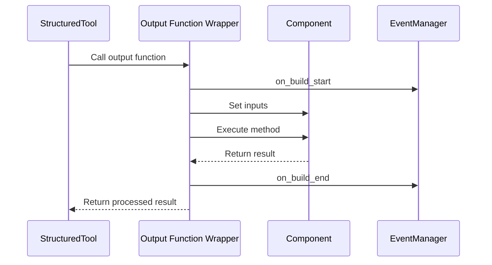
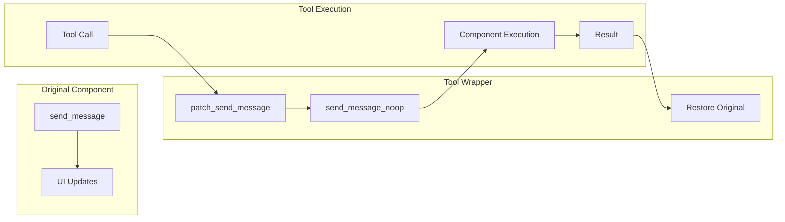
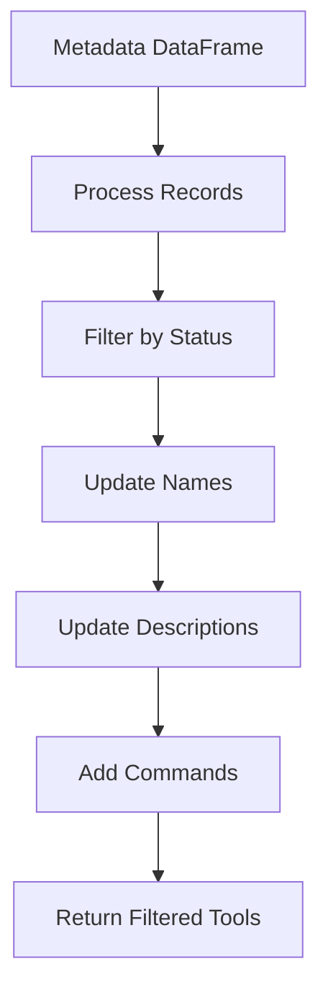

# Toolkit Framework Module Documentation

## Introduction

The Toolkit Framework module provides a sophisticated system for converting Langflow components into LangChain-compatible tools. This module serves as a bridge between the component system and the tools ecosystem, enabling components to be used as callable tools within agent workflows. It handles the complex transformation of component inputs, outputs, and methods into structured tools that can be seamlessly integrated with LangChain's tool framework.

## Architecture Overview

The Toolkit Framework is built around the `ComponentToolkit` class, which encapsulates the logic for converting components into tools. The architecture follows a modular design pattern that separates concerns between tool creation, input schema generation, and output processing.



## Core Components

### ComponentToolkit Class

The `ComponentToolkit` class is the central component of this module, responsible for transforming Langflow components into LangChain tools. It provides methods for tool generation, metadata management, and tool customization.

**Key Responsibilities:**
- Convert component outputs into callable tools
- Generate appropriate input schemas based on component configuration
- Handle both synchronous and asynchronous component methods
- Manage tool metadata and filtering
- Integrate with event management systems



## Tool Generation Process

### Input Schema Generation

The toolkit dynamically generates input schemas based on component configuration:

1. **Tool Mode Inputs**: When components have inputs marked for tool mode
2. **Flow Mode Inputs**: For dynamic input configuration during flow execution
3. **Required Inputs**: Based on component output requirements
4. **Full Component Inputs**: Default schema generation



### Output Processing

The toolkit handles various output types from components:

- **Message Objects**: Extracts text content using `get_text()` method
- **Data Objects**: Returns the underlying data structure
- **Other Types**: Serializes using the serialization system

### Event Integration

Tools integrate with the event management system to provide build lifecycle notifications:



## Message Handling and UI Integration

### Send Message Patching

The toolkit implements a sophisticated message handling system that prevents UI message duplication when components are used as tools:



The patching system ensures that:
- Components used as tools don't send messages to the UI
- Only the calling component controls UI updates
- Message handling is properly restored after tool execution
- Both synchronous and asynchronous methods are supported

## Metadata Management

### Tool Filtering and Customization

The toolkit supports advanced metadata management for tool filtering and customization:

- **Status-based Filtering**: Tools can be enabled/disabled via metadata
- **Dynamic Naming**: Tool names can be overridden through metadata
- **Description Enhancement**: Tool descriptions can be modified and enhanced
- **Command Integration**: Special commands can be added to tool descriptions



## Integration with Other Modules

### Component System Integration

The Toolkit Framework deeply integrates with the [component_system](component_system.md) module:

- **BaseComponent**: Inherits component structure and behavior
- **CustomComponent**: Handles custom component tool conversion
- **ComponentWithCache**: Manages caching in tool context

### Graph System Integration

Tools integrate with the [graph_system](graph_system.md) for workflow execution:

- **Vertex**: Components as graph vertices can be converted to tools
- **NodeData**: Tool inputs/outputs align with node data structures
- **GraphData**: Tool execution within graph contexts

### Service Integration

The framework leverages [services](services.md) for:

- **CacheService**: Tool result caching
- **ServiceManager**: Tool lifecycle management
- **ServiceFactory**: Tool instance creation

## Error Handling and Validation

### Tool Creation Validation

The toolkit implements comprehensive validation during tool creation:

- **Input Validation**: Ensures all required inputs are in tool mode
- **Method Validation**: Verifies output methods exist and are callable
- **Schema Validation**: Validates generated input schemas
- **Error Propagation**: Properly handles and propagates component errors

### Runtime Error Handling

Tools include robust error handling mechanisms:

```python
# Error handling in tool execution
try:
    # Component execution with event management
    result = output_method()
except Exception as e:
    # Convert to ToolException for LangChain compatibility
    raise ToolException(e) from e
```

## Usage Patterns

### Basic Tool Creation

```python
# Create toolkit from component
toolkit = ComponentToolkit(component)

# Generate tools from component outputs
tools = toolkit.get_tools()
```

### Custom Tool Configuration

```python
# Create tool with custom name and description
tools = toolkit.get_tools(
    tool_name="custom_tool_name",
    tool_description="Custom tool description"
)
```

### Metadata-driven Tool Management

```python
# Create toolkit with metadata
toolkit = ComponentToolkit(component, metadata=df)

# Generate filtered and customized tools
tools = toolkit.get_tools()
customized_tools = toolkit.update_tools_metadata(tools)
```

## Best Practices

### Tool Mode Configuration

- Enable tool mode only for inputs that should be exposed to tool users
- Ensure required inputs are properly configured in tool mode
- Use meaningful input names and descriptions

### Output Design

- Design component outputs to return serializable data
- Use Message objects for text-based tool responses
- Consider Data objects for structured output

### Error Handling

- Implement proper error handling in component methods
- Use meaningful error messages for tool users
- Test tools in both sync and async contexts

### Performance Optimization

- Leverage caching through ComponentWithCache when appropriate
- Consider event manager integration for build lifecycle tracking
- Use metadata for efficient tool filtering and customization

## Dependencies

The Toolkit Framework module depends on several key components:

- **LangChain Core**: For BaseTool and StructuredTool implementations
- **Pandas**: For metadata management and processing
- **Component System**: For component structure and behavior
- **Serialization System**: For result serialization
- **Event Management**: For build lifecycle integration

## Future Enhancements

Potential areas for future development include:

- **Advanced Schema Generation**: More sophisticated input schema creation
- **Tool Composition**: Ability to combine multiple tools
- **Caching Optimization**: Enhanced caching strategies for tool results
- **Performance Monitoring**: Built-in performance tracking for tool execution
- **Tool Versioning**: Support for tool version management and migration