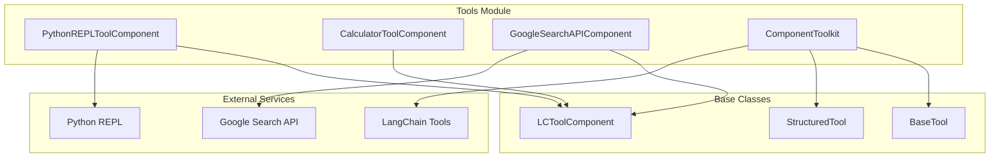
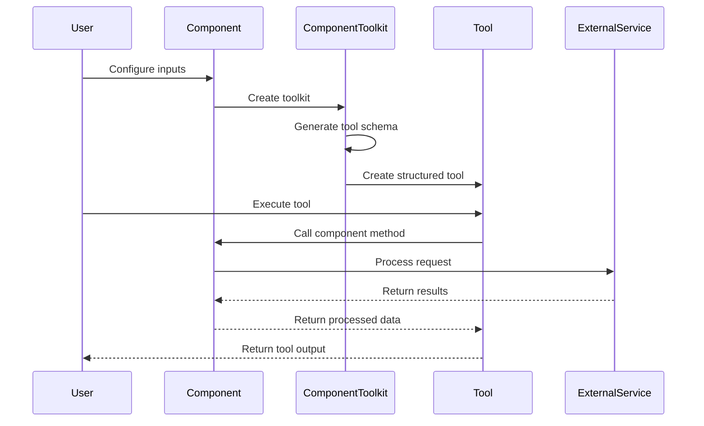

# Tools Module Documentation

## Overview

The Tools module provides a comprehensive framework for integrating various utility tools and external services into the Langflow system. It enables users to extend functionality through Python code execution, mathematical calculations, web search capabilities, and custom component-based tools.

## Architecture



## Core Components

### 1. PythonREPLToolComponent
A deprecated but functional tool for executing Python code in a REPL environment. Supports global imports and provides a sandboxed execution environment.

**Key Features:**
- Dynamic module importing
- Sandboxed Python execution
- Error handling and logging
- Global namespace management

*Detailed documentation: [Tool Components](tool_components.md)*

### 2. CalculatorToolComponent
A deprecated arithmetic expression evaluator that safely parses and computes mathematical expressions.

**Key Features:**
- Safe expression parsing using AST
- Support for basic arithmetic operations (+, -, *, /, **)
- Error handling for invalid expressions and division by zero
- Formatted result output

*Detailed documentation: [Tool Components](tool_components.md)*

### 3. GoogleSearchAPIComponent
A deprecated tool for integrating Google Search API functionality.

**Key Features:**
- Google Custom Search API integration
- Configurable result count
- API key management
- Search result processing

*Detailed documentation: [Tool Components](tool_components.md)*

### 4. ComponentToolkit
The core framework for converting Langflow components into LangChain tools.

**Key Features:**
- Dynamic tool creation from components
- Input schema generation
- Async and sync tool support
- Tool metadata management
- Message handling and UI integration

*Detailed documentation: [Toolkit Framework](toolkit_framework.md)*

## Data Flow



## Integration with Other Modules

### Component System Integration
The tools module heavily relies on the component system for base functionality:
- Inherits from `LCToolComponent` which extends the base component system
- Utilizes component lifecycle management
- Integrates with the field typing system

### Schema and Data Handling
Tools work with schema types for data serialization:
- Uses `Data` objects for structured output
- Integrates with content block system
- Supports message passing between components

### Service Integration
Tools can interact with services for:
- Event management during tool execution
- Caching mechanisms
- Service factory patterns

## Usage Patterns

### 1. Direct Tool Usage
Components can be used directly as tools by calling their `build_tool()` method:

```python
tool = component.build_tool()
result = tool.run(input_data)
```

### 2. ComponentToolkit Usage
For more complex scenarios, use ComponentToolkit to create multiple tools from a component:

```python
toolkit = ComponentToolkit(component)
tools = toolkit.get_tools()
```

### 3. Tool Mode Configuration
Components can be configured with tool mode inputs for dynamic parameter binding:

```python
# Configure inputs for tool mode
input.tool_mode = True
# Tool will accept these as parameters at runtime
```

## Error Handling

The tools module implements comprehensive error handling:

- **ToolException**: Standardized error reporting for tool failures
- **Validation Errors**: Input validation and schema compliance
- **Import Errors**: Graceful handling of missing dependencies
- **Execution Errors**: Safe execution with proper error propagation

## Security Considerations

### Python REPL Security
- Sandboxed execution environment
- Controlled global namespace
- Import validation and error handling

### API Key Management
- Secure storage and handling of API credentials
- Environment variable support
- Secret string input types

### Tool Access Control
- Tool mode flags for controlling tool availability
- Metadata-based tool filtering
- Callback support for monitoring tool usage

## Migration Notes

Several components in this module are marked as deprecated (`legacy = True`):
- PythonREPLToolComponent
- CalculatorToolComponent  
- GoogleSearchAPIComponent

These components are maintained for backward compatibility but should be migrated to newer implementations when possible.

## Best Practices

1. **Tool Design**: Design tools with clear, focused functionality
2. **Error Handling**: Implement proper error handling and user feedback
3. **Input Validation**: Use proper input types and validation
4. **Documentation**: Provide clear descriptions and usage examples
5. **Testing**: Test tools in isolation and within workflows
6. **Security**: Consider security implications of tool execution
7. **Performance**: Optimize for performance, especially for frequently used tools

## Future Enhancements

- Enhanced security sandboxing for code execution
- More sophisticated tool composition and chaining
- Advanced tool metadata and discovery mechanisms
- Integration with external tool repositories
- Enhanced monitoring and analytics for tool usage