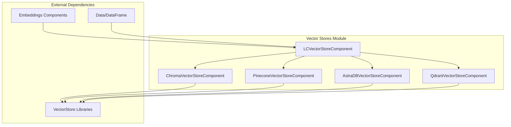
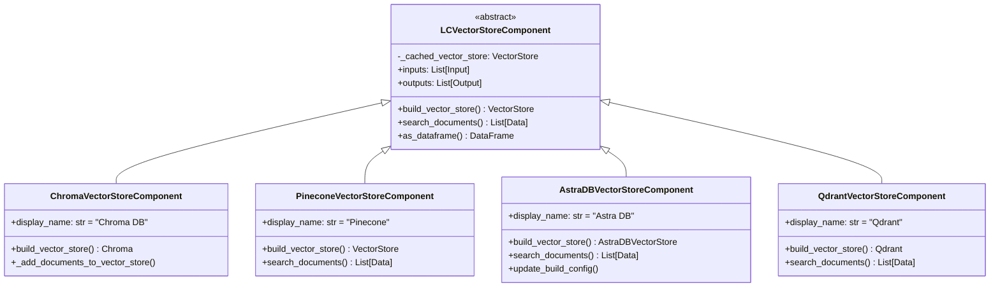
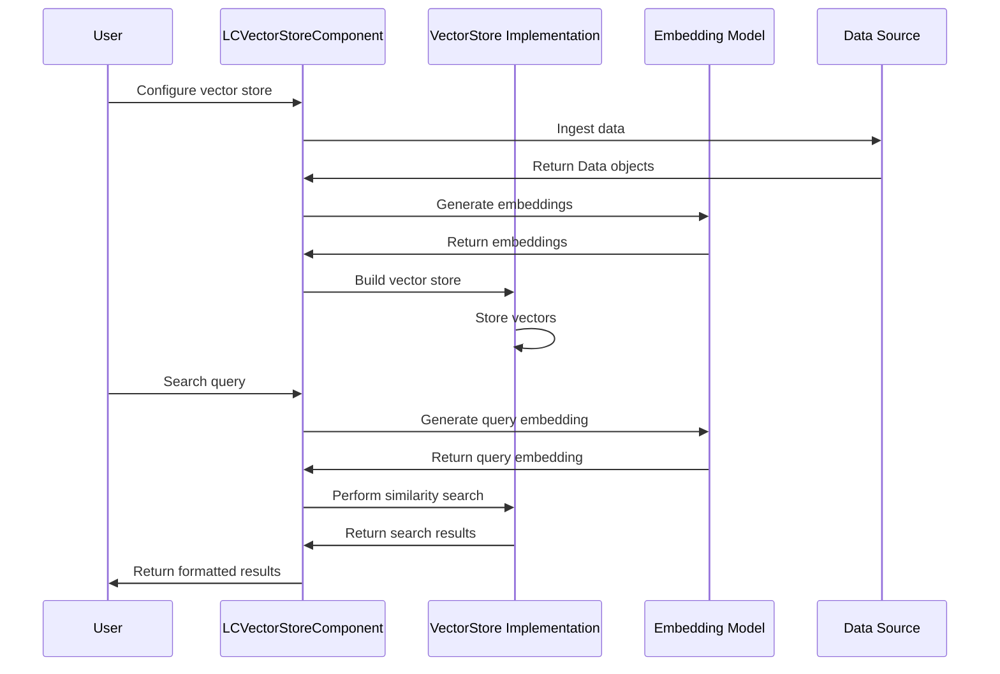

# Vector Stores Module Documentation

## Overview

The Vector Stores module provides a comprehensive framework for integrating various vector database systems into Langflow. This module enables efficient storage, indexing, and retrieval of vector embeddings, supporting semantic search capabilities across multiple vector database providers.

## Purpose

The Vector Stores module serves as a unified interface for:
- **Vector Storage**: Storing document embeddings in various vector databases
- **Semantic Search**: Performing similarity searches across different vector store implementations
- **Multi-Provider Support**: Integrating with popular vector databases including Chroma, Pinecone, AstraDB, and Qdrant
- **Data Ingestion**: Processing and ingesting various data formats into vector stores
- **Hybrid Search**: Supporting both vector and hybrid search methodologies

## Architecture

## Core Components

### Base Architecture

The module follows a hierarchical design pattern with `LCVectorStoreComponent` as the abstract base class that defines the common interface for all vector store implementations.

## Sub-modules

### 1. [Chroma Vector Store](chroma_vectorstore.md)
- **Purpose**: Local and server-based vector storage with persistence capabilities
- **Key Features**: Collection management, duplicate handling, server/client modes
- **Use Cases**: Development environments, local prototyping, small to medium datasets

### 2. [Pinecone Vector Store](pinecone_vectorstore.md)
- **Purpose**: Cloud-native vector database with high-performance search
- **Key Features**: Namespace support, distance strategies, managed infrastructure
- **Use Cases**: Production deployments, large-scale applications, enterprise solutions

### 3. [AstraDB Vector Store](astradb_vectorstore.md)
- **Purpose**: Enterprise-grade vector database with hybrid search capabilities
- **Key Features**: Database/collection management, hybrid search, reranking, cloud providers
- **Use Cases**: Enterprise applications, hybrid search requirements, multi-cloud deployments

### 4. [Qdrant Vector Store](qdrant_vectorstore.md)
- **Purpose**: High-performance vector search engine with filtering capabilities
- **Key Features**: gRPC support, multiple distance functions, payload filtering
- **Use Cases**: Real-time applications, high-throughput scenarios, complex filtering requirements

### 5. [Base Vector Store](base_vectorstore.md)
- **Purpose**: Abstract base class defining the common interface for all vector store implementations
- **Key Features**: Caching mechanism, search functionality, data preparation, validation
- **Use Cases**: Foundation for implementing custom vector store components

## Data Flow

## Integration Points

### Dependencies
- **Embeddings Module**: Provides embedding models for vector generation ([embeddings.md](embeddings.md))
- **Data Processing**: Handles data ingestion and transformation ([data_processing.md](data_processing.md))
- **Component System**: Base component framework ([component_system.md](component_system.md))

### Related Modules
- **Graph System**: Integrates with workflow execution ([graph_system.md](graph_system.md))
- **Schema Types**: Defines data structures ([schema_types.md](schema_types.md))
- **Services**: Provides supporting services ([services.md](services.md))

## Configuration

### Common Inputs
All vector store components share common configuration options:

- **Ingest Data**: Data or DataFrame objects to be stored
- **Search Query**: Query string for similarity search
- **Number of Results**: Maximum number of search results to return
- **Embedding Model**: Embedding component for vector generation
- **Cache Vector Store**: Option to cache the vector store instance

### Provider-Specific Features

#### Chroma
- Collection name and persistence directory
- Server configuration (host, port, SSL)
- Duplicate handling and search type selection

#### Pinecone
- Index name and namespace
- API key authentication
- Distance strategy configuration

#### AstraDB
- Database and collection management
- Hybrid search with reranking
- Multi-cloud provider support
- Advanced filtering and metadata handling

#### Qdrant
- Host and port configuration
- Distance function selection
- Payload key customization

## Best Practices

### Performance Optimization
1. **Caching**: Enable vector store caching for repeated operations
2. **Batch Processing**: Process documents in batches for large datasets
3. **Index Selection**: Choose appropriate indexes based on use case
4. **Embedding Model**: Select embedding models optimized for your domain

### Security Considerations
1. **API Keys**: Store API keys securely using environment variables
2. **Access Control**: Implement proper access controls for vector databases
3. **Data Encryption**: Enable encryption for sensitive data in transit and at rest
4. **Audit Logging**: Monitor and log access to vector stores

### Scalability Guidelines
1. **Provider Selection**: Choose providers based on scale requirements
2. **Sharding**: Implement sharding strategies for large datasets
3. **Replication**: Configure replication for high availability
4. **Monitoring**: Implement comprehensive monitoring and alerting

## Error Handling

The module implements comprehensive error handling for:
- **Connection Issues**: Network connectivity and authentication failures
- **Data Validation**: Input data format and content validation
- **Resource Limits**: Storage and compute resource limitations
- **API Errors**: Provider-specific API error handling

## Testing

### Unit Testing
- Individual component functionality testing
- Mock provider interactions
- Edge case handling

### Integration Testing
- End-to-end workflow testing
- Multi-provider compatibility testing
- Performance benchmarking

## Troubleshooting

### Common Issues
1. **Connection Failures**: Verify API keys and network connectivity
2. **Embedding Mismatches**: Ensure embedding model compatibility
3. **Performance Issues**: Optimize batch sizes and indexing strategies
4. **Data Format Errors**: Validate input data formats and metadata

### Debug Information
- Enable detailed logging for component operations
- Monitor vector store metrics and performance
- Use status outputs for debugging search operations

## Future Enhancements

### Planned Features
- Additional vector store providers (Weaviate, Milvus, etc.)
- Advanced hybrid search algorithms
- Real-time vector updates and streaming
- Multi-modal vector storage capabilities

### Performance Improvements
- Vector quantization and compression
- Distributed search optimization
- Caching layer enhancements
- Query optimization algorithms