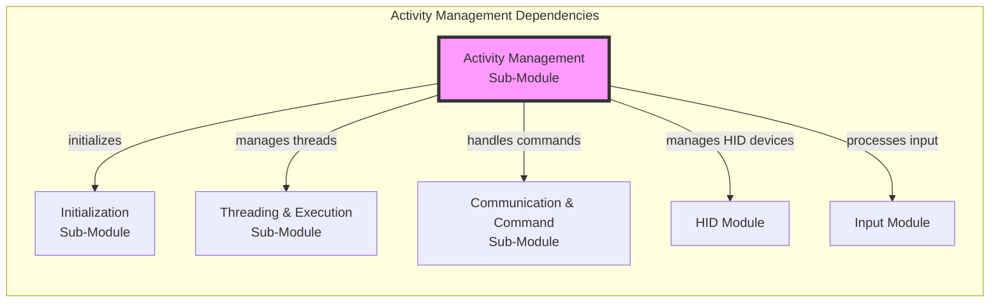
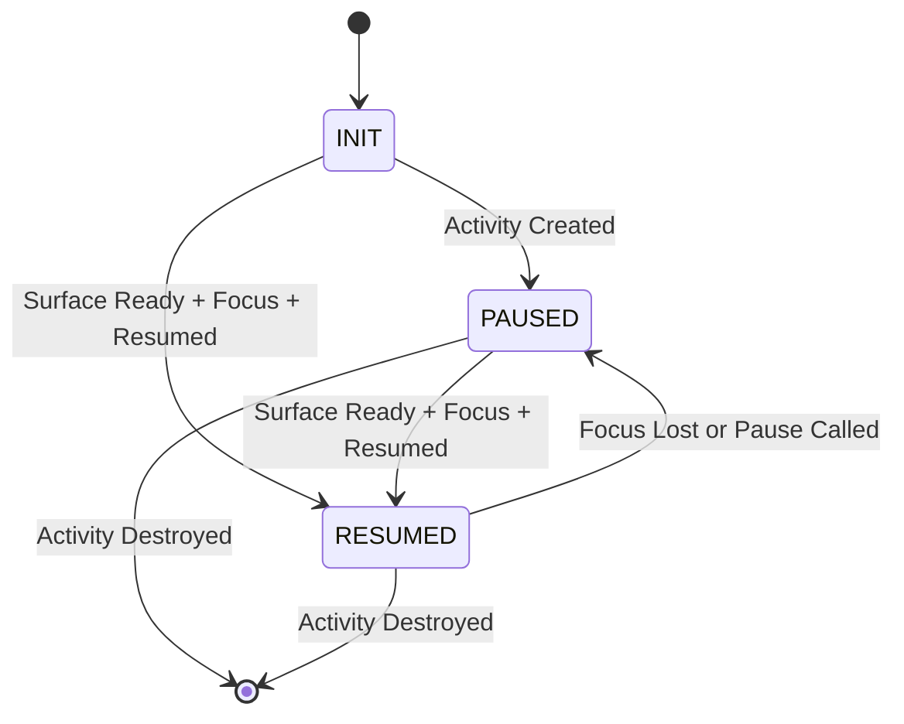
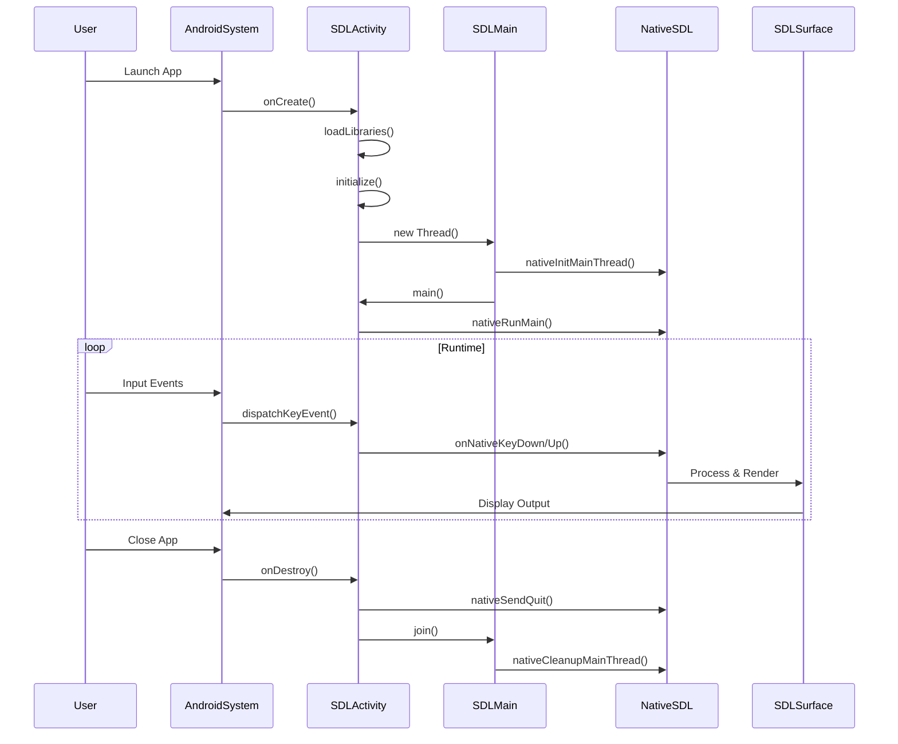
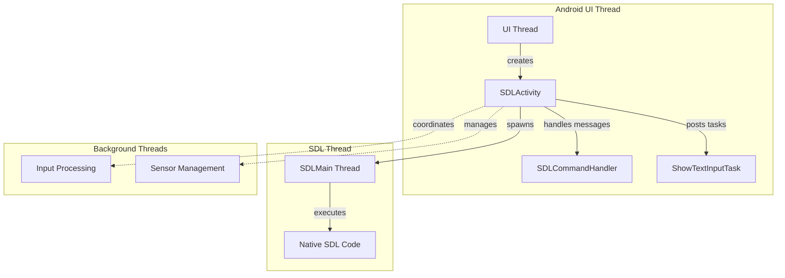

# Activity Management Sub-Module Documentation

## Introduction

The Activity Management Sub-Module is a critical component of the SDL (Simple DirectMedia Layer) Android implementation, responsible for managing the main Android Activity lifecycle and providing the primary interface between the Android application framework and the SDL native library. This module serves as the central orchestrator for SDL applications running on Android devices, handling everything from library loading and initialization to input management and system integration.

## Core Purpose and Functionality

The SDLActivity class within this module acts as the main entry point for SDL applications on Android, providing:

- **Activity Lifecycle Management**: Comprehensive handling of Android activity lifecycle events (onCreate, onPause, onResume, onDestroy, etc.)
- **Native Library Integration**: Loading and initialization of SDL native libraries and the main application
- **Thread Management**: Coordination between the Android UI thread and the SDL native thread
- **Input System Integration**: Bridging Android input events to SDL's input system
- **System Integration**: Managing device orientation, display settings, and system UI
- **Resource Management**: Proper cleanup and resource management across activity lifecycle

## Architecture Overview

```mermaid
graph TB
    subgraph "Activity Management Sub-Module"
        SDLActivity["SDLActivity<br/>Main Activity Class"]
        SDLMain["SDLMain<br/>Runnable Implementation"]
        SDLCommandHandler["SDLCommandHandler<br/>Message Handler"]
        SDLClipboardHandler["SDLClipboardHandler<br/>Clipboard Integration"]
        ShowTextInputTask["ShowTextInputTask<br/>Text Input Handler"]
    end

    subgraph "Android Framework"
        Activity["android.app.Activity"]
        Thread["java.lang.Thread"]
        Handler["android.os.Handler"]
        ClipboardManager["android.content.ClipboardManager"]
    end

    subgraph "SDL System Components"
        SDL["SDL Core"]
        SDLSurface["SDLSurface"]
        SDLControllerManager["SDLControllerManager"]
        HIDDeviceManager["HIDDeviceManager"]
    end

    SDLActivity -.->|extends| Activity
    SDLActivity -.->|implements| View.OnSystemUiVisibilityChangeListener
    SDLMain -.->|implements| Runnable
    SDLCommandHandler -.->|extends| Handler
    SDLClipboardHandler -.->|implements| ClipboardManager.OnPrimaryClipChangedListener
    ShowTextInputTask -.->|implements| Runnable

    SDLActivity -->|uses| SDLMain
    SDLActivity -->|uses| SDLCommandHandler
    SDLActivity -->|uses| SDLClipboardHandler
    SDLActivity -->|uses| ShowTextInputTask
    SDLActivity -->|manages| SDLSurface
    SDLActivity -->|coordinates| HIDDeviceManager
    SDLActivity -->|calls native| SDL

    SDLMain -->|runs on| Thread
    SDLCommandHandler -->|handles messages| Handler
    SDLClipboardHandler -->|monitors| ClipboardManager
```

## Component Relationships

## Key Components Deep Dive

### SDLActivity Class

The SDLActivity class is the central component that extends Android's Activity class and implements the View.OnSystemUiVisibilityChangeListener interface. It manages the complete lifecycle of SDL applications on Android:

#### Core Responsibilities:

1. **Library Loading and Initialization**
   - Loads SDL native libraries (SDL3, main)
   - Validates library versions and compatibility
   - Handles library loading failures gracefully

2. **Activity Lifecycle Management**
   - Manages activity creation, pause, resume, and destruction
   - Coordinates with native SDL thread state
   - Handles multi-window mode support (Android 7.0+)

3. **Native Thread Coordination**
   - Creates and manages the SDLMain thread
   - Handles native state transitions (INIT, PAUSED, RESUMED)
   - Provides thread-safe communication between Java and native code

4. **Input Event Processing**
   - Dispatches keyboard, mouse, and gamepad events
   - Manages text input and soft keyboard interactions
   - Handles special key combinations and device-specific inputs

#### State Management:

### SDLMain Class

A simple Runnable implementation that serves as the entry point for the SDL native application thread:

- Sets thread priority to THREAD_PRIORITY_DISPLAY
- Initializes native thread context
- Calls the main() method of SDLActivity
- Handles cleanup after native execution completes
- Manages activity finishing when SDL main exits

### SDLCommandHandler Class

An inner Handler class that processes messages from the native SDL thread:

- **COMMAND_CHANGE_TITLE**: Updates activity title
- **COMMAND_CHANGE_WINDOW_STYLE**: Toggles fullscreen mode
- **COMMAND_TEXTEDIT_HIDE**: Manages soft keyboard visibility
- **COMMAND_SET_KEEP_SCREEN_ON**: Controls screen timeout behavior
- **COMMAND_USER**: Custom user commands (0x8000+)

### SDLClipboardHandler Class

Manages clipboard integration between Android and SDL:

- Monitors clipboard changes via OnPrimaryClipChangedListener
- Provides text retrieval and setting functionality
- Handles clipboard text format conversion
- Notifies native code of clipboard changes

### ShowTextInputTask Class

A Runnable implementation for managing text input:

- Creates and positions the SDLDummyEdit view
- Manages soft keyboard show/hide operations
- Handles input type configuration
- Provides proper focus management for text input

## Data Flow Architecture

## System Integration Points

### 1. Device and Platform Detection

The module provides comprehensive device detection capabilities:

- **Android TV Detection**: Identifies Android TV devices via UiModeManager
- **VR Headset Detection**: Detects Oculus Quest and Pico VR devices
- **Chromebook Detection**: Identifies Chrome OS environments
- **DeX Mode Detection**: Detects Samsung DeX desktop mode
- **Tablet Detection**: Determines device form factor based on screen diagonal

### 2. Orientation Management

Sophisticated orientation handling based on:
- Device natural orientation detection
- Application-specified orientation hints
- Window resizability settings
- Multi-orientation support with user preferences

### 3. System UI Integration

- **Fullscreen Mode**: Immersive sticky mode with automatic re-hide
- **Display Cutout Handling**: Support for notched displays (Android 9+)
- **Insets Management**: Proper handling of system window insets
- **Dark Mode Support**: Automatic dark mode detection and notification

### 4. Permission Management

- Runtime permission requests (Android 6.0+)
- Permission result handling and native notification
- Graceful degradation for older Android versions

## Threading Model

## Error Handling and Robustness

### Library Loading Failures
- Comprehensive error detection during library loading
- User-friendly error dialogs for library failures
- Graceful application termination with proper messaging

### Version Compatibility
- SDL version validation between Java and native code
- Clear error messaging for version mismatches
- Prevents runtime crashes from incompatible versions

### Activity Recreation
- Configurable activity recreation support
- Native thread counter management
- Proper state preservation across recreations

### Resource Cleanup
- Systematic resource cleanup in onDestroy()
- HID device manager proper release
- Audio manager cleanup
- Thread synchronization and termination

## Performance Considerations

### Memory Management
- Static variable reset on initialization
- Proper cleanup of native resources
- Cursor and bitmap resource management
- Clipboard listener lifecycle management

### Thread Optimization
- Display priority thread setting
- Efficient message handling
- Minimal UI thread blocking
- Proper thread synchronization

### Battery Optimization
- Screen timeout management
- Sensor enablement only when needed
- Proper pause/resume handling
- Memory trim response

## Integration with Other Modules

### [Initialization Sub-Module](initialization_sub_module.md)
- SDL.setupJNI() coordination
- SDL.initialize() state management
- Context setting and management

### [Threading & Execution Sub-Module](threading_and_execution_sub_module.md)
- SDLMain thread creation and management
- OneShotTask integration for UI operations
- Thread priority and lifecycle management

### [Communication & Command Sub-Module](communication_and_command_sub_module.md)
- SDLCommandHandler message processing
- SDLClipboardHandler integration
- SDLFileDialogState management
- ShowTextInputTask coordination

### [HID Module](android_hid_module.md)
- HIDDeviceManager acquisition and release
- HID device freeze/thaw during lifecycle events
- USB and BLE device coordination

### [Input Module](android_sdl_input_module.md)
- SDLControllerManager integration
- Motion listener management
- Input device detection and configuration
- Touch device initialization

## Configuration and Customization

### Library Configuration
- Customizable library loading via getLibraries()
- Main function specification via getMainFunction()
- Shared object path customization via getMainSharedObject()
- Command-line argument support via getArguments()

### UI Customization
- Custom surface creation via createSDLSurface()
- Message box customization support
- Cursor customization and management
- System UI visibility control

### Behavior Configuration
- Activity recreation control via nativeAllowRecreateActivity()
- Back button trapping configuration
- Relative mouse mode support
- Permission request handling

## Best Practices and Usage Guidelines

### Activity Lifecycle Management
1. Always call super methods in lifecycle callbacks
2. Handle multi-window mode appropriately
3. Manage native thread state transitions carefully
4. Ensure proper resource cleanup

### Thread Safety
1. Use command handler for UI updates from native thread
2. Synchronize access to shared state variables
3. Properly manage thread lifecycle and cleanup
4. Avoid blocking the UI thread with native operations

### Error Handling
1. Always check for library loading failures
2. Provide meaningful error messages to users
3. Handle version mismatches gracefully
4. Implement proper fallback mechanisms

### Performance Optimization
1. Minimize UI thread blocking operations
2. Use appropriate thread priorities
3. Implement efficient message handling
4. Manage resources proactively

## Conclusion

The Activity Management Sub-Module serves as the cornerstone of SDL's Android implementation, providing a robust and feature-rich foundation for multimedia applications. Its comprehensive lifecycle management, sophisticated input handling, and seamless integration with both Android system services and SDL's native components make it an essential component for any SDL-based Android application. The module's design emphasizes reliability, performance, and extensibility while maintaining compatibility across a wide range of Android devices and versions.