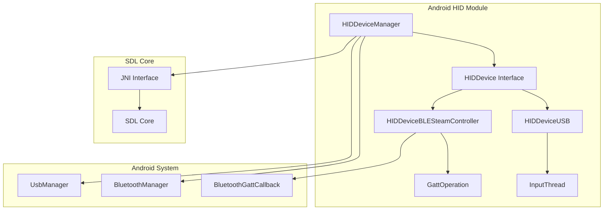
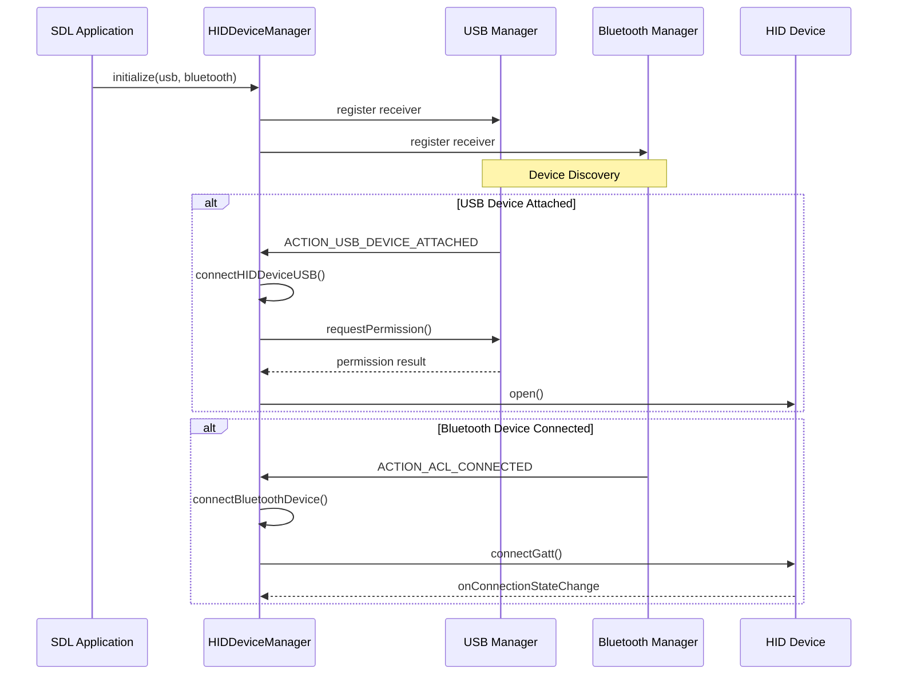

# Android HID Module Documentation

## Overview

The Android HID (Human Interface Device) module provides comprehensive support for HID devices on Android platforms, including both USB and Bluetooth Low Energy (BLE) devices. This module is part of the SDL (Simple DirectMedia Layer) library's Android implementation and serves as a bridge between Android's hardware interfaces and SDL's cross-platform input system.

## Purpose and Scope

The module's primary purpose is to:
- Manage HID device discovery and connection for both USB and Bluetooth interfaces
- Handle device-specific protocols for various gaming controllers and input devices
- Provide a unified interface for SDL applications to interact with HID devices
- Support special device types like Steam Controllers and Xbox controllers
- Manage device permissions and connection states on Android

## Architecture Overview

## Core Components

### HIDDeviceManager
The central manager class that coordinates all HID device operations. It handles:
- Device discovery and lifecycle management
- USB and Bluetooth device enumeration
- Permission management for USB devices
- Connection state tracking
- JNI interface to native SDL code

### HIDDevice Interface
A common interface that defines the contract for all HID devices, ensuring consistent behavior across different device types.

### HIDDeviceUSB
Implements USB HID device support with features including:
- USB device enumeration and connection
- Endpoint management for input/output operations
- Support for feature reports and standard HID reports
- Xbox 360 and Xbox One controller detection
- Input thread management for asynchronous data processing

### HIDDeviceBLESteamController
Specialized implementation for Steam Controller BLE devices featuring:
- Bluetooth GATT protocol implementation
- Steam Controller-specific service and characteristic handling
- Chromebook compatibility workarounds
- Asynchronous GATT operation queuing
- Device registration and configuration management

## Device Support

### USB Devices
The module supports a wide range of USB HID devices including:
- Standard HID class devices
- Xbox 360 controllers (wired and wireless)
- Xbox One controllers
- Vendor-specific gaming controllers

### Bluetooth Devices
Currently specialized for:
- Steam Controller (BLE version)
- Future expansion for other BLE HID devices

## Connection Management

## Data Flow

### Input Data Flow
1. Device generates input reports
2. HIDDevice implementation receives data (USB bulk transfer or BLE notification)
3. Data is processed and forwarded to HIDDeviceManager
4. HIDDeviceManager calls native JNI method `HIDDeviceInputReport`
5. SDL core processes the input data

### Output Data Flow
1. SDL application requests output report
2. Native code calls `writeReport` through JNI
3. HIDDeviceManager delegates to specific device implementation
4. Device sends data to hardware (USB bulk transfer or BLE write)

## Error Handling and Recovery

The module implements several recovery mechanisms:
- **USB Permission Denied**: Automatic permission request with user dialog
- **Bluetooth Connection Loss**: Automatic reconnection attempts
- **Chromebook Compatibility**: Special handling for Chromebook Bluetooth stack issues
- **Device Disconnection**: Proper cleanup and notification to SDL core

## Platform-Specific Considerations

### Android Version Compatibility
- Minimum API level 16 for basic USB support
- API level 18+ for Bluetooth LE support
- API level 21+ for enhanced USB device information
- API level 23+ for transport-specific BLE connections
- API level 31+ for Bluetooth permission handling

### Chromebook Support
Special provisions for Chromebook devices:
- Forced BLE transport for Steam Controllers
- Connection state monitoring and recovery
- Workaround for Android Bluetooth stack issues

## Integration with SDL

The module integrates with SDL through JNI callbacks:
- `HIDDeviceConnected`: Device connection notification
- `HIDDeviceDisconnected`: Device disconnection notification
- `HIDDeviceInputReport`: Input data delivery
- `HIDDeviceReportResponse`: Response to feature report requests

## Sub-modules

For detailed information about specific implementations, see:
- [hid_device_usb.md](hid_device_usb.md) - USB HID device implementation including InputThread management
- [hid_device_ble_steam_controller.md](hid_device_ble_steam_controller.md) - Steam Controller BLE implementation with GATT operations
- [hid_device_manager.md](hid_device_manager.md) - Central management component for device discovery and coordination

## Dependencies

This module depends on:
- Android SDK APIs (USB, Bluetooth)
- SDL core native libraries
- [android_sdl_core_module](android_sdl_core_module.md) for SDLActivity integration
- [hid_api_module](hid_api_module.md) for cross-platform HID API compatibility