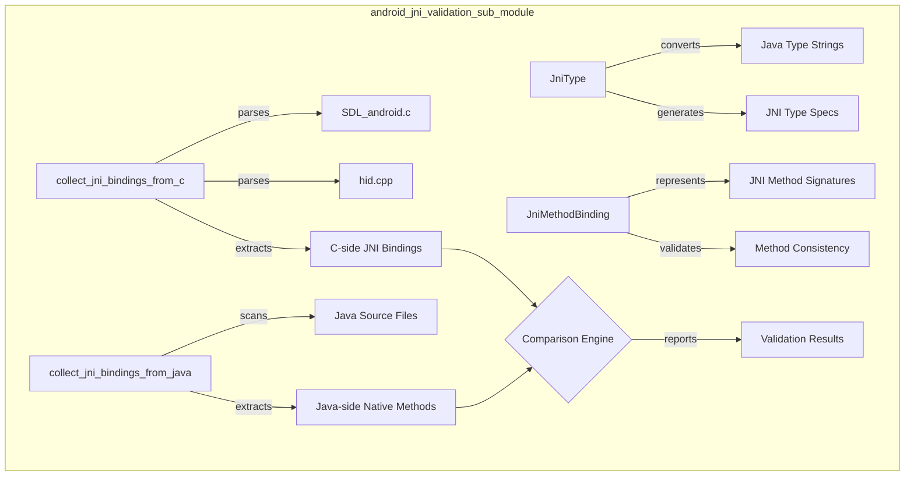
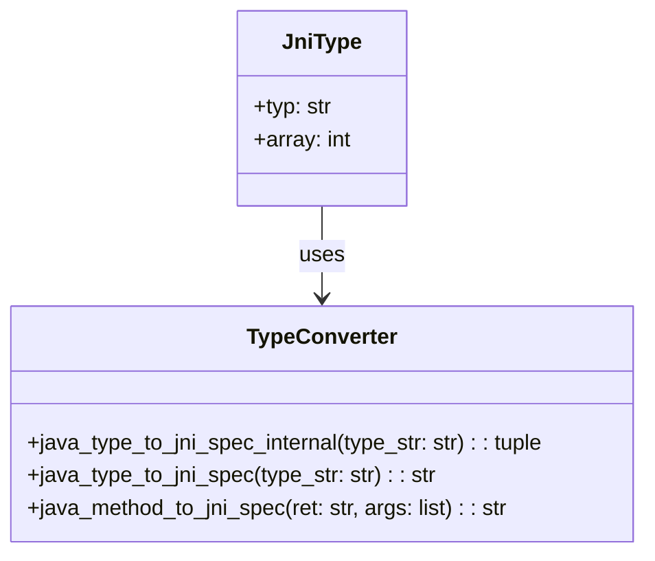
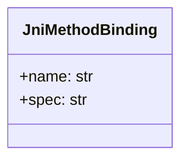
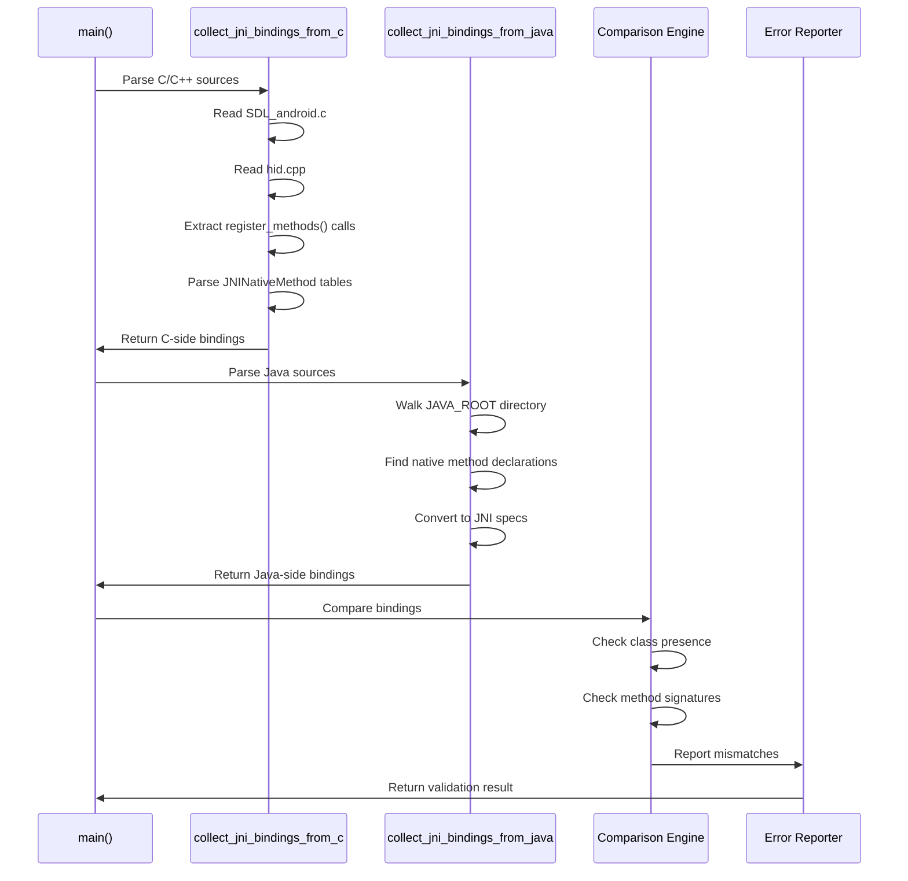
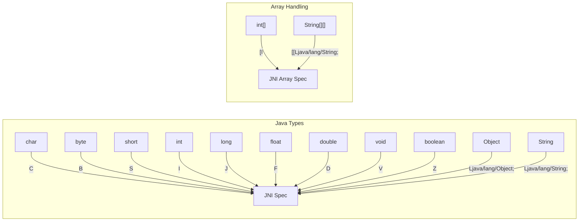
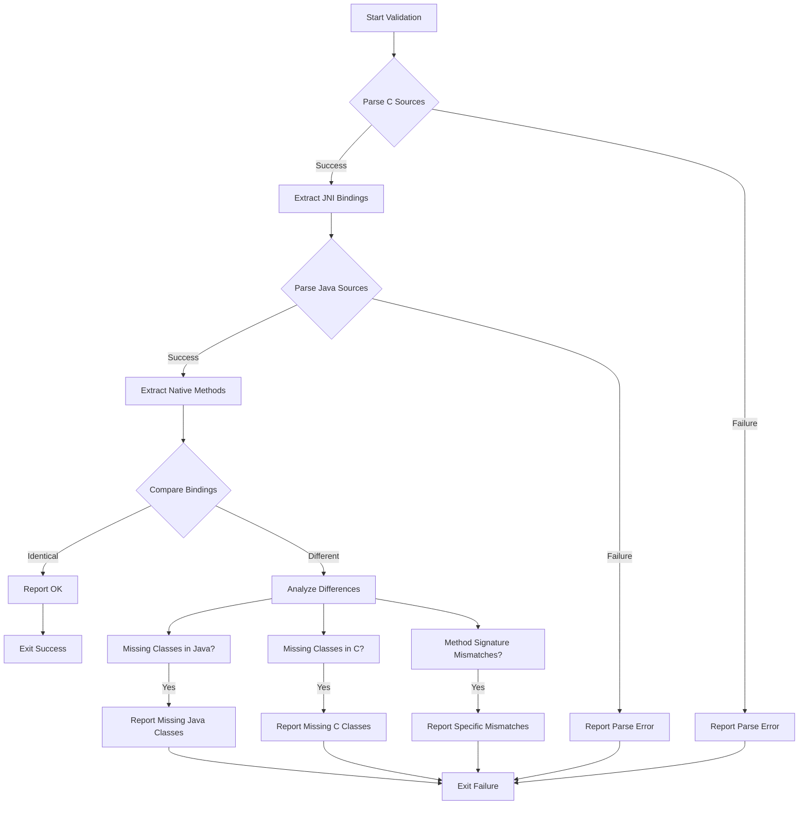
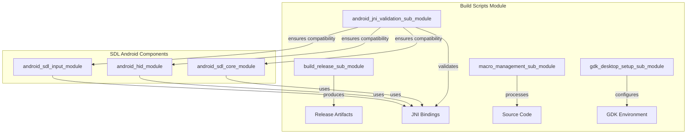

# Android JNI Validation Sub-Module

## Introduction

The android_jni_validation_sub_module is a critical build system component that ensures consistency between Java Native Interface (JNI) bindings defined in C/C++ source code and their corresponding native method declarations in Java source files. This validation tool prevents runtime linking errors by detecting mismatches between JNI method signatures before compilation.

## Purpose and Core Functionality

This sub-module serves as a quality assurance mechanism for SDL's Android port, specifically targeting the JNI bridge between Java Android application code and native C/C++ SDL libraries. It automatically validates that:

1. **Method Signature Consistency**: JNI method signatures in C/C++ match their Java native method declarations
2. **Class Completeness**: All JNI classes have corresponding implementations on both sides
3. **Method Presence**: All native methods declared in Java have matching C/C++ implementations
4. **Type Safety**: Java types are correctly mapped to JNI type specifications

## Architecture Overview



## Core Components

### JniType Class

The `JniType` dataclass represents a Java type in the JNI context, handling both basic types and array dimensions.



**Key Features:**
- Immutable dataclass for type safety
- Supports multi-dimensional arrays through `array` field
- Integrates with type conversion utilities

### JniMethodBinding Class

The `JniMethodBinding` dataclass encapsulates a JNI method's signature information for comparison purposes.



**Key Features:**
- Immutable representation of JNI method bindings
- Combines method name and JNI signature specification
- Used as set elements for efficient comparison

## Data Flow Architecture



## Type Conversion System

The module implements a comprehensive type mapping system between Java types and JNI type specifications:



## Validation Process Flow



## Integration with Build System

The android_jni_validation_sub_module integrates with the broader [build_scripts_module](build_scripts_module.md) as part of the SDL build process:



## Source File Analysis

The validation process examines specific source files within the SDL codebase:

### C/C++ Source Files
- **`src/core/android/SDL_android.c`**: Primary JNI implementation file containing native method tables
- **`src/hidapi/android/hid.cpp`**: HID-specific JNI implementations

### Java Source Files
- **`android-project/app/src/main/java/`**: Recursive scan of all Java source files for native method declarations

## Error Detection and Reporting

The module provides detailed error reporting for various mismatch scenarios:

### Missing Class Errors
- Classes present in C but missing in Java implementation
- Classes present in Java but missing in C implementation

### Method Signature Errors
- Methods existing only in C sources
- Methods existing only in Java sources
- Methods with mismatched signatures between C and Java

### Type Conversion Errors
- Unsupported Java types in method signatures
- Invalid array specifications
- Malformed JNI type specifications

## Usage and Command Line Interface

The module operates as a standalone Python script with the following interface:

```bash
python check_android_jni.py [--help]
```

**Exit Codes:**
- `0`: Validation successful, all JNI bindings match
- `1`: Validation failed, mismatches detected

## Dependencies and Requirements

### External Dependencies
- **Python 3.6+**: Required for dataclass support
- **argparse**: Command-line argument parsing
- **pathlib**: Path manipulation utilities
- **re**: Regular expression pattern matching

### SDL-Specific Dependencies
- Access to SDL source code directory structure
- Read permissions for C/C++ and Java source files
- Knowledge of SDL's JNI naming conventions

## Best Practices and Recommendations

### For SDL Developers
1. **Run validation before commits**: Always validate JNI bindings after modifying native method signatures
2. **Maintain consistency**: Ensure Java and C method signatures are updated together
3. **Use standard types**: Stick to basic Java types supported by the type conversion system

### For Build System Integration
1. **Early validation**: Run JNI validation as early as possible in the build process
2. **Fail fast**: Treat validation failures as build-breaking errors
3. **Automated checking**: Integrate validation into continuous integration pipelines

## Relationship to Other Modules

The android_jni_validation_sub_module serves as a quality gate for the Android-specific SDL modules:

- **[android_sdl_core_module](android_sdl_core_module.md)**: Validates JNI bindings for core SDL functionality
- **[android_hid_module](android_hid_module.md)**: Ensures HID device JNI interfaces are consistent
- **[android_sdl_input_module](android_sdl_input_module.md)**: Validates input-related JNI method bindings

This validation sub-module is essential for maintaining the integrity of SDL's cross-language interface on the Android platform, preventing runtime errors that would otherwise occur from JNI binding mismatches.