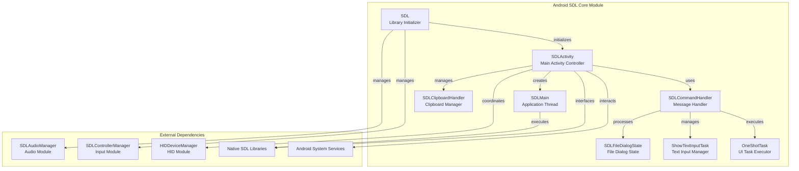
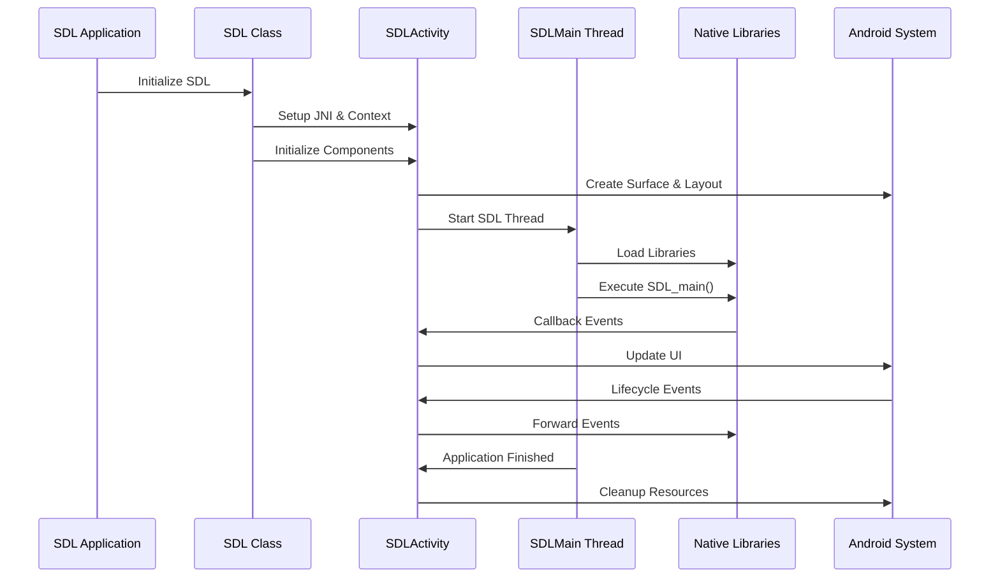

# Android SDL Core Module

## Overview

The Android SDL Core Module serves as the central orchestrator for SDL (Simple DirectMedia Layer) applications on Android platforms. This module provides the essential infrastructure for initializing, managing, and coordinating SDL applications within the Android environment. It acts as the primary bridge between the Android operating system and the SDL native libraries, handling critical aspects such as activity lifecycle management, JNI setup, library loading, and cross-platform compatibility.

## Purpose and Core Functionality

The module's primary purpose is to establish and maintain the runtime environment necessary for SDL applications to function properly on Android devices. It encapsulates complex Android-specific operations while providing a clean interface for SDL applications to interact with Android system services, hardware capabilities, and user interface components.

### Key Responsibilities:
- **Application Lifecycle Management**: Coordinates the SDL application lifecycle with Android's activity lifecycle
- **JNI Bridge Management**: Establishes and maintains the Java Native Interface connections
- **Library Loading and Validation**: Handles dynamic loading of SDL native libraries with version validation
- **System Integration**: Provides interfaces for Android-specific features like permissions, file dialogs, and system UI
- **Cross-Platform Compatibility**: Ensures SDL applications work consistently across different Android versions and device configurations

## Architecture Overview

## Component Architecture

### SDL Class - Library Initialization Hub
The `SDL` class serves as the central initialization point for the entire SDL ecosystem on Android. It provides static methods for setting up JNI connections, managing application context, and loading native libraries with sophisticated error handling and fallback mechanisms.

### SDLActivity Class - Activity Lifecycle Manager
The `SDLActivity` class extends Android's Activity class and represents the main entry point for SDL applications. It manages the complex interaction between Android's activity lifecycle and SDL's internal state machine, ensuring proper initialization, pause/resume handling, and resource management.

### SDLMain Class - Application Thread Controller
The `SDLMain` class implements the Runnable interface and serves as the dedicated thread for executing the SDL application's main function. It handles thread priority settings and ensures proper cleanup after application termination.

### Support Classes - Specialized Managers
- **SDLCommandHandler**: Processes messages between the native SDL code and Android UI thread
- **SDLClipboardHandler**: Manages clipboard operations with proper event notification
- **SDLFileDialogState**: Tracks file dialog operations and state
- **ShowTextInputTask**: Handles soft keyboard display and text input management
- **OneShotTask**: Provides utility for executing one-time UI operations

## Sub-module Structure

The android_sdl_core_module contains several logical sub-modules that handle specific aspects of the SDL integration:

### 1. [Initialization Sub-module](initialization_sub_module.md)
**Core Components**: `SDL.java`

This sub-module is responsible for the initial setup and configuration of the SDL environment. It handles JNI setup, library loading with ReLinker support for robust library loading, and context management. The initialization process includes version validation to ensure compatibility between Java and native code components.

### 2. [Activity Management Sub-module](activity_management_sub_module.md)
**Core Components**: `SDLActivity.java` (main activity components)

This sub-module manages the Android activity lifecycle and coordinates it with SDL's internal state. It handles surface creation and management, input device initialization, orientation changes, and system UI interactions. The activity management ensures proper pause/resume behavior and resource cleanup.

### 3. [Threading and Execution Sub-module](threading_and_execution_sub_module.md)
**Core Components**: `SDLMain.java`, `OneShotTask.java`

This sub-module handles the execution model of SDL applications on Android. It manages the dedicated SDL thread, ensures proper thread priority for display operations, and provides utilities for executing tasks on the main UI thread when necessary.

### 4. [Communication and Command Sub-module](communication_and_command_sub_module.md)
**Core Components**: `SDLCommandHandler.java`, `SDLClipboardHandler.java`, `SDLFileDialogState.java`, `ShowTextInputTask.java`

This sub-module facilitates communication between the native SDL code and the Android environment. It handles command processing, clipboard operations, file dialog management, and text input coordination. This sub-module ensures that SDL applications can properly interact with Android system services and UI components.

## Data Flow Architecture

## Integration with Other Modules

The android_sdl_core_module serves as the central hub that coordinates with several other modules in the SDL ecosystem:

### [android_hid_module](android_hid_module.md)
The core module integrates with the HID module through the `HIDDeviceManager` to handle human interface devices such as game controllers, keyboards, and mice. This integration enables SDL applications to support various input devices seamlessly.

### [android_sdl_input_module](android_sdl_input_module.md)
The core module coordinates with the input module through `SDLAudioManager` and `SDLControllerManager` to handle audio output and input device management. This ensures proper initialization and lifecycle management of audio and controller subsystems.

### Native Library Integration
The core module provides the bridge to native SDL libraries through JNI interfaces. It handles library loading, version validation, and provides the execution environment for the native SDL main function.

## Key Features and Capabilities

### Robust Library Loading
The module implements sophisticated library loading mechanisms with fallback support through ReLinker, ensuring compatibility across different Android versions and device configurations.

### Comprehensive Lifecycle Management
Full integration with Android's activity lifecycle, including proper handling of pause/resume, focus changes, configuration changes, and resource cleanup.

### Cross-Platform Compatibility
Extensive device and platform detection capabilities, including support for Android TV, Chromebook, VR headsets, and Samsung DeX mode.

### System Integration
Native integration with Android system services including clipboard management, file dialogs, permissions, and system UI controls.

### Thread Safety
Proper thread management with dedicated SDL execution thread and safe communication mechanisms between native and UI threads.

## Error Handling and Robustness

The module implements comprehensive error handling strategies including:
- Library loading failure detection and user notification
- Version mismatch validation between Java and native components
- Graceful handling of missing system features
- Proper resource cleanup on application termination
- Thread safety mechanisms for cross-thread communication

This architecture ensures that SDL applications can run reliably on the Android platform while providing a rich set of features and maintaining compatibility across different device configurations and Android versions.