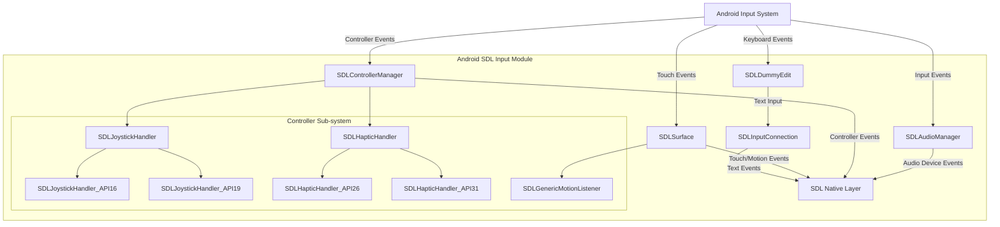
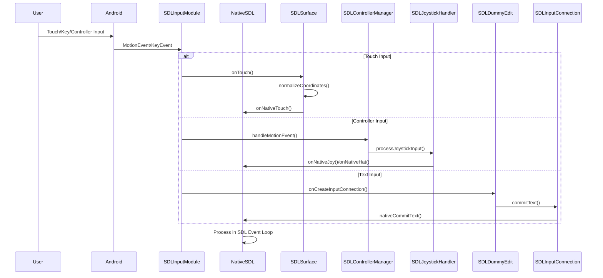

# Android SDL Input Module Documentation

## Overview

The Android SDL Input Module is a comprehensive input handling system for SDL (Simple DirectMedia Layer) applications on Android platforms. This module provides unified management of various input devices including game controllers, joysticks, haptic feedback devices, audio devices, touch screens, keyboards, and sensors.

## Purpose and Core Functionality

The module serves as the primary interface between Android's input subsystem and SDL's cross-platform input abstraction layer. It handles:

- **Game Controller Management**: Detection, configuration, and event handling for gamepads and joysticks
- **Haptic Feedback**: Vibration and force feedback support across different Android API levels
- **Audio Device Management**: Hot-pluggable audio input/output device detection and management
- **Touch Input Processing**: Multi-touch gesture recognition and coordinate normalization
- **Keyboard and Text Input**: Soft keyboard integration and text input handling
- **Motion Sensors**: Accelerometer and device orientation tracking
- **Surface Input**: Touch, mouse, and stylus input through the rendering surface

## Architecture Overview

## Module Components

### 1. SDLAudioManager
Manages audio device detection and hot-plugging functionality. Provides real-time notifications when audio devices are connected or disconnected from the system.

**Key Features:**
- Audio device enumeration and monitoring
- Hot-plug support for Android 7.0+ (API 24+)
- Thread priority management for audio processing
- JNI bridge to native SDL audio subsystem

### 2. SDLControllerManager
Central coordinator for all game controller and joystick input. Implements a handler pattern to support different Android API levels while maintaining a consistent interface.

**Key Features:**
- Multi-API level joystick support (API 16, 19+)
- Haptic feedback with API-specific implementations (API 26, 31+)
- Generic motion event handling for analog inputs
- Device capability detection and enumeration

### 3. SDLSurface
Primary input surface that handles touch, mouse, stylus, and sensor input. Acts as the main event dispatcher for user interactions with the application.

**Key Features:**
- Multi-touch gesture recognition
- Mouse and stylus input support with pressure sensitivity
- Accelerometer and orientation sensor integration
- Surface lifecycle management
- Coordinate normalization for consistent cross-device behavior

### 4. SDLDummyEdit & SDLInputConnection
Provides text input functionality through Android's Input Method Framework (IMF). Creates an invisible text input field that captures keyboard input while maintaining SDL's event model.

**Key Features:**
- Soft keyboard integration
- Text composition and commit handling
- Backspace and special key processing
- Multi-language input support

## Data Flow Architecture

## API Level Compatibility

The module implements a sophisticated compatibility layer to support different Android API levels:

| Component | API 16 | API 19 | API 24 | API 26 | API 31 |
|-----------|--------|--------|--------|--------|--------|
| Joystick Handler | ✓ Basic | ✓ Enhanced | ✓ Enhanced | ✓ Enhanced | ✓ Enhanced |
| Haptic Feedback | ✓ Basic | ✓ Basic | ✓ Basic | ✓ Advanced | ✓ Multi-motor |
| Audio Devices | ✗ | ✗ | ✓ Hot-plug | ✓ Hot-plug | ✓ Hot-plug |
| Motion Capture | ✗ | ✗ | ✓ Relative | ✓ Pointer Capture | ✓ Pointer Capture |

## Integration with SDL Core

The input module integrates closely with the [android_sdl_core_module](android_sdl_core_module.md) through:

- **SDLActivity**: Main activity coordinator that manages input listeners
- **SDL**: Context provider and system service accessor
- **Native Interface**: JNI bridges for all input event types

## Related Modules

- **[android_sdl_core_module](android_sdl_core_module.md)**: Core SDL functionality and activity management
- **[android_hid_module](android_hid_module.md)**: Human Interface Device management for USB and Bluetooth devices

## Sub-module Documentation

For detailed information about specific sub-systems, refer to:

- [Audio Management Sub-module](audio_management_sub_module.md) - Audio device management including hot-plug detection and device enumeration
- [Controller Management Sub-module](controller_management_sub_module.md) - Comprehensive game controller and joystick handling with multi-API support
- [Surface Input Sub-module](surface_input_sub_module.md) - Touch, mouse, stylus, and sensor input processing through the rendering surface
- [Text Input Sub-module](text_input_sub_module.md) - Keyboard and text input handling with soft keyboard integration