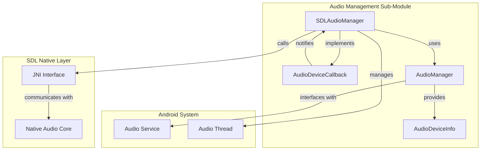
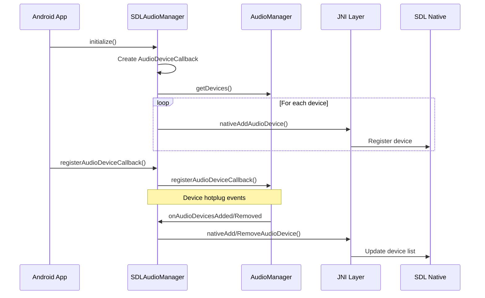
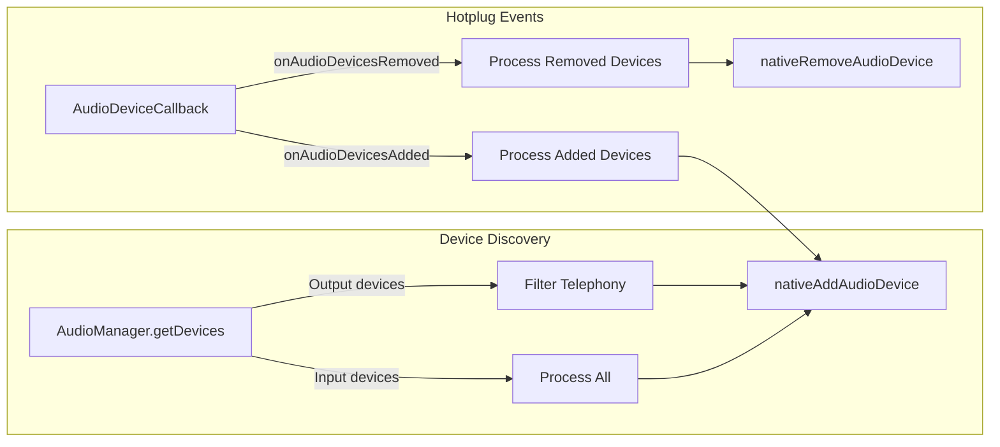
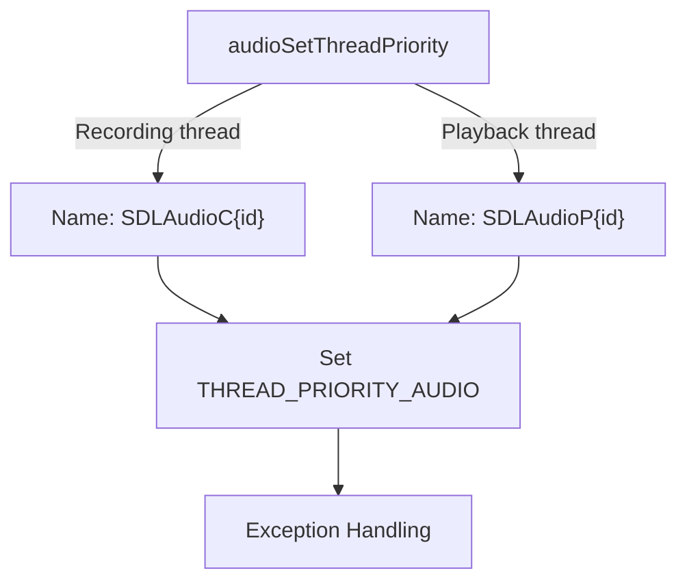
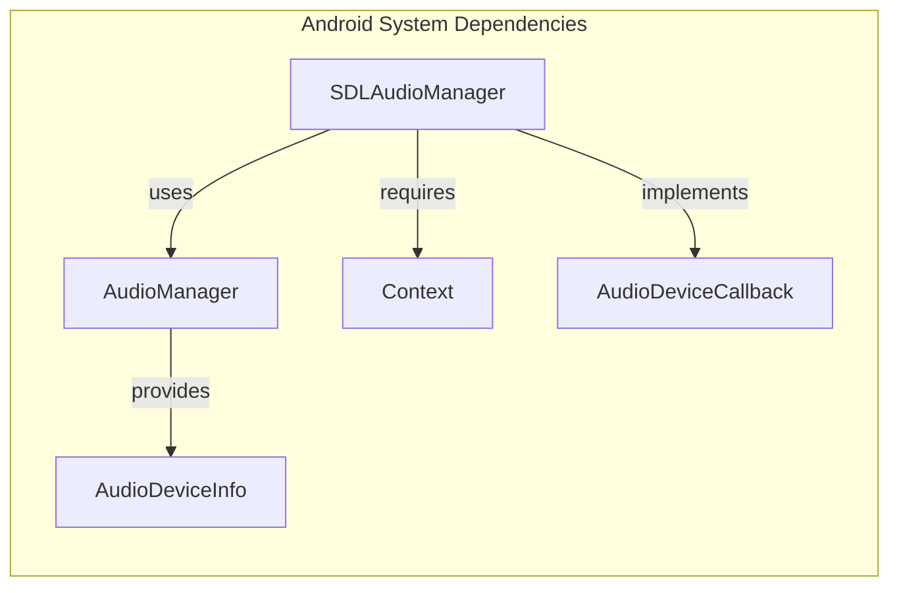
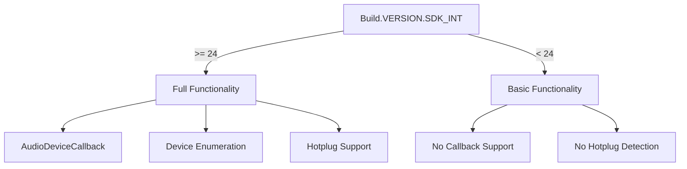

# Audio Management Sub-Module Documentation

## Introduction

The Audio Management Sub-Module is a critical component of the SDL (Simple DirectMedia Layer) Android input system, responsible for managing audio device detection, configuration, and thread management. This module provides a bridge between Android's native audio system and SDL's cross-platform audio abstraction layer, enabling seamless audio device management for games and multimedia applications.

## Architecture Overview

The module is built around the `SDLAudioManager` class, which serves as the central coordinator for all audio-related operations. It leverages Android's AudioManager API to detect and manage audio devices while providing native callbacks to the SDL core for device enumeration and management.



## Core Components

### SDLAudioManager Class

The `SDLAudioManager` is a singleton-like utility class that encapsulates all audio management functionality. It provides static methods for initialization, device management, and thread configuration.

#### Key Responsibilities:
- **Device Detection**: Monitors audio device connection/disconnection events
- **Device Enumeration**: Provides initial device discovery and registration
- **Thread Management**: Configures audio thread priorities and naming
- **JNI Bridge**: Communicates with native SDL audio components

#### Core Methods:



## Data Flow Architecture

### Device Registration Flow



### Thread Management Flow



## Component Dependencies

### Internal Dependencies

The Audio Management Sub-Module has minimal internal dependencies, focusing primarily on Android system services:



### External Module Dependencies

The module integrates with the broader SDL ecosystem:

- **[android_sdl_core_module](android_sdl_core_module.md)**: Provides the main SDL context and initialization framework
- **[android_sdl_input_module](android_sdl_input_module.md)**: Part of the input module hierarchy, coordinating with controller and surface management
- **[android_hid_module](android_hid_module.md)**: May interact for audio device HID management

## API Specifications

### Public Static Methods

| Method | Purpose | Parameters | Returns |
|--------|---------|------------|---------|
| `initialize()` | Initialize the audio manager | None | void |
| `setContext(Context)` | Set Android application context | Context | void |
| `release(Context)` | Release resources | Context | void |
| `registerAudioDeviceCallback()` | Register for device notifications | None | void |
| `unregisterAudioDeviceCallback()` | Unregister from notifications | None | void |
| `audioSetThreadPriority(boolean, int)` | Configure audio thread | boolean recording, int deviceId | void |

### Native Interface Methods

| Method | Purpose | Parameters | Returns |
|--------|---------|------------|---------|
| `nativeSetupJNI()` | Initialize JNI interface | None | int |
| `nativeAddAudioDevice(boolean, String, int)` | Add device to native layer | boolean isSink, String name, int deviceId | void |
| `nativeRemoveAudioDevice(boolean, int)` | Remove device from native layer | boolean isSink, int deviceId | void |

## Android Version Compatibility

The module implements version-specific functionality:



## Thread Safety and Concurrency

The module is designed with thread safety in mind:

- **Static Methods**: All public methods are static and thread-safe
- **Callback Registration**: Uses Android's built-in callback mechanisms
- **Thread Priority**: Manages audio thread priorities through Android's process management
- **Exception Handling**: Gracefully handles exceptions during thread configuration

## Error Handling

The module implements comprehensive error handling:

- **Device Access**: Returns null for unsupported Android versions
- **Thread Configuration**: Catches and logs exceptions during priority setting
- **Resource Management**: Provides cleanup methods for resource release
- **Version Compatibility**: Gracefully degrades functionality on older Android versions

## Integration Patterns

### Initialization Pattern

```java
// Typical initialization sequence
SDLAudioManager.setContext(context);
SDLAudioManager.initialize();
SDLAudioManager.registerAudioDeviceCallback();
```

### Cleanup Pattern

```java
// Typical cleanup sequence
SDLAudioManager.unregisterAudioDeviceCallback();
SDLAudioManager.release(context);
```

## Performance Considerations

- **Device Enumeration**: Performed once during initialization to minimize overhead
- **Callback Efficiency**: Uses Android's optimized callback mechanisms
- **Thread Management**: Leverages Android's native thread priority system
- **Memory Management**: Minimal object creation during runtime operations

## Future Considerations

The module is designed to be extensible for future Android audio features:

- **New Device Types**: Can be extended to support new audio device categories
- **Enhanced Callbacks**: Ready for additional Android audio system updates
- **Performance Metrics**: Can be extended to provide audio performance monitoring
- **Advanced Routing**: Prepared for complex audio routing scenarios

This documentation provides a comprehensive overview of the Audio Management Sub-Module's architecture, functionality, and integration patterns within the SDL Android ecosystem.