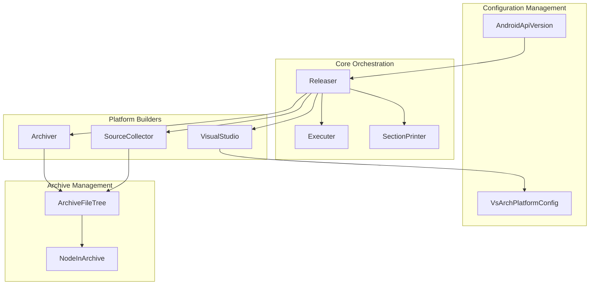
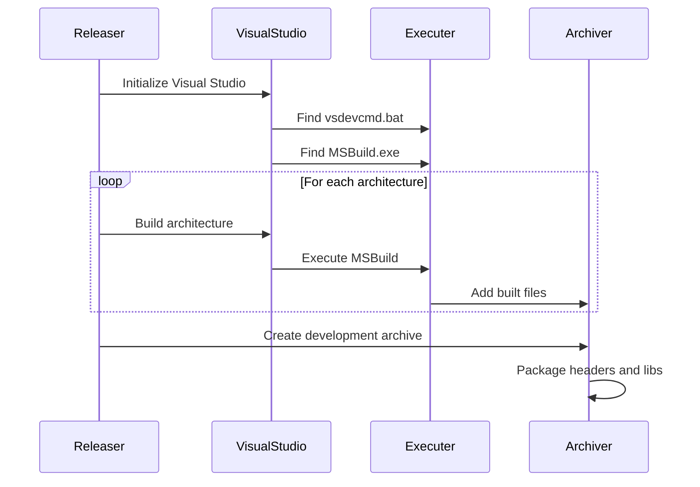
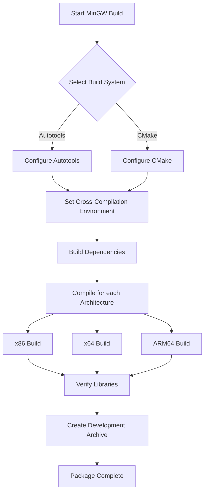
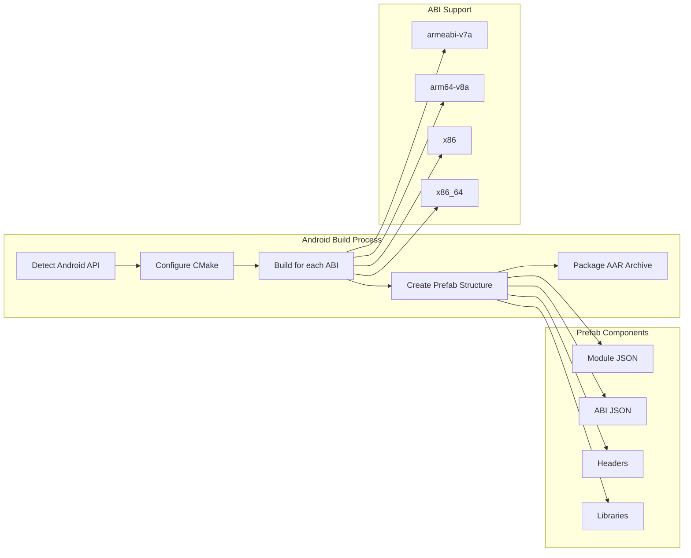
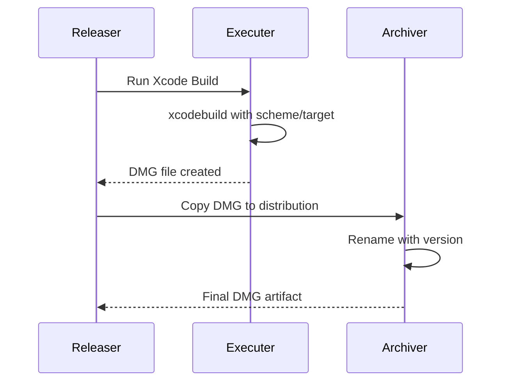
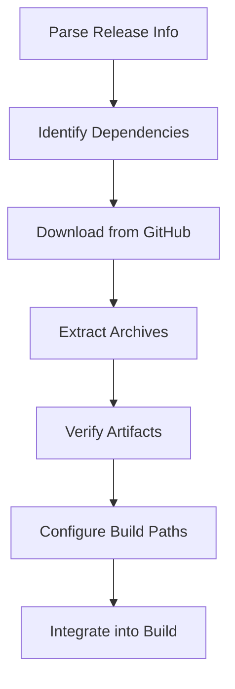

# Build Release Sub-Module Documentation

## Introduction

The build_release_sub_module is a comprehensive Python-based build and release automation system designed for SDL (Simple DirectMedia Layer) libraries. This module orchestrates the creation of release artifacts across multiple platforms including Windows (MSVC/MinGW), macOS (DMG), Android (AAR), and source distributions. It provides a unified interface for managing complex multi-platform build processes with dependency management, artifact packaging, and version control integration.

## Architecture Overview

The module follows a component-based architecture with clear separation of concerns:



## Core Components

### Releaser
The central orchestrator that manages the entire release process. It coordinates platform-specific builds, handles dependency management, and generates final artifacts.

**Key Responsibilities:**
- Version extraction and management
- Build process coordination
- Artifact collection and packaging
- Dependency verification
- Cross-platform build orchestration

### Executer
A command execution wrapper that provides dry-run capabilities and consistent error handling across all build operations.

**Key Responsibilities:**
- Command execution with logging
- Dry-run simulation
- Working directory management
- Environment variable handling

### VisualStudio
Manages Visual Studio builds for Windows platforms, including MSBuild integration and architecture-specific configurations.

**Key Responsibilities:**
- Visual Studio detection and configuration
- MSBuild project compilation
- Architecture-specific build management (x86, x64, ARM64)
- Development environment setup

### Archiver
Handles creation of distribution archives in multiple formats (ZIP, TAR.GZ, TAR.XZ) with proper file metadata and symlink resolution.

**Key Responsibilities:**
- Multi-format archive creation
- File metadata preservation
- Symlink handling for different archive formats
- Git hash integration

### SourceCollector
Extracts source code from Git repositories with configurable filtering and timestamp preservation.

**Key Responsibilities:**
- Git archive extraction
- File filtering and selection
- Timestamp preservation
- External repository integration

### ArchiveFileTree & NodeInArchive
Provide an abstract representation of archive contents, supporting files, directories, symlinks, and generated content.

**Key Responsibilities:**
- Archive structure representation
- File mapping and configuration
- Template processing
- Dependency resolution

## Platform-Specific Build Processes

### Windows MSVC Build Flow



### MinGW Cross-Compilation Flow



### Android AAR Build Flow



### macOS DMG Creation



## Configuration Management

### Release Information Structure
The module uses JSON-based configuration to define build parameters, dependencies, and artifact specifications:

```json
{
  "name": "SDL3",
  "version": {
    "file": "include/SDL3/SDL_version.h",
    "re_major": "#define SDL_MAJOR_VERSION (\\d+)",
    "re_minor": "#define SDL_MINOR_VERSION (\\d+)",
    "re_micro": "#define SDL_MICRO_VERSION (\\d+)"
  },
  "source": {
    "files": {},
    "extra-repos": []
  },
  "msvc": {
    "msbuild": {},
    "cmake": {},
    "files-lib": {},
    "files-devel": {}
  },
  "mingw": {
    "autotools": {},
    "cmake": {},
    "dependencies": {}
  },
  "android": {
    "api-minimum": 16,
    "api-target": 34,
    "abis": ["armeabi-v7a", "arm64-v8a", "x86", "x86_64"],
    "modules": {},
    "dependencies": {}
  },
  "dmg": {
    "path": "build/SDL3.dmg",
    "project": "Xcode/SDL3.xcodeproj"
  }
}
```

### Context Template System
The module supports dynamic configuration through template substitution:

```python
context = {
    "PROJECT_NAME": project_name,
    "PROJECT_VERSION": version,
    "PROJECT_COMMIT": commit,
    "PROJECT_REVISION": revision,
    "ARCH": architecture,
    "PLATFORM": platform,
    "CONFIGURATION": configuration
}
```

## Dependency Management

### Dependency Resolution Process



### Supported Dependency Types
- **MinGW Dependencies**: Cross-compilation libraries and tools
- **MSVC Dependencies**: Windows development libraries
- **Android Dependencies**: AAR libraries and NDK components
- **macOS Dependencies**: Frameworks and development tools

## Artifact Generation

### Source Archives
Creates clean source distributions with:
- Git repository contents
- Version information files
- External repository integration
- Configurable file filtering

### Platform Binaries
Generates platform-specific distributions:
- **Windows**: DLLs, import libraries, and headers
- **MinGW**: Cross-compiled libraries with development files
- **Android**: AAR packages with prefab modules
- **macOS**: DMG disk images with frameworks

### Development Packages
Comprehensive development distributions including:
- Header files and documentation
- Import libraries and static libraries
- CMake configuration files
- Build system integration files

## Integration Points

### Version Control Integration
- Git commit hash embedding
- Revision information extraction
- Clean tree verification
- Archive-based building support

### CI/CD Integration
- GitHub Actions compatibility
- Section-based logging
- Artifact output formatting
- Dependency caching support

### Cross-Module Dependencies
The build_release_sub_module integrates with other system modules:

- **[android_hid_module](android_hid_module.md)**: Android HID device support for Android builds
- **[android_sdl_core_module](android_sdl_core_module.md)**: Core SDL functionality for Android applications
- **[android_sdl_input_module](android_sdl_input_module.md)**: Input handling for Android SDL applications
- **[hid_api_module](hid_api_module.md)**: HID API implementation for cross-platform builds

## Error Handling and Validation

### Build Verification
- Library dependency validation (MinGW)
- File existence checks
- Cross-compilation verification
- Archive integrity validation

### Error Recovery
- Dry-run mode for testing
- Overwrite protection
- Clean build directory management
- Dependency conflict resolution

## Performance Optimizations

### Parallel Processing
- Multi-threaded compilation
- Concurrent architecture builds
- Parallel archive creation
- Dependency pre-fetching

### Caching Strategies
- Build directory reuse
- Dependency caching
- Fast build mode support
- Incremental compilation

## Security Considerations

### Code Signing
- DMG signature preservation
- Library validation
- Source integrity verification

### Dependency Security
- GitHub release verification
- Archive checksum validation
- External repository trust management

## Usage Examples

### Basic Release Creation
```bash
python build-release.py --actions source,msvc,mingw --out dist/
```

### Android Build with Custom API
```bash
python build-release.py --actions android --android-api 34 --android-home /path/to/sdk
```

### Dry Run for Testing
```bash
python build-release.py --actions all --dry-run --fast
```

### Platform-Specific Build
```bash
python build-release.py --actions dmg --commit v3.0.0
```

## Extensibility

### Adding New Platforms
The modular architecture supports adding new platforms by:
1. Creating platform-specific builder classes
2. Adding configuration sections to release-info.json
3. Implementing artifact generation logic
4. Adding dependency management

### Custom Build Steps
Extensible through:
- Configuration file modifications
- Plugin architecture for custom builders
- Template system for file generation
- Hook system for build process integration

This comprehensive build and release system provides a robust foundation for managing complex multi-platform software distributions with consistent quality and reliability across all supported platforms.