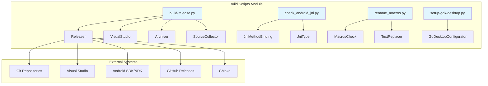
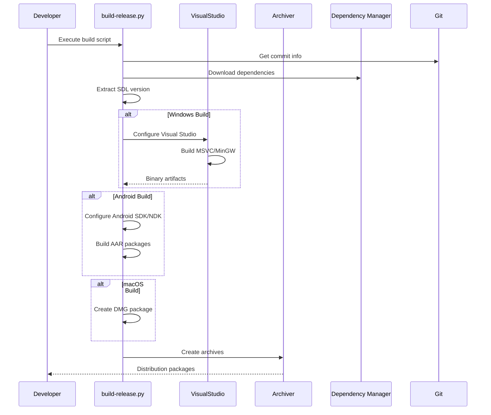

# Build Scripts Module Documentation

## Overview

The `build_scripts_module` is a comprehensive build automation and release management system for SDL (Simple DirectMedia Layer) libraries. This module provides a unified framework for building, packaging, and distributing SDL releases across multiple platforms including Windows (MSVC/MinGW), macOS, Android, and Linux.

## Purpose and Scope

The build scripts module serves as the central orchestration system for:
- **Release Management**: Automated creation of source archives and binary distributions
- **Cross-Platform Building**: Support for multiple compilers and platforms
- **Dependency Management**: Automated downloading and integration of external dependencies
- **Quality Assurance**: Validation of builds and JNI bindings
- **Distribution**: Creation of platform-specific packages (ZIP, TAR.GZ, DMG, AAR)

## Architecture Overview



## Core Components

### 1. Release Management System (`build-release.py`)

The main orchestrator that coordinates all build activities. See [build_release_sub_module](build_release_sub_module.md) for detailed documentation.

Key classes include:

#### Releaser Class
- **Purpose**: Central coordinator for all release activities
- **Responsibilities**: 
  - Version extraction and management
  - Build coordination across platforms
  - Artifact generation and validation
  - Dependency management

#### VisualStudio Class
- **Purpose**: Handles Visual Studio integration for Windows builds
- **Key Features**:
  - Automatic VS version detection
  - MSBuild integration
  - Cross-architecture support (x86, x64, ARM64)

#### Archiver Class
- **Purpose**: Creates distribution packages
- **Supported Formats**: ZIP, TAR.GZ, TAR.XZ
- **Features**: Symlink handling, git hash embedding, file filtering

#### SourceCollector Class
- **Purpose**: Extracts source code from git repositories
- **Features**: 
  - Git archive extraction
  - File filtering and timestamp management
  - Multi-repository support

### 2. Android JNI Validation (`check_android_jni.py`)

Ensures consistency between Java and C/C++ JNI bindings. See [android_jni_validation_sub_module](android_jni_validation_sub_module.md) for detailed documentation.

#### JniMethodBinding Class
- **Purpose**: Represents a JNI method binding
- **Validation**: Method name and signature verification

#### JniType Class
- **Purpose**: Handles Java to JNI type conversion
- **Features**: Array type support, primitive type mapping

### 3. Macro Management (`rename_macros.py`)

Handles SDL3 macro renaming and deprecation. See [macro_management_sub_module](macro_management_sub_module.md) for detailed documentation.

#### MacrosCheck Class
- **Purpose**: Applies macro transformations
- **Operations**: Platform macro renaming, deprecated macro marking

#### TextReplacer Class
- **Purpose**: Performs text-based macro replacements
- **Features**: Regex-based matching, configurable replacement formats

### 4. GDK Desktop Setup (`setup-gdk-desktop.py`)

Configures Microsoft Game Development Kit for desktop development. See [gdk_desktop_setup_sub_module](gdk_desktop_setup_sub_module.md) for detailed documentation.

#### GdDesktopConfigurator Class
- **Purpose**: GDK environment setup
- **Features**: 
  - Automatic GDK download and extraction
  - Visual Studio integration
  - Build environment configuration

## Build Process Flow



## Platform Support

### Windows
- **Compilers**: Visual Studio (2015-2022), MinGW-w64
- **Architectures**: x86, x64, ARM64
- **Output**: ZIP packages, development archives

### Android
- **API Levels**: Configurable minimum and target APIs
- **ABIs**: armeabi-v7a, arm64-v8a, x86, x86_64
- **Output**: AAR packages, development ZIPs

### macOS
- **Build System**: Xcode
- **Output**: DMG disk images

### Cross-Platform
- **Source Archives**: ZIP, TAR.GZ, TAR.XZ
- **Dependencies**: GitHub release integration
- **Configuration**: JSON-based release information

## Configuration System

The module uses JSON configuration files (`release-info.json`) to define:
- Project metadata and version extraction rules
- Platform-specific build configurations
- Dependency specifications
- File inclusion/exclusion patterns
- Output archive structures

## Quality Assurance Features

### JNI Validation
- Automatic detection of JNI method mismatches
- Type signature verification
- Cross-language consistency checks

### Build Verification
- Dependency validation
- Library linking checks (MinGW)
- File existence verification
- Git tree cleanliness validation

### Error Handling
- Comprehensive logging system
- Graceful degradation for missing dependencies
- Detailed error reporting with context

## Integration Points

### GitHub Integration
- GitHub Actions workflow support
- Automatic release artifact upload
- Dependency version tracking
- Output variable generation

### CMake Integration
- Cross-platform build configuration
- Generator support (Ninja, Visual Studio)
- Toolchain file support
- Installation rules

### External Dependencies
- Automated download from GitHub releases
- Version selection and validation
- Extraction and integration
- Platform-specific dependency handling

## Usage Examples

### Basic Release Build
```bash
python build-scripts/build-release.py --actions source,msvc,android --out dist/
```

### Platform-Specific Build
```bash
# Windows MSVC
python build-scripts/build-release.py --actions msvc --vs-year 2022

# Android
python build-scripts/build-release.py --actions android --android-api 21

# MinGW
python build-scripts/build-release.py --actions mingw
```

### Validation Only
```bash
# JNI validation
python build-scripts/check_android_jni.py

# Macro validation
python build-scripts/rename_macros.py src/
```

## Best Practices

1. **Version Management**: Always use semantic versioning and tag releases
2. **Dependency Pinning**: Specify exact dependency versions in release-info.json
3. **Platform Testing**: Test builds on all target platforms before release
4. **Clean Builds**: Use --fast only for development, full builds for releases
5. **Validation**: Run all validation scripts before publishing artifacts

## Troubleshooting

### Common Issues
- **Missing Dependencies**: Run with --actions download first
- **Dirty Git Tree**: Use --force with caution, or commit changes
- **Platform Errors**: Ensure SDKs are properly installed and configured
- **Build Failures**: Check logs for specific error messages and dependencies

### Debug Mode
Enable debug logging with --debug flag for detailed execution information.

## Related Documentation
- [android_hid_module](android_hid_module.md) - Android HID device management
- [android_sdl_core_module](android_sdl_core_module.md) - Core SDL Android functionality
- [android_sdl_input_module](android_sdl_input_module.md) - SDL input handling on Android
- [hid_api_module](hid_api_module.md) - HID API implementation