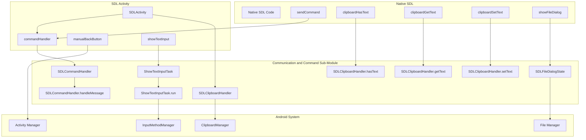
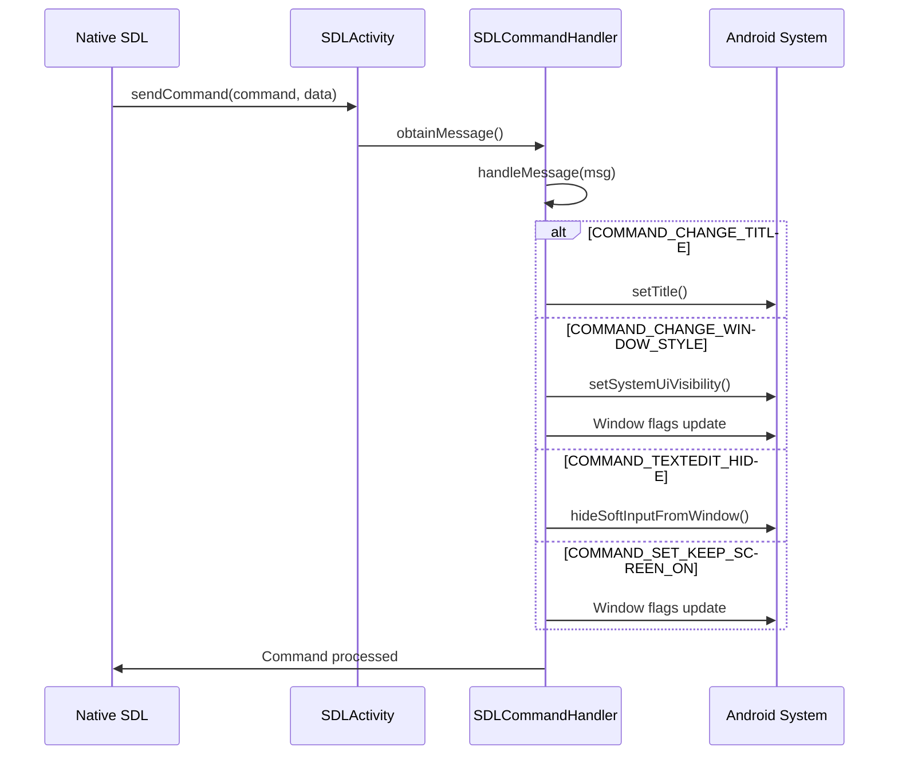
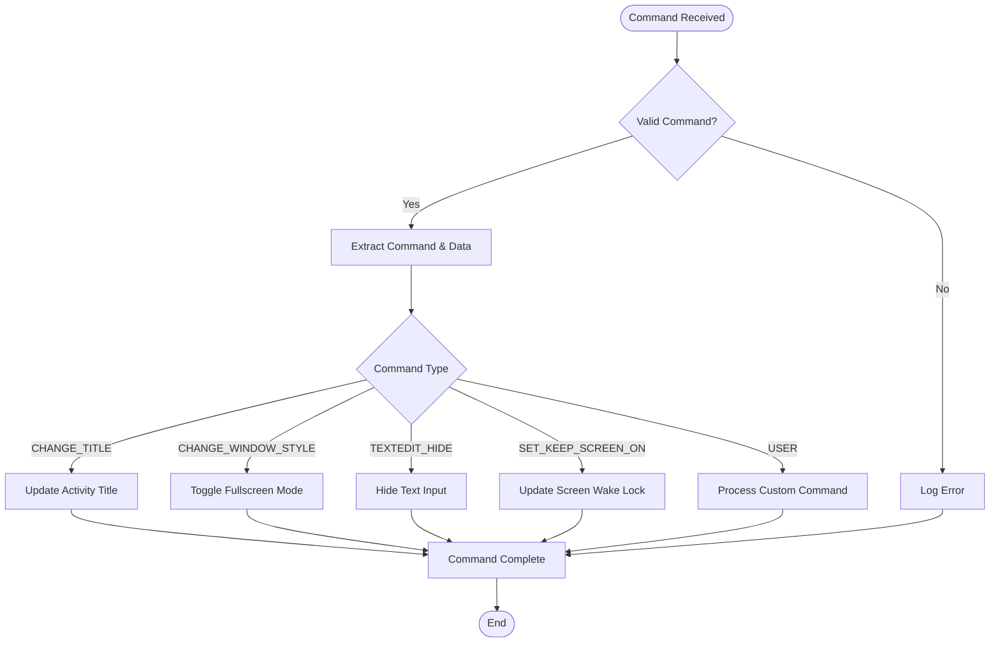

# Communication and Command Sub-Module Documentation

## Introduction

The Communication and Command Sub-Module is a critical component of the SDL Android implementation that handles the bridge between the native SDL library and the Android Java application layer. This module manages command processing, clipboard operations, file dialog interactions, and text input handling, providing essential communication channels for SDL applications running on Android devices.

## Module Overview

This sub-module is part of the larger [android_sdl_core_module](android_sdl_core_module.md) and focuses specifically on handling communication between the native SDL code and the Android Java environment. It provides mechanisms for command execution, system integration, and user interface interactions that are essential for SDL applications to function properly on Android.

## Core Components

### 1. SDLCommandHandler

The `SDLCommandHandler` is a specialized Android Handler class that processes messages from the native SDL library. It acts as the primary command processing mechanism, handling various system-level operations and UI modifications.

**Key Responsibilities:**
- Window style management (fullscreen/windowed mode switching)
- Title bar updates
- Text input visibility control
- Screen wake lock management
- Custom message handling

**Command Types:**
- `COMMAND_CHANGE_TITLE`: Updates the activity title
- `COMMAND_CHANGE_WINDOW_STYLE`: Toggles fullscreen mode
- `COMMAND_TEXTEDIT_HIDE`: Hides the text input interface
- `COMMAND_SET_KEEP_SCREEN_ON`: Controls screen timeout behavior
- `COMMAND_USER`: Custom user-defined commands

### 2. SDLClipboardHandler

The `SDLClipboardHandler` manages clipboard operations between SDL applications and the Android system clipboard. It implements the `ClipboardManager.OnPrimaryClipChangedListener` interface to provide real-time clipboard synchronization.

**Key Features:**
- Text clipboard operations (get/set/has text)
- Automatic clipboard change notifications to native SDL
- Thread-safe clipboard access
- Integration with Android's ClipboardManager service

### 3. SDLFileDialogState

The `SDLFileDialogState` class tracks the state of active file dialog operations. It maintains information about file selection dialogs initiated by the SDL application.

**State Tracking:**
- Request code identification
- Multiple file selection support
- Dialog completion status
- Result processing coordination

### 4. ShowTextInputTask

The `ShowTextInputTask` is a Runnable implementation that handles the display and management of the on-screen keyboard. It coordinates the text input interface between SDL applications and Android's input method framework.

**Functionality:**
- Dynamic text input area positioning
- Input method type specification
- Keyboard visibility management
- Focus coordination between SDL surface and text input

## Architecture

### Component Relationships



### Data Flow Architecture



## Command Processing Flow

### Command Handler Workflow



## Integration Points

### Native to Java Communication

The module provides several JNI callback methods that allow native SDL code to communicate with the Android Java layer:

- `setActivityTitle()`: Updates the activity title from native code
- `setWindowStyle()`: Controls fullscreen mode from native code
- `clipboardGetText()`, `clipboardSetText()`, `clipboardHasText()`: Clipboard operations
- `showTextInput()`: Displays the on-screen keyboard
- `showFileDialog()`: Opens system file selection dialogs

### System Service Integration

The module integrates with various Android system services:

- **ClipboardManager**: For clipboard operations
- **InputMethodManager**: For keyboard management
- **WindowManager**: For display and window management
- **ActivityManager**: For system navigation

## Dependencies

### Internal Dependencies

- [android_sdl_core_module](android_sdl_core_module.md): Parent module providing core SDL functionality
- [SDL](android_sdl_core_module.md): Core SDL class for context management
- [SDLActivity](android_sdl_core_module.md): Main activity class hosting the command handler

### External Dependencies

- Android SDK components (Activity, Context, Handler)
- Android system services (ClipboardManager, InputMethodManager)
- Java standard library (Hashtable, ArrayList, etc.)

## Usage Patterns

### Command Execution

```java
// From native SDL code
SDLActivity.sendCommand(COMMAND_CHANGE_TITLE, "New Title");
SDLActivity.sendCommand(COMMAND_CHANGE_WINDOW_STYLE, 1); // Fullscreen
```

### Clipboard Operations

```java
// Text retrieval
String text = SDLActivity.clipboardGetText();
boolean hasText = SDLActivity.clipboardHasText();

// Text storage
SDLActivity.clipboardSetText("Hello, SDL!");
```

### Text Input Management

```java
// Show text input
SDLActivity.showTextInput(inputType, x, y, width, height);

// Hide text input
SDLActivity.sendCommand(COMMAND_TEXTEDIT_HIDE, null);
```

## Thread Safety

All components in this module are designed with thread safety in mind:

- **SDLCommandHandler**: Uses Android's Handler mechanism for thread-safe message processing
- **SDLClipboardHandler**: Synchronizes clipboard access and change notifications
- **ShowTextInputTask**: Executes on the main UI thread via Runnable

## Error Handling

The module implements comprehensive error handling:

- Null context validation before operations
- Exception handling for system service access
- Graceful degradation when services are unavailable
- Logging for debugging and troubleshooting

## Performance Considerations

- Command processing is asynchronous to prevent blocking the native SDL thread
- Clipboard operations are optimized for minimal overhead
- Text input management includes view recycling and efficient layout updates
- File dialog state tracking prevents memory leaks

## Platform Compatibility

The module includes platform-specific adaptations:

- Android API level compatibility checks
- Device-specific behavior handling (DeX mode, VR headsets, etc.)
- Feature availability validation before use
- Fallback mechanisms for unsupported features

## Future Enhancements

Potential areas for improvement include:

- Enhanced file dialog capabilities (directory selection, save dialogs)
- Additional clipboard format support (images, rich text)
- Improved text input methods for different languages
- Extended command set for new Android features

This module serves as a crucial bridge between SDL's cross-platform architecture and Android's native capabilities, ensuring smooth communication and command execution for SDL applications on Android devices.