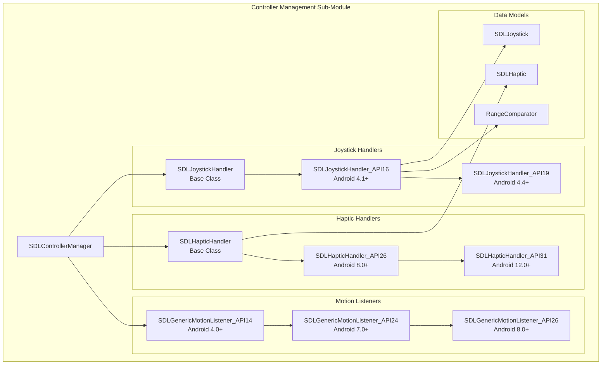
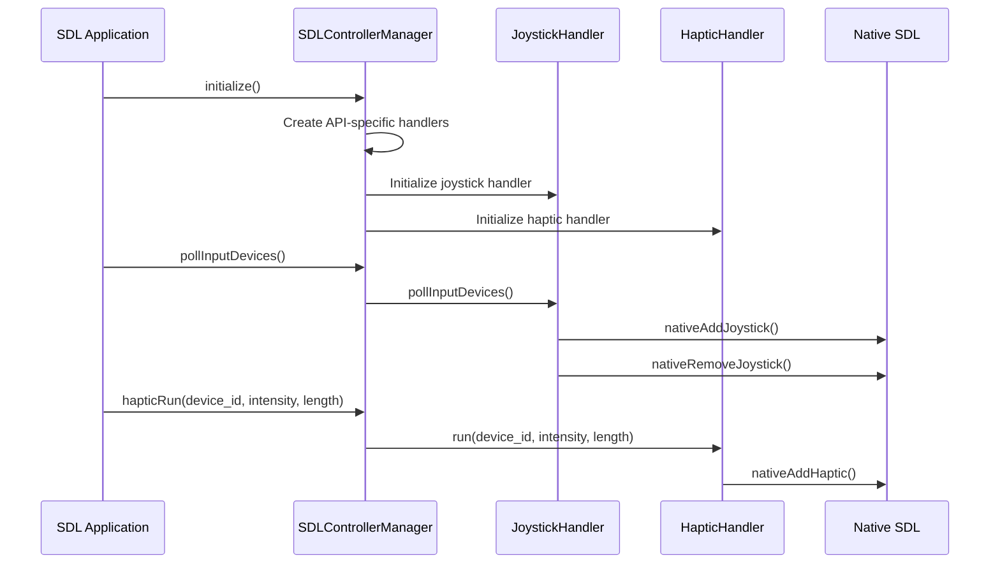
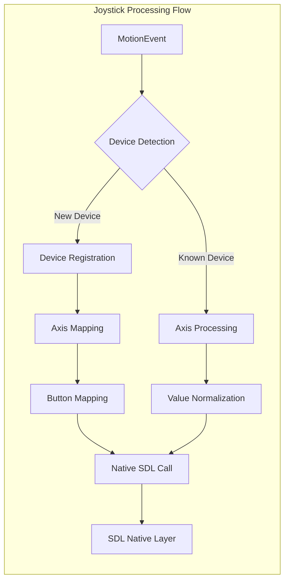
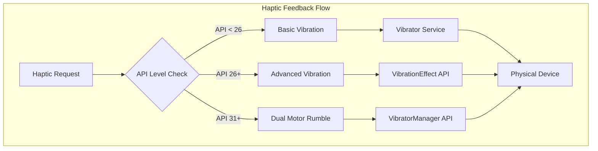
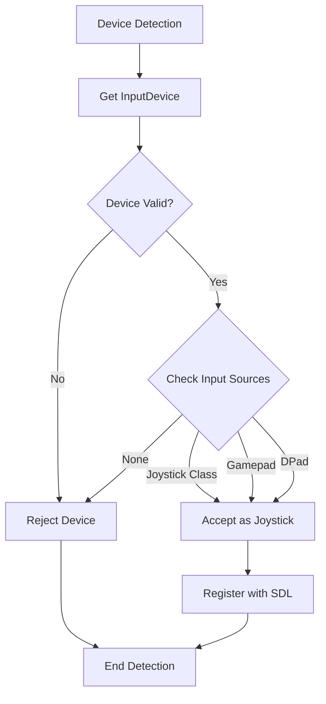

# Controller Management Sub-Module Documentation

## Introduction

The Controller Management Sub-Module is a critical component of the SDL (Simple DirectMedia Layer) Android input system, responsible for handling game controller input, haptic feedback, and motion events. This module provides a comprehensive abstraction layer for managing various types of input devices including gamepads, joysticks, and haptic-capable controllers across different Android API levels.

The module implements sophisticated device detection, input processing, and haptic feedback mechanisms while maintaining compatibility across Android API levels 16 through 31+. It serves as the bridge between Android's input system and SDL's native input handling, ensuring consistent controller behavior across different Android versions and device manufacturers.

## Architecture Overview

### Core Components

The module consists of several key architectural layers:

1. **SDLControllerManager** - Central management class that coordinates all controller operations
2. **Joystick Handler Chain** - API-level specific implementations for joystick input processing
3. **Haptic Handler Chain** - API-level specific implementations for vibration feedback
4. **Motion Listener Chain** - API-level specific implementations for generic motion events



## Component Details

### SDLControllerManager

The central coordinator class that manages the entire controller subsystem. It provides:

- **Device Detection**: Identifies and validates SDL-compatible input devices
- **Handler Initialization**: Creates appropriate API-level specific handlers
- **JNI Bridge**: Interfaces with native SDL code through JNI calls
- **Event Coordination**: Routes input events to appropriate handlers



### Joystick Handler Architecture

The joystick handler implements a chain of responsibility pattern with API-level specific implementations:

#### SDLJoystickHandler (Base Class)
- Defines the interface for joystick handling
- Provides basic motion event processing framework
- Establishes device polling mechanism

#### SDLJoystickHandler_API16 (Android 4.1+)
- Implements basic joystick detection and management
- Handles axis mapping and normalization
- Manages device lifecycle (add/remove)
- Implements sophisticated axis sorting algorithm

#### SDLJoystickHandler_API19 (Android 4.4+)
- Extends API16 with enhanced device identification
- Provides vendor/product ID support
- Implements comprehensive button mapping
- Adds advanced axis mask computation



### Haptic Handler Architecture

The haptic feedback system provides vibration capabilities with API-level specific implementations:

#### SDLHapticHandler (Base Class)
- Basic vibration support using Android's Vibrator service
- Manages haptic device lifecycle
- Provides simple vibration patterns

#### SDLHapticHandler_API26 (Android 8.0+)
- Introduces VibrationEffect API support
- Provides precise intensity control
- Implements error handling and fallbacks

#### SDLHapticHandler_API31 (Android 12.0+)
- Advanced dual-motor rumble support
- Implements frequency-separated vibration
- Provides sophisticated intensity mixing



### Motion Listener Architecture

The motion listener chain handles generic motion events including mouse, stylus, and joystick input:

#### SDLGenericMotionListener_API14 (Android 4.0+)
- Basic mouse hover and scroll support
- Joystick motion event handling
- Stylus input processing

#### SDLGenericMotionListener_API24 (Android 7.0+)
- Adds relative mouse mode support
- Implements pointer capture capabilities
- Enhanced mouse movement tracking

#### SDLGenericMotionListener_API26 (Android 8.0+)
- Advanced pointer capture management
- DeX mode compatibility
- Relative mouse mode optimization

## Data Models

### SDLJoystick
Represents a joystick device with its properties:
- Device identification and metadata
- Axis and hat (D-pad) configuration
- Motion range specifications
- Capability flags

### SDLHaptic
Represents a haptic feedback device:
- Device identification
- Vibrator service reference
- Capability indicators

### RangeComparator
Implements sophisticated axis sorting algorithm:
- Handles controller-specific axis mapping
- Manages trigger button swapping
- Optimizes axis ordering for SDL compatibility

## API Integration

### Native Interface
The module communicates with SDL's native layer through JNI:

```java
// Native method declarations
static native int nativeSetupJNI();
static native void nativeAddJoystick(int device_id, String name, String desc,
                                    int vendor_id, int product_id,
                                    int button_mask, int naxes, int axis_mask, 
                                    int nhats, boolean can_rumble);
static native void nativeRemoveJoystick(int device_id);
static native void nativeAddHaptic(int device_id, String name);
static native void nativeRemoveHaptic(int device_id);
```

### Device Detection Algorithm



## Dependencies

### Internal Dependencies
- **SDLActivity**: Provides context and view management
- **SDL**: Core SDL context and system services
- **android_hid_module**: HID device management for advanced controller support

### External Dependencies
- **Android Input System**: InputDevice, MotionEvent, KeyEvent
- **Android Vibrator Service**: Vibration feedback
- **Android OS**: Build.VERSION for API level detection

## Error Handling

The module implements comprehensive error handling:

1. **Device Validation**: Checks for null devices and invalid IDs
2. **API Compatibility**: Graceful fallbacks for unsupported features
3. **Exception Handling**: Catches and handles vibration API exceptions
4. **Resource Management**: Proper cleanup of device references

## Performance Considerations

1. **Device Polling**: Efficient device enumeration and caching
2. **Event Processing**: Optimized motion event handling
3. **Memory Management**: Proper resource cleanup and garbage collection
4. **JNI Optimization**: Minimized JNI calls through batch processing

## Security Considerations

1. **Input Validation**: All device inputs are validated before processing
2. **Permission Handling**: Vibrator service permissions are properly managed
3. **Resource Access**: Controlled access to system input devices

## Testing and Validation

The module includes comprehensive testing capabilities:

1. **Device Detection Testing**: Validates device identification logic
2. **Input Processing Testing**: Ensures correct event handling
3. **Haptic Feedback Testing**: Validates vibration patterns and intensity
4. **Compatibility Testing**: Verifies behavior across API levels

## Future Enhancements

1. **Enhanced Controller Support**: Additional controller type recognition
2. **Advanced Haptic Patterns**: Complex vibration sequences
3. **Gesture Recognition**: Advanced motion pattern detection
4. **Performance Optimization**: Reduced latency input processing

## Related Documentation

- [android_sdl_input_module.md](android_sdl_input_module.md) - Parent input module documentation
- [android_hid_module.md](android_hid_module.md) - HID device management
- [android_sdl_core_module.md](android_sdl_core_module.md) - Core SDL functionality
- [activity_management_sub_module.md](activity_management_sub_module.md) - Activity lifecycle management