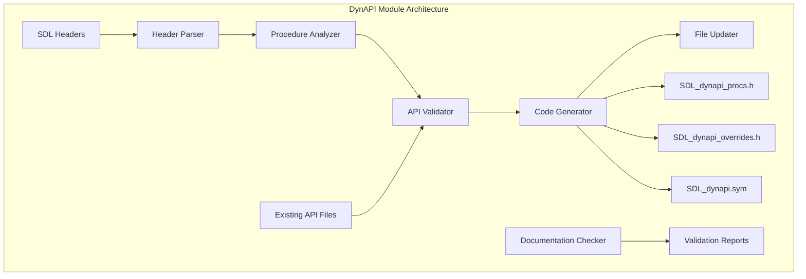
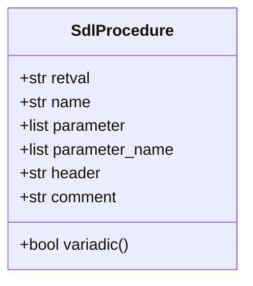
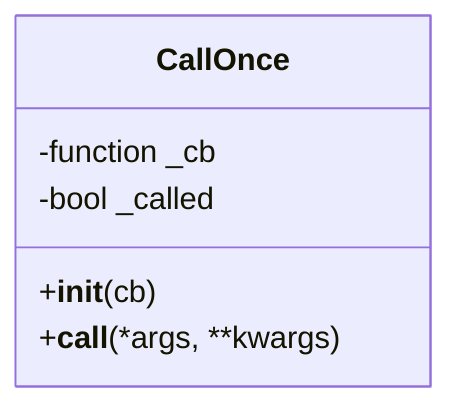
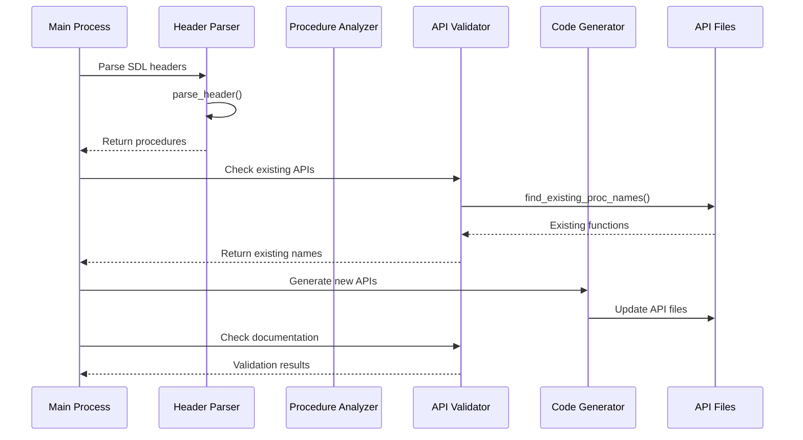
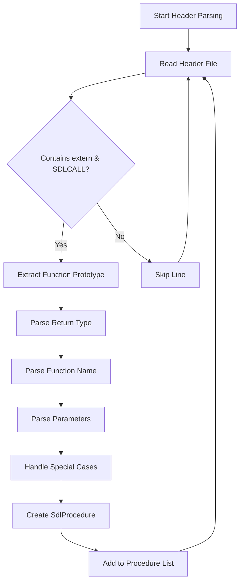
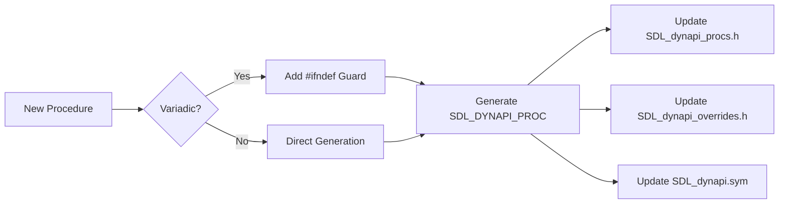
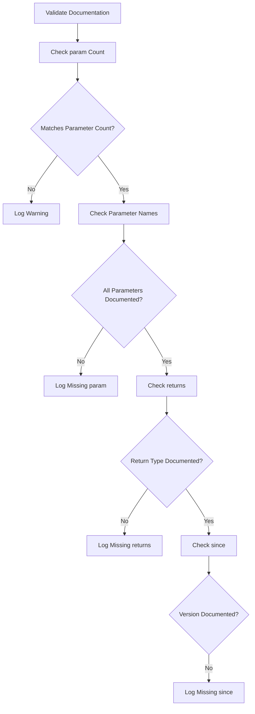
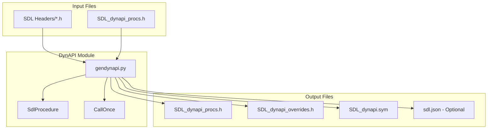
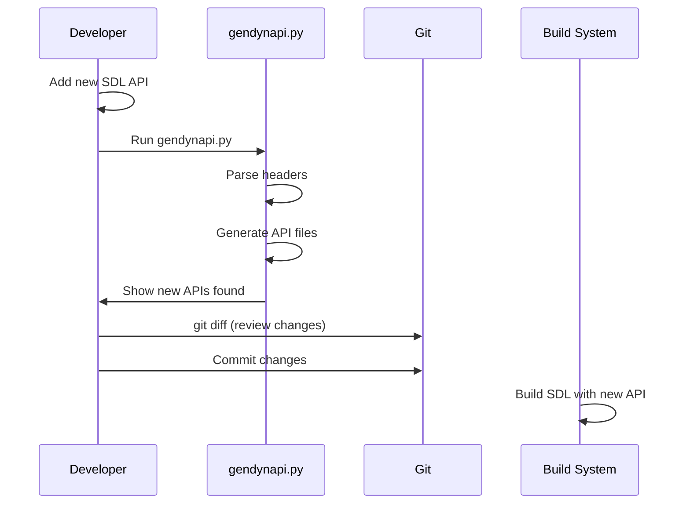

# DynAPI Module Documentation

## Introduction

The DynAPI module is a critical component of the SDL (Simple DirectMedia Layer) library that manages the dynamic API jump table system. This module automatically generates and maintains the dynamic API infrastructure that allows SDL to provide runtime API resolution and compatibility across different platforms and configurations.

The module's primary purpose is to parse SDL header files, extract public API function declarations, and automatically update the dynamic API jump table files. This ensures that when new public APIs are added to SDL, they are properly integrated into the dynamic API system without manual intervention.

## Architecture Overview



## Core Components

### SdlProcedure Class

The `SdlProcedure` class is a dataclass that represents a single SDL API function with all its metadata:



**Properties:**
- `retval`: The return value type of the function
- `name`: The function name
- `parameter`: List of parameter types with anonymized parameter names
- `parameter_name`: List of actual parameter names
- `header`: The header file where the function is declared
- `comment`: The documentation comment associated with the function

**Methods:**
- `variadic()`: Returns true if the function has variadic parameters (contains "...")

### CallOnce Class

The `CallOnce` class is a utility that ensures a callback function is executed only once, regardless of how many times it's called:



**Purpose:**
- Prevents duplicate execution of initialization or warning functions
- Used in documentation checking to ensure warning headers are printed only once

## Data Flow Architecture



## Processing Pipeline

### 1. Header Parsing Phase



**Special Cases Handled:**
- Variadic functions (printf-style functions)
- Function pointer parameters (callbacks)
- Array parameters
- Platform-specific attributes and macros
- Comment blocks and documentation

### 2. API Generation Phase



### 3. Documentation Validation Phase



## File Structure and Dependencies



## Integration with SDL Build System

The DynAPI module integrates with the SDL build system in several ways:

1. **Automatic API Discovery**: Scans all SDL header files in `include/SDL3/`
2. **Dynamic API Maintenance**: Updates three critical files that enable SDL's dynamic API system
3. **Build Validation**: Ensures all public APIs are properly documented and follow SDL conventions
4. **Version Control Integration**: Designed to be run during development and committed with new API additions

## Usage Workflow



## Command Line Interface

The script supports several command-line options:

```bash
# Basic usage - update API files
./gendynapi.py

# Debug mode - show detailed parsing information
./gendynapi.py --debug

# Dump complete API to JSON file
./gendynapi.py --dump api.json

# Dump to default file (sdl.json)
./gendynapi.py --dump
```

## Error Handling and Validation

The module implements comprehensive error handling:

1. **Parsing Errors**: Validates function prototypes and provides detailed error messages
2. **Documentation Warnings**: Checks for missing or incorrect documentation tags
3. **File System Errors**: Handles missing files and permission issues
4. **API Consistency**: Ensures API declarations match across all generated files

## Performance Considerations

- **Efficient Parsing**: Uses compiled regular expressions for performance
- **Memory Management**: Processes files line-by-line to handle large headers
- **Incremental Updates**: Only processes new APIs, preserving existing entries
- **Reproducible Output**: Sorts headers and procedures for consistent results

## Relationship to Other Modules

The DynAPI module has dependencies and relationships with several other SDL modules:

- **[hid_api_module](hid_api_module.md)**: Manages HID device APIs that are processed by DynAPI
- **[android_hid_module](android_hid_module.md)**: Android-specific HID implementations included in dynamic API
- **[android_sdl_core_module](android_sdl_core_module.md)**: Core SDL functionality that relies on dynamic API
- **[gameinput_module](gameinput_module.md)**: Game input APIs that need dynamic resolution

## Maintenance and Development

When adding new SDL APIs, developers should:

1. Add the API declaration to the appropriate header file
2. Run `gendynapi.py` to update the dynamic API files
3. Review the changes with `git diff`
4. Commit the updated API files along with the new API
5. Ensure proper documentation with `\param`, `\returns`, and `\since` tags

The module is designed to be maintenance-free for routine API additions while providing comprehensive validation and error reporting for edge cases and documentation issues.