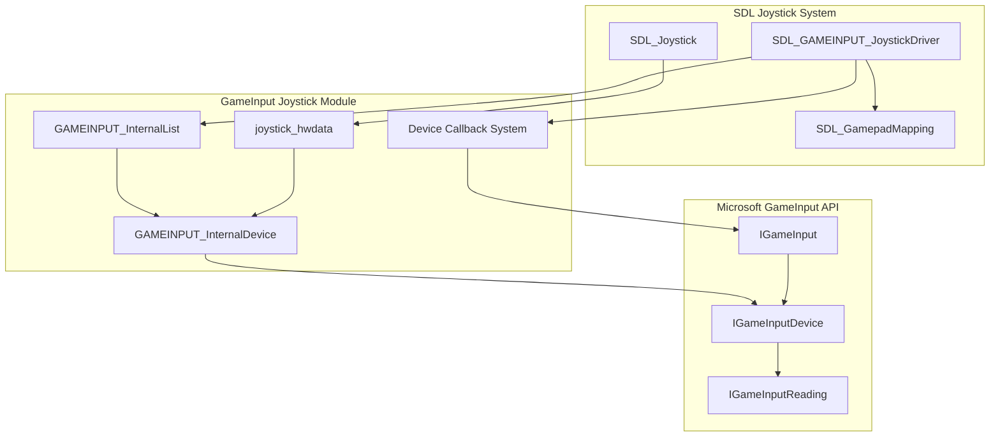
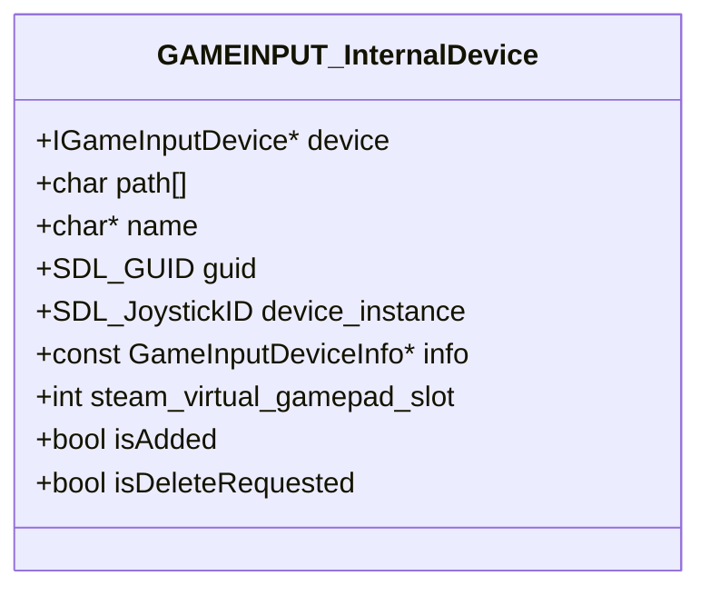
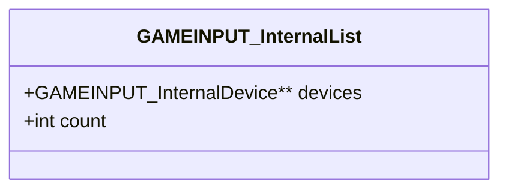
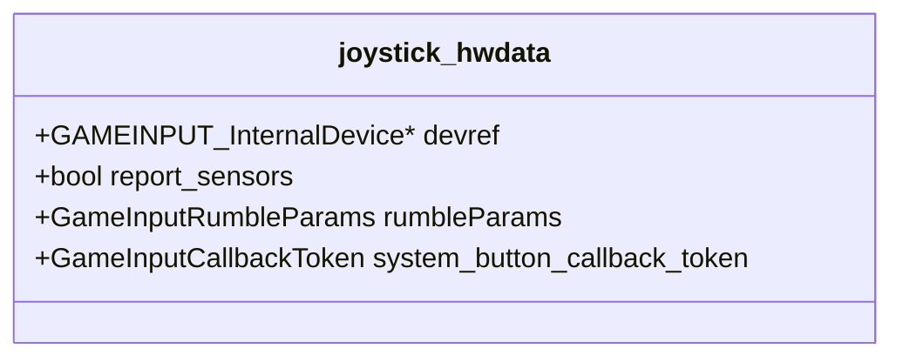
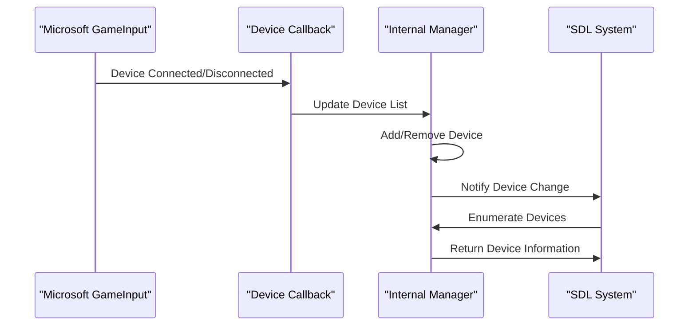
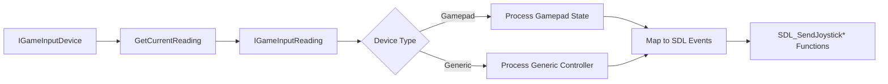
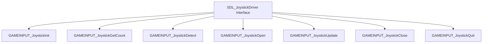

# GameInput Joystick Sub-Module Documentation

## Introduction

The GameInput Joystick Sub-Module is a specialized component within SDL's joystick input system that provides native support for gaming controllers through Microsoft's GameInput API. This module serves as a bridge between SDL's cross-platform joystick abstraction and the Windows-specific GameInput framework, enabling advanced controller features like haptic feedback, trigger rumble, and system button handling.

The module is particularly important for modern gaming applications on Windows platforms, offering superior controller support compared to traditional input methods, with native integration for Xbox controllers and other GameInput-compatible devices.

## Architecture Overview

### Core Components

The module consists of three primary data structures that work together to manage GameInput devices:

1. **GAMEINPUT_InternalDevice** - Represents individual GameInput devices with their properties and SDL mappings
2. **GAMEINPUT_InternalList** - Manages the collection of available GameInput devices
3. **joystick_hwdata** - Hardware-specific data for active joystick instances

### System Integration

## Component Details

### GAMEINPUT_InternalDevice Structure

This structure encapsulates all necessary information about a GameInput device:

**Key Features:**
- Maintains a reference to the underlying IGameInputDevice object
- Stores SDL-specific identifiers (GUID, instance ID) for integration with SDL's joystick system
- Manages device lifecycle through `isAdded` and `isDeleteRequested` flags
- Supports Steam's virtual gamepad system for compatibility with Steam Input

### GAMEINPUT_InternalList Structure

Manages the collection of available GameInput devices:

**Responsibilities:**
- Dynamic array management for device storage
- Thread-safe device enumeration
- Memory management for device entries

### joystick_hwdata Structure

Hardware-specific data for active joystick instances:

**Capabilities:**
- Direct reference to the associated GameInput device
- Haptic feedback parameter storage
- System button (Guide/Share) callback management
- Sensor reporting control

## Data Flow Architecture

### Device Detection and Management

### Input Processing Pipeline

## Key Functional Areas

### Device Lifecycle Management

The module implements comprehensive device lifecycle management:

1. **Initialization**: Registers device callbacks and enumerates existing devices
2. **Hot-plugging**: Responds to device connection/disconnection events
3. **Device Filtering**: Excludes devices handled by other SDL drivers
4. **Cleanup**: Proper resource deallocation and callback unregistration

### Input Translation

The module translates GameInput data to SDL's joystick events:

- **Gamepad Mapping**: Standard Xbox-style controller layout
- **Generic Controllers**: Support for custom button/axis configurations
- **Hat/D-pad**: Conversion from GameInput switch states to SDL hat values
- **Axis Calibration**: Proper scaling of analog inputs to SDL's 16-bit range

### Advanced Features

#### Haptic Feedback
- Dual-motor rumble support (low/high frequency)
- Trigger rumble for supported devices
- Parameter-based rumble control

#### System Button Handling
- Xbox Guide button support
- Share button integration (GameInput 1.0+)
- Dedicated callback system for system-level buttons

#### Steam Integration
- Virtual gamepad slot detection
- Steam Input compatibility
- Raw device path preservation

## Integration with SDL System

### Driver Interface

The module implements the standard `SDL_JoystickDriver` interface:

### Configuration and Hints

The module respects SDL configuration hints:

- **SDL_HINT_JOYSTICK_GAMEINPUT**: Controls whether GameInput support is enabled
- **Default behavior**: Enabled on GDK platforms, disabled elsewhere
- **Runtime configuration**: Can be changed before joystick subsystem initialization

## Dependencies and Relationships

### Internal Dependencies

The module relies on several SDL subsystems:

- **[SDL Windows Core](sdl_windows_core.md)**: Windows-specific utilities and error handling
- **[SDL GameInput Core](sdl_gameinput_core.md)**: GameInput API initialization and management
- **[SDL Joystick System](sdl_joystick_system.md)**: Base joystick functionality and interfaces

### External Dependencies

- **Microsoft GameInput API**: Requires Windows SDK with GameInput support
- **Platform Support**: Windows 10/11, Xbox (GDK), and compatible platforms

## Error Handling and Robustness

### Error Management

The module implements comprehensive error handling:

- **HRESULT Translation**: Converts GameInput API errors to SDL error messages
- **Resource Cleanup**: Ensures proper cleanup on failure conditions
- **Graceful Degradation**: Falls back gracefully when GameInput is unavailable

### Thread Safety

- **Joystick Locking**: Uses SDL's joystick lock system for thread safety
- **Callback Synchronization**: Proper synchronization of device callbacks
- **Atomic Operations**: Safe device list modifications

## Performance Considerations

### Optimization Strategies

1. **Lazy Evaluation**: Device properties are cached and only updated when necessary
2. **Batch Processing**: Multiple input readings processed in single update cycles
3. **Memory Pooling**: Efficient memory management for device structures
4. **Callback Efficiency**: Minimal processing in device callback functions

### Resource Management

- **Reference Counting**: Proper COM object lifecycle management
- **Memory Tracking**: All allocations are properly tracked and freed
- **Callback Registration**: Careful management of GameInput callbacks

## Platform-Specific Features

### GDK Integration

On Gaming Development Kit (GDK) platforms:

- **Background Input**: Enables background controller processing
- **System Button Support**: Enhanced Guide and Share button handling
- **Performance Optimization**: Platform-specific optimizations enabled

### Windows-Specific Features

- **Steam Virtual Gamepad**: Integration with Steam's controller emulation
- **Device Path Handling**: Raw device path preservation for advanced applications
- **Power Management**: Battery state monitoring (implementation ready, currently disabled)

## Future Enhancements

### Planned Features

1. **Sensor Support**: Accelerometer and gyroscope integration (GameInput 2.0+)
2. **Battery Monitoring**: Enhanced power state reporting
3. **Advanced Haptics**: Support for advanced haptic patterns
4. **Device Filtering**: More sophisticated device selection mechanisms

### API Evolution

The module is designed to adapt to GameInput API evolution:

- **Version Detection**: Runtime API version detection and adaptation
- **Feature Flags**: Conditional compilation for different API versions
- **Backward Compatibility**: Maintains compatibility with older GameInput versions

## Conclusion

The GameInput Joystick Sub-Module represents a sophisticated integration of Microsoft's GameInput API with SDL's cross-platform joystick abstraction. By providing native support for modern gaming controllers, it enables SDL applications to deliver premium controller experiences on Windows platforms while maintaining the library's cross-platform compatibility and ease of use.

The module's architecture demonstrates careful attention to performance, thread safety, and extensibility, making it suitable for both indie games and AAA titles requiring advanced controller features. Its integration with Steam's virtual gamepad system and support for emerging GameInput features positions it well for future gaming input requirements.