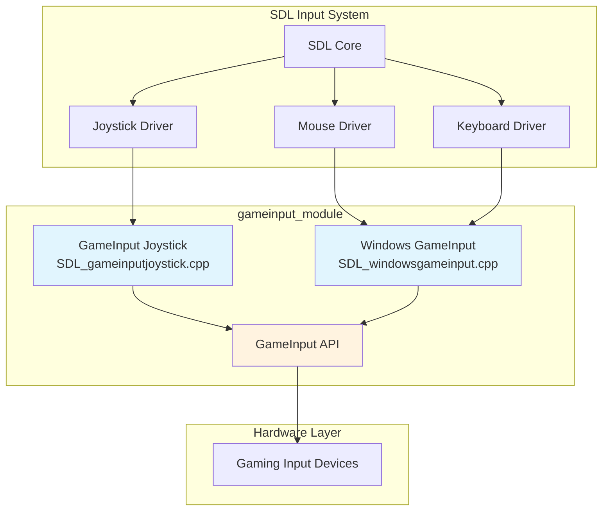
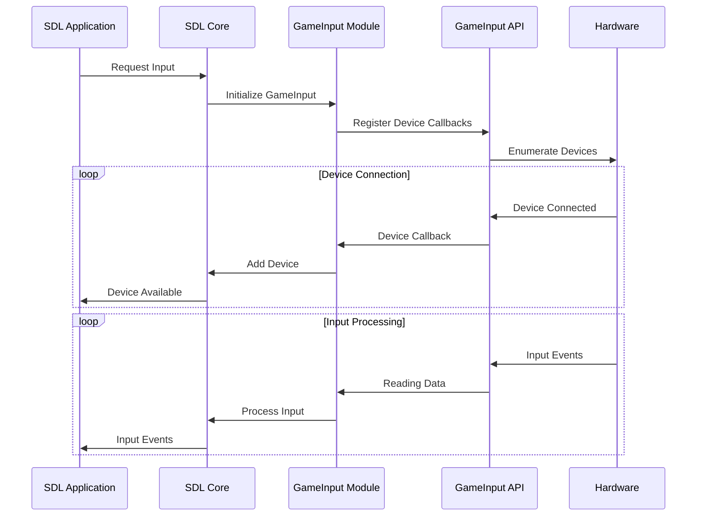

# GameInput Module Documentation

## Overview

The `gameinput_module` is a specialized input handling module for SDL (Simple DirectMedia Layer) that provides GameInput API integration for Windows and GDK (Game Development Kit) platforms. This module serves as a bridge between Microsoft's GameInput API and SDL's input subsystem, enabling advanced gaming input device support including gamepads, joysticks, keyboards, and mice.

## Purpose and Core Functionality

The primary purpose of the gameinput_module is to:
- Provide unified access to gaming input devices through Microsoft's GameInput API
- Handle device enumeration, connection/disconnection events, and input processing
- Support advanced features like rumble/haptic feedback, trigger rumble, and system buttons
- Enable cross-platform compatibility for gaming input devices on Windows and GDK platforms
- Integrate with SDL's existing input subsystem while providing GameInput-specific optimizations

## Architecture Overview

## Module Structure

The gameinput_module consists of two main sub-modules:

### 1. GameInput Joystick Sub-module
**File**: `src/joystick/gdk/SDL_gameinputjoystick.cpp`

This sub-module handles gamepad and joystick input through the GameInput API. It provides:
- Device enumeration and management
- Gamepad button and axis mapping
- Rumble and haptic feedback support
- System button handling (Guide, Share buttons)
- Steam Virtual Gamepad slot detection
- Sensor support (gyroscope, accelerometer) for GameInput 2.0+

**Key Components**:
- `GAMEINPUT_InternalDevice` - Internal device representation
- `GAMEINPUT_InternalList` - Device list management
- `joystick_hwdata` - Per-joystick hardware data
- `SDL_GAMEINPUT_JoystickDriver` - Main driver interface

For detailed documentation, see [GameInput Joystick Sub-module](gameinput_joystick_sub_module.md)

### 2. Windows GameInput Sub-module
**File**: `src/video/windows/SDL_windowsgameinput.cpp`

This sub-module handles mouse and keyboard input through the GameInput API on Windows platforms. It provides:
- Raw mouse input processing with delta tracking
- Raw keyboard input with scancode mapping
- Multi-device support for keyboards and mice
- Integration with SDL's windowing system
- Thread-safe device management

**Key Components**:
- `GAMEINPUT_Device` - Device representation for keyboards/mice
- `WIN_GameInputData` - Global GameInput data structure
- Input delta processing for smooth motion tracking
- Scancode translation for Windows keyboard layouts

For detailed documentation, see [Windows GameInput Sub-module](windows_gameinput_sub_module.md)

## Data Flow Architecture

## Integration with SDL

The gameinput_module integrates with SDL through the standard driver interface:

1. **Joystick Driver Registration**: The module registers itself as `SDL_GAMEINPUT_JoystickDriver` with function pointers for all required operations
2. **Platform Integration**: Windows-specific integration through `WIN_InitGameInput()` and related functions
3. **Hint System**: Uses `SDL_HINT_JOYSTICK_GAMEINPUT` to enable/disable GameInput support
4. **Device Management**: Integrates with SDL's device enumeration and event system

## Platform Support

- **Primary Platform**: Windows (Windows 10/11)
- **GDK Platform**: Xbox and Windows gaming platforms
- **API Versions**: Supports GameInput API versions 1.0 and 2.0+
- **Conditional Compilation**: Uses `SDL_JOYSTICK_GAMEINPUT` and `HAVE_GAMEINPUT_H` defines

## Key Features

### Advanced Input Processing
- **Delta-based Input**: Processes mouse and keyboard input as deltas for smooth, precise tracking
- **Multi-device Support**: Handles multiple keyboards and mice simultaneously
- **Raw Input**: Bypasses Windows message queue for lower latency input

### Gaming Device Support
- **Xbox Controllers**: Native support including Xbox One and Xbox Series controllers
- **System Buttons**: Guide button and Share button support
- **Advanced Rumble**: Support for trigger rumble and multiple rumble motors
- **Steam Integration**: Detection of Steam Virtual Gamepad slots

### Performance Optimizations
- **Thread-safe Operations**: Uses mutex locks for concurrent access
- **Efficient Memory Management**: Stack allocation for temporary data
- **Timestamp Synchronization**: Converts GameInput timestamps to SDL timestamp format

## Dependencies

The gameinput_module depends on several other SDL modules:

- **[android_hid_module](android_hid_module.md)**: For HID device handling patterns
- **[android_sdl_input_module](android_sdl_input_module.md)**: For input management concepts
- **[hid_api_module](hid_api_module.md)**: For device enumeration patterns

## Configuration

The module can be configured through SDL hints:
- `SDL_HINT_JOYSTICK_GAMEINPUT`: Enable/disable GameInput joystick support
- Platform-specific settings for raw input enablement

## Error Handling

The module implements comprehensive error handling:
- HRESULT error conversion for GameInput API failures
- Graceful fallback when GameInput is unavailable
- Memory allocation failure handling
- Device removal during operation

This documentation provides a comprehensive overview of the gameinput_module's architecture and functionality. For detailed implementation specifics, refer to the individual sub-module documentation files.