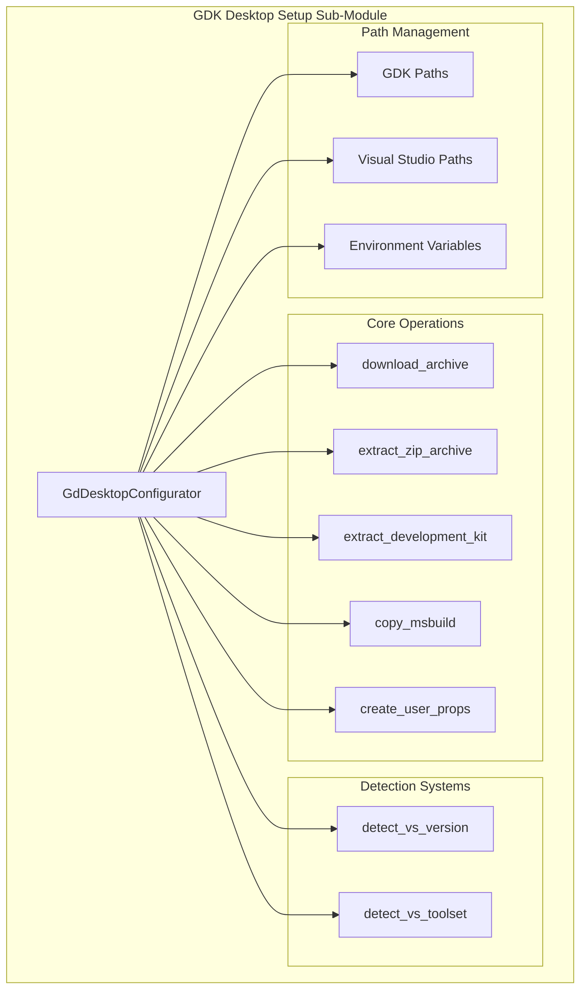
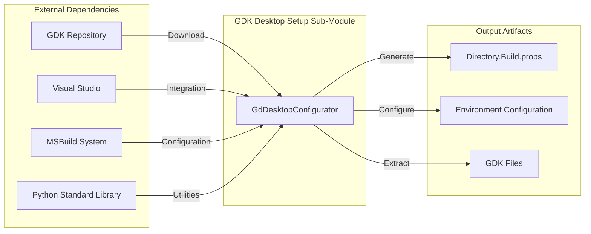
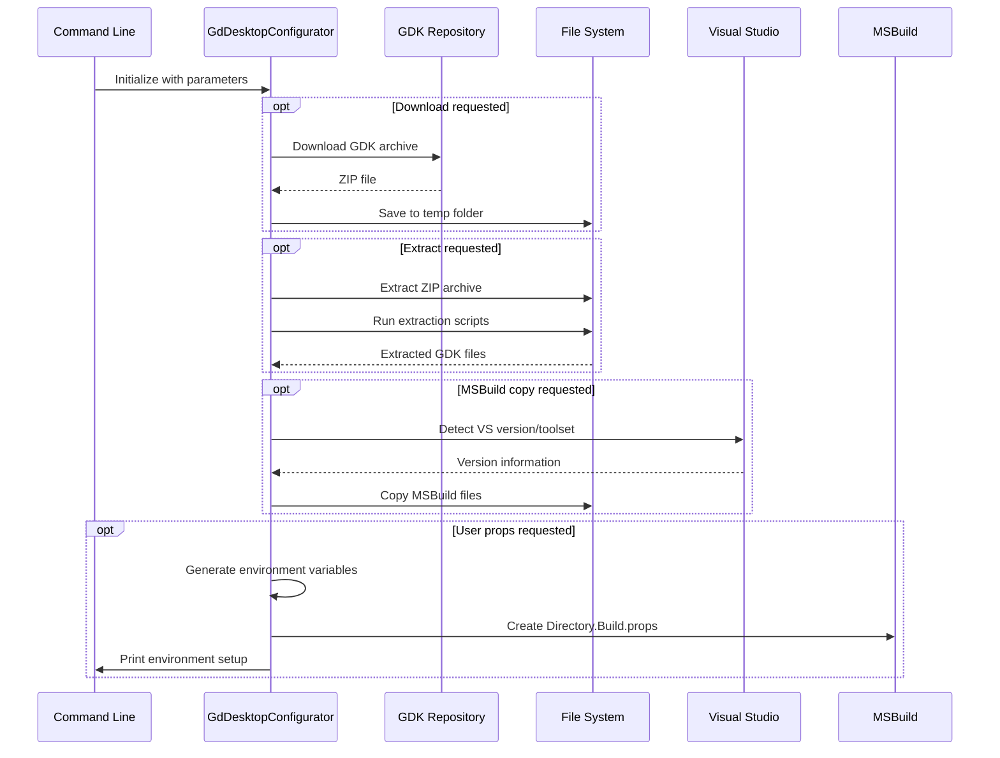
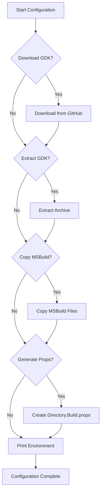

# GDK Desktop Setup Sub-Module Documentation

## Introduction

The GDK Desktop Setup Sub-Module is a critical build infrastructure component responsible for automating the setup and configuration of the Microsoft Game Development Kit (GDK) for desktop development environments. This module streamlines the complex process of downloading, extracting, and configuring GDK components, ensuring proper integration with Visual Studio build systems for game development targeting Windows desktop platforms.

## Module Overview

The gdk_desktop_setup_sub_module is part of the [build_scripts_module](build_scripts_module.md) and provides automated configuration capabilities for the Microsoft GDK. It handles the complete lifecycle of GDK setup, from downloading the appropriate GDK version to configuring build environments and generating necessary MSBuild property files.

## Core Architecture

### Component Structure



### System Integration



## Core Component: GdDesktopConfigurator

### Purpose and Responsibilities

The `GdDesktopConfigurator` class serves as the central orchestrator for GDK desktop setup operations. It manages the complete configuration lifecycle with the following key responsibilities:

1. **GDK Acquisition**: Downloads and extracts GDK archives from Microsoft's GitHub repository
2. **Visual Studio Integration**: Detects compatible Visual Studio versions and toolsets
3. **Build System Configuration**: Copies MSBuild files and generates property files
4. **Environment Setup**: Configures build environment variables and paths

### Key Properties and Methods

#### Configuration Properties
- `git_ref`: Git reference for GDK version (default: "June_2024_Update_1")
- `gdk_edition`: GDK edition identifier (default: "240601")
- `arch`: Target architecture (default: "amd64")
- `gdk_path`: Installation path for GDK files

#### Path Management Properties
```python
@property
def game_dk_path(self) -> Path:  # Microsoft GDK installation path
@property
def windows_sdk_path(self) -> Path:  # Windows SDK path
@property
def gaming_grdk_build_path(self) -> Path:  # GRDK build tools path
```

#### Core Methods
- `download_archive()`: Downloads GDK archive from GitHub
- `extract_zip_archive()`: Extracts downloaded ZIP archive
- `extract_development_kit()`: Runs GDK extraction scripts
- `detect_vs_version()`: Auto-detects Visual Studio version
- `detect_vs_toolset()`: Auto-detects Visual Studio toolset
- `create_user_props()`: Generates MSBuild property files

## Data Flow Architecture

### Setup Process Flow



### Environment Configuration Flow



## Configuration Management

### Visual Studio Integration

The module automatically detects and configures Visual Studio integration through:

1. **Version Detection**: Scans GDK directories for supported VS versions
2. **Toolset Detection**: Identifies available MSBuild toolsets
3. **Path Resolution**: Maps VS installation paths to GDK requirements

### Environment Variables

The configurator generates essential environment variables:

```batch
set "GRDKEDITION=240601"
set "GameDK=C:\GDK\Microsoft GDK\"
set "GameDKLatest=C:\GDK\Microsoft GDK\240601\"
set "WindowsSdkDir=C:\GDK\Windows Kits\10\"
set "GamingGRDKBuild=C:\GDK\Microsoft GDK\240601\GRDK\"
```

### Build Configuration

Generated `Directory.Build.props` file includes:
- Visual Studio targets paths
- GDK edition configuration
- Platform and configuration defaults
- Include and library directory paths

## Dependencies and Integration

### External Dependencies

1. **Microsoft GDK**: Core game development libraries and tools
2. **Visual Studio**: Integrated development environment
3. **MSBuild**: Microsoft build engine
4. **Python Standard Library**: urllib, zipfile, subprocess, pathlib

### Module Relationships

The gdk_desktop_setup_sub_module integrates with:
- [build_scripts_module](build_scripts_module.md): Parent module containing build automation tools
- [build_release_sub_module](build_release_sub_module.md): Related release build configuration
- [android_jni_validation_sub_module](android_jni_validation_sub_module.md): Cross-platform build validation

## Usage Patterns

### Command Line Interface

```bash
# Basic setup with download and configuration
python setup-gdk-desktop.py --download --extract --copy-msbuild \
    --gdk-path "C:\GDK" --vs-folder "C:\Program Files\Microsoft Visual Studio\2022\Professional"

# Generate only environment configuration
python setup-gdk-desktop.py --gdk-path "C:\GDK" --vs-folder "C:\VS" --no-user-props
```

### Programmatic Usage

```python
from build-scripts.setup-gdk-desktop import GdDesktopConfigurator

configurator = GdDesktopConfigurator(
    gdk_path=Path("C:\GDK"),
    arch="amd64",
    vs_folder=Path("C:\Program Files\Microsoft Visual Studio\2022\Professional")
)

# Download and configure GDK
configurator.download_archive()
configurator.extract_zip_archive()
configurator.extract_development_kit()
configurator.copy_msbuild()
configurator.create_user_props(Path("Directory.Build.props"))
```

## Error Handling and Validation

### Validation Points

1. **Archive Integrity**: Verifies downloaded ZIP files exist
2. **Extraction Validation**: Confirms extraction directory creation
3. **Version Compatibility**: Validates Visual Studio version compatibility
4. **Path Existence**: Ensures required directories exist

### Error Scenarios

- **Incompatible VS Version**: Raises `RuntimeError` when no compatible VS version found
- **Multiple VS Versions**: Raises `RuntimeError` when multiple compatible versions detected
- **Missing Toolsets**: Asserts toolset detection with descriptive error messages
- **Network Issues**: Handles download failures through urllib exceptions

## Performance Considerations

### Optimization Strategies

1. **Lazy Evaluation**: Properties like `vs_version` and `vs_toolset` are computed on first access
2. **Temporary File Management**: Uses system temp directory for downloads and extractions
3. **Incremental Operations**: Supports selective execution of setup steps

### Resource Management

- **Disk Space**: Requires sufficient space for GDK download and extraction
- **Network Bandwidth**: Downloads large GDK archives from GitHub
- **File System Operations**: Performs extensive file copying and directory creation

## Security Considerations

### Download Security

- Uses HTTPS for secure GDK downloads from official Microsoft repository
- Validates downloaded file existence before extraction
- No credential storage or sensitive data handling

### File System Security

- Operates within specified directories with proper permission checks
- Uses temporary directories for intermediate operations
- No elevated privileges required for standard operations

## Maintenance and Updates

### Version Management

The module tracks GDK versions through:
- `GIT_REF`: Git reference for GDK repository
- `GDK_EDITION`: Edition identifier in YYMMUU format

### Update Process

1. Update `GIT_REF` and `GDK_EDITION` constants
2. Test compatibility with new GDK version
3. Validate Visual Studio integration
4. Update documentation and examples

## Troubleshooting Guide

### Common Issues

1. **Visual Studio Detection Failures**
   - Verify VS installation path
   - Check GDK compatibility with VS version
   - Ensure proper VS workload installation

2. **Download/Extraction Issues**
   - Check network connectivity
   - Verify sufficient disk space
   - Validate temporary directory permissions

3. **Build Configuration Problems**
   - Review generated Directory.Build.props
   - Verify environment variable settings
   - Check GDK path configurations

### Diagnostic Information

The module provides comprehensive logging through Python's logging framework, enabling detailed troubleshooting of setup operations and configuration issues.

## Conclusion

The gdk_desktop_setup_sub_module serves as a critical automation tool for GDK desktop development setup, significantly reducing the complexity of manual GDK configuration. Its robust architecture handles the complete setup lifecycle while providing flexibility for different development scenarios and maintaining compatibility across GDK and Visual Studio versions.