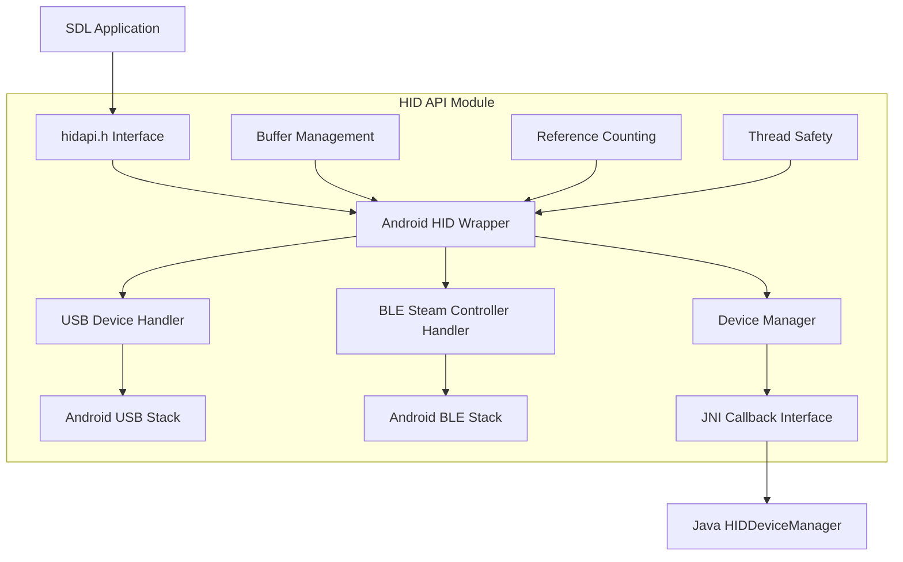
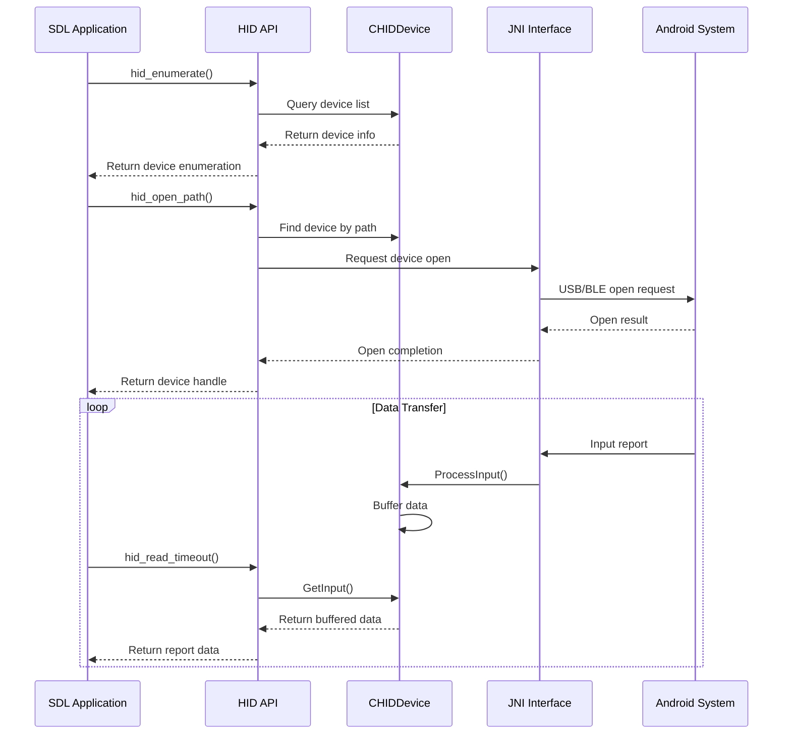

# HID API Module Documentation

## Overview

The HID API module provides a cross-platform interface for communicating with Human Interface Devices (HID) on Android systems. It serves as a bridge between the standard HIDAPI library and Android's native USB and Bluetooth Low Energy (BLE) stacks, enabling SDL applications to interact with HID devices such as game controllers, keyboards, and other input devices.

## Purpose and Scope

This module implements a wrapper layer that:
- Translates HIDAPI calls to Android-specific USB and BLE operations
- Manages device enumeration, connection, and communication
- Handles both USB HID devices and Bluetooth Steam Controllers
- Provides thread-safe device management and data buffering
- Implements reference counting for proper device lifecycle management

## Architecture Overview



## Core Components

### 1. Device Management Layer

**CHIDDevice Class** (`src.hidapi.android.hid.CHIDDevice`)
- Central device abstraction representing individual HID devices
- Manages device lifecycle through reference counting
- Handles device-specific operations (open, close, read, write)
- Implements special handling for Bluetooth Steam Controllers
- Provides thread-safe data buffering and report processing

**Key Features:**
- Reference counting for automatic memory management
- Thread-safe input data queuing with configurable limits
- Synchronous report operations with timeout handling
- Device capability detection and special case handling

### 2. Buffer Management System

**hid_buffer Class** (`src.hidapi.android.hid.hid_buffer`)
- Dynamic byte buffer with automatic memory management
- Efficient data assignment and memory reuse
- Thread-safe operations for concurrent access

**hid_buffer_pool Class** (`src.hidapi.android.hid.hid_buffer_pool`)
- FIFO queue implementation for input data management
- Memory-efficient entry recycling to minimize allocations
- Configurable queue size limits to prevent memory growth
- Thread-safe operations for producer-consumer scenarios

**hid_buffer_entry Structure** (`src.hidapi.android.hid.hid_buffer_entry`)
- Linked list node for buffer pool implementation
- Contains actual data buffer and next pointer

### 3. JNI Interface Layer

The module implements a comprehensive JNI interface for communication with Android's Java-based HID management:

**Callback Registration:**
- `HIDDeviceRegisterCallback`: Establishes JNI method references
- `HIDDeviceReleaseCallback`: Cleans up JNI resources

**Device Lifecycle Management:**
- `HIDDeviceConnected`: Handles new device discovery
- `HIDDeviceDisconnected`: Manages device removal
- `HIDDeviceOpenPending`/`HIDDeviceOpenResult`: Handle permission-based device opening

**Data Transfer:**
- `HIDDeviceInputReport`: Processes incoming HID reports
- `HIDDeviceReportResponse`: Handles synchronous report responses

### 4. Reference Counting System

**hid_device_ref Template Class** (`src.hidapi.android.hid.hid_device_ref`)
- Smart pointer implementation for automatic object lifecycle management
- Thread-safe reference counting with mutex protection
- Automatic deletion when reference count reaches zero
- Copy semantics for proper reference handling

### 5. Thread Safety Mechanisms

**hid_mutex_guard Class** (`src.hidapi.android.hid.hid_mutex_guard`)
- RAII-style mutex lock management
- Automatic lock acquisition and release
- Exception-safe resource management

### 6. Device Enumeration and Information

**hid_device_info Structure** (`src.hidapi.android.hid.hid_device_info`)
- Comprehensive device information storage
- Vendor/product ID, strings, interface details
- Bus type identification (USB/Bluetooth)
- Linked list support for device enumeration

## Data Flow Architecture



## Key Features

### 1. Cross-Platform HIDAPI Compatibility
- Implements standard HIDAPI interface functions
- Maintains compatibility with existing HIDAPI applications
- Provides Android-specific optimizations and features

### 2. Dual Transport Support
- USB HID device support through Android USB host API
- Bluetooth Low Energy support for Steam Controllers
- Automatic transport detection and handling

### 3. Advanced Device Management
- Reference counting for safe multi-client access
- Thread-safe device enumeration and access
- Permission-aware device opening (Android 6.0+)
- Graceful handling of device disconnection

### 4. Efficient Data Handling
- Buffered input with configurable queue sizes
- Synchronous and asynchronous report operations
- Memory-efficient buffer pooling and recycling
- Thread-safe data transfer mechanisms

### 5. Special Device Support
- Enhanced support for Valve Steam Controllers
- Automatic device capability detection
- Custom report handling for specific device types

## Integration with Android System

The module integrates with Android through:

1. **JNI Interface**: Native methods registered with Java HIDDeviceManager
2. **Permission System**: Handles USB and Bluetooth permission requests
3. **Android USB Host API**: Direct USB device communication
4. **Android BLE API**: Bluetooth Low Energy device support
5. **SDL Android Integration**: Leverages SDL's Android platform layer

## Error Handling and Robustness

- Comprehensive error checking for JNI operations
- Graceful handling of device disconnection
- Timeout mechanisms for synchronous operations
- Exception-safe resource management
- Detailed logging for debugging and diagnostics

## Performance Considerations

- Memory pooling to minimize allocation overhead
- Efficient buffer management with size limits
- Thread-safe operations without excessive locking
- Optimized data paths for common operations
- Reference counting to avoid unnecessary object creation/destruction

## Dependencies and Integration

This module depends on:
- [android_hid_module](android_hid_module.md) - Android-specific HID device implementations including HIDDeviceManager, HIDDeviceUSB, and HIDDeviceBLESteamController
- SDL Android platform layer for JNI environment access
- Android NDK for native development
- Standard C++ library for containers and algorithms

### Relationship with Android HID Module

The HID API module serves as the **native interface layer** that communicates with the Android HID module's Java components through JNI. While the android_hid_module handles the actual Android system integration (USB host API, BLE stack, permissions), the hid_api_module provides the standard HIDAPI interface that SDL applications use.

Key integration points:
- **HIDDeviceManager**: Java component that manages device lifecycle and permissions
- **HIDDeviceUSB**: Handles USB device communication at the Java level
- **HIDDeviceBLESteamController**: Manages Bluetooth Steam Controller connections
- **JNI Bridge**: Native methods that allow C++ code to call Java functionality

## Usage Examples

The module is typically used through the standard HIDAPI interface:

```c
// Initialize HIDAPI
hid_init();

// Enumerate available devices
struct hid_device_info *devices = hid_enumerate(0, 0);

// Open a specific device
hid_device *device = hid_open_path(device_path);

// Read input reports
unsigned char data[64];
int res = hid_read_timeout(device, data, sizeof(data), 1000);

// Write output reports
unsigned char report[] = {0x01, 0x80, 0x00};
hid_write(device, report, sizeof(report));

// Clean up
hid_close(device);
hid_exit();
```

## Test and Development Tools

### HIDAPI Test GUI

The module includes a comprehensive test application (`src.hidapi.testgui.test.hid_device_info`) that provides:

- **Device Enumeration**: Lists all available HID devices with detailed information
- **Connection Management**: Connect/disconnect functionality with real-time status
- **Data Transfer Testing**: Send output reports and receive input reports
- **Feature Report Support**: Send and receive feature reports for device configuration
- **Cross-Platform GUI**: Built with FOX toolkit for consistent interface across platforms

**Key Features:**
- Real-time input monitoring with configurable polling intervals
- Hex/decimal/octal data input support
- Report length specification and automatic padding
- Error handling and status reporting
- Device information display (VID/PID, manufacturer, product strings)

**Usage:**
The test GUI serves as both a development tool and example implementation, demonstrating proper HIDAPI usage patterns and device communication protocols.

## Summary

The HID API module provides a robust, thread-safe, and efficient interface for HID device communication on Android. Its architecture emphasizes:

- **Compatibility**: Full HIDAPI standard compliance
- **Performance**: Efficient buffering and memory management
- **Reliability**: Comprehensive error handling and resource management
- **Extensibility**: Clean architecture supporting multiple transport types
- **Integration**: Seamless Android system integration through JNI

This module serves as a critical bridge between SDL applications and Android's HID subsystem, enabling robust and efficient communication with a wide variety of human interface devices while maintaining the familiar HIDAPI interface that developers expect.