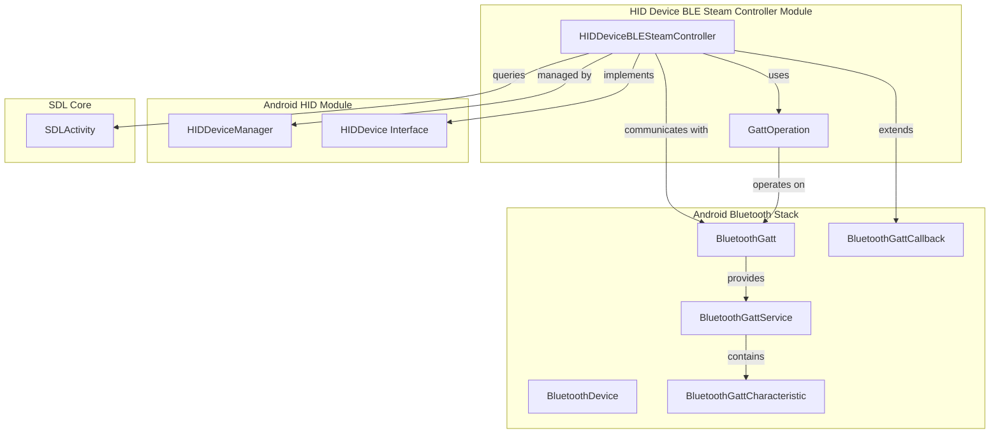
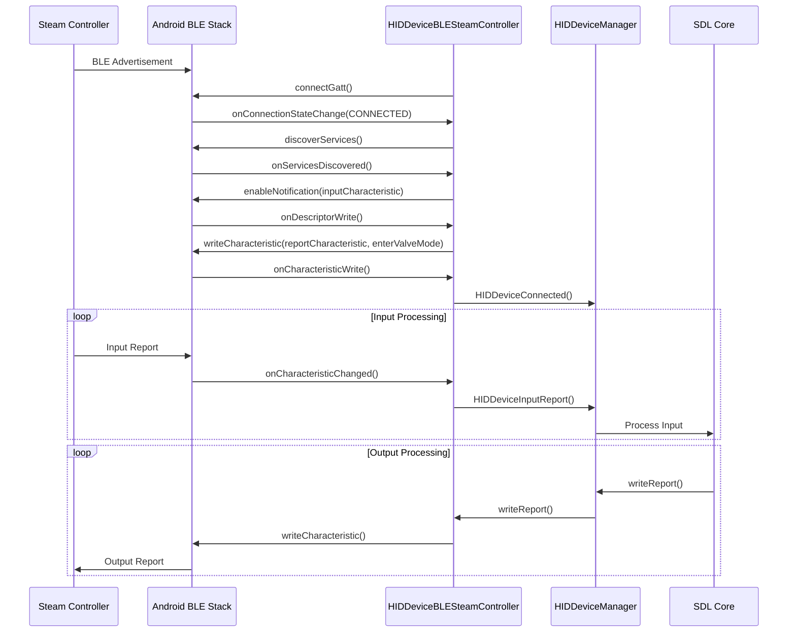
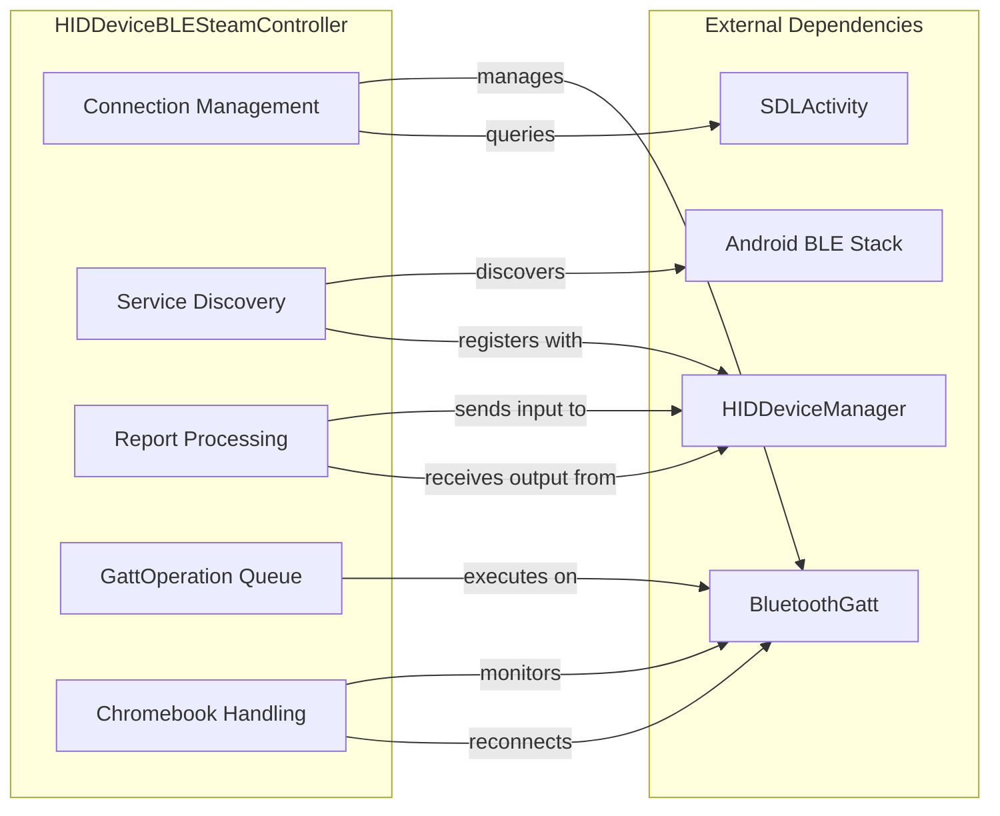
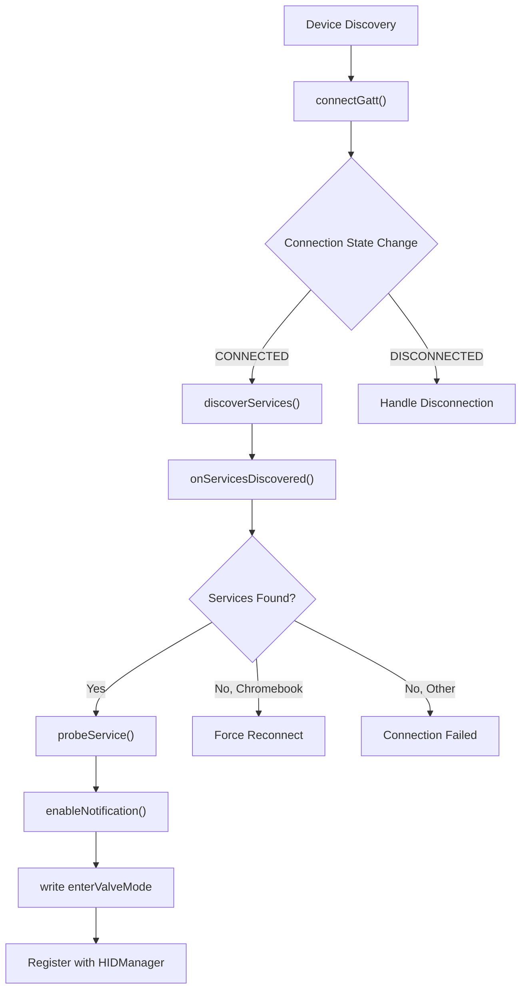
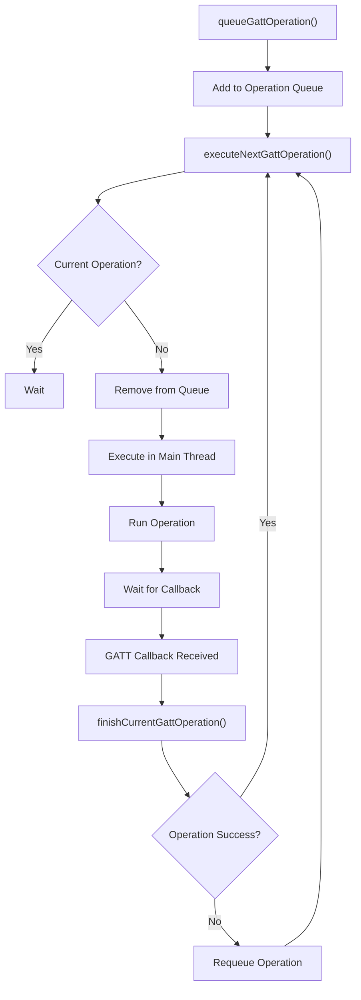

# HID Device BLE Steam Controller Module

## Introduction

The `hid_device_ble_steam_controller` module provides specialized support for Steam Controllers connected via Bluetooth Low Energy (BLE) on Android devices. This module implements the HID (Human Interface Device) protocol for Valve's Steam Controller, enabling game developers to integrate Steam Controller support into their SDL-based Android applications.

The module handles the complex BLE GATT (Generic Attribute Profile) communication required for Steam Controllers, including service discovery, characteristic operations, and Chromebook-specific connection management issues.

## Architecture Overview

## Core Components

### HIDDeviceBLESteamController

The main class that implements the HIDDevice interface for Steam Controllers over BLE. This class manages:

- BLE connection establishment and maintenance
- GATT service discovery and characteristic operations
- Chromebook-specific connection issue handling
- HID report processing and forwarding to SDL

**Key Responsibilities:**
- Implements the HIDDevice interface for Steam Controllers
- Manages BLE GATT connection lifecycle
- Handles Steam Controller service discovery
- Processes input reports from the controller
- Manages feature report read/write operations
- Implements Chromebook-specific connection recovery

### GattOperation

A helper class that encapsulates GATT operations (read, write, enable notifications) and provides a queued execution mechanism for thread-safe BLE operations.

**Key Responsibilities:**
- Encapsulates different types of GATT operations
- Provides static factory methods for creating operations
- Handles operation execution and result tracking
- Manages characteristic and descriptor access

## Data Flow Architecture

## Component Interaction Diagram

## Process Flow

### Connection Establishment Flow

### GATT Operation Execution Flow

## Key Features

### Steam Controller Service Support

The module implements support for Valve's proprietary Steam Controller BLE service:

- **Service UUID**: `100F6C32-1735-4313-B402-38567131E5F3`
- **Input Characteristic**: `100F6C33-1735-4313-B402-38567131E5F3` - Receives input reports
- **Report Characteristic**: `100F6C34-1735-4313-B402-38567131E5F3` - Sends output/feature reports

### Chromebook Compatibility

Special handling for Chromebook devices that exhibit unique BLE connection behaviors:

- Forces Low Energy transport mode (`TRANSPORT_LE`)
- Implements connection state monitoring
- Provides automatic reconnection for Chromebook-specific issues
- Handles the "BtGatt.ContextMap bug" that affects service discovery

### Queued GATT Operations

Thread-safe execution of BLE operations through a queued mechanism:

- All GATT operations are serialized through a queue
- Operations execute on the main thread to ensure Android BLE stack compatibility
- Failed operations are automatically retried
- Supports read, write, and notification enable operations

## Integration with HID Device Manager

The module integrates with the [android_hid_module](android_hid_module.md) through the HIDDevice interface:

- Reports device connection status via `HIDDeviceConnected()`
- Delivers input reports through `HIDDeviceInputReport()`
- Handles feature report responses with `HIDDeviceReportResponse()`
- Receives device ID assignment from the manager

## Error Handling and Recovery

### Connection Recovery
- Automatic reconnection for failed connections
- Chromebook-specific connection monitoring
- Service discovery retry mechanism
- Force disconnect/reconnect for stuck connections

### Operation Failure Handling
- Failed GATT operations are requeued for retry
- Connection state validation before operations
- Graceful degradation for unsupported operations

## Dependencies

### Direct Dependencies
- [android_hid_module](android_hid_module.md) - Provides HIDDevice interface and device management
- [android_sdl_core_module](android_sdl_core_module.md) - Provides SDLActivity for Chromebook detection
- Android Bluetooth APIs - BLE GATT communication
- Android Handler/Looper - Main thread operation execution

### Indirect Dependencies
- HID API module - Native HID implementation
- SDL Controller Manager - Input processing pipeline

## Usage Considerations

### Performance
- All BLE operations are asynchronous and queued
- Input reports are processed immediately upon receipt
- Chromebook connection checking runs on a 10-second interval

### Thread Safety
- GATT operations are serialized through a queue
- All BLE operations execute on the main thread
- Synchronization used for operation queue management

### Platform Specifics
- Android 6.0+ supports forced LE transport mode
- Chromebook devices require special connection handling
- Service discovery timing varies by Android version

## Future Enhancements

Potential areas for improvement:
- Support for other BLE HID devices beyond Steam Controller
- Enhanced error recovery mechanisms
- Power management optimization
- Multi-controller support improvements