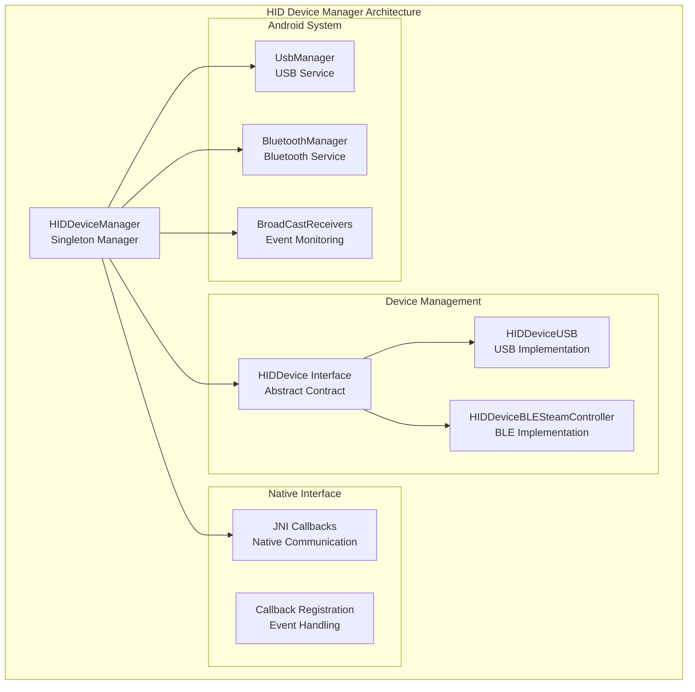
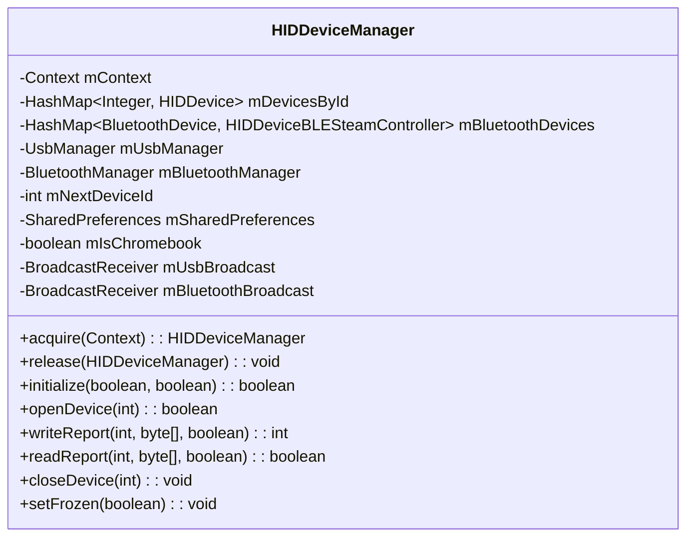
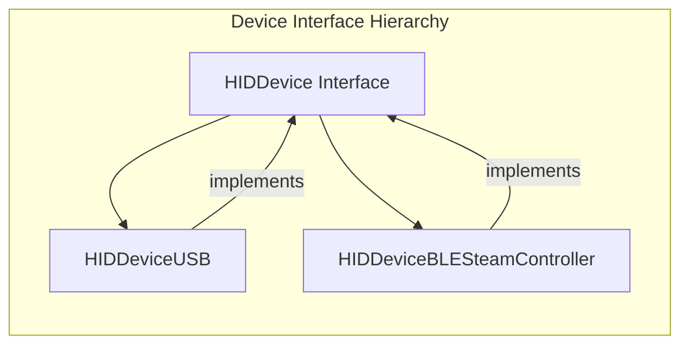
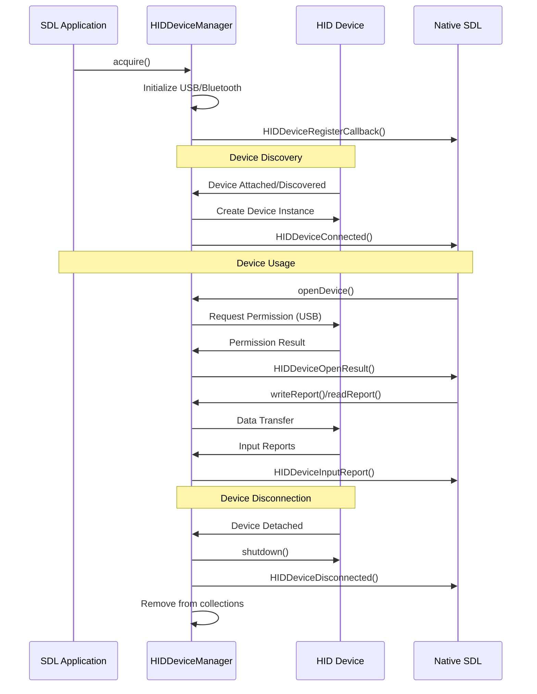
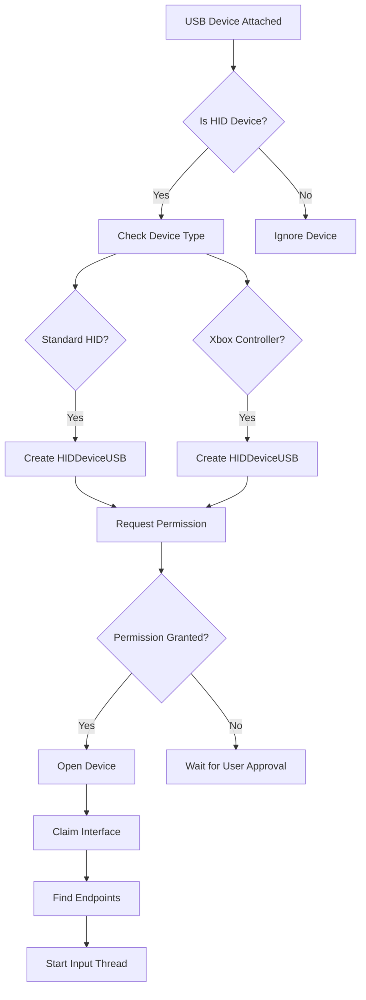
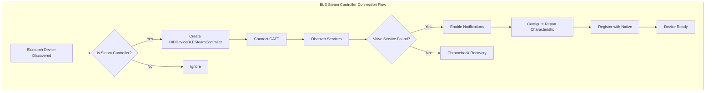
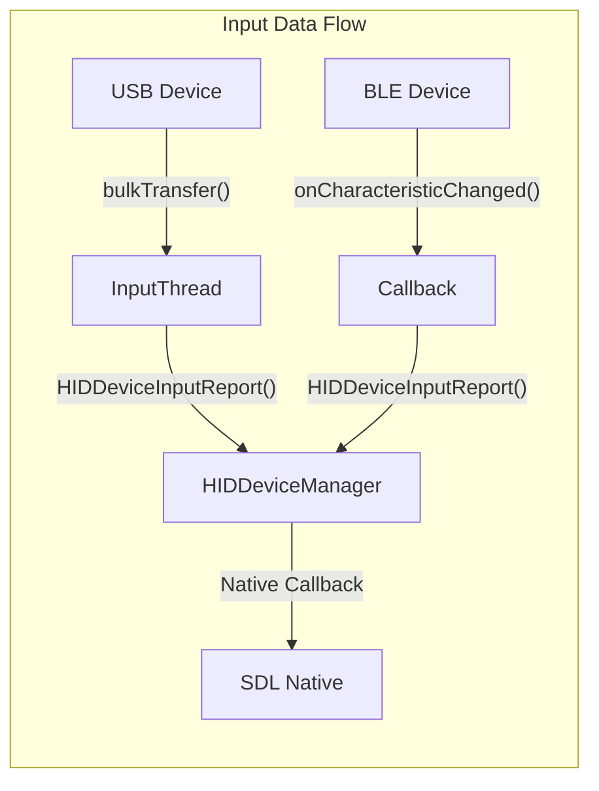
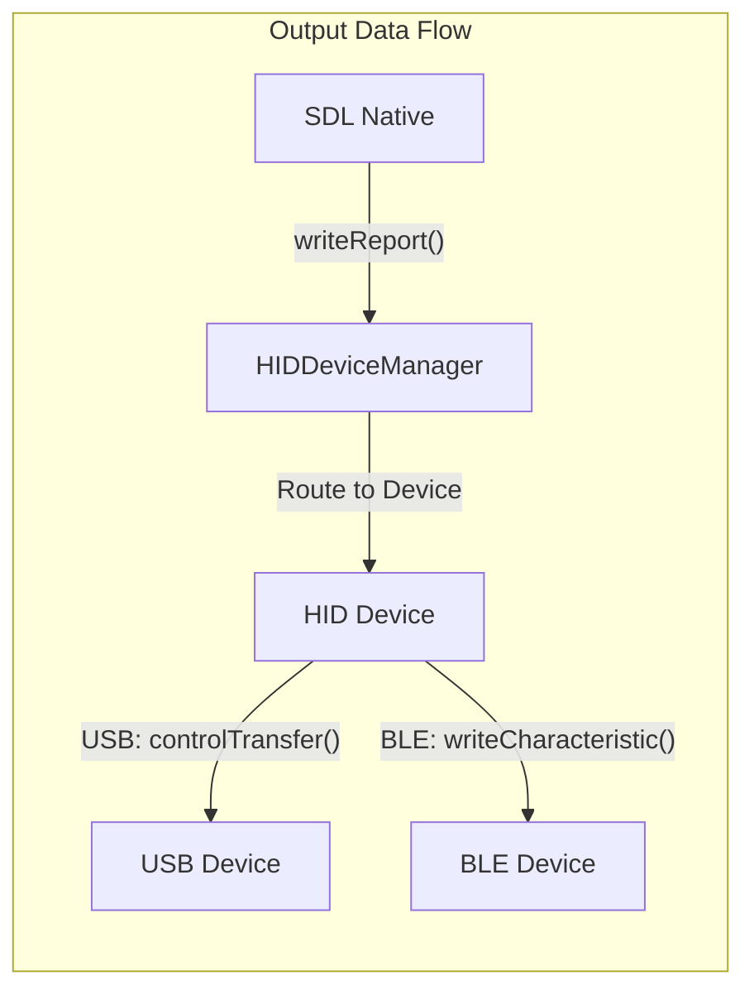

# HID Device Manager Module

## Introduction

The HID Device Manager module serves as the central orchestrator for Human Interface Device (HID) management in the SDL Android application. It provides a unified interface for handling both USB and Bluetooth Low Energy (BLE) HID devices, with special support for Steam Controllers. The module implements a singleton pattern to ensure consistent device management across the application lifecycle.

## Architecture Overview

The HID Device Manager acts as the primary coordinator between the native SDL library and Android's hardware interfaces. It manages device discovery, connection lifecycle, permission handling, and data flow for all HID devices.

## Core Components

### HIDDeviceManager Class

The `HIDDeviceManager` class is the central component that implements the singleton pattern for device management. It coordinates between USB and Bluetooth device handling, manages device lifecycle, and provides the JNI interface to the native SDL library.

**Key Responsibilities:**
- Device discovery and enumeration
- Connection lifecycle management
- Permission handling for USB devices
- Bluetooth device pairing and connection
- Event broadcasting and callback management
- Chromebook-specific compatibility handling

## Device Management Architecture

### Device Interface Contract

All HID devices implement the `HIDDevice` interface, providing a consistent API for device operations regardless of the underlying connection type.

### Device Lifecycle Management

The manager handles complete device lifecycle from discovery to disconnection:

## USB Device Management

### USB Device Discovery and Connection

The manager implements comprehensive USB device handling with support for standard HID devices and gaming controllers:

### Xbox Controller Support

The manager includes specialized detection for Xbox 360 and Xbox One controllers with comprehensive vendor ID support:

- **Xbox 360 Controllers**: 25+ supported vendors including Microsoft, Logitech, Razer, and third-party manufacturers
- **Xbox One Controllers**: 17+ supported vendors with protocol-specific detection
- **Custom Interface Detection**: Uses vendor-specific interface classes and protocols

## Bluetooth Low Energy Management

### Steam Controller BLE Support

The manager provides specialized support for Steam Controllers over Bluetooth Low Energy:

### Chromebook Compatibility

Special handling for Chromebook devices includes:
- **Connection State Monitoring**: Periodic checks for connection state mismatches
- **Service Discovery Recovery**: Automatic reconnection when services aren't discovered
- **Transport Mode Selection**: Force LE transport to avoid BREDR fallback
- **Context Map Bug Handling**: Recovery from Android Bluetooth stack issues

## Data Flow Architecture

### Input Report Processing

The manager processes input reports from all connected devices and forwards them to the native SDL library:

### Output Report Processing

Output reports from applications are routed to the appropriate device:

## Permission Management

### USB Permission Handling

The manager implements a robust permission system for USB devices:

1. **Permission Check**: Verify existing permissions before device access
2. **Permission Request**: Display system dialog for user approval
3. **Pending State**: Queue operations while waiting for permission
4. **Result Handling**: Process permission grant/denial outcomes

### Bluetooth Permission Management

For Android 12+ (API 31+), the manager handles:
- **BLUETOOTH_CONNECT**: Required for BLE device connections
- **BLUETOOTH**: Legacy permission for older Android versions
- **Feature Detection**: Verify BLE support before initialization

## Error Handling and Recovery

### Device Connection Recovery

The manager implements multiple recovery mechanisms:

- **USB Device Recovery**: Automatic reconnection on connection failures
- **BLE Service Rediscovery**: Reattempt service discovery on Chromebooks
- **Permission Retry**: Re-request permissions on denial
- **Connection State Monitoring**: Periodic health checks for active connections

### Chromebook-Specific Issues

Special handling for Chromebook compatibility includes:
- **ACL Intent Workaround**: Manual connection state monitoring
- **Service Discovery Recovery**: Automatic reconnection when services fail
- **Transport Mode Enforcement**: Force LE transport selection
- **Context Map Bug Mitigation**: Recovery from Android Bluetooth stack issues

## Integration with SDL Core

### Native Interface

The manager provides JNI callbacks to communicate with the native SDL library:

- **Device Registration**: Register/unregister device callbacks
- **Connection Events**: Notify device connection/disconnection
- **Data Transfer**: Handle input/output report transmission
- **Permission Events**: Communicate permission request results

### Thread Safety

All device operations are synchronized to ensure thread safety:
- **Device Collections**: Synchronized access to device maps
- **Operation Queuing**: Thread-safe GATT operation management
- **Callback Registration**: Safe native callback registration

## Dependencies

The HID Device Manager module depends on several other system components:

- **[android_sdl_core_module](android_sdl_core_module.md)**: Core SDL functionality and activity management
- **[hid_device_usb](hid_device_usb.md)**: USB-specific device implementation
- **[hid_device_ble_steam_controller](hid_device_ble_steam_controller.md)**: BLE Steam Controller implementation
- **[hid_api_module](hid_api_module.md)**: Native HID API interface

## Configuration and Storage

### Persistent Device IDs

The manager uses SharedPreferences to maintain device ID consistency:
- **Device ID Mapping**: Persistent mapping of device identifiers to IDs
- **Next ID Counter**: Monotonic counter for new device allocation
- **Cross-Session Consistency**: Maintain device IDs across application restarts

### Chromebook Detection

Automatic Chromebook detection enables compatibility features:
- **Device Model Detection**: Identify Chromebook devices at runtime
- **Feature Flag Activation**: Enable Chromebook-specific workarounds
- **Connection Monitoring**: Implement manual connection state tracking

## Performance Considerations

### Resource Management

- **Singleton Pattern**: Single manager instance reduces memory overhead
- **Reference Counting**: Automatic cleanup when no longer needed
- **Thread Pool Management**: Efficient input thread handling
- **Connection Limiting**: Prevent excessive device connections

### Battery Optimization

- **Selective Scanning**: Targeted device discovery to reduce power consumption
- **Connection Efficiency**: Minimize connection attempts and retries
- **Background Handling**: Proper cleanup when application backgrounded

## Security Considerations

### Permission Security

- **Minimal Permission Set**: Request only necessary permissions
- **Runtime Permission Handling**: Proper Android 6.0+ permission model
- **Permission Validation**: Verify permissions before device access

### Device Authentication

- **Vendor ID Validation**: Verify device authenticity through vendor IDs
- **Protocol Validation**: Ensure proper device protocol compliance
- **Connection Security**: Use secure connection methods where available